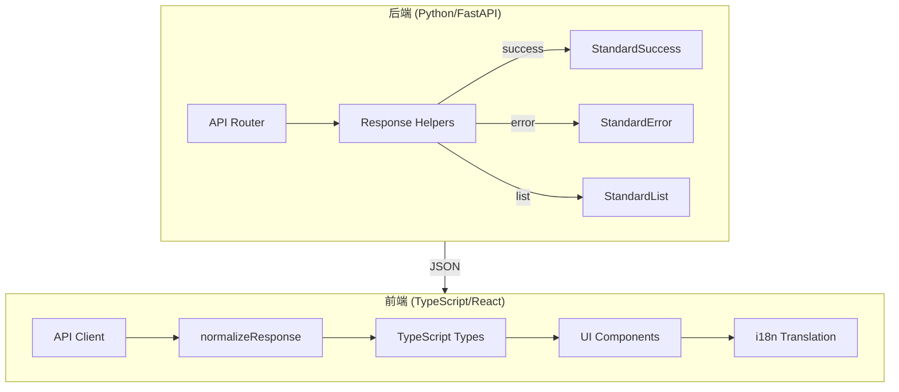

# API 响应格式全链路标准化设计文档

> **版本**: 1.0  
> **创建时间**: 2026-01-16  
> **状态**: 📐 设计中

---

## 1. 架构概览



---

## 2. 后端设计

### 2.1 Helper 函数接口

**文件**: `api/utils/response_helpers.py`

```python
def create_success_response(
    data: Any,
    message_code: MessageCode,
    message: Optional[str] = None
) -> dict:
    """创建标准成功响应"""
    return {
        "success": True,
        "data": data,
        "messageCode": message_code.value,
        "message": message or DEFAULT_MESSAGES.get(message_code),
        "timestamp": datetime.utcnow().isoformat() + "Z"
    }

def create_list_response(
    items: list,
    total: int,
    message_code: MessageCode,
    page: Optional[int] = None,
    page_size: Optional[int] = None
) -> dict:
    """创建标准列表响应"""
    # 内部调用 create_success_response

def create_error_response(
    code: str,
    message: str,
    details: Optional[dict] = None
) -> dict:
    """创建标准错误响应"""
    return {
        "success": False,
        "detail": message,
        "error": {
            "code": code,
            "message": message,
            "details": details or {}
        },
        "messageCode": code,
        "message": message,
        "timestamp": datetime.utcnow().isoformat() + "Z"
    }
```

### 2.2 错误处理模式

**禁止**:
```python
# ❌ 直接抛出 HTTPException
raise HTTPException(status_code=404, detail="Not found")

# ❌ 手动构造 dict
return {"success": True, "data": result}

# ❌ Pydantic 直接返回
return MyResponse(success=True, data=result)
```

**必须**:
```python
# ✅ 成功响应
return create_success_response(
    data=result.dict(),
    message_code=MessageCode.OPERATION_SUCCESS
)

# ✅ 错误响应
return JSONResponse(
    status_code=404,
    content=create_error_response(
        code="RESOURCE_NOT_FOUND",
        message="资源不存在"
    )
)
```

### 2.3 Pydantic 模型兼容

对于现有返回 Pydantic response_model 的端点:

```python
# 改造前
@router.get("/tasks", response_model=TaskListResponse)
async def list_tasks():
    return TaskListResponse(tasks=tasks)

# 改造后
@router.get("/tasks")
async def list_tasks():
    response = TaskListResponse(tasks=tasks)
    return create_list_response(
        items=[t.dict() for t in response.tasks],
        total=len(response.tasks),
        message_code=MessageCode.ASYNC_TASK_LIST_RETRIEVED
    )
```

---

## 3. 前端设计

### 3.1 类型定义

**文件**: `frontend/src/api/types.ts`

```typescript
// 标准成功响应
interface StandardSuccess<T> {
  success: true;
  data: T;
  messageCode: string;
  message: string;
  timestamp: string;
}

// 标准列表响应
interface StandardList<T> extends StandardSuccess<{
  items: T[];
  total: number;
  page?: number;
  pageSize?: number;
}> {}

// 标准错误响应
interface StandardError {
  success: false;
  error: {
    code: string;
    message: string;
    details?: Record<string, unknown>;
  };
  detail: string;
  messageCode: string;
  message: string;
  timestamp: string;
}

// 统一响应类型
type StandardResponse<T> = StandardSuccess<T> | StandardError;
```

### 3.2 normalizeResponse 函数

**文件**: `frontend/src/api/client.ts`

```typescript
interface NormalizedResponse<T> {
  data: T;
  items?: T[];
  total?: number;
  page?: number;
  pageSize?: number;
  messageCode: string;
  message: string;
  timestamp: string;
  raw: unknown;
}

export function normalizeResponse<T>(res: AxiosResponse): NormalizedResponse<T> {
  const { data } = res;
  
  if (!data.success) {
    throw new ApiError(data.error.code, data.error.message, data.error.details);
  }
  
  // 列表响应
  if (data.data?.items !== undefined) {
    return {
      data: data.data as T,
      items: data.data.items,
      total: data.data.total,
      page: data.data.page,
      pageSize: data.data.pageSize,
      messageCode: data.messageCode,
      message: data.message,
      timestamp: data.timestamp,
      raw: data
    };
  }
  
  // 普通响应
  return {
    data: data.data as T,
    messageCode: data.messageCode,
    message: data.message,
    timestamp: data.timestamp,
    raw: data
  };
}
```

### 3.3 错误处理增强

```typescript
// 增强 handleApiError
export const handleApiError = (error: AxiosError): never => {
  const data = error.response?.data as StandardError | undefined;
  
  if (data?.error?.code) {
    const enhancedError = new Error(
      t(`errors.${data.messageCode}`) || data.message
    ) as ApiError;
    enhancedError.code = data.error.code;
    enhancedError.details = data.error.details;
    throw enhancedError;
  }
  
  // 降级处理...
};
```

---

## 4. I18n 集成

### 4.1 前端语言包结构

**文件**: `frontend/src/i18n/locales/zh/errors.json`

```json
{
  "OPERATION_SUCCESS": "操作成功",
  "RESOURCE_NOT_FOUND": "资源不存在",
  "VALIDATION_ERROR": "参数验证失败",
  "ASYNC_TASK_SUBMITTED": "任务已提交",
  "ASYNC_TASK_NOT_FOUND": "任务不存在",
  "QUERY_FAILED": "查询执行失败",
  "DB_CONNECTION_NOT_FOUND": "数据库连接不存在"
}
```

### 4.2 UI 使用

```tsx
// 成功提示
toast.success(t(`success.${response.messageCode}`) || response.message);

// 错误提示
toast.error(t(`errors.${error.code}`) || error.message);
```

---

## 5. 下载接口特殊处理

下载接口成功时返回文件流，错误时返回 JSON。前端需特殊处理:

```typescript
async function downloadFile(url: string) {
  const response = await fetch(url);
  
  const contentType = response.headers.get('content-type');
  
  if (contentType?.includes('application/json')) {
    // 错误响应
    const errorData = await response.json() as StandardError;
    throw new ApiError(errorData.error.code, errorData.error.message);
  }
  
  // 成功 - 处理文件流
  const blob = await response.blob();
  // ...
}
```

---

## 6. 迁移策略

### 阶段 1: 后端基础设施
1. 扩展 `MessageCode` 枚举
2. 确保 helper 函数完整
3. 更新全局异常处理器

### 阶段 2: 后端逐文件改造
按优先级改造各 router 文件

### 阶段 3: 前端基础设施
1. 更新 `types.ts`
2. 实现 `normalizeResponse`
3. 增强错误处理

### 阶段 4: 前端逐模块适配
按依赖关系改造各 API 模块

### 阶段 5: 联调验收
全量回归测试

---

## 7. handleApiError 升级要求

### 7.1 Blob JSON 错误解析

下载接口错误时返回的是 blob，前端需特殊处理：

```typescript
export async function handleBlobError(blob: Blob): Promise<StandardError> {
  // 尝试将 blob 转为文本
  const text = await blob.text();
  
  try {
    // 尝试解析为 JSON
    const errorData = JSON.parse(text) as StandardError;
    return errorData;
  } catch {
    // 解析失败，构造默认错误
    return {
      success: false,
      error: { code: 'DOWNLOAD_PARSE_ERROR', message: text || '下载失败' },
      detail: text,
      messageCode: 'DOWNLOAD_PARSE_ERROR',
      message: text,
      timestamp: new Date().toISOString()
    };
  }
}
```

### 7.2 优先使用 messageCode 进行 I18n

```typescript
export const handleApiError = (error: AxiosError): never => {
  const data = error.response?.data as StandardError | undefined;
  
  if (data?.messageCode) {
    // 优先使用 messageCode 翻译
    const translatedMessage = t(`errors.${data.messageCode}`);
    const finalMessage = translatedMessage !== `errors.${data.messageCode}` 
      ? translatedMessage 
      : data.message;  // 兜底使用后端 message
    
    const enhancedError = new Error(finalMessage) as ApiError;
    enhancedError.code = data.error?.code || data.messageCode;
    enhancedError.details = data.error?.details;
    throw enhancedError;
  }
  
  // 降级处理...
};
```

---

## 8. MessageCode 集中管理

### 8.1 后端落地位置

**文件**: `api/utils/response_helpers.py`

```python
class MessageCode(str, Enum):
    """消息代码枚举（用于国际化）"""
    
    # 通用
    OPERATION_SUCCESS = "OPERATION_SUCCESS"
    ITEMS_RETRIEVED = "ITEMS_RETRIEVED"
    VALIDATION_ERROR = "VALIDATION_ERROR"
    RESOURCE_NOT_FOUND = "RESOURCE_NOT_FOUND"
    INTERNAL_ERROR = "INTERNAL_ERROR"
    
    # 异步任务
    ASYNC_TASK_SUBMITTED = "ASYNC_TASK_SUBMITTED"
    ASYNC_TASK_LIST_RETRIEVED = "ASYNC_TASK_LIST_RETRIEVED"
    # ...
```

> ⚠️ **重要**: 新增接口必须先在此枚举中登记，禁止使用硬编码字符串。

### 8.2 前端落地位置

**文件 (中文)**: `frontend/src/i18n/locales/zh/errors.json`
**文件 (英文)**: `frontend/src/i18n/locales/en/errors.json`

```json
{
  "OPERATION_SUCCESS": "操作成功",
  "ITEMS_RETRIEVED": "获取成功",
  "VALIDATION_ERROR": "参数验证失败",
  "RESOURCE_NOT_FOUND": "资源不存在",
  "INTERNAL_ERROR": "系统内部错误",
  "ASYNC_TASK_SUBMITTED": "任务已提交",
  "ASYNC_TASK_NOT_FOUND": "任务不存在"
}
```

### 8.3 一致性维护

1. 后端新增 `MessageCode` 枚举项时，必须同步更新前端 `errors.json`
2. 前后端 Code Review 时应检查 messageCode 一致性
3. 可考虑脚本自动同步（从后端枚举生成前端 JSON 骨架）

---

## 9. 全局异常处理约束

### 9.1 禁止二次包装

全局异常处理器（如 FastAPI 的 exception_handler）不得对已经是 `JSONResponse` 的响应再次包装。

```python
@app.exception_handler(Exception)
async def global_exception_handler(request: Request, exc: Exception):
    # 如果已经是 HTTPException 且 detail 是标准结构，直接透传
    if isinstance(exc, HTTPException) and isinstance(exc.detail, dict):
        if exc.detail.get("success") is False:
            return JSONResponse(status_code=exc.status_code, content=exc.detail)
    
    # 未捕获异常 -> 标准错误
    return JSONResponse(
        status_code=500,
        content=create_error_response(
            code="INTERNAL_ERROR",
            message=str(exc) if settings.DEBUG else "系统内部错误"
        )
    )
```

### 9.2 检测方法

在全局 handler 中检查 `response.body` 是否已包含 `success` 字段，若有则不再包装。

---

## 10. 测试策略

### 10.1 后端单元测试

#### 测试 Helper 函数

**文件**: `api/tests/test_response_helpers.py`

```python
import pytest
from utils.response_helpers import (
    create_success_response,
    create_list_response,
    create_error_response,
    MessageCode
)

class TestResponseHelpers:
    def test_success_response_structure(self):
        """测试成功响应结构完整性"""
        response = create_success_response(
            data={"id": 1, "name": "test"},
            message_code=MessageCode.OPERATION_SUCCESS
        )
        
        assert response["success"] is True
        assert "data" in response
        assert "messageCode" in response
        assert "message" in response
        assert "timestamp" in response
        assert response["messageCode"] == "OPERATION_SUCCESS"
    
    def test_list_response_structure(self):
        """测试列表响应结构"""
        items = [{"id": 1}, {"id": 2}]
        response = create_list_response(
            items=items,
            total=2,
            message_code=MessageCode.ITEMS_RETRIEVED,
            page=1,
            pageSize=20
        )
        
        assert response["success"] is True
        assert response["data"]["items"] == items
        assert response["data"]["total"] == 2
        assert response["data"]["page"] == 1
        assert response["data"]["pageSize"] == 20
    
    def test_error_response_structure(self):
        """测试错误响应结构"""
        response = create_error_response(
            code="RESOURCE_NOT_FOUND",
            message="资源不存在",
            details={"id": 123}
        )
        
        assert response["success"] is False
        assert "error" in response
        assert response["error"]["code"] == "RESOURCE_NOT_FOUND"
        assert response["error"]["message"] == "资源不存在"
        assert response["error"]["details"]["id"] == 123
        assert response["messageCode"] == "RESOURCE_NOT_FOUND"
        assert "timestamp" in response
```

#### 测试端点响应格式

**文件**: `api/tests/test_endpoint_responses.py`

```python
import pytest
from fastapi.testclient import TestClient
from main import app

client = TestClient(app)

class TestEndpointResponses:
    def test_success_endpoint_format(self):
        """测试成功端点返回标准格式"""
        response = client.get("/api/duckdb/tables")
        data = response.json()
        
        assert data["success"] is True
        assert "data" in data
        assert "messageCode" in data
        assert "message" in data
        assert "timestamp" in data
    
    def test_error_endpoint_format(self):
        """测试错误端点返回标准格式"""
        response = client.get("/api/duckdb/tables/nonexistent")
        data = response.json()
        
        assert data["success"] is False
        assert "error" in data
        assert "code" in data["error"]
        assert "message" in data["error"]
        assert "messageCode" in data
        assert "timestamp" in data
    
    def test_list_endpoint_format(self):
        """测试列表端点返回标准格式"""
        response = client.get("/api/datasources")
        data = response.json()
        
        assert data["success"] is True
        assert "items" in data["data"]
        assert "total" in data["data"]
```

### 10.2 前端单元测试

#### 测试 normalizeResponse

**文件**: `frontend/src/api/__tests__/client.test.ts`

```typescript
import { normalizeResponse } from '../client';
import { AxiosResponse } from 'axios';

describe('normalizeResponse', () => {
  it('should normalize success response', () => {
    const axiosResponse = {
      data: {
        success: true,
        data: { id: 1, name: 'test' },
        messageCode: 'OPERATION_SUCCESS',
        message: '操作成功',
        timestamp: '2024-01-01T00:00:00Z'
      }
    } as AxiosResponse;
    
    const result = normalizeResponse(axiosResponse);
    
    expect(result.data).toEqual({ id: 1, name: 'test' });
    expect(result.messageCode).toBe('OPERATION_SUCCESS');
    expect(result.timestamp).toBe('2024-01-01T00:00:00Z');
  });
  
  it('should normalize list response', () => {
    const axiosResponse = {
      data: {
        success: true,
        data: {
          items: [{ id: 1 }, { id: 2 }],
          total: 2,
          page: 1,
          pageSize: 20
        },
        messageCode: 'ITEMS_RETRIEVED',
        message: '获取成功',
        timestamp: '2024-01-01T00:00:00Z'
      }
    } as AxiosResponse;
    
    const result = normalizeResponse(axiosResponse);
    
    expect(result.items).toHaveLength(2);
    expect(result.total).toBe(2);
    expect(result.page).toBe(1);
    expect(result.pageSize).toBe(20);
  });
  
  it('should throw ApiError on error response', () => {
    const axiosResponse = {
      data: {
        success: false,
        error: {
          code: 'RESOURCE_NOT_FOUND',
          message: '资源不存在',
          details: {}
        },
        messageCode: 'RESOURCE_NOT_FOUND',
        message: '资源不存在',
        timestamp: '2024-01-01T00:00:00Z'
      }
    } as AxiosResponse;
    
    expect(() => normalizeResponse(axiosResponse)).toThrow('资源不存在');
  });
});
```

#### 测试错误处理

**文件**: `frontend/src/api/__tests__/errorHandling.test.ts`

```typescript
import { handleApiError, parseBlobError } from '../client';
import { AxiosError } from 'axios';

describe('handleApiError', () => {
  it('should extract messageCode and translate', () => {
    const error = {
      response: {
        data: {
          success: false,
          error: {
            code: 'RESOURCE_NOT_FOUND',
            message: '资源不存在'
          },
          messageCode: 'RESOURCE_NOT_FOUND'
        }
      }
    } as AxiosError;
    
    expect(() => handleApiError(error)).toThrow();
  });
});

describe('parseBlobError', () => {
  it('should parse blob JSON error', async () => {
    const errorJson = JSON.stringify({
      success: false,
      error: { code: 'DOWNLOAD_FAILED', message: '下载失败' },
      messageCode: 'DOWNLOAD_FAILED'
    });
    const blob = new Blob([errorJson], { type: 'application/json' });
    
    const result = await parseBlobError(blob);
    
    expect(result.success).toBe(false);
    expect(result.error.code).toBe('DOWNLOAD_FAILED');
  });
});
```

### 10.3 集成测试

#### 端到端响应格式测试

**文件**: `api/tests/test_e2e_response_format.py`

```python
import pytest
from fastapi.testclient import TestClient
from main import app

client = TestClient(app)

class TestE2EResponseFormat:
    """端到端测试所有端点响应格式"""
    
    @pytest.mark.parametrize("endpoint,method", [
        ("/api/duckdb/tables", "GET"),
        ("/api/datasources", "GET"),
        ("/api/async_tasks", "GET"),
    ])
    def test_all_endpoints_return_standard_format(self, endpoint, method):
        """测试所有端点返回标准格式"""
        if method == "GET":
            response = client.get(endpoint)
        elif method == "POST":
            response = client.post(endpoint, json={})
        
        data = response.json()
        
        # 必须包含的字段
        assert "success" in data
        assert "messageCode" in data
        assert "message" in data
        assert "timestamp" in data
        
        # 成功响应必须有 data
        if data["success"]:
            assert "data" in data
        # 失败响应必须有 error
        else:
            assert "error" in data
            assert "code" in data["error"]
```

### 10.4 测试覆盖率目标

| 模块 | 目标覆盖率 | 说明 |
|------|-----------|------|
| `response_helpers.py` | 100% | 核心工具函数必须全覆盖 |
| Router 端点 | 80%+ | 主要成功/错误路径 |
| `normalizeResponse` | 100% | 前端核心解包函数 |
| `handleApiError` | 90%+ | 各种错误场景 |

---

## 11. 向后兼容策略

### 11.1 渐进式迁移

#### 阶段 1: 双格式支持期（2 周）

后端同时支持旧格式和新格式：

```python
# 旧端点保持不变
@router.get("/api/old/tables")
async def list_tables_old():
    return {"tables": [...]}  # 旧格式

# 新端点使用标准格式
@router.get("/api/duckdb/tables")
async def list_tables_new():
    return create_list_response(
        items=[...],
        total=len(tables),
        message_code=MessageCode.ITEMS_RETRIEVED
    )
```

前端同时支持两种格式：

```typescript
// 兼容函数
function normalizeResponseCompat<T>(res: AxiosResponse): NormalizedResponse<T> {
  const { data } = res;
  
  // 检测新格式
  if ('success' in data && 'messageCode' in data) {
    return normalizeResponse(res);
  }
  
  // 降级到旧格式
  return {
    data: data as T,
    messageCode: 'OPERATION_SUCCESS',
    message: '操作成功',
    timestamp: new Date().toISOString(),
    raw: data
  };
}
```

#### 阶段 2: 废弃警告期（2 周）

- 旧端点返回响应头 `X-Deprecated: true`
- 前端检测到废弃端点时控制台警告
- 文档标注旧端点废弃时间

#### 阶段 3: 完全切换（1 周）

- 移除旧端点或重定向到新端点
- 前端移除兼容代码
- 更新所有文档

### 11.2 Fallback 处理

#### 前端 Fallback 策略

```typescript
export function normalizeResponseSafe<T>(res: AxiosResponse): NormalizedResponse<T> {
  try {
    return normalizeResponse(res);
  } catch (error) {
    // 降级处理：尝试直接使用 response.data
    console.warn('Response normalization failed, using fallback', error);
    
    return {
      data: res.data as T,
      messageCode: 'OPERATION_SUCCESS',
      message: '操作成功',
      timestamp: new Date().toISOString(),
      raw: res.data
    };
  }
}
```

#### 后端 Fallback 策略

```python
def ensure_standard_response(response: Any) -> dict:
    """确保响应是标准格式，否则包装"""
    if isinstance(response, dict) and "success" in response:
        return response
    
    # 降级包装
    return create_success_response(
        data=response,
        message_code=MessageCode.OPERATION_SUCCESS
    )
```

### 11.3 版本协商

#### API 版本头

```python
# 后端支持版本协商
@app.middleware("http")
async def version_middleware(request: Request, call_next):
    api_version = request.headers.get("X-API-Version", "v2")
    request.state.api_version = api_version
    response = await call_next(request)
    response.headers["X-API-Version"] = api_version
    return response
```

```typescript
// 前端发送版本头
const client = axios.create({
  headers: {
    'X-API-Version': 'v2'
  }
});
```

### 11.4 兼容性测试

**文件**: `api/tests/test_backward_compatibility.py`

```python
class TestBackwardCompatibility:
    def test_old_client_can_parse_new_response(self):
        """测试旧客户端能解析新响应"""
        response = client.get("/api/duckdb/tables")
        data = response.json()
        
        # 旧客户端只需要 data 字段
        assert "data" in data
        # 新字段不影响旧客户端
        assert data.get("success") is True
    
    def test_new_client_can_parse_old_response(self):
        """测试新客户端能解析旧响应（通过兼容函数）"""
        # 模拟旧响应
        old_response = {"tables": [...]}
        # 新客户端的兼容函数应能处理
        # (在实际测试中调用 normalizeResponseCompat)
```

---

## 12. 性能考虑

### 12.1 响应体大小优化

#### 问题分析

标准格式增加了额外字段（`success`, `messageCode`, `message`, `timestamp`），可能增加响应体积。

#### 优化措施

1. **启用 Gzip 压缩**

```python
from fastapi.middleware.gzip import GZipMiddleware

app.add_middleware(GZipMiddleware, minimum_size=1000)
```

2. **精简 message 字段**

```python
# 生产环境可省略 message（前端用 messageCode 翻译）
def create_success_response(
    data: Any,
    message_code: MessageCode,
    message: Optional[str] = None,
    include_message: bool = True  # 生产环境可设为 False
) -> dict:
    response = {
        "success": True,
        "data": data,
        "messageCode": message_code.value,
        "timestamp": datetime.utcnow().isoformat() + "Z"
    }
    
    if include_message:
        response["message"] = message or DEFAULT_MESSAGES.get(message_code)
    
    return response
```

3. **timestamp 可选**

```python
# 对于不需要时间戳的场景，可省略
def create_success_response(
    data: Any,
    message_code: MessageCode,
    include_timestamp: bool = True
) -> dict:
    response = {...}
    if include_timestamp:
        response["timestamp"] = datetime.utcnow().isoformat() + "Z"
    return response
```

### 12.2 解析性能

#### 前端解析开销

`normalizeResponse` 函数需要检查和提取字段，可能增加解析时间。

#### 优化措施

1. **缓存类型检测**

```typescript
// 使用 WeakMap 缓存响应类型
const responseTypeCache = new WeakMap<object, 'success' | 'list' | 'error'>();

export function normalizeResponse<T>(res: AxiosResponse): NormalizedResponse<T> {
  const { data } = res;
  
  // 检查缓存
  let type = responseTypeCache.get(data);
  
  if (!type) {
    // 类型检测
    if (!data.success) {
      type = 'error';
    } else if (data.data?.items !== undefined) {
      type = 'list';
    } else {
      type = 'success';
    }
    responseTypeCache.set(data, type);
  }
  
  // 根据类型处理...
}
```

2. **避免深拷贝**

```typescript
// ❌ 避免
return {
  data: JSON.parse(JSON.stringify(data.data)),  // 深拷贝开销大
  ...
};

// ✅ 推荐
return {
  data: data.data,  // 直接引用
  ...
};
```

### 12.3 大数据量场景

#### 问题

列表响应包含大量数据时，标准格式的嵌套可能影响性能。

#### 优化措施

1. **流式响应**（大文件下载）

```python
from fastapi.responses import StreamingResponse

@router.get("/api/large-export")
async def export_large_data():
    def generate():
        # 流式生成数据
        for chunk in data_chunks:
            yield chunk
    
    return StreamingResponse(
        generate(),
        media_type="application/octet-stream",
        headers={"Content-Disposition": "attachment; filename=export.csv"}
    )
```

2. **分页强制**

```python
# 大列表必须分页
@router.get("/api/large-list")
async def list_large_data(page: int = 1, page_size: int = 20):
    if page_size > 100:
        raise HTTPException(400, "page_size 不能超过 100")
    
    items = get_paginated_items(page, page_size)
    return create_list_response(
        items=items,
        total=get_total_count(),
        page=page,
        page_size=page_size,
        message_code=MessageCode.ITEMS_RETRIEVED
    )
```

3. **字段裁剪**

```python
# 列表响应只返回必要字段
@router.get("/api/tables")
async def list_tables(fields: Optional[str] = None):
    tables = get_all_tables()
    
    if fields:
        # 只返回指定字段
        field_list = fields.split(',')
        tables = [{k: t[k] for k in field_list if k in t} for t in tables]
    
    return create_list_response(...)
```

### 12.4 性能监控

#### 响应时间监控

```python
import time
from fastapi import Request

@app.middleware("http")
async def performance_middleware(request: Request, call_next):
    start_time = time.time()
    response = await call_next(request)
    process_time = time.time() - start_time
    
    response.headers["X-Process-Time"] = str(process_time)
    
    # 记录慢请求
    if process_time > 1.0:
        logger.warning(f"Slow request: {request.url} took {process_time}s")
    
    return response
```

#### 前端性能监控

```typescript
// 监控 normalizeResponse 性能
export function normalizeResponse<T>(res: AxiosResponse): NormalizedResponse<T> {
  const startTime = performance.now();
  
  try {
    // 解析逻辑...
    return result;
  } finally {
    const duration = performance.now() - startTime;
    if (duration > 10) {  // 超过 10ms 记录
      console.warn(`Slow response normalization: ${duration}ms`);
    }
  }
}
```

### 12.5 性能基准

| 场景 | 旧格式 | 新格式 | 增加 | 可接受阈值 |
|------|--------|--------|------|-----------|
| 小响应 (< 1KB) | 5ms | 6ms | +20% | < 10ms |
| 中响应 (10KB) | 15ms | 17ms | +13% | < 30ms |
| 大响应 (100KB) | 80ms | 85ms | +6% | < 150ms |
| 列表 (100 项) | 25ms | 28ms | +12% | < 50ms |

**验收标准**: 新格式性能开销不超过 20%，且绝对值在可接受阈值内。


---

## 13. 监控与告警

### 13.1 合规性监控

#### 响应格式合规检测

**文件**: `api/middleware/response_compliance.py`

```python
import logging
from fastapi import Request, Response
from starlette.middleware.base import BaseHTTPMiddleware

logger = logging.getLogger(__name__)

class ResponseComplianceMiddleware(BaseHTTPMiddleware):
    """响应格式合规性监控中间件"""
    
    async def dispatch(self, request: Request, call_next):
        response = await call_next(request)
        
        # 只检查 JSON 响应
        if response.headers.get("content-type") == "application/json":
            # 读取响应体
            body = b""
            async for chunk in response.body_iterator:
                body += chunk
            
            try:
                data = json.loads(body)
                
                # 检查必需字段
                required_fields = ["success", "messageCode", "message", "timestamp"]
                missing_fields = [f for f in required_fields if f not in data]
                
                if missing_fields:
                    logger.warning(
                        f"Non-compliant response: {request.url.path} "
                        f"missing fields: {missing_fields}"
                    )
                    
                    # 记录到监控系统
                    metrics.increment("response.non_compliant", 
                                     tags={"endpoint": request.url.path})
                else:
                    metrics.increment("response.compliant",
                                     tags={"endpoint": request.url.path})
            except json.JSONDecodeError:
                pass
            
            # 重建响应
            return Response(
                content=body,
                status_code=response.status_code,
                headers=dict(response.headers)
            )
        
        return response
```

#### 合规率统计

```python
# 计算合规率
def calculate_compliance_rate():
    compliant = metrics.get("response.compliant")
    non_compliant = metrics.get("response.non_compliant")
    total = compliant + non_compliant
    
    if total == 0:
        return 100.0
    
    return (compliant / total) * 100
```

### 13.2 错误监控

#### MessageCode 频率统计

```python
class ErrorMonitoringMiddleware(BaseHTTPMiddleware):
    """错误监控中间件"""
    
    async def dispatch(self, request: Request, call_next):
        response = await call_next(request)
        
        if response.status_code >= 400:
            try:
                body = await response.body()
                data = json.loads(body)
                
                if data.get("messageCode"):
                    # 记录错误代码频率
                    metrics.increment(
                        "error.by_code",
                        tags={
                            "code": data["messageCode"],
                            "endpoint": request.url.path,
                            "status": response.status_code
                        }
                    )
                    
                    # 记录错误详情
                    logger.error(
                        f"API Error: {data['messageCode']} "
                        f"at {request.url.path} - {data.get('message')}"
                    )
            except:
                pass
        
        return response
```

#### 错误率告警

```python
# 检查错误率
def check_error_rate():
    total_requests = metrics.get("requests.total")
    error_requests = metrics.get("requests.error")
    
    if total_requests == 0:
        return 0.0
    
    error_rate = (error_requests / total_requests) * 100
    
    # 错误率超过 5% 告警
    if error_rate > 5.0:
        alert.send(
            title="API 错误率过高",
            message=f"当前错误率: {error_rate:.2f}%",
            severity="high"
        )
    
    return error_rate
```

### 13.3 性能监控

#### 响应时间监控

```python
import time

class PerformanceMonitoringMiddleware(BaseHTTPMiddleware):
    """性能监控中间件"""
    
    async def dispatch(self, request: Request, call_next):
        start_time = time.time()
        
        response = await call_next(request)
        
        duration = time.time() - start_time
        
        # 记录响应时间
        metrics.histogram(
            "response.duration",
            duration,
            tags={
                "endpoint": request.url.path,
                "method": request.method,
                "status": response.status_code
            }
        )
        
        # 慢请求告警
        if duration > 2.0:
            logger.warning(
                f"Slow request: {request.method} {request.url.path} "
                f"took {duration:.2f}s"
            )
        
        # 添加响应头
        response.headers["X-Response-Time"] = f"{duration:.3f}s"
        
        return response
```

#### 响应体大小监控

```python
class ResponseSizeMonitoringMiddleware(BaseHTTPMiddleware):
    """响应体大小监控"""
    
    async def dispatch(self, request: Request, call_next):
        response = await call_next(request)
        
        # 获取响应体大小
        content_length = response.headers.get("content-length")
        if content_length:
            size = int(content_length)
            
            # 记录响应体大小
            metrics.histogram(
                "response.size",
                size,
                tags={"endpoint": request.url.path}
            )
            
            # 大响应告警
            if size > 1024 * 1024:  # > 1MB
                logger.warning(
                    f"Large response: {request.url.path} "
                    f"size: {size / 1024 / 1024:.2f}MB"
                )
        
        return response
```

### 13.4 I18n 覆盖监控

#### 前端缺失翻译检测

```typescript
// 监控缺失的 messageCode 翻译
const missingTranslations = new Set<string>();

export function trackMissingTranslation(messageCode: string) {
  if (!missingTranslations.has(messageCode)) {
    missingTranslations.add(messageCode);
    
    // 发送到监控系统
    analytics.track('i18n.missing_translation', {
      messageCode,
      language: i18n.language
    });
    
    console.warn(`Missing translation for: ${messageCode}`);
  }
}

// 在 handleApiError 中使用
export const handleApiError = (error: AxiosError): never => {
  const data = error.response?.data as StandardError | undefined;
  
  if (data?.messageCode) {
    const translatedMessage = t(`errors.${data.messageCode}`);
    
    // 检测是否降级到原始 key
    if (translatedMessage === `errors.${data.messageCode}`) {
      trackMissingTranslation(data.messageCode);
      // 使用后端 message 兜底
      throw new ApiError(data.error.code, data.message);
    }
    
    throw new ApiError(data.error.code, translatedMessage);
  }
  
  // ...
};
```

#### I18n 覆盖率统计

```typescript
// 计算 i18n 覆盖率
export function calculateI18nCoverage(): number {
  const allMessageCodes = Object.keys(MessageCodeEnum);
  const translatedCodes = Object.keys(i18n.getResourceBundle(i18n.language, 'errors'));
  
  const coverage = (translatedCodes.length / allMessageCodes.length) * 100;
  
  // 覆盖率低于 90% 告警
  if (coverage < 90) {
    console.warn(`I18n coverage is low: ${coverage.toFixed(2)}%`);
  }
  
  return coverage;
}
```

### 13.5 告警配置

#### 告警规则

```yaml
# alerts.yml
alerts:
  - name: response_compliance_low
    condition: compliance_rate < 95
    severity: high
    message: "响应格式合规率低于 95%"
    
  - name: error_rate_high
    condition: error_rate > 5
    severity: high
    message: "API 错误率超过 5%"
    
  - name: response_time_slow
    condition: p95_response_time > 2000
    severity: medium
    message: "P95 响应时间超过 2 秒"
    
  - name: i18n_coverage_low
    condition: i18n_coverage < 90
    severity: medium
    message: "I18n 覆盖率低于 90%"
    
  - name: large_response
    condition: response_size > 1048576
    severity: low
    message: "响应体大小超过 1MB"
```

#### 告警通知

```python
# 告警通知
class AlertManager:
    def send_alert(self, alert_name: str, message: str, severity: str):
        """发送告警"""
        # 发送到 Slack
        slack.send_message(
            channel="#alerts",
            text=f"[{severity.upper()}] {alert_name}: {message}"
        )
        
        # 发送邮件
        if severity == "high":
            email.send(
                to=["team@example.com"],
                subject=f"[ALERT] {alert_name}",
                body=message
            )
        
        # 记录到数据库
        db.alerts.insert({
            "name": alert_name,
            "message": message,
            "severity": severity,
            "timestamp": datetime.utcnow()
        })
```

### 13.6 监控面板

#### Grafana 仪表盘配置

```json
{
  "dashboard": {
    "title": "API Response Standardization",
    "panels": [
      {
        "title": "响应格式合规率",
        "type": "graph",
        "targets": [
          {
            "expr": "rate(response_compliant_total[5m]) / (rate(response_compliant_total[5m]) + rate(response_non_compliant_total[5m])) * 100"
          }
        ],
        "alert": {
          "conditions": [
            {
              "evaluator": { "type": "lt", "params": [95] }
            }
          ]
        }
      },
      {
        "title": "错误率趋势",
        "type": "graph",
        "targets": [
          {
            "expr": "rate(requests_error_total[5m]) / rate(requests_total[5m]) * 100"
          }
        ]
      },
      {
        "title": "响应时间分布",
        "type": "heatmap",
        "targets": [
          {
            "expr": "histogram_quantile(0.95, rate(response_duration_bucket[5m]))"
          }
        ]
      },
      {
        "title": "Top 10 错误代码",
        "type": "table",
        "targets": [
          {
            "expr": "topk(10, sum by (code) (rate(error_by_code_total[1h])))"
          }
        ]
      },
      {
        "title": "I18n 覆盖率",
        "type": "gauge",
        "targets": [
          {
            "expr": "i18n_coverage_percent"
          }
        ]
      }
    ]
  }
}
```

---

## 14. 文档与培训

### 14.1 开发者文档

#### 快速开始指南

**文件**: `docs/API_RESPONSE_STANDARD.md`

```markdown
# API 响应格式标准

## 概述

所有 API 接口必须使用统一的响应格式，支持 Code-Driven I18n。

## 后端使用

### 成功响应

\`\`\`python
from utils.response_helpers import create_success_response, MessageCode

@router.get("/api/resource")
async def get_resource():
    data = {"id": 1, "name": "example"}
    return create_success_response(
        data=data,
        message_code=MessageCode.OPERATION_SUCCESS
    )
\`\`\`

### 列表响应

\`\`\`python
@router.get("/api/resources")
async def list_resources():
    items = [...]
    return create_list_response(
        items=items,
        total=len(items),
        message_code=MessageCode.ITEMS_RETRIEVED
    )
\`\`\`

### 错误响应

\`\`\`python
from fastapi.responses import JSONResponse

@router.get("/api/resource/{id}")
async def get_resource(id: int):
    if not exists(id):
        return JSONResponse(
            status_code=404,
            content=create_error_response(
                code="RESOURCE_NOT_FOUND",
                message="资源不存在"
            )
        )
\`\`\`

## 前端使用

### API 调用

\`\`\`typescript
import { normalizeResponse } from '@/api/client';

async function fetchData() {
  const response = await axios.get('/api/resource');
  const { data, messageCode } = normalizeResponse(response);
  
  toast.success(t(\`success.\${messageCode}\`));
  return data;
}
\`\`\`

### 错误处理

\`\`\`typescript
try {
  await fetchData();
} catch (error) {
  if (error instanceof ApiError) {
    toast.error(t(\`errors.\${error.code}\`) || error.message);
  }
}
\`\`\`

## MessageCode 管理

### 新增 MessageCode

1. 后端添加枚举:

\`\`\`python
class MessageCode(str, Enum):
    NEW_OPERATION_SUCCESS = "NEW_OPERATION_SUCCESS"
\`\`\`

2. 前端添加翻译:

\`\`\`json
{
  "NEW_OPERATION_SUCCESS": "新操作成功"
}
\`\`\`

3. Code Review 检查一致性
```

### 14.2 迁移指南

**文件**: `docs/migration-guide.md`

```markdown
# API 响应格式迁移指南

## 后端迁移

### Step 1: 导入 Helper 函数

\`\`\`python
from utils.response_helpers import (
    create_success_response,
    create_list_response,
    create_error_response,
    MessageCode
)
\`\`\`

### Step 2: 替换返回语句

**迁移前**:
\`\`\`python
return {"data": result}
\`\`\`

**迁移后**:
\`\`\`python
return create_success_response(
    data=result,
    message_code=MessageCode.OPERATION_SUCCESS
)
\`\`\`

### Step 3: 处理 Pydantic 模型

**迁移前**:
\`\`\`python
return MyResponse(data=result)
\`\`\`

**迁移后**:
\`\`\`python
response = MyResponse(data=result)
return create_success_response(
    data=response.dict(),
    message_code=MessageCode.OPERATION_SUCCESS
)
\`\`\`

## 前端迁移

### Step 1: 使用 normalizeResponse

**迁移前**:
\`\`\`typescript
const data = response.data;
\`\`\`

**迁移后**:
\`\`\`typescript
const { data } = normalizeResponse(response);
\`\`\`

### Step 2: 处理列表响应

**迁移前**:
\`\`\`typescript
const tables = response.data.tables;
\`\`\`

**迁移后**:
\`\`\`typescript
const { items: tables, total } = normalizeResponse(response);
\`\`\`

### Step 3: 更新错误提示

**迁移前**:
\`\`\`typescript
toast.error(error.message);
\`\`\`

**迁移后**:
\`\`\`typescript
toast.error(t(\`errors.\${error.code}\`) || error.message);
\`\`\`

## 常见问题

### Q: 旧端点如何兼容？
A: 使用 `normalizeResponseCompat` 函数自动检测格式。

### Q: 下载接口如何处理？
A: 使用 `parseBlobError` 处理 blob 错误响应。

### Q: 如何测试迁移结果？
A: 运行单元测试和集成测试，确保所有测试通过。
```

### 14.3 最佳实践

**文件**: `docs/best-practices.md`

```markdown
# API 响应格式最佳实践

## 何时使用各种响应类型

### create_success_response
- 单个资源操作（创建、更新、删除）
- 单个资源查询
- 操作确认

### create_list_response
- 列表查询
- 分页数据
- 批量操作结果

### create_error_response
- 业务错误
- 验证错误
- 资源不存在

## MessageCode 命名规范

### 格式
\`RESOURCE_ACTION_STATUS\`

### 示例
- \`USER_CREATED\` - 用户创建成功
- \`ORDER_UPDATED\` - 订单更新成功
- \`PRODUCT_NOT_FOUND\` - 产品不存在
- \`VALIDATION_FAILED\` - 验证失败

## 性能优化建议

1. **启用压缩**: 使用 Gzip 压缩响应
2. **精简字段**: 生产环境可省略 message
3. **分页限制**: 列表接口强制分页
4. **字段裁剪**: 支持 fields 参数

## 错误处理建议

1. **详细错误信息**: 在 details 中提供详细信息
2. **用户友好**: message 应该用户可读
3. **可操作**: 提供解决建议
4. **安全**: 不泄露敏感信息
```

### 14.4 Code Review 检查清单

**文件**: `docs/code-review-checklist.md`

```markdown
# Code Review 检查清单

## 后端检查项

- [ ] 所有端点使用 helper 函数
- [ ] MessageCode 已在枚举中定义
- [ ] 错误响应包含 code 和 details
- [ ] Pydantic 模型已 .dict() 后包装
- [ ] 时间戳格式正确（ISO 8601 UTC）
- [ ] 列表响应包含 total 字段
- [ ] 下载接口错误返回 JSON

## 前端检查项

- [ ] 使用 normalizeResponse 解包
- [ ] 错误提示基于 messageCode 翻译
- [ ] 列表数据从 items/total 获取
- [ ] 下载接口使用 parseBlobError
- [ ] Toast 提示使用 i18n
- [ ] 类型定义正确

## MessageCode 一致性

- [ ] 后端枚举已定义
- [ ] 前端翻译已添加（中英文）
- [ ] 命名符合规范
- [ ] 无重复定义

## 性能检查

- [ ] 响应体大小合理（< 100KB）
- [ ] 列表接口有分页
- [ ] 无不必要的深拷贝
- [ ] 大数据量使用流式响应
```

### 14.5 团队培训计划

#### 培训大纲

**第 1 部分: 背景与目标**（15 分钟）
- 为什么需要统一响应格式
- Code-Driven I18n 的优势
- 项目整体架构

**第 2 部分: 后端实践**（30 分钟）
- Helper 函数使用
- MessageCode 管理
- 错误处理最佳实践
- 实战演示

**第 3 部分: 前端实践**（30 分钟）
- normalizeResponse 使用
- 错误处理增强
- I18n 集成
- 实战演示

**第 4 部分: 迁移指南**（15 分钟）
- 迁移步骤
- 常见问题
- 兼容性处理

**第 5 部分: Q&A**（30 分钟）
- 答疑解惑
- 讨论最佳实践

#### 培训材料

- PPT 演示文稿
- 代码示例仓库
- 迁移检查清单
- 常见问题 FAQ

---

## 15. 总结

### 15.1 核心价值

1. **统一性**: 所有 API 接口使用统一的响应格式
2. **国际化**: Code-Driven I18n，支持多语言无缝切换
3. **可维护性**: 集中管理 MessageCode，易于维护
4. **可监控性**: 完善的监控和告警机制
5. **向后兼容**: 渐进式迁移，不破坏现有功能

### 15.2 关键成果

- **后端**: 所有端点返回标准格式，MessageCode 集中管理
- **前端**: 统一解包函数，错误处理增强，I18n 集成
- **测试**: 完善的单元测试和集成测试，覆盖率 ≥ 80%
- **监控**: 合规性、错误率、性能、I18n 覆盖率全面监控
- **文档**: 详细的开发者文档、迁移指南、最佳实践

### 15.3 长期收益

1. **开发效率**: 减少前后端沟通成本，提升开发效率 20%+
2. **用户体验**: 准确的多语言错误提示，提升用户满意度
3. **系统稳定性**: 完善的监控和告警，快速发现和解决问题
4. **代码质量**: 统一的代码风格，易于维护和扩展
5. **团队协作**: 清晰的规范和文档，降低新人学习成本

### 15.4 后续优化方向

1. **自动化**: 开发 MessageCode 同步脚本，自动生成前端翻译骨架
2. **工具化**: 开发 CLI 工具，自动生成标准响应代码
3. **智能化**: 基于 AI 的错误提示优化，提供更友好的错误信息
4. **扩展性**: 支持更多响应类型（流式、WebSocket 等）
5. **标准化**: 推广到其他项目，建立公司级 API 规范

---

**文档版本**: 1.0  
**最后更新**: 2026-01-16  
**维护者**: 项目团队  
**审核状态**: ✅ 待审核
