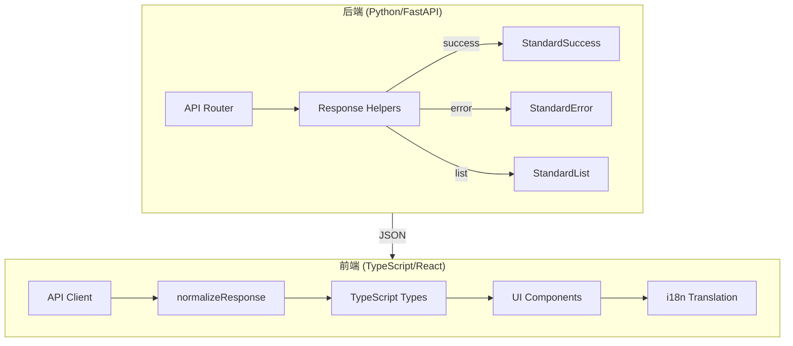

# API 响应格式全链路标准化设计文档

> **版本**: 1.0  
> **创建时间**: 2026-01-16  
> **状态**: 📐 设计中

---

## 1. 架构概览



---

## 2. 后端设计

### 2.1 Helper 函数接口

**文件**: `api/utils/response_helpers.py`

```python
def create_success_response(
    data: Any,
    message_code: MessageCode,
    message: Optional[str] = None
) -> dict:
    """创建标准成功响应"""
    return {
        "success": True,
        "data": data,
        "messageCode": message_code.value,
        "message": message or DEFAULT_MESSAGES.get(message_code),
        "timestamp": datetime.utcnow().isoformat() + "Z"
    }

def create_list_response(
    items: list,
    total: int,
    message_code: MessageCode,
    page: Optional[int] = None,
    page_size: Optional[int] = None
) -> dict:
    """创建标准列表响应"""
    # 内部调用 create_success_response

def create_error_response(
    code: str,
    message: str,
    details: Optional[dict] = None
) -> dict:
    """创建标准错误响应"""
    return {
        "success": False,
        "detail": message,
        "error": {
            "code": code,
            "message": message,
            "details": details or {}
        },
        "messageCode": code,
        "message": message,
        "timestamp": datetime.utcnow().isoformat() + "Z"
    }
```

### 2.2 错误处理模式

**禁止**:
```python
# ❌ 直接抛出 HTTPException
raise HTTPException(status_code=404, detail="Not found")

# ❌ 手动构造 dict
return {"success": True, "data": result}

# ❌ Pydantic 直接返回
return MyResponse(success=True, data=result)
```

**必须**:
```python
# ✅ 成功响应
return create_success_response(
    data=result.dict(),
    message_code=MessageCode.OPERATION_SUCCESS
)

# ✅ 错误响应
return JSONResponse(
    status_code=404,
    content=create_error_response(
        code="RESOURCE_NOT_FOUND",
        message="资源不存在"
    )
)
```

### 2.3 Pydantic 模型兼容

对于现有返回 Pydantic response_model 的端点:

```python
# 改造前
@router.get("/tasks", response_model=TaskListResponse)
async def list_tasks():
    return TaskListResponse(tasks=tasks)

# 改造后
@router.get("/tasks")
async def list_tasks():
    response = TaskListResponse(tasks=tasks)
    return create_list_response(
        items=[t.dict() for t in response.tasks],
        total=len(response.tasks),
        message_code=MessageCode.ASYNC_TASK_LIST_RETRIEVED
    )
```

---

## 3. 前端设计

### 3.1 类型定义

**文件**: `frontend/src/api/types.ts`

```typescript
// 标准成功响应
interface StandardSuccess<T> {
  success: true;
  data: T;
  messageCode: string;
  message: string;
  timestamp: string;
}

// 标准列表响应
interface StandardList<T> extends StandardSuccess<{
  items: T[];
  total: number;
  page?: number;
  pageSize?: number;
}> {}

// 标准错误响应
interface StandardError {
  success: false;
  error: {
    code: string;
    message: string;
    details?: Record<string, unknown>;
  };
  detail: string;
  messageCode: string;
  message: string;
  timestamp: string;
}

// 统一响应类型
type StandardResponse<T> = StandardSuccess<T> | StandardError;
```

### 3.2 normalizeResponse 函数

**文件**: `frontend/src/api/client.ts`

```typescript
interface NormalizedResponse<T> {
  data: T;
  items?: T[];
  total?: number;
  page?: number;
  pageSize?: number;
  messageCode: string;
  message: string;
  timestamp: string;
  raw: unknown;
}

export function normalizeResponse<T>(res: AxiosResponse): NormalizedResponse<T> {
  const { data } = res;
  
  if (!data.success) {
    throw new ApiError(data.error.code, data.error.message, data.error.details);
  }
  
  // 列表响应
  if (data.data?.items !== undefined) {
    return {
      data: data.data as T,
      items: data.data.items,
      total: data.data.total,
      page: data.data.page,
      pageSize: data.data.pageSize,
      messageCode: data.messageCode,
      message: data.message,
      timestamp: data.timestamp,
      raw: data
    };
  }
  
  // 普通响应
  return {
    data: data.data as T,
    messageCode: data.messageCode,
    message: data.message,
    timestamp: data.timestamp,
    raw: data
  };
}
```

### 3.3 错误处理增强

```typescript
// 增强 handleApiError
export const handleApiError = (error: AxiosError): never => {
  const data = error.response?.data as StandardError | undefined;
  
  if (data?.error?.code) {
    const enhancedError = new Error(
      t(`errors.${data.messageCode}`) || data.message
    ) as ApiError;
    enhancedError.code = data.error.code;
    enhancedError.details = data.error.details;
    throw enhancedError;
  }
  
  // 降级处理...
};
```

---

## 4. I18n 集成

### 4.1 前端语言包结构

**文件**: `frontend/src/i18n/locales/zh/errors.json`

```json
{
  "OPERATION_SUCCESS": "操作成功",
  "RESOURCE_NOT_FOUND": "资源不存在",
  "VALIDATION_ERROR": "参数验证失败",
  "ASYNC_TASK_SUBMITTED": "任务已提交",
  "ASYNC_TASK_NOT_FOUND": "任务不存在",
  "QUERY_FAILED": "查询执行失败",
  "DB_CONNECTION_NOT_FOUND": "数据库连接不存在"
}
```

### 4.2 UI 使用

```tsx
// 成功提示
toast.success(t(`success.${response.messageCode}`) || response.message);

// 错误提示
toast.error(t(`errors.${error.code}`) || error.message);
```

---

## 5. 下载接口特殊处理

下载接口成功时返回文件流，错误时返回 JSON。前端需特殊处理:

```typescript
async function downloadFile(url: string) {
  const response = await fetch(url);
  
  const contentType = response.headers.get('content-type');
  
  if (contentType?.includes('application/json')) {
    // 错误响应
    const errorData = await response.json() as StandardError;
    throw new ApiError(errorData.error.code, errorData.error.message);
  }
  
  // 成功 - 处理文件流
  const blob = await response.blob();
  // ...
}
```

---

## 6. 迁移策略

### 阶段 1: 后端基础设施
1. 扩展 `MessageCode` 枚举
2. 确保 helper 函数完整
3. 更新全局异常处理器

### 阶段 2: 后端逐文件改造
按优先级改造各 router 文件

### 阶段 3: 前端基础设施
1. 更新 `types.ts`
2. 实现 `normalizeResponse`
3. 增强错误处理

### 阶段 4: 前端逐模块适配
按依赖关系改造各 API 模块

### 阶段 5: 联调验收
全量回归测试

---

## 7. handleApiError 升级要求

### 7.1 Blob JSON 错误解析

下载接口错误时返回的是 blob，前端需特殊处理：

```typescript
export async function handleBlobError(blob: Blob): Promise<StandardError> {
  // 尝试将 blob 转为文本
  const text = await blob.text();
  
  try {
    // 尝试解析为 JSON
    const errorData = JSON.parse(text) as StandardError;
    return errorData;
  } catch {
    // 解析失败，构造默认错误
    return {
      success: false,
      error: { code: 'DOWNLOAD_PARSE_ERROR', message: text || '下载失败' },
      detail: text,
      messageCode: 'DOWNLOAD_PARSE_ERROR',
      message: text,
      timestamp: new Date().toISOString()
    };
  }
}
```

### 7.2 优先使用 messageCode 进行 I18n

```typescript
export const handleApiError = (error: AxiosError): never => {
  const data = error.response?.data as StandardError | undefined;
  
  if (data?.messageCode) {
    // 优先使用 messageCode 翻译
    const translatedMessage = t(`errors.${data.messageCode}`);
    const finalMessage = translatedMessage !== `errors.${data.messageCode}` 
      ? translatedMessage 
      : data.message;  // 兜底使用后端 message
    
    const enhancedError = new Error(finalMessage) as ApiError;
    enhancedError.code = data.error?.code || data.messageCode;
    enhancedError.details = data.error?.details;
    throw enhancedError;
  }
  
  // 降级处理...
};
```

---

## 8. MessageCode 集中管理

### 8.1 后端落地位置

**文件**: `api/utils/response_helpers.py`

```python
class MessageCode(str, Enum):
    """消息代码枚举（用于国际化）"""
    
    # 通用
    OPERATION_SUCCESS = "OPERATION_SUCCESS"
    ITEMS_RETRIEVED = "ITEMS_RETRIEVED"
    VALIDATION_ERROR = "VALIDATION_ERROR"
    RESOURCE_NOT_FOUND = "RESOURCE_NOT_FOUND"
    INTERNAL_ERROR = "INTERNAL_ERROR"
    
    # 异步任务
    ASYNC_TASK_SUBMITTED = "ASYNC_TASK_SUBMITTED"
    ASYNC_TASK_LIST_RETRIEVED = "ASYNC_TASK_LIST_RETRIEVED"
    # ...
```

> ⚠️ **重要**: 新增接口必须先在此枚举中登记，禁止使用硬编码字符串。

### 8.2 前端落地位置

**文件 (中文)**: `frontend/src/i18n/locales/zh/errors.json`
**文件 (英文)**: `frontend/src/i18n/locales/en/errors.json`

```json
{
  "OPERATION_SUCCESS": "操作成功",
  "ITEMS_RETRIEVED": "获取成功",
  "VALIDATION_ERROR": "参数验证失败",
  "RESOURCE_NOT_FOUND": "资源不存在",
  "INTERNAL_ERROR": "系统内部错误",
  "ASYNC_TASK_SUBMITTED": "任务已提交",
  "ASYNC_TASK_NOT_FOUND": "任务不存在"
}
```

### 8.3 一致性维护

1. 后端新增 `MessageCode` 枚举项时，必须同步更新前端 `errors.json`
2. 前后端 Code Review 时应检查 messageCode 一致性
3. 可考虑脚本自动同步（从后端枚举生成前端 JSON 骨架）

---

## 9. 全局异常处理约束

### 9.1 禁止二次包装

全局异常处理器（如 FastAPI 的 exception_handler）不得对已经是 `JSONResponse` 的响应再次包装。

```python
@app.exception_handler(Exception)
async def global_exception_handler(request: Request, exc: Exception):
    # 如果已经是 HTTPException 且 detail 是标准结构，直接透传
    if isinstance(exc, HTTPException) and isinstance(exc.detail, dict):
        if exc.detail.get("success") is False:
            return JSONResponse(status_code=exc.status_code, content=exc.detail)
    
    # 未捕获异常 -> 标准错误
    return JSONResponse(
        status_code=500,
        content=create_error_response(
            code="INTERNAL_ERROR",
            message=str(exc) if settings.DEBUG else "系统内部错误"
        )
    )
```

### 9.2 检测方法

在全局 handler 中检查 `response.body` 是否已包含 `success` 字段，若有则不再包装。
