# API 响应格式全链路标准化任务清单

> **状态**: 📋 待执行  
> **预计工时**: 3-5 天

---

## 阶段 1: 后端基础设施 [P0]

### 1.1 扩展 MessageCode 枚举
- [ ] 在 `response_helpers.py` 添加异步任务相关代码
- [ ] 添加上传相关代码
- [ ] 添加数据源相关代码
- [ ] 添加查询相关代码
- [ ] 添加视觉查询相关代码
- [ ] 添加其他业务代码

### 1.2 验证 Helper 函数
- [ ] 确认 `create_success_response` 输出完整
- [ ] 确认 `create_list_response` 输出完整
- [ ] 确认 `create_error_response` 包含 `detail` 字段
- [ ] 确认 `timestamp` 格式正确

### 1.3 更新全局异常处理
- [ ] 确保未捕获异常使用 `INTERNAL_ERROR` 代码
- [ ] 防止对已标准化响应二次包装

---

## 阶段 2: 后端 Router 改造 [P0]

### 2.1 async_tasks.py
- [ ] 提交任务接口 - 包装 Pydantic
- [ ] 任务列表接口 - 使用 list_response
- [ ] 任务详情接口 - 包装 Pydantic
- [ ] 取消任务接口 - 使用 success_response
- [ ] 重试任务接口 - 使用 success_response
- [ ] 清理任务接口 - 使用 success_response
- [ ] 下载结果接口 - 错误时返回标准 JSON

### 2.2 chunked_upload.py
- [ ] init 接口 - 使用 success_response
- [ ] chunk 接口 - 使用 success_response
- [ ] complete 接口 - 使用 success_response
- [ ] cancel 接口 - 使用 success_response

### 2.3 database_tables.py
- [ ] 表列表接口 - 使用 list_response
- [ ] schema 列表接口 - 使用 list_response
- [ ] 表详情接口 - 使用 success_response

### 2.4 duckdb_query.py
- [ ] 表列表接口 - 使用 list_response
- [ ] 表详情接口 - 使用 success_response
- [ ] 删除表接口 - 使用 success_response
- [ ] 刷新元数据接口 - 使用 success_response
- [ ] execute 接口 - 使用 success_response
- [ ] pool status 接口 - 使用 success_response
- [ ] pool reset 接口 - 使用 success_response
- [ ] 迁移接口 - 使用 success_response
- [ ] 错误统计接口 - 使用 success_response

### 2.5 query.py
- [ ] visual-query 生成接口 - 包装 Pydantic
- [ ] visual-query 预览接口 - 包装 Pydantic
- [ ] visual-query 校验接口 - 包装 Pydantic
- [ ] /api/query 接口 - 使用 success_response
- [ ] /api/execute_sql 接口 - 使用 success_response
- [ ] /api/save_query_to_duckdb 接口 - 使用 success_response
- [ ] set-operations 全套接口 - 包装 Pydantic

### 2.6 其他 Router
- [ ] paste_data.py - 使用 success_response
- [ ] query_cancel.py - 验证合规性
- [ ] sql_favorites.py - 列表用 list_response，其余用 success_response
- [ ] url_reader.py - 使用 success_response

---

## 阶段 3: 前端基础设施 [P0 - 必须先做]

> ⚠️ **关键**: 必须在后端切换新结构**之前**完成，否则前端全线报错

### 3.1 类型定义 (`types.ts`)
- [ ] 标记 `ApiResponse` 为 `@deprecated`
- [ ] 新增 `StandardSuccess<T>` 类型
- [ ] 新增 `StandardList<T>` 类型（含 `items/total/page/pageSize`）
- [ ] 新增 `StandardError` 类型（含 `error.code/messageCode/details`）
- [ ] 新增 `NormalizedResponse<T>` 类型

### 3.2 Client 增强 (`client.ts`)
- [ ] 实现 `normalizeResponse<T>()`
    - 检测 `success` 字段
    - 解包 `data` / `data.items/total/page/pageSize`
    - 返回 `messageCode/timestamp/raw`
    - 错误时抛出带 `code` 的 `ApiError`
- [ ] 实现 `parseBlobError(blob)` - blob JSON 错误解析
- [ ] 升级 `handleApiError`
    - 提取 `error.code` / `messageCode` / `details`
    - 优先使用 `messageCode` 做 i18n
    - `message` 兜底
    - 网络错误返回 `NETWORK_ERROR` / `TIMEOUT` 代码
- [ ] 新增 `extractMessageCode(payload)` 辅助函数

### 3.3 I18n 资源
- [ ] 创建 `frontend/src/i18n/locales/zh/errors.json`
- [ ] 创建 `frontend/src/i18n/locales/en/errors.json`
- [ ] 添加所有 `messageCode` 翻译

---

## 阶段 4: 前端 API 模块适配 [P1]

> 每个模块需从 `response.data` 改为 `normalizeResponse(response)`

### 4.1 asyncTaskApi.ts（当前: 直接 `return response.data`）
- [ ] 列表接口 - 从 `items/total` 取数据
- [ ] 详情接口 - 从 `data` 取任务对象
- [ ] 提交接口 - 从 `data` 取结果
- [ ] 取消接口 - 使用 `normalizeResponse`
- [ ] 重试接口 - 使用 `normalizeResponse`
- [ ] 下载接口 - 添加 `parseBlobError` 错误处理

### 4.2 queryApi.ts（当前: 直接 `response.data`）
- [ ] execute 接口 - 从 `data` 取 rows/columns
- [ ] federated 接口 - 使用 `normalizeResponse`
- [ ] query 接口 - 使用 `normalizeResponse`

### 4.3 visualQueryApi.ts（当前: 直接 `response.data`）
- [ ] 生成接口 - 从 `data` 取 sql
- [ ] 预览接口 - 从 `data` 取 rows/columns
- [ ] 校验接口 - 从 `data` 取验证结果
- [ ] 集合操作全套 - 使用 `normalizeResponse`

### 4.4 dataSourceApi.ts（当前: 部分手动取 `data.items`）
- [ ] 列表接口 - 确认类型含 `messageCode/timestamp`
- [ ] CRUD 接口 - 使用 `normalizeResponse`
- [ ] 测试接口 - 使用 `normalizeResponse`

### 4.5 其他 API 模块
- [ ] `fileApi.ts` - 使用 `normalizeResponse`，上传成功从 `data` 取
- [ ] `sqlFavoritesApi.ts` - 列表从 `items/total`，其余从 `data`
- [ ] `urlReaderApi.ts` - 使用 `normalizeResponse`
- [ ] `pasteDataApi.ts` - 使用 `normalizeResponse`

### 4.6 UI 层文案改造
- [ ] Toast 成功提示 - 使用 `t(`success.${messageCode}`)` 或 `message` 兜底
- [ ] Toast 错误提示 - 使用 `t(`errors.${error.code}`)` 或 `error.message` 兜底
- [ ] 表单错误 - 从 `error.details.field` 定位

---

## 阶段 5: 联调验收 [P2]

### 5.1 后端测试
- [ ] 每个端点成功路径返回标准格式
- [ ] 每个端点错误路径返回标准格式
- [ ] 检查 `messageCode` / `timestamp` 完整性

### 5.2 前端测试
- [ ] `normalizeResponse` 输出稳定
- [ ] 错误提示走 `messageCode` 映射
- [ ] 下载错误正确解析

### 5.3 UI 回归
- [ ] 分页数据正确
- [ ] 空态/错误态 UI 正常
- [ ] Toast 提示正确显示

---

## 依赖关系

```mermaid
graph LR
    A[后端基础设施] --> B[后端 Router 改造]
    B --> C[前端基础设施]
    C --> D[前端 API 适配]
    D --> E[联调验收]
```

---

## 风险与缓解

| 风险 | 缓解措施 |
|------|----------|
| 前端大量调用点需修改 | 分批改造，保持向后兼容 |
| 下载接口错误处理复杂 | 单独处理 blob 响应 |
| messageCode 不一致 | 集中管理枚举，前后端同步 |

---

## 附录 A: 接口覆盖清单（逐项验收）

### async_tasks.py
- [ ] 提交任务 `/api/async_tasks`
- [ ] 任务列表 `/api/async_tasks`
- [ ] 任务详情 `/api/async_tasks/{id}`
- [ ] 取消任务 `/api/async_tasks/{id}/cancel`
- [ ] 重试任务 `/api/async_tasks/{id}/retry`
- [ ] 清理任务 `/api/async_tasks/cleanup`
- [ ] 下载结果 `/api/async_tasks/{id}/download`

### chunked_upload.py
- [ ] init `/api/chunked-upload/init`
- [ ] chunk `/api/chunked-upload/chunk`
- [ ] complete `/api/chunked-upload/complete`
- [ ] cancel `/api/chunked-upload/cancel`

### database_tables.py
- [ ] 表列表 `/api/database/{id}/tables`
- [ ] schema 列表 `/api/database/{id}/schemas`
- [ ] 表详情 `/api/database/{id}/tables/{name}`

### duckdb_query.py
- [ ] 表列表 `/api/duckdb/tables`
- [ ] 表详情 `/api/duckdb/tables/{name}`
- [ ] 删除表 `/api/duckdb/tables/{name}`
- [ ] 刷新元数据
- [ ] execute `/api/duckdb/execute`
- [ ] pool status `/api/duckdb/pool/status`
- [ ] pool reset `/api/duckdb/pool/reset`
- [ ] 迁移 `/api/duckdb/migrate`
- [ ] 错误统计 `/api/duckdb/errors`
- [ ] 联邦查询

### query.py
- [ ] visual-query 生成 `/api/visual-query/generate`
- [ ] visual-query 预览 `/api/visual-query/preview`
- [ ] visual-query 校验 `/api/visual-query/validate`
- [ ] `/api/query`
- [ ] `/api/execute_sql`
- [ ] `/api/save_query_to_duckdb`
- [ ] DuckDB 表列表/删除
- [ ] set-operations 生成/预览/校验/执行/导出

### 其他
- [ ] paste_data.py: `/api/paste-data`
- [ ] query_cancel.py: `/api/query/cancel/{id}`
- [ ] sql_favorites.py: 列表/增/改/删/使用
- [ ] url_reader.py: `read_from_url` / `url_info`
- [ ] data_sources.py: 旧连接 CRUD/测试/刷新、upload、excel inspect/import
- [ ] datasources.py: `/databases*` / `/files/list` / `/datasources*`
- [ ] config_api.py: `/api/app-config/features`
- [ ] server_files.py: `mounted/browse/import/excel inspect/import`
- [ ] settings.py: shortcuts 获取/更新/重置

---

## 附录 B: 边界与特殊处理

### B.1 下载接口错误
- 成功时返回文件流（`application/octet-stream`）
- 错误时必须返回标准 JSON（`application/json`）
- 前端需检测 `content-type`，若为 JSON 则尝试解析错误

### B.2 列表字段约束
- 后端 `create_list_response` 必须输出 `items` / `total`
- `page` / `pageSize` 可选
- 前端未提供分页参数时，调用方自行计算

### B.3 Pydantic 兼容
- 禁止直接返回 Pydantic 模型实例
- 必须 `.dict()` 后包装

### B.4 全局异常二次包装禁止
- 全局异常处理器不得对已标准化的 `JSONResponse` 再次包装
- 未捕获异常统一使用 `INTERNAL_ERROR` 代码

### B.5 Deprecated 接口
- 即使标记为废弃，也必须使用标准结构
- 防止旧版前端解析崩溃

### B.6 超时/取消
- 联邦查询/长查询取消时，错误码可用 `TIMEOUT` / `QUERY_FAILED` / `ASYNC_TASK_CANCEL_NOT_ALLOWED`
- 前端据此提示

### B.7 I18n 稳定性
- `messageCode` 不得频繁变动
- 新增接口必须在枚举中登记

---

## 附录 C: MessageCode I18n 覆盖验收检查表

> 基于 `api/utils/response_helpers.py` 中的 `MessageCode` 枚举，逐项确认前端语言包是否覆盖。

### 通用
| MessageCode | zh | en | 备注 |
|-------------|----|----|------|
| `OPERATION_SUCCESS` | [ ] | [ ] | 操作成功 |

### 连接相关
| MessageCode | zh | en | 备注 |
|-------------|----|----|------|
| `CONNECTION_TEST_SUCCESS` | [ ] | [ ] | 连接测试完成 |
| `CONNECTION_TEST_FAILED` | [ ] | [ ] | 连接测试失败 |
| `CONNECTION_CREATED` | [ ] | [ ] | 数据库连接创建成功 |
| `CONNECTION_UPDATED` | [ ] | [ ] | 数据库连接更新成功 |
| `CONNECTION_DELETED` | [ ] | [ ] | 数据库连接已删除 |
| `CONNECTION_REFRESHED` | [ ] | [ ] | 连接刷新成功 |
| `CONNECTION_FAILED` | [ ] | [ ] | 连接失败 |
| `CONNECTION_TIMEOUT` | [ ] | [ ] | 连接超时 |

### 数据源相关
| MessageCode | zh | en | 备注 |
|-------------|----|----|------|
| `DATASOURCES_RETRIEVED` | [ ] | [ ] | 获取数据源列表成功 |
| `DATASOURCE_RETRIEVED` | [ ] | [ ] | 获取数据源成功 |
| `DATASOURCE_DELETED` | [ ] | [ ] | 数据源已删除 |
| `DATASOURCE_NOT_FOUND` | [ ] | [ ] | 数据源不存在 |

### 批量操作
| MessageCode | zh | en | 备注 |
|-------------|----|----|------|
| `BATCH_DELETE_SUCCESS` | [ ] | [ ] | 批量删除完成 |
| `BATCH_TEST_SUCCESS` | [ ] | [ ] | 批量测试完成 |
| `BATCH_OPERATION_FAILED` | [ ] | [ ] | 批量操作失败 |

### 查询相关
| MessageCode | zh | en | 备注 |
|-------------|----|----|------|
| `QUERY_SUCCESS` | [ ] | [ ] | 查询成功 |
| `QUERY_CANCELLED` | [ ] | [ ] | 查询已取消 |
| `QUERY_NOT_FOUND` | [ ] | [ ] | 查询不存在或已完成 |
| `TABLE_CREATED` | [ ] | [ ] | 表创建成功 |
| `TABLE_DELETED` | [ ] | [ ] | 表已删除 |
| `EXPORT_SUCCESS` | [ ] | [ ] | 导出成功 |

### 异步任务
| MessageCode | zh | en | 备注 |
|-------------|----|----|------|
| `TASK_SUBMITTED` | [ ] | [ ] | 任务已提交 |
| `TASK_CANCELLED` | [ ] | [ ] | 任务已取消 |

### 文件相关
| MessageCode | zh | en | 备注 |
|-------------|----|----|------|
| `FILE_UPLOADED` | [ ] | [ ] | 文件上传成功 |

### 错误相关
| MessageCode | zh | en | 备注 |
|-------------|----|----|------|
| `INVALID_REQUEST` | [ ] | [ ] | 请求参数无效 |
| `OPERATION_FAILED` | [ ] | [ ] | 操作失败 |
| `VALIDATION_ERROR` | [ ] | [ ] | 参数验证失败 |

### 待补充（新接口改造时新增）
| MessageCode | zh | en | 备注 |
|-------------|----|----|------|
| `ITEMS_RETRIEVED` | [ ] | [ ] | 获取列表成功 |
| `RESOURCE_NOT_FOUND` | [ ] | [ ] | 资源不存在 |
| `INTERNAL_ERROR` | [ ] | [ ] | 系统内部错误 |
| `UNAUTHORIZED` | [ ] | [ ] | 未授权 |
| `FORBIDDEN` | [ ] | [ ] | 禁止访问 |
| `TIMEOUT` | [ ] | [ ] | 请求超时 |
| `NETWORK_ERROR` | [ ] | [ ] | 网络错误 |

---

> ⚠️ **验收标准**: 所有 `[ ]` 变为 `[x]` 后，表示 i18n 覆盖完成。
