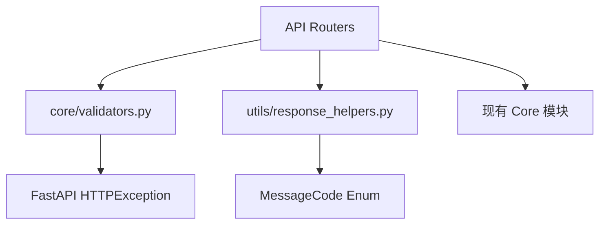

# API 标准化重构设计文档

> **版本**: 1.0  
> **创建时间**: 2024-12-23  
> **关联需求**: requirements.md

---

## 📐 架构设计

### 1. 整体架构

```
┌─────────────────────────────────────────────────────────────────┐
│                         API Router Layer                         │
│  duckdb_query.py │ async_tasks.py │ datasources.py │ ...        │
├─────────────────────────────────────────────────────────────────┤
│                         Core Layer (新增)                        │
│  ┌──────────────┐  ┌──────────────┐  ┌──────────────────────┐   │
│  │ validators.py │  │ error_codes.py│  │ response_helpers.py │   │
│  │ (参数校验)    │  │ (错误码定义) │  │ (响应格式化)        │   │
│  └──────────────┘  └──────────────┘  └──────────────────────┘   │
├─────────────────────────────────────────────────────────────────┤
│                         现有模块                                 │
│  database_manager │ duckdb_pool │ encryption │ config_manager   │
└─────────────────────────────────────────────────────────────────┘
```

### 2. 模块依赖关系



---

## 🔧 详细设计

### 模块 1: core/validators.py

**职责**: 统一参数校验逻辑

**接口设计**:

| 函数 | 输入 | 输出 | 异常 |
|------|------|------|------|
| `validate_table_name(name, field)` | str, str | None | HTTPException 400/403 |
| `validate_alias(alias, field)` | str, str | None | HTTPException 400 |
| `validate_shortcut(shortcut)` | str | None | HTTPException 400 |
| `sanitize_path(path, allowed_bases)` | str, List[str] | str | HTTPException 403 |
| `validate_pagination(limit, offset)` | int, int | None | HTTPException 400 |

**正则常量**:

```python
# DuckDB 标识符限制（与 PostgreSQL 一致）：
# - 最大长度: 64 字符
# - 引号包裹后可以使用特殊字符，但我们限制为字母数字下划线
SAFE_TABLE_NAME_PATTERN = re.compile(r'^[a-zA-Z_][a-zA-Z0-9_]{0,63}$')
SAFE_ALIAS_PATTERN = re.compile(r'^[a-zA-Z_][a-zA-Z0-9_]*$')
SAFE_SHORTCUT_PATTERN = re.compile(r'^(Cmd|Ctrl|Alt|Shift)(\+(Cmd|Ctrl|Alt|Shift|[A-Z0-9]))+$')
```

**保护常量**:

```python
# 保护的 Schema（禁止操作）
PROTECTED_SCHEMAS = ["information_schema", "pg_catalog", "duckdb_"]
# 保护的表名前缀
PROTECTED_PREFIX = "system_"
# 直接返回最大行数（超过需使用异步任务）
MAX_DIRECT_RETURN_ROWS = 10000
```

---

### 模块 2: response_helpers.py 扩展

**新增 MessageCode**:

```python
# 查询相关
QUERY_SUCCESS = "QUERY_SUCCESS"
QUERY_FAILED = "QUERY_FAILED"

# 表操作
TABLE_CREATED = "TABLE_CREATED"
TABLE_DELETED = "TABLE_DELETED"
TABLE_NOT_FOUND = "TABLE_NOT_FOUND"

# 异步任务
TASK_SUBMITTED = "TASK_SUBMITTED"
TASK_CANCELLED = "TASK_CANCELLED"
TASK_COMPLETED = "TASK_COMPLETED"
TASK_FAILED = "TASK_FAILED"

# 文件操作
FILE_UPLOADED = "FILE_UPLOADED"
FILE_IMPORT_SUCCESS = "FILE_IMPORT_SUCCESS"
EXPORT_SUCCESS = "EXPORT_SUCCESS"

# 校验错误
VALIDATION_ERROR = "VALIDATION_ERROR"
```

---

### 模块 3: 各 Router 改造

#### 3.1 duckdb_query.py 改造

**改动点**:

| 位置 | 当前代码 | 改造后代码 |
|------|---------|-----------|
| L705 DETACH | `DETACH {alias}` | `DETACH "{alias}"` |
| L622 日志 | 存在敏感日志 | 删除该行 |
| L405 删除表 | 无系统表保护 | 添加 `validate_table_name()` |
| 全部响应 | 手动构建 dict | 使用 `create_success_response()` |

**代码示例**:

```python
# 改造前
return {
    "success": True,
    "tables": table_info,
    "count": len(table_info)
}

# 改造后
from utils.response_helpers import create_success_response, MessageCode

return create_success_response(
    data={"tables": table_info, "count": len(table_info)},
    message_code=MessageCode.OPERATION_SUCCESS,
    message=f"获取到 {len(table_info)} 个表"
)
```

#### 3.2 async_tasks.py 改造

**改动点**:

| 功能 | 改动 |
|------|------|
| 分页 | 添加 `offset` 参数 |
| 排序 | 添加 `order_by` 参数 |
| 表名长度 | 添加 64 字符限制 |
| 取消原因 | 添加 500 字符限制 |
| 响应格式 | 使用 `create_success_response()` |

**分页实现**:

```python
@router.get("/api/async_tasks")
async def list_async_tasks(
    limit: int = Query(default=20, ge=1, le=100),
    offset: int = Query(default=0, ge=0),
    order_by: str = Query(default="created_at_desc", enum=["created_at_desc", "created_at_asc", "status"])
):
    from core.validators import validate_pagination
    validate_pagination(limit, offset)
    
    tasks = task_manager.list_tasks(limit=limit, offset=offset, order_by=order_by)
    total = task_manager.count_tasks()
    
    return create_list_response(
        items=tasks,
        total=total,
        message_code=MessageCode.OPERATION_SUCCESS,
        page_size=limit
    )
```

#### 3.3 server_files.py 改造

**改动点**:

| 功能 | 改动 |
|------|------|
| 浏览目录 | 添加 `sanitize_path()` 校验 |
| 导入文件 | 添加 `sanitize_path()` 校验 |

**代码示例**:

```python
from core.validators import sanitize_path

@router.get("/api/server_files")
async def browse_directory(path: str):
    allowed_bases = [m["path"] for m in config_manager.get_server_mounts()]
    safe_path = sanitize_path(path, allowed_bases)
    
    files = os.listdir(safe_path)
    # ...
```

#### 3.4 大数据量处理

**改动点**:

| 端点 | 改动 |
|------|------|
| `POST /api/duckdb/execute` | 添加行数限制检查 |
| `POST /api/duckdb/federated-query` | 添加行数限制检查 |

**实现**:

```python
MAX_DIRECT_RETURN_ROWS = 10000

def check_result_size(row_count: int):
    """检查结果集大小，超过限制抛出异常"""
    if row_count > MAX_DIRECT_RETURN_ROWS:
        raise HTTPException(400, detail={
            "code": "DATA_TOO_LARGE",
            "message": f"数据量过大（{row_count:,} 行），请使用异步任务",
            "field": "sql",
            "details": {
                "max_rows": MAX_DIRECT_RETURN_ROWS,
                "actual_rows": row_count,
                "hint": "使用异步任务可以导出完整数据为 CSV/Parquet 文件"
            }
        })
```

#### 3.5 连接测试超时处理

**改动点**:

| 端点 | 改动 |
|------|------|
| `POST /api/datasources/databases/test` | 添加超时和资源清理 |

**实现**:

```python
import asyncio

async def test_connection_with_timeout(params: dict, timeout: int):
    connection = None
    try:
        connection = await asyncio.wait_for(
            create_connection(params),
            timeout=timeout
        )
        await connection.execute("SELECT 1")
        return {"success": True}
    except asyncio.TimeoutError:
        raise HTTPException(408, detail={
            "code": "CONNECTION_TIMEOUT",
            "message": f"连接超时（{timeout}秒）"
        })
    finally:
        if connection:
            await connection.close()
```

---

## 📊 错误码设计

### 标准错误码

| 错误码 | HTTP 状态 | 说明 |
|-------|----------|------|
| `VALIDATION_ERROR` | 400 | 参数校验失败 |
| `INVALID_TABLE_NAME` | 400 | 表名格式无效 |
| `INVALID_ALIAS` | 400 | 别名格式无效 |
| `INVALID_SHORTCUT` | 400 | 快捷键格式无效 |
| `PATH_NOT_ALLOWED` | 403 | 路径不在白名单内 |
| `RESERVED_NAME` | 403 | 使用了保留名称 |
| `NOT_FOUND` | 404 | 资源不存在 |
| `TABLE_NOT_FOUND` | 404 | 表不存在 |
| `CONNECTION_NOT_FOUND` | 404 | 连接不存在 |
| `TASK_NOT_FOUND` | 404 | 任务不存在 |
| `CONFLICT` | 409 | 资源冲突（如重名） |
| `INTERNAL_ERROR` | 500 | 服务器内部错误 |
| `QUERY_FAILED` | 500 | 查询执行失败 |
| `ATTACH_FAILED` | 500 | 数据库 ATTACH 失败 |

---

## 🔄 迁移策略

### 阶段 1: 安全修复（立即）

1. 修复 DETACH SQL 注入
2. 删除敏感日志
3. 添加路径遍历校验

### 阶段 2: 基础设施（1天）

1. 创建 `core/validators.py`
2. 扩展 `response_helpers.py`
3. 更新 `__init__.py` 导出

### 阶段 3: Router 改造（3天）

1. 改造 `duckdb_query.py`
2. 改造 `async_tasks.py`
3. 改造 `datasources.py`
4. 改造 `server_files.py`
5. 改造 `paste_data.py`

### 阶段 4: 前端适配（1天）

1. 更新 TypeScript 类型
2. 适配新响应格式
3. 测试兼容性

---

## ✅ 兼容性保证

### 向后兼容策略

1. **响应字段**: 保留所有现有字段，新增字段使用 Optional
2. **路由别名**: 新旧路由同时支持
3. **参数别名**: 使用 Pydantic Field alias

### 测试要点

| 测试项 | 方法 |
|-------|------|
| 现有前端不报错 | 集成测试 |
| 新旧路由都可用 | API 测试 |
| 错误响应格式正确 | 单元测试 |
| 安全漏洞已修复 | 渗透测试 |

---

## 📁 文件变更清单

### 新增文件

| 文件路径 | 说明 |
|---------|------|
| `api/core/validators.py` | 公共校验模块 |

### 修改文件

| 文件路径 | 改动范围 |
|---------|---------|
| `api/utils/response_helpers.py` | 新增 MessageCode |
| `api/utils/__init__.py` | 导出 validators |
| `api/routers/duckdb_query.py` | 安全修复 + 响应格式 |
| `api/routers/async_tasks.py` | 分页 + 响应格式 |
| `api/routers/datasources.py` | 响应格式统一 |
| `api/routers/server_files.py` | 路径校验 |
| `api/routers/paste_data.py` | 删除重复字段 |
| `frontend/src/types/api.d.ts` | TypeScript 类型 |
