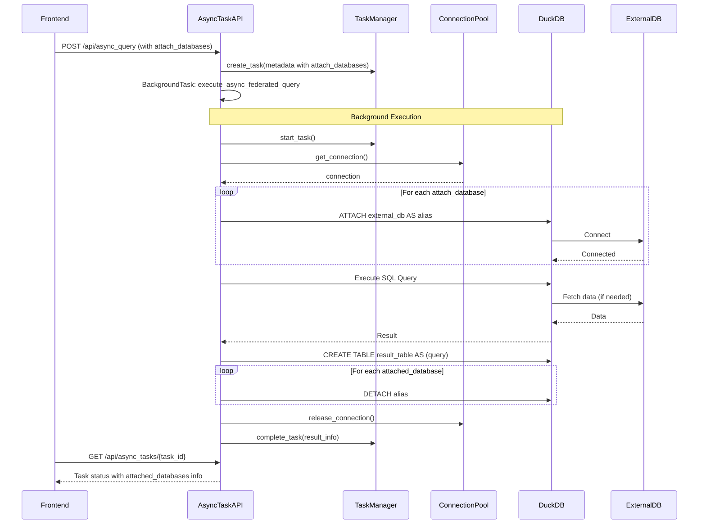
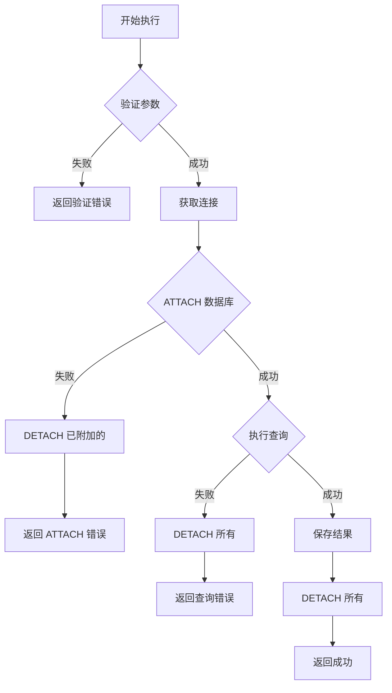

# Design Document: Async Federated Query Support

## Overview

本设计文档描述了为异步任务系统添加联邦查询支持的技术方案。该功能允许用户提交涉及多个外部数据库（MySQL、PostgreSQL、SQLite）的长时间运行查询作为异步任务执行。

### 设计目标

1. **API 一致性**：异步联邦查询 API 与同步联邦查询 API 保持一致
2. **代码复用**：复用现有的 `build_attach_sql`、`password_encryptor`、`db_manager` 等基础设施
3. **资源安全**：确保 ATTACH/DETACH 操作在同一连接上下文中完成，避免资源泄漏
4. **错误处理**：提供详细的错误信息，支持故障诊断和重试

## Architecture

### 系统架构图



### 组件职责

| 组件 | 职责 |
|------|------|
| AsyncTaskAPI | 接收请求、验证参数、创建任务、触发后台执行 |
| TaskManager | 任务状态管理、元数据持久化、取消信号处理 |
| ConnectionPool | DuckDB 连接管理、连接复用 |
| execute_async_federated_query | 后台执行函数，处理 ATTACH/DETACH 和查询执行 |
| db_manager | 外部数据库连接配置管理 |
| password_encryptor | 密码加密/解密 |

## Components and Interfaces

### 1. API 层修改

#### AsyncQueryRequest 模型扩展

```python
# api/routers/async_tasks.py

class AsyncQueryRequest(BaseModel):
    """异步查询请求模型"""
    sql: str
    custom_table_name: Optional[str] = None
    task_type: str = "query"
    datasource: Optional[Dict[str, Any]] = None
    # 新增：联邦查询支持
    attach_databases: Optional[List[AttachDatabase]] = None
```

#### 请求验证函数

```python
def validate_attach_databases(attach_databases: Optional[List[AttachDatabase]]) -> None:
    """验证 attach_databases 参数"""
    if not attach_databases:
        return
    
    aliases = set()
    for db in attach_databases:
        if not db.alias or not db.alias.strip():
            raise HTTPException(status_code=400, detail="数据库别名不能为空")
        if not db.connection_id or not db.connection_id.strip():
            raise HTTPException(status_code=400, detail="连接ID不能为空")
        if db.alias in aliases:
            raise HTTPException(status_code=400, detail=f"重复的数据库别名: {db.alias}")
        aliases.add(db.alias)
```

### 2. 后台执行函数

#### execute_async_federated_query

```python
def execute_async_federated_query(
    task_id: str,
    sql: str,
    custom_table_name: Optional[str] = None,
    task_type: str = "query",
    datasource: Optional[Dict[str, Any]] = None,
    attach_databases: Optional[List[Dict[str, str]]] = None,
):
    """
    执行异步联邦查询（后台任务）
    
    关键设计：
    1. 所有 ATTACH/DETACH 操作必须在同一连接上下文中完成
    2. 无论成功或失败，都必须执行 DETACH 清理
    3. 支持任务取消检查点
    """
    attached_aliases = []
    
    try:
        # 1. 启动任务
        if not task_manager.start_task(task_id):
            return
        
        # 2. 取消检查点 1
        if task_manager.is_cancellation_requested(task_id):
            task_manager.fail_task(task_id, "用户取消")
            return
        
        # 3. 获取连接并执行
        with pool.get_connection() as con:
            # 3.1 执行 ATTACH 操作
            if attach_databases:
                attached_aliases = _attach_external_databases(con, attach_databases)
            
            # 3.2 取消检查点 2
            if task_manager.is_cancellation_requested(task_id):
                _detach_databases(con, attached_aliases)
                task_manager.fail_task(task_id, "用户取消")
                return
            
            # 3.3 执行查询并保存结果
            table_name = _execute_and_save_result(con, sql, custom_table_name, task_id)
            
            # 3.4 获取元数据
            metadata = _get_result_metadata(con, table_name)
            
            # 3.5 DETACH 清理（在同一连接中）
            _detach_databases(con, attached_aliases)
        
        # 4. 更新任务状态
        task_manager.complete_task(task_id, {
            "table_name": table_name,
            "attached_databases": attached_aliases,
            **metadata
        })
        
    except Exception as e:
        # 确保清理
        if attached_aliases:
            try:
                with pool.get_connection() as con:
                    _detach_databases(con, attached_aliases)
            except Exception as detach_error:
                logger.warning(f"DETACH 清理失败: {detach_error}")
        
        task_manager.fail_task(task_id, str(e))
```

### 3. 辅助函数

#### _attach_external_databases

```python
def _attach_external_databases(
    con,
    attach_databases: List[Dict[str, str]]
) -> List[str]:
    """
    执行 ATTACH 操作，返回成功附加的别名列表
    
    失败时会 DETACH 已附加的数据库并抛出异常
    """
    attached = []
    
    try:
        for db in attach_databases:
            alias = db["alias"]
            connection_id = db["connection_id"]
            
            # 获取连接配置
            connection = db_manager.get_connection(connection_id)
            if not connection:
                raise ValueError(f"数据库连接 '{connection_id}' 不存在")
            
            # 构建配置
            db_config = connection.params.copy()
            db_config['type'] = connection.type.value
            
            # 解密密码
            password = db_config.get('password', '')
            if password and password_encryptor.is_encrypted(password):
                db_config['password'] = password_encryptor.decrypt_password(password)
            
            # 执行 ATTACH
            attach_sql = build_attach_sql(alias, db_config)
            con.execute(attach_sql)
            attached.append(alias)
            logger.info(f"成功 ATTACH 数据库: {alias}")
            
    except Exception as e:
        # 回滚已附加的数据库
        _detach_databases(con, attached)
        raise
    
    return attached
```

#### _detach_databases

```python
def _detach_databases(con, aliases: List[str]) -> None:
    """
    执行 DETACH 操作，忽略单个失败继续处理其他
    """
    for alias in aliases:
        try:
            con.execute(f"DETACH {alias}")
            logger.info(f"成功 DETACH 数据库: {alias}")
        except Exception as e:
            logger.warning(f"DETACH {alias} 失败: {e}")
```

### 4. 前端组件修改

#### AsyncTaskDialog Props 扩展

```typescript
export interface AsyncTaskDialogProps {
  open: boolean;
  onOpenChange: (open: boolean) => void;
  sql: string;
  datasource?: {
    id: string;
    type: string;
    name?: string;
  };
  // 新增：联邦查询支持
  attachDatabases?: Array<{
    alias: string;
    connectionId: string;
  }>;
  onSuccess?: (taskId: string) => void;
}
```

#### 提交逻辑修改

```typescript
const submitMutation = useMutation({
  mutationFn: async () => {
    const payload: AsyncQueryPayload = {
      sql,
      task_type: 'query',
    };

    if (customTableName.trim()) {
      payload.custom_table_name = customTableName.trim();
    }

    if (datasource) {
      payload.datasource = datasource;
    }

    // 新增：联邦查询参数
    if (attachDatabases && attachDatabases.length > 0) {
      payload.attach_databases = attachDatabases.map(db => ({
        alias: db.alias,
        connection_id: db.connectionId,
      }));
    }

    return submitAsyncQuery(payload);
  },
  // ...
});
```

## Data Models

### 任务元数据结构

```python
# 存储在 task.metadata 中的联邦查询信息
{
    "sql": "SELECT * FROM mysql_db.users JOIN pg_db.orders ...",
    "task_type": "query",
    "custom_table_name": "federated_result",
    "attach_databases": [
        {"alias": "mysql_db", "connection_id": "mysql-prod"},
        {"alias": "pg_db", "connection_id": "pg-analytics"}
    ],
    "datasource": None  # 联邦查询时为 None
}
```

### 任务结果信息结构

```python
# 存储在 task.result_info 中的执行结果
{
    "status": "completed",
    "table_name": "federated_result",
    "row_count": 1000,
    "columns": [...],
    "attached_databases": ["mysql_db", "pg_db"],  # 新增
    "is_federated": True,  # 新增
    "execution_time_ms": 5000
}
```


## Correctness Properties

*A property is a characteristic or behavior that should hold true across all valid executions of a system-essentially, a formal statement about what the system should do. Properties serve as the bridge between human-readable specifications and machine-verifiable correctness guarantees.*

### Property Reflection

After analyzing the acceptance criteria, the following redundancies were identified and consolidated:

1. Properties 4.1, 4.2, 4.3 (DETACH cleanup) can be combined into a single "DETACH cleanup invariant" property
2. Properties 7.1, 7.2, 7.3 (connection consistency) can be combined into a single "connection context invariant" property
3. Properties 9.1, 9.2, 9.3, 9.4 (input validation) can be combined into a single "input validation" property

### Consolidated Properties

#### Property 1: Attach Databases Metadata Persistence
*For any* async query request with valid attach_databases parameter, the created task's metadata SHALL contain the exact attach_databases configuration that was submitted.
**Validates: Requirements 1.1, 2.2**

#### Property 2: DETACH Cleanup Invariant
*For any* federated async task execution (whether successful, failed, or cancelled), all databases that were successfully ATTACHed SHALL be DETACHed before the task completes.
**Validates: Requirements 1.3, 4.1, 4.2, 4.3, 4.4**

#### Property 3: Connection Context Invariant
*For any* federated async task execution, all ATTACH operations, the SQL query execution, and all DETACH operations SHALL be performed within the same DuckDB connection context.
**Validates: Requirements 7.1, 7.2, 7.3**

#### Property 4: Input Validation Completeness
*For any* async query request with attach_databases parameter, if any entry has empty alias, empty connection_id, or duplicate aliases, the request SHALL be rejected with appropriate validation error before task creation.
**Validates: Requirements 9.1, 9.2, 9.3, 9.4**

#### Property 5: Result Info Contains Attached Databases
*For any* completed federated async task, the result_info SHALL contain the list of database aliases that were successfully attached during execution.
**Validates: Requirements 1.5, 5.1, 5.3**

#### Property 6: Retry Preserves Original Configuration
*For any* retry of a federated async task without explicit attach_databases override, the new task SHALL use the original attach_databases configuration from the failed task.
**Validates: Requirements 2.3, 10.1**

#### Property 7: ATTACH Failure Rollback
*For any* federated async task where ATTACH fails for database N, all databases 1 to N-1 that were successfully ATTACHed SHALL be DETACHed before the task fails.
**Validates: Requirements 1.4, 4.1**

#### Property 8: SQL Validation Round Trip
*For any* async query request, the SQL stored in task metadata SHALL be identical to the SQL submitted in the request (after trimming).
**Validates: Requirements 9.4**

## Error Handling

### Error Categories

| 错误类型 | 错误码 | 错误消息模板 | 处理方式 |
|---------|--------|-------------|---------|
| 连接不存在 | CONNECTION_NOT_FOUND | 数据库连接 '{connection_id}' 不存在 | 立即失败，不执行 ATTACH |
| 类型不支持 | UNSUPPORTED_TYPE | 不支持的数据源类型: {type} | 立即失败，不执行 ATTACH |
| ATTACH 失败 | ATTACH_FAILED | 连接外部数据库 '{alias}' 失败: {detail} | 回滚已 ATTACH 的数据库 |
| 认证失败 | AUTH_FAILED | 数据库认证失败，请检查用户名和密码 | 回滚并提示检查凭据 |
| 连接超时 | CONNECTION_TIMEOUT | 连接超时，请检查网络或数据库状态 | 回滚并提示检查网络 |
| 查询失败 | QUERY_FAILED | 查询执行失败: {detail} | 执行 DETACH 清理后失败 |
| 参数验证 | VALIDATION_ERROR | {具体验证错误} | 立即拒绝请求 |

### 错误处理流程



## Testing Strategy

### 测试框架

- **后端**: pytest + pytest-asyncio + unittest.mock
- **前端**: vitest + @testing-library/react
- **属性测试**: hypothesis (Python) / fast-check (TypeScript)

### 双重测试方法

本功能采用单元测试和属性测试相结合的方式：

1. **单元测试**: 验证具体示例、边界情况和错误条件
2. **属性测试**: 验证应在所有有效输入上成立的通用属性

### 后端测试用例

#### 单元测试

```python
# api/tests/test_async_federated_query.py

class TestAsyncFederatedQueryAPI:
    """异步联邦查询 API 测试"""
    
    def test_submit_federated_query_success(self):
        """测试成功提交联邦查询"""
        pass
    
    def test_submit_with_invalid_connection_id(self):
        """测试无效连接ID"""
        pass
    
    def test_submit_with_duplicate_aliases(self):
        """测试重复别名"""
        pass

class TestAsyncFederatedQueryExecution:
    """异步联邦查询执行测试"""
    
    def test_attach_detach_lifecycle(self):
        """测试 ATTACH/DETACH 生命周期"""
        pass
    
    def test_cleanup_on_query_failure(self):
        """测试查询失败时的清理"""
        pass
    
    def test_cleanup_on_cancellation(self):
        """测试取消时的清理"""
        pass
```

#### 属性测试

```python
# api/tests/test_async_federated_query_properties.py

from hypothesis import given, strategies as st

class TestAsyncFederatedQueryProperties:
    """异步联邦查询属性测试"""
    
    @given(st.lists(st.fixed_dictionaries({
        'alias': st.text(min_size=1, max_size=20, alphabet='abcdefghijklmnopqrstuvwxyz_'),
        'connection_id': st.text(min_size=1, max_size=50)
    }), min_size=1, max_size=5, unique_by=lambda x: x['alias']))
    def test_metadata_persistence_property(self, attach_databases):
        """
        **Feature: async-federated-query, Property 1: Attach Databases Metadata Persistence**
        **Validates: Requirements 1.1, 2.2**
        
        For any valid attach_databases, metadata should contain exact configuration.
        """
        pass
    
    @given(st.text(min_size=1))
    def test_sql_validation_round_trip(self, sql):
        """
        **Feature: async-federated-query, Property 8: SQL Validation Round Trip**
        **Validates: Requirements 9.4**
        
        SQL in metadata should match submitted SQL after trimming.
        """
        pass
```

### 前端测试用例

```typescript
// frontend/src/new/Query/AsyncTasks/__tests__/AsyncTaskDialog.federated.test.tsx

describe('AsyncTaskDialog Federated Query Support', () => {
  it('should include attachDatabases in submission payload', () => {
    // Test that attachDatabases prop is passed to API
  });
  
  it('should display attached databases in confirmation', () => {
    // Test UI shows database list
  });
});
```

### 测试配置

属性测试应配置为运行至少 100 次迭代：

```python
# conftest.py
from hypothesis import settings

settings.register_profile("ci", max_examples=100)
settings.load_profile("ci")
```

### 测试覆盖要求

| 测试类型 | 覆盖目标 |
|---------|---------|
| 单元测试 | API 端点、验证逻辑、错误处理 |
| 属性测试 | 元数据持久化、清理不变量、输入验证 |
| 集成测试 | ATTACH/DETACH 流程（需要 mock） |
| 前端测试 | 组件渲染、数据传递 |

