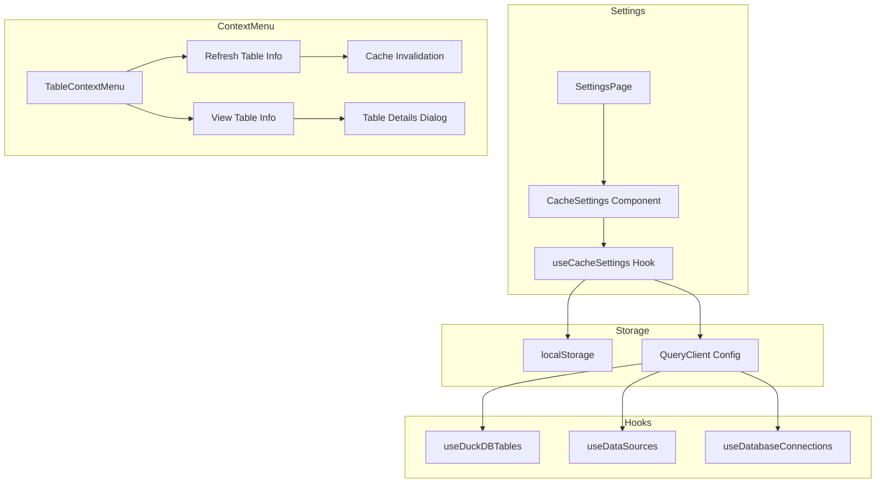

# Design Document: Cache Settings Configurable

## Overview

本设计实现可配置的缓存管理系统，包括：
1. 统一的缓存有效期配置（默认 30 分钟）
2. 表右键菜单增强（刷新表信息、查看表信息）
3. 设置页面的缓存配置 UI
4. 清除所有缓存功能

## Architecture



## Components and Interfaces

### 文件结构

```
frontend/src/new/
├── hooks/
│   ├── useCacheSettings.ts          # 新增：缓存配置 Hook
│   ├── useDuckDBTables.ts           # 修改：使用动态缓存配置
│   ├── useDataSources.ts            # 修改：使用动态缓存配置
│   └── useDatabaseConnections.ts    # 修改：使用动态缓存配置
├── Settings/
│   ├── SettingsPage.tsx             # 修改：添加缓存设置卡片
│   └── CacheSettings.tsx            # 新增：缓存设置组件
├── Query/DataSourcePanel/
│   └── ContextMenu.tsx              # 修改：添加刷新表信息菜单项
└── utils/
    └── cacheConfig.ts               # 新增：缓存配置工具函数
```

### 1. CacheSettings Hook

```typescript
// frontend/src/new/hooks/useCacheSettings.ts

interface CacheSettings {
  /** 缓存有效期（分钟） */
  cacheDuration: number;
}

interface UseCacheSettingsReturn {
  settings: CacheSettings;
  updateSettings: (settings: Partial<CacheSettings>) => void;
  resetToDefaults: () => void;
  clearAllCache: () => Promise<void>;
  isLoading: boolean;
}

const DEFAULT_CACHE_SETTINGS: CacheSettings = {
  cacheDuration: 30, // 30 分钟
};

const CACHE_SETTINGS_KEY = 'duckquery-cache-settings';
```

### 2. CacheSettings Component

```typescript
// frontend/src/new/Settings/CacheSettings.tsx
// 作为独立组件，在 SettingsPage.tsx 中导入使用

interface CacheSettingsProps {
  // 无需 props，使用 useCacheSettings hook
}
```

**UI 布局（在 SettingsPage.tsx 中的位置）：**

```tsx
// SettingsPage.tsx 中的结构
<div className="max-w-4xl mx-auto space-y-6">
  {/* 数据库设置 - 已有 */}
  <Card>...</Card>
  
  {/* 快捷键设置 - 已有 */}
  <ShortcutSettings />
  
  {/* 🆕 缓存设置 - 新增，放在快捷键设置后面 */}
  <CacheSettings />
  
  {/* 界面设置 - 已有 */}
  <Card>...</Card>
  
  {/* 语言设置 - 已有 */}
  <Card>...</Card>
  
  {/* 安全设置 - 已有 */}
  <Card>...</Card>
</div>
```

**CacheSettings 组件内部结构：**

```tsx
<Card>
  <CardHeader>
    <CardTitle>
      <Clock className="h-4 w-4" />
      缓存设置
    </CardTitle>
    <CardDescription>配置查询数据的缓存有效期</CardDescription>
  </CardHeader>
  <CardContent>
    {/* 缓存有效期配置 */}
    <div className="flex items-center justify-between">
      <div>
        <h4>缓存有效期</h4>
        <p>数据在缓存中保持新鲜的时间（分钟）</p>
      </div>
      <Input type="number" min={1} max={120} value={30} />
    </div>
    
    <Separator />
    
    {/* 操作按钮 */}
    <div className="flex gap-2">
      <Button variant="outline" onClick={resetToDefaults}>
        重置为默认值
      </Button>
      <Button variant="destructive" onClick={clearAllCache}>
        清除所有缓存
      </Button>
    </div>
  </CardContent>
</Card>
```

### 3. Enhanced Context Menu

```typescript
// 修改现有 frontend/src/new/Query/DataSourcePanel/ContextMenu.tsx

// 添加菜单项：
// - "刷新表信息" (Refresh Table Info) - 所有表都可用
// - "查看表信息" (View Table Info) - 已有，保持不变

interface TableContextMenuProps {
  // ... 现有 props
  onRefreshTableInfo?: (tableName: string) => Promise<void>;
}
```

### 4. Cache Config Utilities

```typescript
// frontend/src/new/utils/cacheConfig.ts

// 提供给所有 TanStack Query hooks 使用的配置获取函数
export function getCacheConfig(): { staleTime: number; gcTime: number };

// 验证缓存时间输入
export function validateCacheDuration(value: unknown): number;
```

## Data Models

### CacheSettings

```typescript
interface CacheSettings {
  /** 缓存有效期（分钟），范围 1-120 */
  cacheDuration: number;
}
```

### LocalStorage Schema

```json
{
  "duckquery-cache-settings": {
    "cacheDuration": 30
  }
}
```

## Correctness Properties

*A property is a characteristic or behavior that should hold true across all valid executions of a system-essentially, a formal statement about what the system should do. Properties serve as the bridge between human-readable specifications and machine-verifiable correctness guarantees.*

### Property 1: Cache duration validation
*For any* input value, the validation function should accept only positive integers within range 1-120, and reject all other values (negative, zero, non-integer, out of range).
**Validates: Requirements 1.2**

### Property 2: Settings round-trip persistence
*For any* valid CacheSettings object, saving to localStorage and then loading should produce an equivalent object.
**Validates: Requirements 1.3, 6.1, 6.2**

### Property 3: Invalid settings fallback to defaults
*For any* invalid or malformed settings data in localStorage, loading should return the default settings without errors.
**Validates: Requirements 6.3**

### Property 4: Cache duration applies to all queries
*For any* configured cache duration value, all TanStack Query hooks should use that value as both staleTime and gcTime (converted to milliseconds).
**Validates: Requirements 4.1**

## Error Handling

### Input Validation Errors
- 非数字输入：显示错误提示，保持原值
- 超出范围：自动限制到有效范围 [1, 120]
- 空值：使用默认值 30

### Storage Errors
- localStorage 不可用：使用内存中的默认值，不显示错误
- JSON 解析失败：使用默认值，记录警告日志
- 数据格式错误：使用默认值，记录警告日志

### Cache Operation Errors
- 刷新表信息失败：显示错误 toast，保留旧缓存
- 清除缓存失败：显示错误 toast

## Testing Strategy

### Unit Tests
- CacheSettings validation function
- localStorage read/write operations
- Default values handling

### Property-Based Tests
使用 fast-check 库进行属性测试：

1. **Property 1**: 生成随机输入值，验证 validation 函数行为
2. **Property 2**: 生成随机有效设置，验证 round-trip
3. **Property 3**: 生成随机无效数据，验证 fallback 行为
4. **Property 4**: 生成随机有效 duration，验证所有 hooks 配置

### Integration Tests
- 设置页面 UI 交互
- 右键菜单功能
- 缓存刷新流程

### Test Configuration
- 每个属性测试运行 100 次迭代
- 使用 vitest + fast-check
