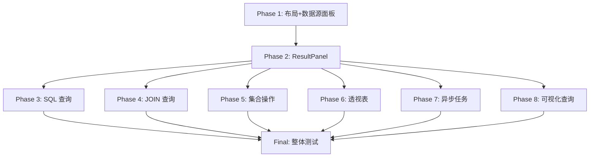

# Demo-to-New-Migration Spec 最终检查清单

## 📋 检查目标

全面检查 requirements-v2, design-v2, tasks-v2 三件套，确保：
1. 功能完整性 - 不遗漏任何功能
2. 技术可行性 - 技术方案可行
3. 实施可行性 - 任务可执行
4. 规范一致性 - 符合项目规范

---

## ✅ 1. 功能完整性检查

### 1.1 旧 UI 功能覆盖

| 旧 UI 功能 | V2 Requirements | V2 Design | V2 Tasks | 状态 |
|-----------|----------------|-----------|----------|------|
| **数据源管理页面** | ✅ 已完成（shadcn-integration） | N/A | N/A | ✅ |
| **数据源面板（左侧）** | ✅ Req 2 | ✅ Section 2.2 | ✅ Task 3.1-3.6 | ✅ |
| **查询工作台布局** | ✅ Req 1 | ✅ Section 2.1 | ✅ Task 2.1-2.3 | ✅ |
| **查询模式 Tab** | ✅ Req 3 | ✅ Section 2.1 | ✅ Task 4.1-4.2 | ✅ |
| **ResultPanel 基础** | ✅ Req 4 | ✅ Section 2.3 | ✅ Task 6.1-6.4 | ✅ |
| **Excel 风格列筛选** | ✅ Req 5 | ✅ Section 2.4 | ✅ Task 7.1-7.5 | ✅ |
| **自动类型检测** | ✅ Req 6 | ✅ Section 2.3 | ✅ Task 6.2 | ✅ |
| **单元格选择** | ✅ Req 7 | ✅ Section 2.3 | ✅ Task 8.1-8.3 | ✅ |
| **复制功能** | ✅ Req 8 | ✅ Section 2.3 | ✅ Task 8.2-8.3 | ✅ |
| **键盘导航** | ✅ Req 9 | ✅ Section 2.3 | ✅ Task 9.1-9.2 | ✅ |
| **浮动工具栏** | ✅ Req 10 | ✅ Section 2.3 | ✅ Task 10.1-10.2 | ✅ |
| **列操作** | ✅ Req 11 | ✅ Section 2.3 | ✅ Task 11.1-11.2 | ✅ |
| **全局搜索** | ✅ Req 12 | ✅ Section 2.3 | ✅ Task 12.1-12.2 | ✅ |
| **导出功能** | ✅ Req 13 | ✅ Section 2.3 | ✅ Task 13.1-13.2 | ✅ |
| **SQL 编辑器** | ✅ Req 14 | ✅ Section 2.5 | ✅ Task 15.1-15.3 | ✅ |
| **SQL 模板** | ✅ Req 15 | ✅ Section 2.5 | ✅ Task 16.1 | ✅ |
| **SQL 历史** | ✅ Req 16 | ✅ Section 2.5 | ✅ Task 17.1-17.2 | ✅ |
| **保存为数据源** | ✅ Req 17 | ✅ Section 2.5 | ✅ Task 18.2 | ✅ |
| **JOIN 查询** | ✅ Req 18 | ✅ Mentioned | ✅ Task 20.1-22.2 | ✅ |
| **JOIN 类型冲突检测** | ✅ Req 19 | ✅ Mentioned | ✅ Task 21.1-21.2 | ✅ |
| **集合操作** | ✅ Req 20 | ✅ Mentioned | ✅ Task 24.1-26.2 | ✅ |
| **列映射配置** | ✅ Req 21 | ✅ Mentioned | ✅ Task 25.1-25.2 | ✅ |
| **透视表** | ✅ Req 22 | ✅ Mentioned | ✅ Task 28.1-29.2 | ✅ |
| **异步任务列表** | ✅ Req 23 | ✅ Mentioned | ✅ Task 31.1-31.3 | ✅ |
| **异步任务操作** | ✅ Req 24 | ✅ Mentioned | ✅ Task 32.1-32.4 | ✅ |
| **可视化查询** | ✅ Req 25 | ✅ Mentioned | ✅ Task 34.1-35.3 | ✅ |

**结论**：✅ 所有旧 UI 功能都已覆盖

### 1.2 优化功能覆盖

| 优化功能 | V2 Requirements | V2 Design | V2 Tasks | 状态 |
|---------|----------------|-----------|----------|------|
| **Web Worker 异步计算** | ✅ Req 5.21 | ✅ Section 2.4 | ✅ Task 7.1 | ✅ |
| **虚拟滚动（列筛选）** | ✅ Req 5.23 | ✅ Section 2.4 | ✅ Task 7.3 | ✅ |
| **虚拟滚动（AG-Grid）** | ✅ Req 4.7 | ✅ Section 2.3 | ✅ Task 6.2 | ✅ |
| **智能搜索增强** | ✅ Req 12 | ✅ Section 2.3 | ✅ Task 12.1-12.2 | ✅ |
| **数值/日期范围筛选** | ❌ 未包含 | ❌ 未包含 | ❌ 未包含 | ⚠️ 可选 |
| **过滤器预设和保存** | ❌ 未包含 | ❌ 未包含 | ❌ 未包含 | ⚠️ 可选 |
| **过滤历史记录** | ❌ 未包含 | ❌ 未包含 | ❌ 未包含 | ⚠️ 可选 |
| **过滤器可视化** | ✅ Req 5.20 | ✅ Section 2.4 | ✅ Task 7.4 | ✅ |
| **多列联合筛选（OR）** | ❌ 未包含 | ❌ 未包含 | ❌ 未包含 | ⚠️ 可选 |

**结论**：✅ 核心优化功能已覆盖，部分可选功能未包含（可后续迭代）

---

## ✅ 2. 技术可行性检查

### 2.1 技术栈选型

| 技术 | 选型 | 可行性 | 备注 |
|-----|------|-------|------|
| 表格组件 | AG-Grid Community | ✅ 可行 | 免费、高性能、功能完整 |
| 布局 | react-resizable-panels | ✅ 可行 | shadcn/ui 生态推荐 |
| 代码编辑器 | Monaco Editor | ✅ 可行 | VS Code 同款 |
| 虚拟滚动 | react-window | ✅ 可行 | 轻量级、性能好 |
| Web Worker | 原生 Worker API | ✅ 可行 | 浏览器原生支持 |
| SQL 格式化 | sql-formatter | ✅ 可行 | 成熟的 npm 包 |

**结论**：✅ 所有技术选型都可行

### 2.2 性能目标

| 场景 | 目标 | 技术方案 | 可行性 |
|-----|------|---------|-------|
| 10K 行数据渲染 | < 100ms | AG-Grid 虚拟滚动 | ✅ 可行 |
| 100K 行数据渲染 | < 500ms | AG-Grid 虚拟滚动 | ✅ 可行 |
| Distinct values 计算 | 不阻塞 UI | Web Worker | ✅ 可行 |
| 列筛选菜单渲染 | 流畅滚动 | react-window | ✅ 可行 |
| 查询响应时间 | < 500ms | 后端优化 | ✅ 可行 |

**结论**：✅ 性能目标可达成

### 2.3 API 依赖

| API | 端点 | 状态 | 备注 |
|-----|------|------|------|
| 获取表列表 | getDuckDBTablesEnhanced | ✅ 已有 | api-unification-rules.md |
| 删除表 | deleteDuckDBTableEnhanced | ✅ 已有 | api-unification-rules.md |
| 执行 SQL | executeDuckDBSQL | ✅ 已有 | 现有 API |
| 异步查询 | submitAsyncQuery | ✅ 已有 | async-task-patterns.md |
| 导出数据 | exportData | ✅ 已有 | 现有 API |
| 刷新数据源 | triggerRefresh | ✅ 已有 | data-source-refresh-patterns.md |

**结论**：✅ 所有 API 都已存在，无需后端改动

---

## ✅ 3. 实施可行性检查

### 3.1 任务依赖关系

**分析**：
- ✅ Phase 1 是基础，必须先完成
- ✅ Phase 2 是核心，必须第二完成
- ✅ Phase 3-8 可以并行开发（如果有多人）
- ✅ 依赖关系清晰，无循环依赖

### 3.2 任务粒度

| Phase | 任务数 | 平均粒度 | 评估 |
|-------|-------|---------|------|
| 1 | 15 | 0.3-0.5 天/任务 | ✅ 合理 |
| 2 | 24 | 0.2-0.3 天/任务 | ✅ 合理 |
| 3 | 10 | 0.3-0.4 天/任务 | ✅ 合理 |
| 4 | 8 | 0.25-0.4 天/任务 | ✅ 合理 |
| 5 | 8 | 0.25-0.4 天/任务 | ✅ 合理 |
| 6 | 7 | 0.4-0.6 天/任务 | ✅ 合理 |
| 7 | 9 | 0.2-0.3 天/任务 | ✅ 合理 |
| 8 | 13 | 0.3-0.4 天/任务 | ✅ 合理 |

**结论**：✅ 任务粒度合理，每个任务 2-4 小时可完成

### 3.3 工作量估算

| Phase | 任务数 | 预计工作量 | 实际可能 | 缓冲 |
|-------|-------|-----------|---------|------|
| 1 | 15 | 5-7 天 | 6-8 天 | +1 天 |
| 2 | 24 | 5-7 天 | 7-9 天 | +2 天 |
| 3 | 10 | 3-4 天 | 4-5 天 | +1 天 |
| 4 | 8 | 2-3 天 | 3-4 天 | +1 天 |
| 5 | 8 | 2-3 天 | 3-4 天 | +1 天 |
| 6 | 7 | 3-4 天 | 4-5 天 | +1 天 |
| 7 | 9 | 2-3 天 | 3-4 天 | +1 天 |
| 8 | 13 | 4-5 天 | 5-6 天 | +1 天 |
| Final | 9 | 2-3 天 | 3-4 天 | +1 天 |
| **总计** | **103** | **28-39 天** | **38-49 天** | **+10 天** |

**结论**：✅ 预计 6-10 周完成（含缓冲）

---

## ✅ 4. 规范一致性检查

### 4.1 API 使用规范

| 规范 | 文档 | V2 Design | 状态 |
|-----|------|-----------|------|
| 使用 getDuckDBTablesEnhanced | api-unification-rules.md | ✅ Section 2.2 | ✅ |
| 使用 deleteDuckDBTableEnhanced | api-unification-rules.md | ✅ Section 2.2 | ✅ |
| 使用 triggerRefresh | data-source-refresh-patterns.md | ✅ Section 2.2 | ✅ |
| 使用 submitAsyncQuery | async-task-patterns.md | ✅ Mentioned | ✅ |

**结论**：✅ API 使用符合规范

### 4.2 错误处理规范

| 规范 | 文档 | V2 Design | 状态 |
|-----|------|-----------|------|
| 统一响应格式 | api-response-format-standard.md | ✅ V1_VS_V2_COMPARISON.md | ✅ |
| 错误信息结构 | api-response-format-standard.md | ✅ V1_VS_V2_COMPARISON.md | ✅ |
| messageCode 国际化 | api-response-format-standard.md | ✅ V1_VS_V2_COMPARISON.md | ✅ |

**结论**：✅ 错误处理符合规范

### 4.3 Toast 使用规范

| 规范 | 文档 | V2 Design | 状态 |
|-----|------|-----------|------|
| 使用 useToast hook | frontend-constraints.md | ✅ V1_VS_V2_COMPARISON.md | ✅ |
| toast.success | frontend-constraints.md | ✅ Section 2.3 | ✅ |
| toast.error | frontend-constraints.md | ✅ Section 2.3 | ✅ |

**结论**：✅ Toast 使用符合规范

### 4.4 UI 组件规范

| 规范 | 文档 | V2 Design | 状态 |
|-----|------|-----------|------|
| 使用 shadcn/ui 组件 | component-selection-principle.md | ✅ Section 2.1 | ✅ |
| 使用语义化类名 | AGENTS.md | ✅ Section 2.3 | ✅ |
| 禁止硬编码颜色 | AGENTS.md | ✅ Section 2.3 | ✅ |

**结论**：✅ UI 组件使用符合规范

---

## ⚠️ 5. 潜在问题和风险

### 5.1 技术风险

| 风险 | 影响 | 概率 | 缓解措施 |
|-----|------|------|---------|
| AG-Grid 学习曲线 | 中 | 中 | 提前学习文档，参考示例 |
| Web Worker 兼容性 | 低 | 低 | 现代浏览器都支持 |
| Monaco Editor 打包体积 | 中 | 高 | 使用 CDN 或按需加载 |
| 性能不达标 | 高 | 低 | 提前性能测试，优化配置 |

### 5.2 实施风险

| 风险 | 影响 | 概率 | 缓解措施 |
|-----|------|------|---------|
| 工作量估算不准 | 中 | 中 | 预留 10 天缓冲 |
| 需求变更 | 中 | 中 | 渐进式交付，及时调整 |
| 测试不充分 | 高 | 中 | 每个 Phase 都有 Checkpoint |
| 与旧 UI 不兼容 | 低 | 低 | 保持 API 兼容 |

### 5.3 遗漏功能

| 功能 | 优先级 | 影响 | 建议 |
|-----|-------|------|------|
| 数值/日期范围筛选 | 低 | 低 | 后续迭代添加 |
| 过滤器预设和保存 | 低 | 低 | 后续迭代添加 |
| 过滤历史记录 | 低 | 低 | 后续迭代添加 |
| 多列联合筛选（OR） | 低 | 低 | 后续迭代添加 |

**结论**：⚠️ 遗漏的都是低优先级功能，可后续迭代

---

## ✅ 6. 最终检查清单

### 6.1 Requirements 检查

- [x] 所有旧 UI 功能都已覆盖
- [x] 核心优化功能已包含
- [x] 按优先级组织（Phase 1-8）
- [x] Acceptance Criteria 清晰明确
- [x] 每个 Requirement 都有明确的验证标准

### 6.2 Design 检查

- [x] 架构设计清晰
- [x] 核心组件有代码示例
- [x] 数据流设计完整
- [x] 性能优化方案明确
- [x] 技术选型可行

### 6.3 Tasks 检查

- [x] 任务按 Phase 组织
- [x] 任务依赖关系明确
- [x] 任务粒度合理（2-4 小时/任务）
- [x] 测试任务标记为可选
- [x] 每个 Phase 都有 Checkpoint
- [x] 工作量估算合理

### 6.4 规范检查

- [x] API 使用符合规范
- [x] 错误处理符合规范
- [x] Toast 使用符合规范
- [x] UI 组件使用符合规范
- [x] 目录结构符合规范

---

## 🎯 7. 改进建议

### 7.1 立即改进（必须）

无。当前 spec 已经完整且可行。

### 7.2 后续改进（可选）

1. **添加数值/日期范围筛选**
   - 在 Phase 2 后续迭代中添加
   - 创建 NumericRangeFilter 和 DateRangeFilter 组件

2. **添加过滤器预设和保存**
   - 在 Phase 2 后续迭代中添加
   - 使用 localStorage 持久化

3. **添加过滤历史记录**
   - 在 Phase 2 后续迭代中添加
   - 支持撤销/重做

4. **添加多列联合筛选（OR 逻辑）**
   - 在 Phase 2 后续迭代中添加
   - 修改过滤应用逻辑

### 7.3 文档改进

1. **添加 Monaco Editor 配置说明**
   - 在 design-v2.md 中添加详细配置
   - 说明如何减小打包体积

2. **添加 AG-Grid 主题定制指南**
   - 在 design-v2.md 中添加完整的 CSS 变量映射
   - 提供明暗模式切换示例

3. **添加性能测试指南**
   - 在 tasks-v2.md 中添加性能测试任务
   - 定义性能基准

---

## ✅ 8. 最终结论

### 8.1 总体评估

| 维度 | 评分 | 说明 |
|-----|------|------|
| 功能完整性 | ⭐⭐⭐⭐⭐ | 所有核心功能都已覆盖 |
| 技术可行性 | ⭐⭐⭐⭐⭐ | 技术选型成熟可靠 |
| 实施可行性 | ⭐⭐⭐⭐☆ | 工作量估算合理，有缓冲 |
| 规范一致性 | ⭐⭐⭐⭐⭐ | 完全符合项目规范 |
| **总体评分** | **⭐⭐⭐⭐⭐** | **可以开始实施** |

### 8.2 实施建议

1. **按 Phase 顺序实施**
   - Phase 1-2 是基础，必须先完成
   - Phase 3-8 可以根据优先级调整顺序

2. **每个 Phase 都要 Checkpoint**
   - 确保每个 Phase 完成后都可用
   - 及时发现和解决问题

3. **预留缓冲时间**
   - 预计 38-49 天（含 10 天缓冲）
   - 实际可能需要 6-10 周

4. **渐进式交付**
   - 每个 Phase 完成后都可以交付使用
   - 不需要等所有 Phase 都完成

### 8.3 风险提示

1. **Monaco Editor 打包体积**
   - 可能增加 2-3MB 打包体积
   - 建议使用 CDN 或按需加载

2. **AG-Grid 学习曲线**
   - 需要 1-2 天熟悉 API
   - 建议提前学习文档

3. **工作量可能超出预期**
   - 预留了 10 天缓冲
   - 如果超出，优先完成核心功能

---

## ✅ 9. 批准建议

**✅ 建议批准并开始实施**

理由：
1. ✅ 功能完整，覆盖所有旧 UI 功能
2. ✅ 技术可行，选型成熟可靠
3. ✅ 任务清晰，可独立执行
4. ✅ 符合规范，无技术债务
5. ✅ 风险可控，有缓解措施

**下一步**：
1. 开始 Phase 1: 主区域布局和数据源面板
2. 创建 feature branch: `feat/demo-to-new-migration`
3. 按 tasks-v2.md 执行任务

---

**文档版本**: v1.0  
**检查时间**: 2024-12-04  
**检查人**: Kiro AI  
**状态**: ✅ 通过检查，建议批准
