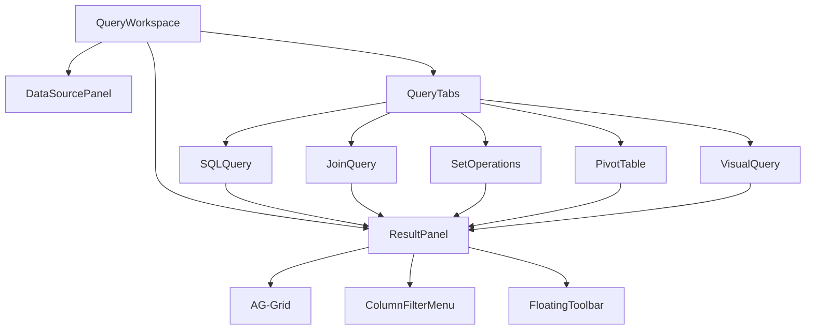
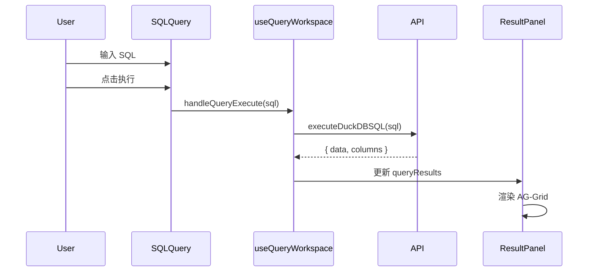
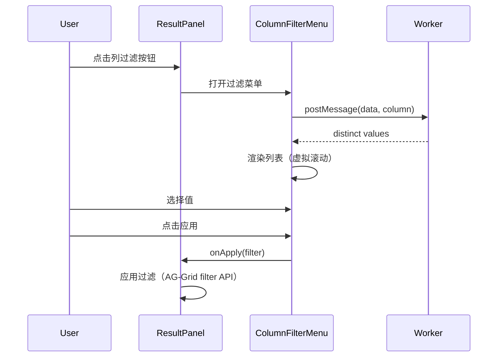

# Demo 迁移到新布局 - 设计文档 (v2)

## 🎯 设计原则

1. **基于 shadcn-integration 的成果**：所有新组件使用 TypeScript + TanStack Query + shadcn/ui
2. **使用 AG-Grid**：高性能表格组件，支持虚拟滚动和 Excel 风格交互
3. **遵循项目规范**：API 统一、错误处理统一、Toast 统一、样式语义化
4. **渐进式实现**：按优先级分阶段实现，确保每个阶段都可用

## 一、架构设计

### 1.1 整体架构

```
frontend/src/new/Query/
├── QueryWorkspace.tsx              # 主容器（三栏布局）
├── DataSourcePanel/                # 数据源面板（左侧）
├── QueryTabs/                      # 查询模式 Tab
├── SQLQuery/                       # SQL 查询
├── JoinQuery/                      # JOIN 查询
├── SetOperations/                  # 集合操作
├── PivotTable/                     # 透视表
├── VisualQuery/                    # 可视化查询
├── ResultPanel/                    # 结果面板（AG-Grid）
└── AsyncTasks/                     # 异步任务
```

### 1.2 技术栈

| 层级 | 技术选型 | 说明 |
|-----|---------|------|
| 语言 | TypeScript | 类型安全 |
| 框架 | React 18 | 组件化 |
| 状态管理 | TanStack Query | 服务端状态 |
| UI 组件 | shadcn/ui | 设计系统 |
| 表格组件 | AG-Grid Community | 高性能表格 |
| 布局 | react-resizable-panels | 可调整大小面板 |
| 代码编辑器 | Monaco Editor | SQL 编辑器 |
| 图标 | lucide-react | 图标库 |

### 1.3 依赖关系



## 二、核心组件设计

### 2.1 QueryWorkspace（查询工作台）

**职责**：三栏布局容器，管理全局状态

**技术实现**：
```typescript
import { Panel, PanelGroup, PanelResizeHandle } from 'react-resizable-panels';
import { useQueryWorkspace } from '@/hooks/useQueryWorkspace';

export const QueryWorkspace: React.FC = () => {
  const {
    selectedTables,
    currentTab,
    queryResults,
    handleTableSelect,
    handleTabChange,
    handleQueryExecute,
  } = useQueryWorkspace();
  
  return (
    <PanelGroup direction="horizontal">
      {/* 数据源面板 */}
      <Panel defaultSize={20} minSize={15} maxSize={40}>
        <DataSourcePanel
          selectedTables={selectedTables[currentTab]}
          onTableSelect={handleTableSelect}
          selectionMode={currentTab === 'join' || currentTab === 'set' ? 'multiple' : 'single'}
        />
      </Panel>
      
      <PanelResizeHandle className="w-1 bg-border hover:bg-primary transition-colors" />
      
      {/* 查询区域 */}
      <Panel defaultSize={50} minSize={30}>
        <PanelGroup direction="vertical">
          <Panel defaultSize={60} minSize={30}>
            <QueryTabs
              activeTab={currentTab}
              onTabChange={handleTabChange}
              onExecute={handleQueryExecute}
            />
          </Panel>
          
          <PanelResizeHandle className="h-1 bg-border hover:bg-primary transition-colors" />
          
          {/* 结果面板 */}
          <Panel defaultSize={40} minSize={20}>
            <ResultPanel
              data={queryResults?.data}
              columns={queryResults?.columns}
              loading={queryResults?.loading}
              error={queryResults?.error}
            />
          </Panel>
        </PanelGroup>
      </Panel>
    </PanelGroup>
  );
};
```

**状态管理**：
```typescript
// hooks/useQueryWorkspace.ts
export const useQueryWorkspace = () => {
  const [selectedTables, setSelectedTables] = useState<Record<string, string[]>>({
    sql: [],
    join: [],
    set: [],
    pivot: [],
    visual: [],
  });
  
  const [currentTab, setCurrentTab] = useState<string>('sql');
  const [queryResults, setQueryResults] = useState<QueryResult | null>(null);
  
  // 表选择
  const handleTableSelect = useCallback((table: string) => {
    setSelectedTables(prev => ({
      ...prev,
      [currentTab]: currentTab === 'join' || currentTab === 'set'
        ? [...prev[currentTab], table]
        : [table],
    }));
  }, [currentTab]);
  
  // Tab 切换
  const handleTabChange = useCallback((tab: string) => {
    setCurrentTab(tab);
  }, []);
  
  // 查询执行
  const handleQueryExecute = useCallback(async (sql: string) => {
    setQueryResults({ loading: true, data: null, columns: null, error: null });
    
    try {
      const response = await executeDuckDBSQL(sql);
      setQueryResults({
        loading: false,
        data: response.data,
        columns: response.columns,
        error: null,
      });
    } catch (error) {
      setQueryResults({
        loading: false,
        data: null,
        columns: null,
        error: error as Error,
      });
    }
  }, []);
  
  return {
    selectedTables,
    currentTab,
    queryResults,
    handleTableSelect,
    handleTabChange,
    handleQueryExecute,
  };
};
```

### 2.2 DataSourcePanel（数据源面板）

**职责**：显示和选择数据源

**技术实现**：
```typescript
import { useQuery } from '@tanstack/react-query';
import { getDuckDBTablesEnhanced } from '@/services/apiClient';

export const DataSourcePanel: React.FC<DataSourcePanelProps> = ({
  selectedTables,
  onTableSelect,
  selectionMode,
}) => {
  // 获取表列表
  const { data: tables, isLoading } = useQuery({
    queryKey: ['tables'],
    queryFn: getDuckDBTablesEnhanced,
  });
  
  // 搜索
  const [searchTerm, setSearchTerm] = useState('');
  const debouncedSearch = useDebounce(searchTerm, 300);
  
  // 过滤表
  const filteredTables = useMemo(() => {
    if (!debouncedSearch) return tables;
    return tables?.filter(t => 
      t.name.toLowerCase().includes(debouncedSearch.toLowerCase())
    );
  }, [tables, debouncedSearch]);
  
  // 分组表
  const groupedTables = useMemo(() => {
    return {
      duckdb: filteredTables?.filter(t => t.type === 'duckdb'),
      database: filteredTables?.filter(t => t.type === 'database'),
      system: filteredTables?.filter(t => t.type === 'system'),
    };
  }, [filteredTables]);
  
  return (
    <div className="h-full flex flex-col bg-surface border-r border-border">
      {/* 搜索 */}
      <div className="p-3 border-b border-border">
        <div className="relative">
          <Search className="absolute left-3 top-1/2 -translate-y-1/2 h-4 w-4 text-muted-foreground" />
          <Input
            placeholder="搜索表..."
            value={searchTerm}
            onChange={(e) => setSearchTerm(e.target.value)}
            className="pl-9"
          />
        </div>
      </div>
      
      {/* 树形结构 */}
      <div className="flex-1 overflow-auto p-2">
        <TreeSection
          title="DuckDB 表"
          tables={groupedTables.duckdb}
          selectedTables={selectedTables}
          onTableSelect={onTableSelect}
          selectionMode={selectionMode}
        />
        <TreeSection
          title="数据库连接"
          tables={groupedTables.database}
          selectedTables={selectedTables}
          onTableSelect={onTableSelect}
          selectionMode={selectionMode}
        />
        <TreeSection
          title="系统表"
          tables={groupedTables.system}
          selectedTables={selectedTables}
          onTableSelect={onTableSelect}
          selectionMode={selectionMode}
        />
      </div>
      
      {/* 底部操作 */}
      <div className="p-3 border-t border-border flex gap-2">
        <Button size="sm" variant="outline" onClick={handleRefresh}>
          <RefreshCw className="h-4 w-4 mr-2" />
          刷新
        </Button>
        <Button size="sm" variant="outline" onClick={handleAdd}>
          <Plus className="h-4 w-4 mr-2" />
          添加
        </Button>
      </div>
    </div>
  );
};
```

### 2.3 ResultPanel（结果面板 - AG-Grid）

**职责**：显示查询结果，支持 Excel 风格过滤和交互

**技术实现**：
```typescript
import { AgGridReact } from 'ag-grid-react';
import 'ag-grid-community/styles/ag-grid.css';
import '@/styles/ag-theme-duckquery.css';

export const ResultPanel: React.FC<ResultPanelProps> = ({
  data,
  columns,
  loading,
  error,
}) => {
  const gridRef = useRef<AgGridReact>(null);
  
  // 列定义
  const columnDefs = useMemo(() => {
    return columns?.map(col => ({
      field: col.name,
      headerName: col.name,
      sortable: true,
      filter: true,
      resizable: true,
      // 自定义列头（包含过滤按钮）
      headerComponent: AgColumnHeader,
      headerComponentParams: {
        onOpenColumnFilterMenu: handleOpenColumnFilterMenu,
      },
    }));
  }, [columns]);
  
  // 默认列配置
  const defaultColDef = useMemo(() => ({
    sortable: true,
    filter: true,
    resizable: true,
    minWidth: 100,
  }), []);
  
  // 选中状态
  const [selection, setSelection] = useState<CellRange[]>([]);
  
  // 复制功能
  const handleCopy = useCallback(() => {
    const ranges = gridRef.current?.api.getCellRanges();
    if (!ranges || ranges.length === 0) return;
    
    const data = extractDataFromRanges(ranges);
    const tsv = convertToTSV(data);
    navigator.clipboard.writeText(tsv);
    toast.success(`已复制 ${data.length} 行数据到剪贴板`);
  }, []);
  
  // 键盘事件
  const handleCellKeyDown = useCallback((event: CellKeyDownEvent) => {
    if ((event.event as KeyboardEvent).ctrlKey && (event.event as KeyboardEvent).key === 'c') {
      event.event.preventDefault();
      handleCopy();
    }
  }, [handleCopy]);
  
  return (
    <div className="h-full flex flex-col bg-surface">
      {/* 工具栏 */}
      <ResultToolbar
        rowCount={data?.length}
        columnCount={columns?.length}
        onExport={handleExport}
        onSearch={handleSearch}
      />
      
      {/* AG-Grid */}
      <div className="flex-1 ag-theme-duckquery">
        <AgGridReact
          ref={gridRef}
          rowData={data}
          columnDefs={columnDefs}
          defaultColDef={defaultColDef}
          // 虚拟滚动
          rowModelType="clientSide"
          // 范围选择
          enableRangeSelection={true}
          enableCellTextSelection={true}
          // 事件
          onRangeSelectionChanged={(event) => setSelection(event.api.getCellRanges() || [])}
          onCellKeyDown={handleCellKeyDown}
          // 性能优化
          suppressColumnVirtualisation={false}
          suppressRowVirtualisation={false}
        />
      </div>
      
      {/* 浮动工具栏 */}
      {selection.length > 0 && (
        <FloatingToolbar
          selection={selection}
          onCopy={handleCopy}
          onExport={handleExportSelection}
          onClear={() => gridRef.current?.api.clearRangeSelection()}
        />
      )}
    </div>
  );
};
```

**AG-Grid 主题定制**：
```css
/* styles/ag-theme-duckquery.css */
.ag-theme-duckquery {
  --ag-background-color: var(--dq-surface);
  --ag-header-background-color: var(--dq-muted);
  --ag-odd-row-background-color: var(--dq-surface);
  --ag-row-hover-color: var(--dq-surface-hover);
  --ag-border-color: var(--dq-border);
  --ag-header-foreground-color: var(--dq-muted-fg);
  --ag-foreground-color: var(--dq-foreground);
  --ag-font-family: var(--dq-font-sans);
  --ag-font-size: 13px;
  --ag-row-height: 35px;
  --ag-header-height: 40px;
}
```

### 2.4 ColumnFilterMenu（Excel 风格列筛选）

**职责**：显示 distinct values，支持搜索、全选、反选

**技术实现**：
```typescript
export const ColumnFilterMenu: React.FC<ColumnFilterMenuProps> = ({
  column,
  data,
  onApply,
  onClose,
}) => {
  const workerRef = useRef<Worker | null>(null);
  const [distinctValues, setDistinctValues] = useState<DistinctValue[]>([]);
  const [selectedKeys, setSelectedKeys] = useState<Set<string>>(new Set());
  const [searchTerm, setSearchTerm] = useState('');
  const [includeMode, setIncludeMode] = useState<'include' | 'exclude'>('include');
  
  // 使用 Web Worker 计算 distinct values
  useEffect(() => {
    workerRef.current = new Worker(
      new URL('../workers/distinctValues.worker.ts', import.meta.url)
    );
    
    workerRef.current.onmessage = (e) => {
      setDistinctValues(e.data[column.field]?.options || []);
    };
    
    workerRef.current.postMessage({
      data,
      columns: [column],
      sampleLimit: 10000,
      previewLimit: 1000,
    });
    
    return () => {
      workerRef.current?.terminate();
    };
  }, [data, column]);
  
  // 过滤 distinct values
  const filteredValues = useMemo(() => {
    if (!searchTerm) return distinctValues;
    return distinctValues.filter(v =>
      v.label.toLowerCase().includes(searchTerm.toLowerCase())
    );
  }, [distinctValues, searchTerm]);
  
  // 全选
  const handleSelectAll = () => {
    setSelectedKeys(new Set(filteredValues.map(v => v.key)));
  };
  
  // 反选
  const handleInvert = () => {
    const newSelected = new Set<string>();
    filteredValues.forEach(v => {
      if (!selectedKeys.has(v.key)) {
        newSelected.add(v.key);
      }
    });
    setSelectedKeys(newSelected);
  };
  
  // 重复项
  const handleDuplicates = () => {
    const duplicates = distinctValues.filter(v => v.count > 1);
    setSelectedKeys(new Set(duplicates.map(v => v.key)));
  };
  
  // 唯一项
  const handleUnique = () => {
    const unique = distinctValues.filter(v => v.count === 1);
    setSelectedKeys(new Set(unique.map(v => v.key)));
  };
  
  // 应用过滤
  const handleApply = () => {
    onApply({
      column: column.field,
      selectedKeys: Array.from(selectedKeys),
      includeMode,
    });
    onClose();
  };
  
  return (
    <Popover open onOpenChange={onClose}>
      <PopoverContent className="w-80 p-0">
        {/* 搜索 */}
        <div className="p-3 border-b border-border">
          <Input
            placeholder="搜索值..."
            value={searchTerm}
            onChange={(e) => setSearchTerm(e.target.value)}
            autoFocus
          />
        </div>
        
        {/* 操作按钮 */}
        <div className="p-2 border-b border-border flex gap-2">
          <Button size="sm" variant="ghost" onClick={handleSelectAll}>
            全选
          </Button>
          <Button size="sm" variant="ghost" onClick={handleInvert}>
            反选
          </Button>
          <Button size="sm" variant="ghost" onClick={handleDuplicates}>
            重复项
          </Button>
          <Button size="sm" variant="ghost" onClick={handleUnique}>
            唯一项
          </Button>
        </div>
        
        {/* 包含/排除模式 */}
        <div className="p-2 border-b border-border">
          <ToggleGroup type="single" value={includeMode} onValueChange={setIncludeMode}>
            <ToggleGroupItem value="include">包含</ToggleGroupItem>
            <ToggleGroupItem value="exclude">排除</ToggleGroupItem>
          </ToggleGroup>
        </div>
        
        {/* Distinct values 列表（虚拟滚动） */}
        <div className="h-80 overflow-auto">
          <FixedSizeList
            height={320}
            itemCount={filteredValues.length}
            itemSize={40}
            width="100%"
          >
            {({ index, style }) => {
              const item = filteredValues[index];
              return (
                <div style={style} className="px-3 flex items-center gap-2">
                  <Checkbox
                    checked={selectedKeys.has(item.key)}
                    onCheckedChange={(checked) => {
                      const newSelected = new Set(selectedKeys);
                      if (checked) {
                        newSelected.add(item.key);
                      } else {
                        newSelected.delete(item.key);
                      }
                      setSelectedKeys(newSelected);
                    }}
                  />
                  <span className="flex-1 truncate">{item.label}</span>
                  <Badge variant="secondary">{item.count}</Badge>
                </div>
              );
            }}
          </FixedSizeList>
        </div>
        
        {/* 底部操作 */}
        <div className="p-3 border-t border-border flex justify-end gap-2">
          <Button size="sm" variant="outline" onClick={onClose}>
            取消
          </Button>
          <Button size="sm" onClick={handleApply}>
            应用
          </Button>
        </div>
      </PopoverContent>
    </Popover>
  );
};
```

### 2.5 SQLQuery（SQL 查询）

**职责**：SQL 编辑器、格式化、模板、历史

**技术实现**：
```typescript
import Editor from '@monaco-editor/react';

export const SQLQuery: React.FC<SQLQueryProps> = ({
  selectedTable,
  onExecute,
}) => {
  const [sql, setSql] = useState('');
  const [history, setHistory] = useState<SQLHistory[]>([]);
  
  // 格式化 SQL
  const handleFormat = useCallback(() => {
    const formatted = format(sql, { language: 'sql' });
    setSql(formatted);
  }, [sql]);
  
  // 插入模板
  const handleInsertTemplate = useCallback((template: string) => {
    setSql(prev => prev + '\n' + template);
  }, []);
  
  // 执行查询
  const handleExecute = useCallback(async () => {
    try {
      await onExecute(sql);
      
      // 添加到历史
      setHistory(prev => [
        {
          sql,
          timestamp: new Date().toISOString(),
          status: 'success',
        },
        ...prev.slice(0, 19),
      ]);
    } catch (error) {
      setHistory(prev => [
        {
          sql,
          timestamp: new Date().toISOString(),
          status: 'failed',
          error: (error as Error).message,
        },
        ...prev.slice(0, 19),
      ]);
    }
  }, [sql, onExecute]);
  
  return (
    <div className="h-full flex">
      {/* 编辑器 */}
      <div className="flex-1 flex flex-col">
        {/* 工具栏 */}
        <div className="p-2 border-b border-border flex gap-2">
          <Button size="sm" variant="outline" onClick={handleFormat}>
            <Code className="h-4 w-4 mr-2" />
            格式化
          </Button>
          <SQLTemplates onSelect={handleInsertTemplate} />
          <Button size="sm" onClick={handleExecute}>
            <Play className="h-4 w-4 mr-2" />
            执行
          </Button>
        </div>
        
        {/* Monaco Editor */}
        <div className="flex-1">
          <Editor
            language="sql"
            value={sql}
            onChange={(value) => setSql(value || '')}
            theme="vs-dark"
            options={{
              minimap: { enabled: false },
              fontSize: 14,
              fontFamily: 'JetBrains Mono, monospace',
            }}
          />
        </div>
      </div>
      
      {/* 历史记录 */}
      <div className="w-64 border-l border-border p-2">
        <h3 className="text-sm font-semibold mb-2">查询历史</h3>
        <div className="space-y-2">
          {history.map((item, index) => (
            <div
              key={index}
              className="p-2 rounded border border-border hover:bg-surface-hover cursor-pointer"
              onClick={() => setSql(item.sql)}
            >
              <div className="text-xs text-muted-foreground truncate">
                {item.sql}
              </div>
              <div className="flex items-center justify-between mt-1">
                <span className="text-xs text-muted-foreground">
                  {formatTime(item.timestamp)}
                </span>
                <Badge variant={item.status === 'success' ? 'success' : 'destructive'}>
                  {item.status}
                </Badge>
              </div>
            </div>
          ))}
        </div>
      </div>
    </div>
  );
};
```

## 三、数据流设计

### 3.1 查询执行流程



### 3.2 列筛选流程



## 四、性能优化

### 4.1 虚拟滚动

- **AG-Grid 虚拟滚动**：自动处理，支持百万行数据
- **列筛选菜单虚拟滚动**：使用 react-window，支持 1000+ distinct values

### 4.2 Web Worker

- **Distinct values 计算**：在 Worker 中计算，不阻塞 UI
- **大数据集处理**：采样 10,000 行，限制显示 1,000 个值

### 4.3 Memoization

```typescript
// 使用 useMemo 缓存计算结果
const columnDefs = useMemo(() => {
  return columns?.map(col => ({
    field: col.name,
    headerName: col.name,
    // ...
  }));
}, [columns]);

// 使用 useCallback 缓存函数
const handleCopy = useCallback(() => {
  // ...
}, []);
```

## 五、测试策略

### 5.1 单元测试

- 测试 hooks 逻辑（useQueryWorkspace, useColumnFilter）
- 测试工具函数（columnTypeDetection, dataExport）

### 5.2 集成测试

- 测试查询执行流程
- 测试列筛选功能
- 测试复制功能

### 5.3 E2E 测试

- 测试完整的查询工作流
- 测试多表 JOIN
- 测试异步任务

## 六、迁移策略

### 6.1 渐进式迁移

| Phase | 功能 | 工作量 |
|-------|-----|-------|
| 1 | 主区域布局 + 数据源面板 | 5-7 天 |
| 2 | ResultPanel（AG-Grid + Excel 过滤） | 5-7 天 |
| 3 | SQL 查询 | 3-4 天 |
| 4 | JOIN + 集合操作 | 4-6 天 |
| 5 | 透视表 + 异步任务 | 5-7 天 |
| 6 | 可视化查询 | 4-5 天 |

**总计**：26-36 天（5-7 周）

---

**文档版本**: v2.0  
**创建时间**: 2024-12-04  
**状态**: 📝 待评审
