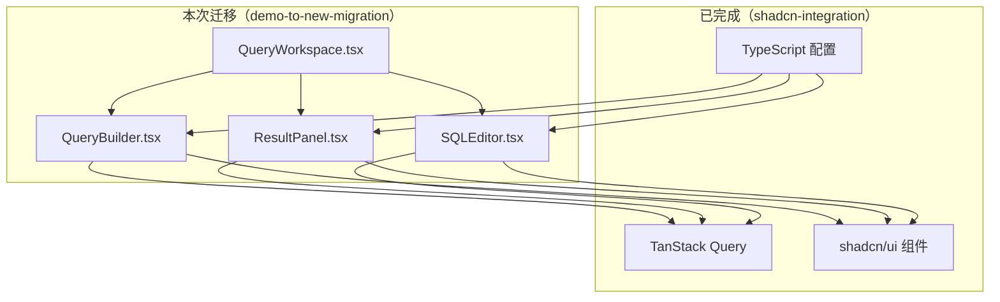
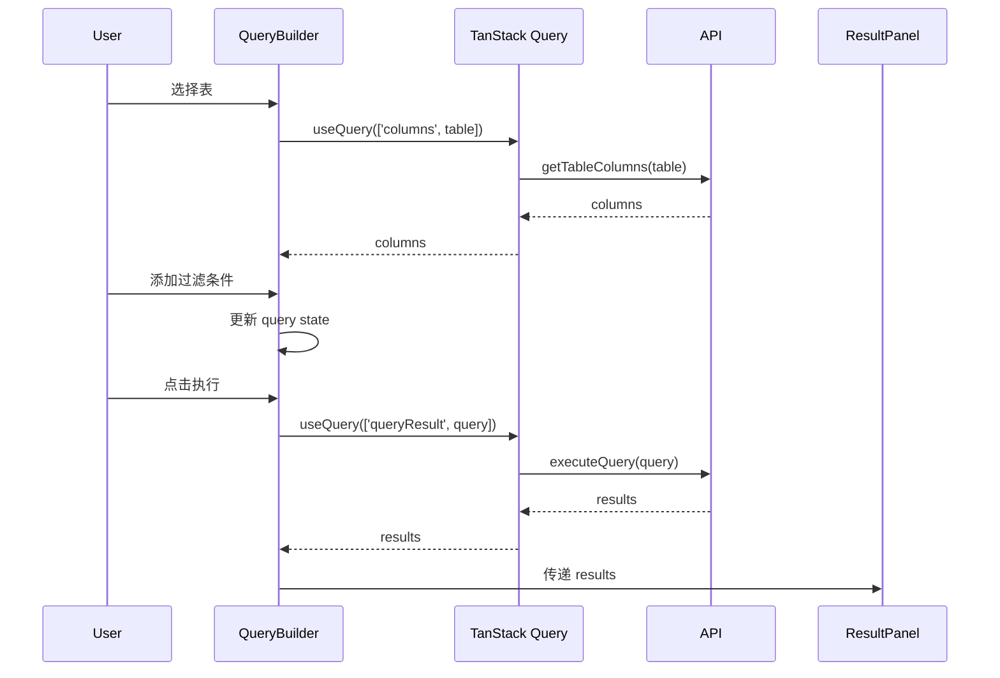
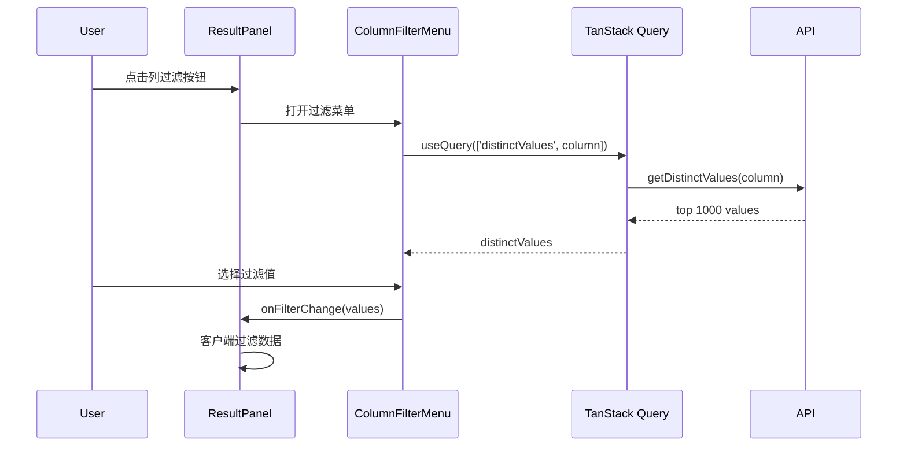

# Demo 迁移到新布局 - 设计文档

## 🎯 设计原则

**基于 shadcn-integration 的成果**：本设计假设 `shadcn-integration` 已完成，所有新组件都使用 TypeScript + TanStack Query + shadcn/ui。

## 一、架构设计

### 1.1 整体架构

```
frontend/src/new/
├── providers/
│   └── QueryProvider.tsx           # ✅ 已有（shadcn-integration）
│
├── components/
│   └── ui/                         # ✅ 已有（shadcn-integration）
│       ├── button.tsx
│       ├── card.tsx
│       ├── tabs.tsx
│       └── ...
│
├── Layout/                         # ✅ 已有（shadcn-integration）
│   ├── Sidebar.tsx
│   ├── Header.tsx
│   └── PageShell.tsx
│
├── DataSource/                     # ✅ 已有（shadcn-integration）
│   ├── DatabaseForm.tsx
│   ├── UploadPanel.tsx
│   └── ...
│
├── Query/                          # 🆕 本次迁移
│   ├── QueryBuilder/
│   │   ├── QueryBuilder.tsx        # 主查询构建器
│   │   ├── TableSelector.tsx       # 表选择器
│   │   ├── ColumnSelector.tsx      # 列选择器
│   │   ├── FilterBuilder.tsx       # 过滤器构建器
│   │   ├── JoinBuilder.tsx         # 关联查询构建器
│   │   ├── AggregationBuilder.tsx  # 聚合构建器
│   │   └── SortBuilder.tsx         # 排序构建器
│   │
│   ├── ResultPanel/
│   │   ├── ResultPanel.tsx         # 结果面板主组件
│   │   ├── ResultTable.tsx         # 结果表格
│   │   ├── ColumnFilterMenu.tsx    # 列过滤菜单（Excel 风格）
│   │   ├── ResultToolbar.tsx       # 结果工具栏
│   │   └── ExportDialog.tsx        # 导出对话框
│   │
│   ├── SQLEditor/
│   │   ├── SQLEditor.tsx           # SQL 编辑器
│   │   ├── SQLToolbar.tsx          # SQL 工具栏
│   │   └── SQLHistory.tsx          # SQL 历史记录
│   │
│   └── QueryWorkspace.tsx          # 查询工作台（三栏布局）
│
└── hooks/
    ├── useQueryBuilder.ts          # 查询构建器逻辑
    ├── useResultPanel.ts           # 结果面板逻辑
    └── useSQLEditor.ts             # SQL 编辑器逻辑
```

### 1.2 依赖关系



## 二、核心组件设计

### 2.1 QueryWorkspace（查询工作台）

**职责**：三栏布局容器，管理数据源面板、查询构建器、结果面板的布局。

**技术栈**：
- `react-resizable-panels` - 可调整大小的面板
- TypeScript - 类型安全
- TanStack Query - 数据管理

**类型定义**：
```typescript
interface QueryWorkspaceProps {
  defaultLayout?: number[];  // 默认布局比例 [20, 50, 30]
}

interface WorkspaceState {
  selectedTable: string | null;
  query: Query;
  results: QueryResult | null;
}
```

**组件结构**：
```typescript
import { Panel, PanelGroup, PanelResizeHandle } from 'react-resizable-panels';
import { useQuery } from '@tanstack/react-query';

export const QueryWorkspace: React.FC<QueryWorkspaceProps> = ({ defaultLayout = [20, 50, 30] }) => {
  const [selectedTable, setSelectedTable] = useState<string | null>(null);
  const [query, setQuery] = useState<Query>(initialQuery);
  
  // 获取表列表
  const { data: tables } = useQuery({
    queryKey: ['tables'],
    queryFn: getDuckDBTablesEnhanced,
  });
  
  // 执行查询
  const { data: results, isLoading } = useQuery({
    queryKey: ['queryResult', query],
    queryFn: () => executeQuery(query),
    enabled: !!query.sql,
  });
  
  return (
    <PanelGroup direction="horizontal">
      {/* 数据源面板 */}
      <Panel defaultSize={defaultLayout[0]} minSize={15}>
        <DataSourcePanel
          tables={tables}
          selectedTable={selectedTable}
          onSelectTable={setSelectedTable}
        />
      </Panel>
      
      <PanelResizeHandle />
      
      {/* 查询构建器 */}
      <Panel defaultSize={defaultLayout[1]} minSize={30}>
        <QueryBuilder
          selectedTable={selectedTable}
          query={query}
          onQueryChange={setQuery}
        />
      </Panel>
      
      <PanelResizeHandle />
      
      {/* 结果面板 */}
      <Panel defaultSize={defaultLayout[2]} minSize={20}>
        <ResultPanel
          results={results}
          isLoading={isLoading}
        />
      </Panel>
    </PanelGroup>
  );
};
```

### 2.2 QueryBuilder（查询构建器）

**职责**：可视化查询构建，支持表选择、列选择、过滤、关联、聚合、排序。

**技术栈**：
- shadcn/ui Tabs - 标签页切换
- shadcn/ui Select - 下拉选择
- shadcn/ui Button - 操作按钮
- TanStack Query - 数据获取

**类型定义**：
```typescript
interface Query {
  table: string;
  columns: string[];
  filters: Filter[];
  joins: Join[];
  aggregations: Aggregation[];
  sorts: Sort[];
  limit?: number;
}

interface Filter {
  column: string;
  operator: 'eq' | 'ne' | 'gt' | 'lt' | 'gte' | 'lte' | 'like' | 'in';
  value: any;
}

interface QueryBuilderProps {
  selectedTable: string | null;
  query: Query;
  onQueryChange: (query: Query) => void;
}
```

**组件结构**：
```typescript
export const QueryBuilder: React.FC<QueryBuilderProps> = ({
  selectedTable,
  query,
  onQueryChange,
}) => {
  // 获取表的列信息
  const { data: columns } = useQuery({
    queryKey: ['columns', selectedTable],
    queryFn: () => getTableColumns(selectedTable),
    enabled: !!selectedTable,
  });
  
  return (
    <Card>
      <Tabs defaultValue="basic">
        <TabsList>
          <TabsTrigger value="basic">基础查询</TabsTrigger>
          <TabsTrigger value="filter">过滤</TabsTrigger>
          <TabsTrigger value="join">关联</TabsTrigger>
          <TabsTrigger value="aggregate">聚合</TabsTrigger>
        </TabsList>
        
        <TabsContent value="basic">
          <TableSelector
            tables={tables}
            selected={query.table}
            onChange={(table) => onQueryChange({ ...query, table })}
          />
          <ColumnSelector
            columns={columns}
            selected={query.columns}
            onChange={(columns) => onQueryChange({ ...query, columns })}
          />
        </TabsContent>
        
        <TabsContent value="filter">
          <FilterBuilder
            columns={columns}
            filters={query.filters}
            onChange={(filters) => onQueryChange({ ...query, filters })}
          />
        </TabsContent>
        
        {/* 其他标签页 */}
      </Tabs>
    </Card>
  );
};
```

### 2.3 ResultPanel（结果面板）

**职责**：显示查询结果，支持 Excel 风格的列过滤、排序、导出。

**关键特性**：
- Excel 风格的列过滤（distinct values，top 1000）
- 列类型自动检测
- 虚拟滚动（大数据集）
- 导出功能（CSV, JSON, Parquet）

**技术栈**：
- `@tanstack/react-table` - 表格库
- `@tanstack/react-virtual` - 虚拟滚动
- shadcn/ui Popover - 过滤菜单
- TanStack Query - 数据获取

**类型定义**：
```typescript
interface ResultPanelProps {
  results: QueryResult | null;
  isLoading: boolean;
}

interface QueryResult {
  columns: string[];
  rows: any[][];
  rowCount: number;
}

interface ColumnFilter {
  column: string;
  values: Set<any>;
}
```

**组件结构**：
```typescript
export const ResultPanel: React.FC<ResultPanelProps> = ({ results, isLoading }) => {
  const [columnFilters, setColumnFilters] = useState<ColumnFilter[]>([]);
  
  // 获取列的 distinct values（用于过滤）
  const { data: distinctValues } = useQuery({
    queryKey: ['distinctValues', selectedColumn],
    queryFn: () => getDistinctValues(selectedColumn),
    enabled: !!selectedColumn,
  });
  
  // 导出数据
  const exportMutation = useMutation({
    mutationFn: (format: 'csv' | 'json' | 'parquet') => exportData(results, format),
    onSuccess: () => toast.success('导出成功'),
  });
  
  if (isLoading) {
    return <Skeleton className="h-full" />;
  }
  
  return (
    <Card className="h-full flex flex-col">
      <ResultToolbar
        rowCount={results?.rowCount}
        onExport={(format) => exportMutation.mutate(format)}
      />
      
      <ResultTable
        columns={results?.columns}
        rows={results?.rows}
        columnFilters={columnFilters}
        onColumnFilterChange={setColumnFilters}
      />
    </Card>
  );
};
```

### 2.4 ColumnFilterMenu（列过滤菜单）

**职责**：Excel 风格的列过滤菜单，显示 distinct values 并支持多选。

**关键逻辑**（参考 DISTINCT_VALUES_LOGIC.md）：
1. 采样 10,000 行数据
2. 去重得到 distinct values
3. 按频率排序，取前 1,000 个
4. 显示在过滤菜单中

**组件结构**：
```typescript
export const ColumnFilterMenu: React.FC<ColumnFilterMenuProps> = ({
  column,
  onFilterChange,
}) => {
  // 获取 distinct values
  const { data: distinctValues, isLoading } = useQuery({
    queryKey: ['distinctValues', column],
    queryFn: () => getDistinctValues(column),
  });
  
  const [selectedValues, setSelectedValues] = useState<Set<any>>(new Set());
  
  return (
    <Popover>
      <PopoverTrigger asChild>
        <Button variant="ghost" size="sm">
          <Filter className="h-4 w-4" />
        </Button>
      </PopoverTrigger>
      
      <PopoverContent className="w-80">
        <Command>
          <CommandInput placeholder="搜索..." />
          <CommandList>
            {isLoading ? (
              <CommandEmpty>加载中...</CommandEmpty>
            ) : (
              distinctValues?.map((value) => (
                <CommandItem
                  key={value}
                  onSelect={() => {
                    const newSelected = new Set(selectedValues);
                    if (newSelected.has(value)) {
                      newSelected.delete(value);
                    } else {
                      newSelected.add(value);
                    }
                    setSelectedValues(newSelected);
                    onFilterChange(Array.from(newSelected));
                  }}
                >
                  <Checkbox checked={selectedValues.has(value)} />
                  <span className="ml-2">{value}</span>
                </CommandItem>
              ))
            )}
          </CommandList>
        </Command>
      </PopoverContent>
    </Popover>
  );
};
```

## 三、数据流设计

### 3.1 查询构建流程



### 3.2 结果过滤流程



## 四、性能优化

### 4.1 虚拟滚动

使用 `@tanstack/react-virtual` 实现虚拟滚动，只渲染可见行：

```typescript
import { useVirtualizer } from '@tanstack/react-virtual';

const rowVirtualizer = useVirtualizer({
  count: rows.length,
  getScrollElement: () => parentRef.current,
  estimateSize: () => 35,
  overscan: 10,
});
```

### 4.2 查询缓存

TanStack Query 自动缓存查询结果：

```typescript
const { data: results } = useQuery({
  queryKey: ['queryResult', query],
  queryFn: () => executeQuery(query),
  staleTime: 1000 * 60 * 5, // 5 分钟
  cacheTime: 1000 * 60 * 30, // 30 分钟
});
```

### 4.3 防抖搜索

过滤菜单的搜索使用防抖：

```typescript
const [searchTerm, setSearchTerm] = useState('');
const debouncedSearch = useDebounce(searchTerm, 300);

const filteredValues = useMemo(() => {
  return distinctValues?.filter(v =>
    String(v).toLowerCase().includes(debouncedSearch.toLowerCase())
  );
}, [distinctValues, debouncedSearch]);
```

## 五、可访问性设计

### 5.1 键盘导航
- Tab 键在表格单元格间导航
- 方向键在表格中移动
- Enter 键打开过滤菜单
- Esc 键关闭对话框

### 5.2 屏幕阅读器
- 所有按钮有 aria-label
- 表格有正确的 role 和 aria 属性
- 过滤状态有 aria-live 通知

### 5.3 Focus 管理
- 对话框打开时 focus 到第一个输入框
- 对话框关闭时 focus 返回触发按钮
- 键盘 trap 在模态对话框内

## 六、测试策略

### 6.1 单元测试
- 查询构建逻辑测试
- 过滤逻辑测试
- 数据转换测试

### 6.2 集成测试
- 查询构建器 → API 集成
- 结果面板 → 过滤功能
- 导出功能端到端测试

### 6.3 性能测试
- 大数据集渲染性能（10,000+ 行）
- 虚拟滚动性能
- 查询响应时间

## 七、迁移策略

### 7.1 渐进式迁移
1. Week 3: 查询构建器基础功能
2. Week 4: 结果面板和过滤功能
3. Week 5: SQL 编辑器和高级功能

### 7.2 功能对比

| Demo 功能 | 新布局实现 | 状态 |
|----------|-----------|------|
| 表选择 | TableSelector.tsx | 🆕 |
| 列选择 | ColumnSelector.tsx | 🆕 |
| 过滤器 | FilterBuilder.tsx | 🆕 |
| 关联查询 | JoinBuilder.tsx | 🆕 |
| 结果表格 | ResultTable.tsx | 🆕 |
| 列过滤 | ColumnFilterMenu.tsx | 🆕 |
| 导出 | ExportDialog.tsx | 🆕 |
| SQL 编辑器 | SQLEditor.tsx | 🆕 |

## 八、依赖项

### 8.1 必需依赖
- `@tanstack/react-table` - 表格功能
- `@tanstack/react-virtual` - 虚拟滚动
- `react-resizable-panels` - 可调整大小面板

### 8.2 已有依赖（shadcn-integration）
- TypeScript
- TanStack Query
- shadcn/ui 组件
- Tailwind CSS

## 九、成功标准

### 9.1 功能完整性
- [ ] 所有 Demo 功能已迁移
- [ ] 所有交互正常工作
- [ ] 所有 API 集成正常

### 9.2 性能标准
- [ ] 10,000 行数据渲染 < 100ms
- [ ] 查询响应时间 < 500ms
- [ ] 过滤操作响应 < 50ms

### 9.3 代码质量
- [ ] 所有组件使用 TypeScript
- [ ] 所有数据获取使用 TanStack Query
- [ ] 所有组件有单元测试
- [ ] 无 ESLint 错误
