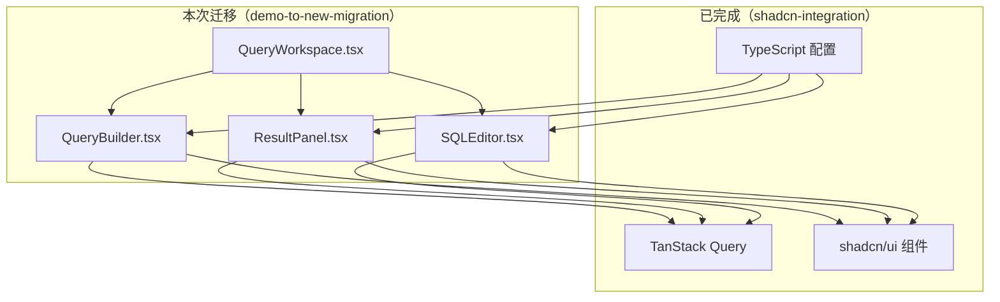
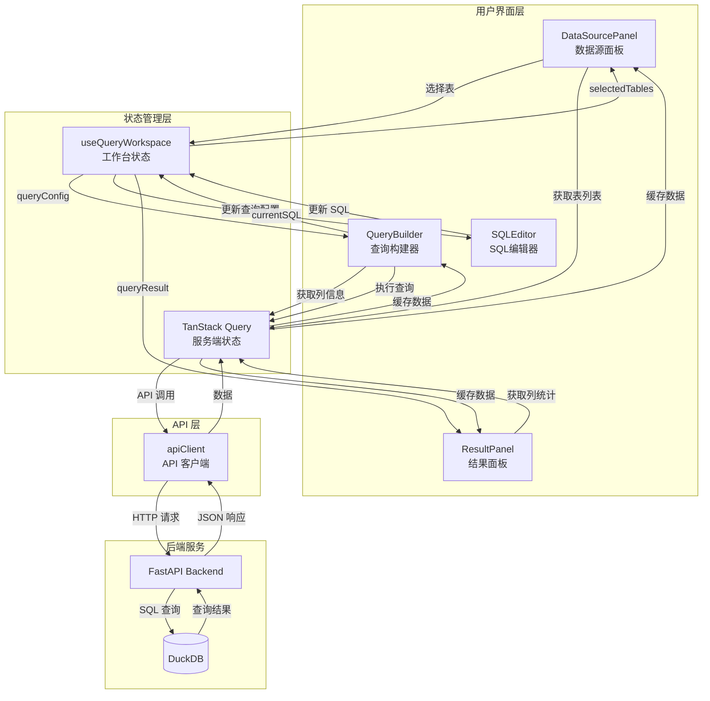
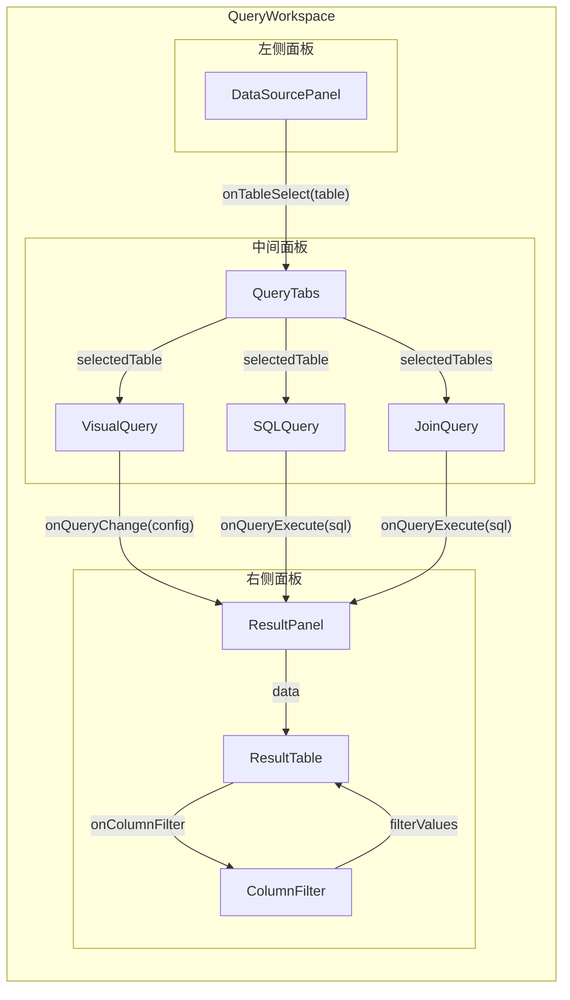
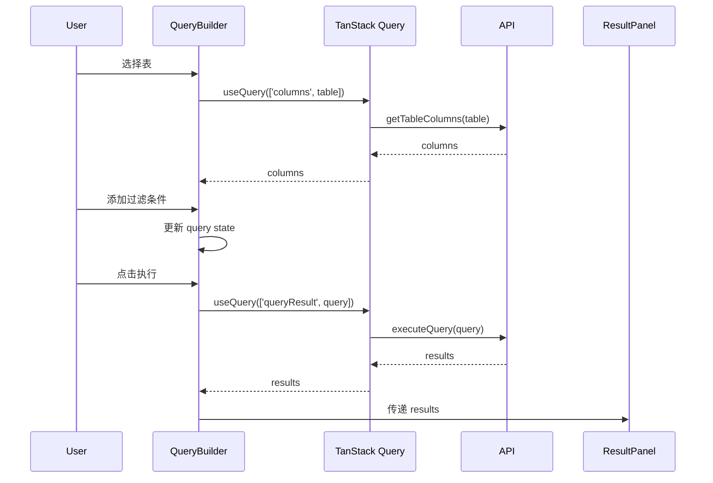
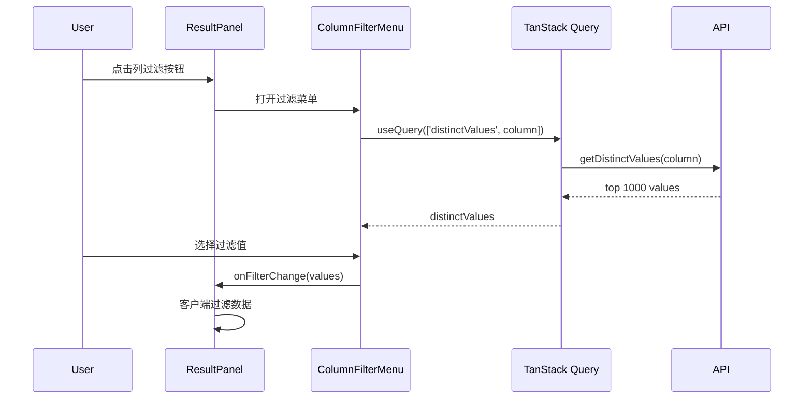
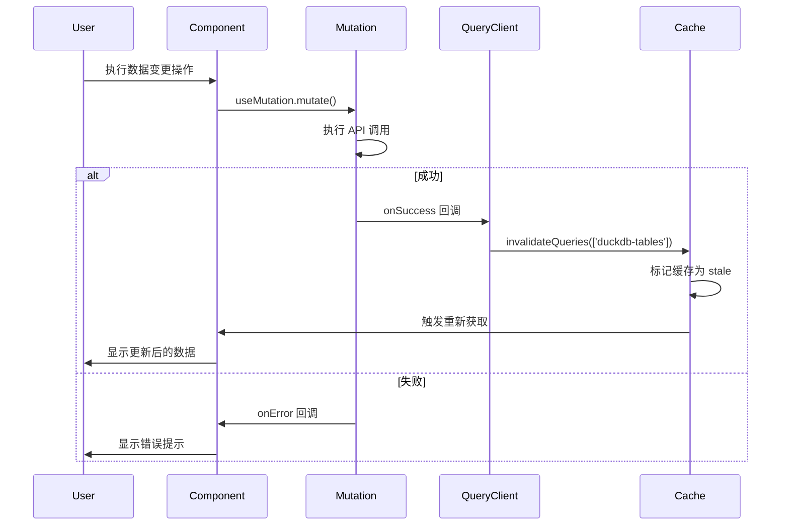
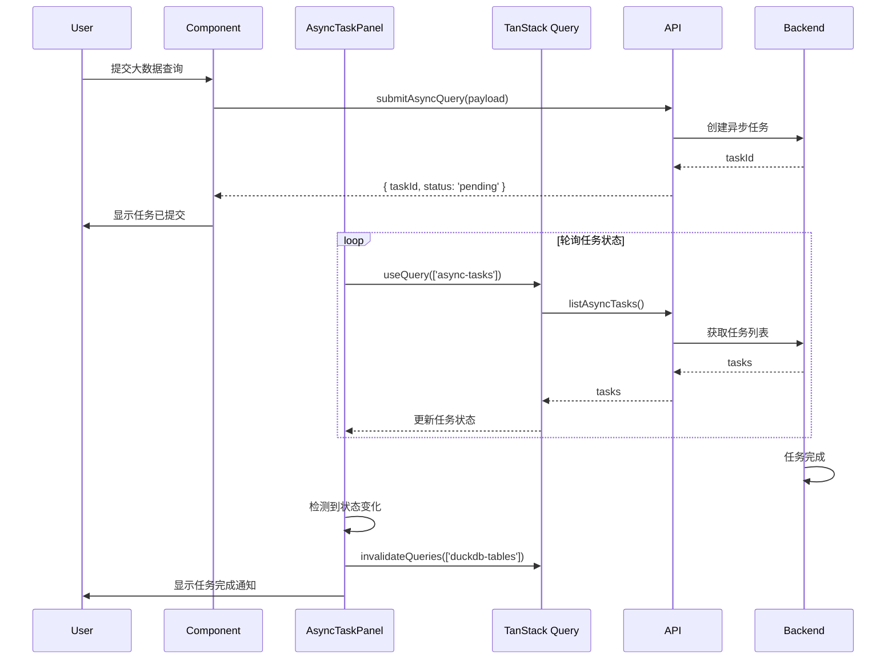
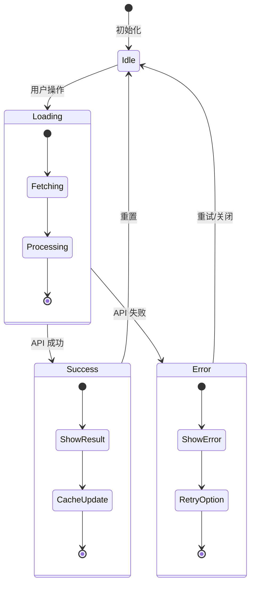
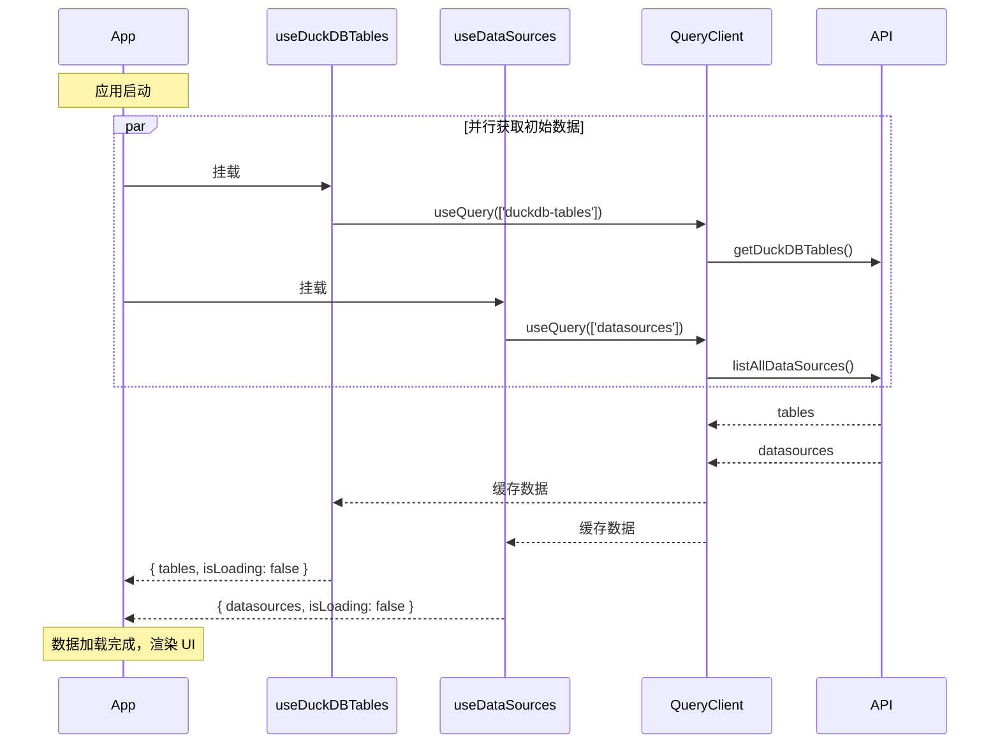
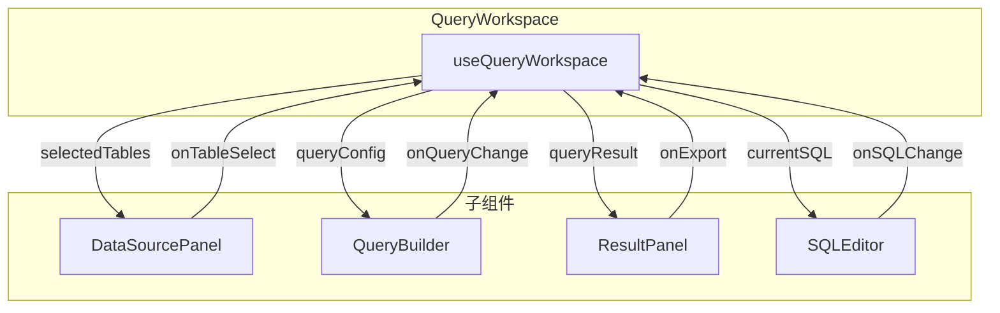

# Demo 迁移到新布局 - 设计文档

## 🎯 设计原则

**基于 shadcn-integration 的成果**：本设计假设 `shadcn-integration` 已完成，所有新组件都使用 TypeScript + TanStack Query + shadcn/ui。

## 📚 技术规范参考

**重要**：开发前必须阅读以下规范文档：

| 规范 | 文档位置 | 说明 |
|------|---------|------|
| **技术规范总览** | [TECHNICAL_STANDARDS.md](./TECHNICAL_STANDARDS.md) | UI 组件、API 调用、响应格式 |
| **TanStack Query 规范** | [tanstack-query-standards.md](../../../.kiro/steering/tanstack-query-standards.md) | 数据获取、缓存策略 |
| **API 响应格式** | [api-response-format-standard.md](../../../.kiro/steering/api-response-format-standard.md) | 后端响应格式 |
| **UI 样式规范** | [AGENTS.md](../../../AGENTS.md) | 设计系统、Tailwind 类名 |

### 关键规范摘要

#### UI 组件
- 使用 `@/new/components/ui/*` 中的 shadcn/ui 组件
- 使用语义化 Tailwind 类名（`bg-surface`, `text-foreground`）
- 禁止硬编码颜色值

#### API 调用
- 强制使用 TanStack Query（`useQuery`, `useMutation`）
- 复用现有 hooks：`useDuckDBTables`, `useDataSources`, `useDatabaseConnections`
- queryKey 使用 kebab-case：`['duckdb-tables']`, `['async-tasks']`

#### 缓存失效
- 使用 `@/new/utils/cacheInvalidation.ts` 中的工具函数
- 数据变更后必须调用相应的 invalidate 函数

## 一、架构设计

### 1.1 整体架构

```
frontend/src/new/
├── providers/
│   └── QueryProvider.tsx           # ✅ 已有（shadcn-integration）
│
├── components/
│   └── ui/                         # ✅ 已有（shadcn-integration）
│       ├── button.tsx
│       ├── card.tsx
│       ├── tabs.tsx
│       └── ...
│
├── Layout/                         # ✅ 已有（shadcn-integration）
│   ├── Sidebar.tsx
│   ├── Header.tsx
│   └── PageShell.tsx
│
├── DataSource/                     # ✅ 已有（shadcn-integration）
│   ├── DatabaseForm.tsx
│   ├── UploadPanel.tsx
│   └── ...
│
├── Query/                          # 🆕 本次迁移
│   ├── QueryBuilder/
│   │   ├── QueryBuilder.tsx        # 主查询构建器
│   │   ├── TableSelector.tsx       # 表选择器
│   │   ├── ColumnSelector.tsx      # 列选择器
│   │   ├── FilterBuilder.tsx       # 过滤器构建器
│   │   ├── JoinBuilder.tsx         # 关联查询构建器
│   │   ├── AggregationBuilder.tsx  # 聚合构建器
│   │   └── SortBuilder.tsx         # 排序构建器
│   │
│   ├── ResultPanel/
│   │   ├── ResultPanel.tsx         # 结果面板主组件
│   │   ├── ResultTable.tsx         # 结果表格
│   │   ├── ColumnFilterMenu.tsx    # 列过滤菜单（Excel 风格）
│   │   ├── ResultToolbar.tsx       # 结果工具栏
│   │   └── ExportDialog.tsx        # 导出对话框
│   │
│   ├── SQLEditor/
│   │   ├── SQLEditor.tsx           # SQL 编辑器
│   │   ├── SQLToolbar.tsx          # SQL 工具栏
│   │   └── SQLHistory.tsx          # SQL 历史记录
│   │
│   └── QueryWorkspace.tsx          # 查询工作台（三栏布局）
│
└── hooks/
    ├── useQueryBuilder.ts          # 查询构建器逻辑
    ├── useResultPanel.ts           # 结果面板逻辑
    └── useSQLEditor.ts             # SQL 编辑器逻辑
```

### 1.2 依赖关系



## 二、核心组件设计

### 2.1 QueryWorkspace（查询工作台）

**职责**：三栏布局容器，管理数据源面板、查询构建器、结果面板的布局。

**技术栈**：
- `react-resizable-panels` - 可调整大小的面板
- TypeScript - 类型安全
- TanStack Query - 数据管理

**类型定义**：
```typescript
interface QueryWorkspaceProps {
  defaultLayout?: number[];  // 默认布局比例 [20, 50, 30]
}

interface WorkspaceState {
  selectedTable: string | null;
  query: Query;
  results: QueryResult | null;
}
```

**组件结构**：
```typescript
import { Panel, PanelGroup, PanelResizeHandle } from 'react-resizable-panels';
import { useQuery } from '@tanstack/react-query';

export const QueryWorkspace: React.FC<QueryWorkspaceProps> = ({ defaultLayout = [20, 50, 30] }) => {
  const [selectedTable, setSelectedTable] = useState<string | null>(null);
  const [query, setQuery] = useState<Query>(initialQuery);
  
  // 获取表列表
  const { data: tables } = useQuery({
    queryKey: ['tables'],
    queryFn: getDuckDBTablesEnhanced,
  });
  
  // 执行查询
  const { data: results, isLoading } = useQuery({
    queryKey: ['queryResult', query],
    queryFn: () => executeQuery(query),
    enabled: !!query.sql,
  });
  
  return (
    <PanelGroup direction="horizontal">
      {/* 数据源面板 */}
      <Panel defaultSize={defaultLayout[0]} minSize={15}>
        <DataSourcePanel
          tables={tables}
          selectedTable={selectedTable}
          onSelectTable={setSelectedTable}
        />
      </Panel>
      
      <PanelResizeHandle />
      
      {/* 查询构建器 */}
      <Panel defaultSize={defaultLayout[1]} minSize={30}>
        <QueryBuilder
          selectedTable={selectedTable}
          query={query}
          onQueryChange={setQuery}
        />
      </Panel>
      
      <PanelResizeHandle />
      
      {/* 结果面板 */}
      <Panel defaultSize={defaultLayout[2]} minSize={20}>
        <ResultPanel
          results={results}
          isLoading={isLoading}
        />
      </Panel>
    </PanelGroup>
  );
};
```

### 2.2 QueryBuilder（查询构建器）

**职责**：可视化查询构建，支持表选择、列选择、过滤、关联、聚合、排序。

**技术栈**：
- shadcn/ui Tabs - 标签页切换
- shadcn/ui Select - 下拉选择
- shadcn/ui Button - 操作按钮
- TanStack Query - 数据获取

**类型定义**：
```typescript
interface Query {
  table: string;
  columns: string[];
  filters: Filter[];
  joins: Join[];
  aggregations: Aggregation[];
  sorts: Sort[];
  limit?: number;
}

interface Filter {
  column: string;
  operator: 'eq' | 'ne' | 'gt' | 'lt' | 'gte' | 'lte' | 'like' | 'in';
  value: any;
}

interface QueryBuilderProps {
  selectedTable: string | null;
  query: Query;
  onQueryChange: (query: Query) => void;
}
```

**组件结构**：
```typescript
export const QueryBuilder: React.FC<QueryBuilderProps> = ({
  selectedTable,
  query,
  onQueryChange,
}) => {
  // 获取表的列信息
  const { data: columns } = useQuery({
    queryKey: ['columns', selectedTable],
    queryFn: () => getTableColumns(selectedTable),
    enabled: !!selectedTable,
  });
  
  return (
    <Card>
      <Tabs defaultValue="basic">
        <TabsList>
          <TabsTrigger value="basic">基础查询</TabsTrigger>
          <TabsTrigger value="filter">过滤</TabsTrigger>
          <TabsTrigger value="join">关联</TabsTrigger>
          <TabsTrigger value="aggregate">聚合</TabsTrigger>
        </TabsList>
        
        <TabsContent value="basic">
          <TableSelector
            tables={tables}
            selected={query.table}
            onChange={(table) => onQueryChange({ ...query, table })}
          />
          <ColumnSelector
            columns={columns}
            selected={query.columns}
            onChange={(columns) => onQueryChange({ ...query, columns })}
          />
        </TabsContent>
        
        <TabsContent value="filter">
          <FilterBuilder
            columns={columns}
            filters={query.filters}
            onChange={(filters) => onQueryChange({ ...query, filters })}
          />
        </TabsContent>
        
        {/* 其他标签页 */}
      </Tabs>
    </Card>
  );
};
```

### 2.3 ResultPanel（结果面板）- AG-Grid 方案

**职责**：显示查询结果，支持 Excel 风格的列过滤、排序、导出。

**关键特性**：
- Excel 风格的列过滤（AG-Grid 内置 Set Filter）
- 列类型自动检测和智能格式化
- 虚拟滚动（AG-Grid 内置，支持 10万+ 行）
- 导出功能（CSV 内置 + 自定义 JSON/Parquet）
- 多列排序和列固定

**技术栈变更**（符合 component-selection-principle.md）：
- ~~`@tanstack/react-table`~~ → `ag-grid-react` + `ag-grid-community`
- ~~`@tanstack/react-virtual`~~ → AG-Grid 内置虚拟滚动
- ~~自定义过滤菜单~~ → AG-Grid 内置 Excel 风格过滤
- TanStack Query - 数据获取（保留）

**AG-Grid 优势**：
| 功能 | AG-Grid | 自定义实现 |
|------|---------|-----------|
| 虚拟滚动 | ✅ 内置 | 需要 @tanstack/react-virtual |
| Excel 风格过滤 | ✅ 内置 agSetColumnFilter | 需要自己实现 |
| 多列排序 | ✅ 内置 | 需要自己实现 |
| 列固定 | ✅ 内置 pinned | 需要自己实现 |
| CSV 导出 | ✅ 内置 exportDataAsCsv | 需要自己实现 |
| 列宽调整 | ✅ 内置 | 需要自己实现 |

**组件结构**：
```
ResultPanel/
├── ResultPanel.tsx              # 主容器组件
├── AGGridWrapper.tsx            # AG-Grid 封装组件
├── ResultToolbar.tsx            # 工具栏组件
├── ExportDialog.tsx             # 导出对话框
├── themes/
│   └── ag-grid-theme.css        # AG-Grid 主题定制
└── hooks/
    ├── useAGGridConfig.ts       # AG-Grid 配置 Hook
    ├── useColumnTypeDetection.ts # 列类型检测 Hook
    └── useGridStats.ts          # 表格统计信息 Hook
```

**参考文档**：[AG_GRID_INTEGRATION.md](./AG_GRID_INTEGRATION.md)

**类型定义**：
```typescript
interface ResultPanelProps {
  results: QueryResult | null;
  isLoading: boolean;
}

interface QueryResult {
  columns: string[];
  rows: any[][];
  rowCount: number;
}

interface ColumnFilter {
  column: string;
  values: Set<any>;
}
```

**组件结构**：
```typescript
export const ResultPanel: React.FC<ResultPanelProps> = ({ results, isLoading }) => {
  const [columnFilters, setColumnFilters] = useState<ColumnFilter[]>([]);
  
  // 获取列的 distinct values（用于过滤）
  const { data: distinctValues } = useQuery({
    queryKey: ['distinctValues', selectedColumn],
    queryFn: () => getDistinctValues(selectedColumn),
    enabled: !!selectedColumn,
  });
  
  // 导出数据
  const exportMutation = useMutation({
    mutationFn: (format: 'csv' | 'json' | 'parquet') => exportData(results, format),
    onSuccess: () => toast.success('导出成功'),
  });
  
  if (isLoading) {
    return <Skeleton className="h-full" />;
  }
  
  return (
    <Card className="h-full flex flex-col">
      <ResultToolbar
        rowCount={results?.rowCount}
        onExport={(format) => exportMutation.mutate(format)}
      />
      
      <ResultTable
        columns={results?.columns}
        rows={results?.rows}
        columnFilters={columnFilters}
        onColumnFilterChange={setColumnFilters}
      />
    </Card>
  );
};
```

### 2.4 ColumnFilterMenu（列过滤菜单）

**职责**：Excel 风格的列过滤菜单，显示 distinct values 并支持多选。

**关键逻辑**（参考 DISTINCT_VALUES_LOGIC.md）：
1. 采样 10,000 行数据
2. 去重得到 distinct values
3. 按频率排序，取前 1,000 个
4. 显示在过滤菜单中

**组件结构**：
```typescript
export const ColumnFilterMenu: React.FC<ColumnFilterMenuProps> = ({
  column,
  onFilterChange,
}) => {
  // 获取 distinct values
  const { data: distinctValues, isLoading } = useQuery({
    queryKey: ['distinctValues', column],
    queryFn: () => getDistinctValues(column),
  });
  
  const [selectedValues, setSelectedValues] = useState<Set<any>>(new Set());
  
  return (
    <Popover>
      <PopoverTrigger asChild>
        <Button variant="ghost" size="sm">
          <Filter className="h-4 w-4" />
        </Button>
      </PopoverTrigger>
      
      <PopoverContent className="w-80">
        <Command>
          <CommandInput placeholder="搜索..." />
          <CommandList>
            {isLoading ? (
              <CommandEmpty>加载中...</CommandEmpty>
            ) : (
              distinctValues?.map((value) => (
                <CommandItem
                  key={value}
                  onSelect={() => {
                    const newSelected = new Set(selectedValues);
                    if (newSelected.has(value)) {
                      newSelected.delete(value);
                    } else {
                      newSelected.add(value);
                    }
                    setSelectedValues(newSelected);
                    onFilterChange(Array.from(newSelected));
                  }}
                >
                  <Checkbox checked={selectedValues.has(value)} />
                  <span className="ml-2">{value}</span>
                </CommandItem>
              ))
            )}
          </CommandList>
        </Command>
      </PopoverContent>
    </Popover>
  );
};
```

## 三、数据流设计

### 3.1 整体数据流架构



### 3.2 组件间数据流向



### 3.3 查询构建流程



### 3.4 结果过滤流程



### 3.5 缓存失效流程



### 3.6 异步任务流程



### 3.7 状态更新流程



### 3.8 API 调用时序



## 四、性能优化

### 4.1 虚拟滚动

使用 `@tanstack/react-virtual` 实现虚拟滚动，只渲染可见行：

```typescript
import { useVirtualizer } from '@tanstack/react-virtual';

const rowVirtualizer = useVirtualizer({
  count: rows.length,
  getScrollElement: () => parentRef.current,
  estimateSize: () => 35,
  overscan: 10,
});
```

### 4.2 查询缓存

TanStack Query 自动缓存查询结果：

```typescript
const { data: results } = useQuery({
  queryKey: ['queryResult', query],
  queryFn: () => executeQuery(query),
  staleTime: 1000 * 60 * 5, // 5 分钟
  cacheTime: 1000 * 60 * 30, // 30 分钟
});
```

### 4.3 防抖搜索

过滤菜单的搜索使用防抖：

```typescript
const [searchTerm, setSearchTerm] = useState('');
const debouncedSearch = useDebounce(searchTerm, 300);

const filteredValues = useMemo(() => {
  return distinctValues?.filter(v =>
    String(v).toLowerCase().includes(debouncedSearch.toLowerCase())
  );
}, [distinctValues, debouncedSearch]);
```

## 五、可访问性设计

### 5.1 键盘导航
- Tab 键在表格单元格间导航
- 方向键在表格中移动
- Enter 键打开过滤菜单
- Esc 键关闭对话框

### 5.2 屏幕阅读器
- 所有按钮有 aria-label
- 表格有正确的 role 和 aria 属性
- 过滤状态有 aria-live 通知

### 5.3 Focus 管理
- 对话框打开时 focus 到第一个输入框
- 对话框关闭时 focus 返回触发按钮
- 键盘 trap 在模态对话框内

## 六、测试策略

### 6.1 单元测试
- 查询构建逻辑测试
- 过滤逻辑测试
- 数据转换测试

### 6.2 集成测试
- 查询构建器 → API 集成
- 结果面板 → 过滤功能
- 导出功能端到端测试

### 6.3 性能测试
- 大数据集渲染性能（10,000+ 行）
- 虚拟滚动性能
- 查询响应时间

## 七、迁移策略

### 7.1 渐进式迁移
1. Week 3: 查询构建器基础功能
2. Week 4: 结果面板和过滤功能
3. Week 5: SQL 编辑器和高级功能

### 7.2 功能对比

| Demo 功能 | 新布局实现 | 状态 |
|----------|-----------|------|
| 表选择 | TableSelector.tsx | 🆕 |
| 列选择 | ColumnSelector.tsx | 🆕 |
| 过滤器 | FilterBuilder.tsx | 🆕 |
| 关联查询 | JoinBuilder.tsx | 🆕 |
| 结果表格 | ResultTable.tsx | 🆕 |
| 列过滤 | ColumnFilterMenu.tsx | 🆕 |
| 导出 | ExportDialog.tsx | 🆕 |
| SQL 编辑器 | SQLEditor.tsx | 🆕 |

## 八、依赖项

### 8.1 必需依赖
- `@tanstack/react-table` - 表格功能
- `@tanstack/react-virtual` - 虚拟滚动
- `react-resizable-panels` - 可调整大小面板

### 8.2 已有依赖（shadcn-integration）
- TypeScript
- TanStack Query
- shadcn/ui 组件
- Tailwind CSS

## 九、国际化（i18n）规范

### 9.1 使用方式

```typescript
import { useTranslation } from 'react-i18next';

const MyComponent = () => {
  const { t } = useTranslation('common');
  
  return (
    <Button>{t('actions.execute')}</Button>
  );
};
```

### 9.2 翻译 key 命名规范

```
格式：<模块>.<功能>.<具体文案>

示例：
- query.builder.selectTable      // 查询构建器 - 选择表
- query.result.noData            // 查询结果 - 无数据
- query.filter.addCondition      // 查询过滤 - 添加条件
- query.sql.execute              // SQL 查询 - 执行
- query.export.success           // 导出 - 成功
```

### 9.3 翻译文件位置

```
frontend/src/i18n/locales/
├── zh/
│   └── common.json    # 中文翻译
└── en/
    └── common.json    # 英文翻译
```

### 9.4 新增文案流程

1. 在组件中使用 `t('query.xxx.xxx')` 
2. 在 `zh/common.json` 中添加中文翻译
3. 在 `en/common.json` 中添加英文翻译
4. 测试中英文切换

## 十、TypeScript 类型定义

### 10.1 API 请求类型

```typescript
// 可视化查询配置
interface VisualQueryConfig {
  table: string;
  columns: string[];
  filters: FilterConfig[];
  aggregations: AggregationConfig[];
  groupBy: string[];
  orderBy: SortConfig[];
  limit?: number;
}

// 过滤条件
interface FilterConfig {
  column: string;
  operator: '=' | '!=' | '>' | '<' | '>=' | '<=' | 'LIKE' | 'ILIKE' | 'IS NULL' | 'IS NOT NULL' | 'BETWEEN';
  value: string | number | null;
  value2?: string | number;  // BETWEEN 操作符的第二个值
  logic_operator: 'AND' | 'OR';
}

// 聚合配置
interface AggregationConfig {
  column: string;
  function: 'SUM' | 'AVG' | 'COUNT' | 'MIN' | 'MAX' | 'COUNT_DISTINCT';
  alias?: string;
}

// 排序配置
interface SortConfig {
  column: string;
  direction: 'ASC' | 'DESC';
}
```

### 10.2 API 响应类型

```typescript
// 查询结果
interface QueryResult {
  columns: string[];
  rows: unknown[][];
  rowCount: number;
  executionTime?: number;
}

// 表信息
interface TableInfo {
  name: string;
  type: string;
  row_count?: number;
  source_type?: string;
  columns?: ColumnInfo[];
}

// 列信息
interface ColumnInfo {
  name: string;
  type: string;
  nullable: boolean;
}

// 列统计
interface ColumnStatistics {
  distinct_count: number;
  null_count: number;
  top_values: Array<{ value: unknown; count: number }>;
}
```

### 10.3 组件 Props 类型

```typescript
// TableSelector Props
interface TableSelectorProps {
  selectedTable: string | null;
  onTableSelect: (tableName: string) => void;
  disabled?: boolean;
}

// ColumnSelector Props
interface ColumnSelectorProps {
  tableName: string;
  selectedColumns: string[];
  onColumnsChange: (columns: string[]) => void;
  disabled?: boolean;
}

// FilterBuilder Props
interface FilterBuilderProps {
  tableName: string;
  filters: FilterConfig[];
  onFiltersChange: (filters: FilterConfig[]) => void;
}

// ResultPanel Props
interface ResultPanelProps {
  data: unknown[][] | null;
  columns: string[] | null;
  loading: boolean;
  error: Error | null;
  rowCount?: number;
  execTime?: number;
  onExport?: (format: 'csv' | 'json' | 'parquet') => void;
}

// SQLEditor Props
interface SQLEditorProps {
  value: string;
  onChange: (value: string) => void;
  onExecute: (sql: string) => void;
  disabled?: boolean;
}
```

## 十一、错误处理规范

### 11.1 错误分类

| 错误类型 | 处理方式 | 用户提示 |
|---------|---------|---------|
| 网络错误 | 重试 + toast | `t('error.network')` |
| SQL 语法错误 | 高亮错误位置 | `t('error.sqlSyntax')` |
| 表不存在 | 刷新表列表 | `t('error.tableNotFound')` |
| 权限错误 | 提示联系管理员 | `t('error.permission')` |
| 超时错误 | 建议使用异步任务 | `t('error.timeout')` |

### 11.2 错误处理模式

```typescript
const mutation = useMutation({
  mutationFn: executeDuckDBSQL,
  onError: (error: Error) => {
    // 解析错误类型并显示国际化提示
    if (error.message.includes('syntax error')) {
      toast.error(t('error.sqlSyntax') + ': ' + error.message);
    } else if (error.message.includes('not found')) {
      toast.error(t('error.tableNotFound'));
    } else {
      toast.error(t('error.general') + ': ' + error.message);
    }
  },
});
```

## 十二、UI 状态规范

### 12.1 加载状态

```typescript
// 使用 Skeleton 组件
if (isLoading) {
  return (
    <div className="space-y-4">
      <Skeleton className="h-10 w-full" />
      <Skeleton className="h-10 w-full" />
      <Skeleton className="h-10 w-full" />
    </div>
  );
}
```

### 12.2 空状态

```typescript
// 使用图标 + 文案
if (!data || data.length === 0) {
  return (
    <div className="flex flex-col items-center justify-center h-40 text-muted-foreground">
      <Database className="w-10 h-10 mb-2" />
      <p>{t('query.result.noData')}</p>
    </div>
  );
}
```

### 12.3 禁用状态

```typescript
<Button 
  disabled={!selectedTable || isExecuting}
  className="disabled:opacity-50 disabled:cursor-not-allowed"
>
  {isExecuting ? t('actions.executing') : t('actions.execute')}
</Button>
```

## 十三、键盘快捷键规范

### 13.1 SQL 编辑器快捷键

| 快捷键 | 功能 | 实现方式 |
|--------|------|---------|
| `Ctrl+Enter` / `Cmd+Enter` | 执行查询 | `onKeyDown` 事件 |
| `Ctrl+Shift+Enter` | 执行选中 SQL | 获取选中文本 |
| `Ctrl+S` / `Cmd+S` | 保存查询 | 阻止默认行为 |
| `Ctrl+/` | 注释/取消注释 | 编辑器 API |
| `Ctrl+Shift+F` | 格式化 SQL | sql-formatter |

### 13.2 全局快捷键

| 快捷键 | 功能 |
|--------|------|
| `Esc` | 关闭对话框/弹窗 |
| `Ctrl+K` / `Cmd+K` | 打开命令面板 |

### 13.3 实现示例

```typescript
useEffect(() => {
  const handleKeyDown = (e: KeyboardEvent) => {
    if ((e.ctrlKey || e.metaKey) && e.key === 'Enter') {
      e.preventDefault();
      onExecute(sql);
    }
  };
  
  document.addEventListener('keydown', handleKeyDown);
  return () => document.removeEventListener('keydown', handleKeyDown);
}, [sql, onExecute]);
```

## 十四、性能优化参数

### 14.1 虚拟滚动配置

```typescript
const rowVirtualizer = useVirtualizer({
  count: rows.length,
  getScrollElement: () => parentRef.current,
  estimateSize: () => 35,  // 行高 35px
  overscan: 10,            // 预渲染 10 行
});
```

### 14.2 防抖/节流参数

| 场景 | 延迟时间 | 方式 |
|------|---------|------|
| 搜索输入 | 300ms | debounce |
| 窗口调整 | 100ms | throttle |
| 滚动事件 | 16ms | throttle (60fps) |

### 14.3 大数据集处理

```typescript
const MAX_PREVIEW_ROWS = 10000;      // 预览最大行数
const MAX_DISTINCT_VALUES = 1000;    // distinct values 最大数量
const SAMPLE_SIZE = 10000;           // 采样大小
```

## 十五、状态管理详细设计

### 15.1 已实现的 Hooks

| Hook | 位置 | 用途 | 状态 |
|------|------|------|------|
| `useQueryWorkspace` | `hooks/useQueryWorkspace.ts` | 查询工作台状态管理 | ✅ 已实现 |
| `useDuckDBTables` | `hooks/useDuckDBTables.ts` | DuckDB 表列表 | ✅ 已实现 |
| `useDataSources` | `hooks/useDataSources.ts` | 数据源列表 | ✅ 已实现 |
| `useDatabaseConnections` | `hooks/useDatabaseConnections.ts` | 数据库连接 | ✅ 已实现 |

### 15.2 useQueryWorkspace 状态结构

```typescript
interface QueryWorkspaceState {
  // 选中的表
  selectedTables: string[];
  
  // 当前查询配置
  queryConfig: VisualQueryConfig | null;
  
  // 查询结果
  queryResult: QueryResult | null;
  
  // 当前 SQL
  currentSQL: string;
  
  // 活动标签页
  activeTab: 'visual' | 'sql' | 'join' | 'set' | 'pivot';
  
  // 面板折叠状态
  panelCollapsed: {
    dataSource: boolean;
    result: boolean;
  };
}

interface QueryWorkspaceActions {
  selectTable: (tableName: string) => void;
  deselectTable: (tableName: string) => void;
  setQueryConfig: (config: VisualQueryConfig) => void;
  setQueryResult: (result: QueryResult) => void;
  setCurrentSQL: (sql: string) => void;
  setActiveTab: (tab: string) => void;
  togglePanel: (panel: 'dataSource' | 'result') => void;
  reset: () => void;
}
```

### 15.3 组件间状态共享



### 15.4 状态更新最佳实践

```typescript
// ✅ 正确：使用 actions 更新状态
const { state, actions } = useQueryWorkspace();
actions.selectTable('my_table');

// ❌ 错误：直接修改状态
state.selectedTables.push('my_table');

// ✅ 正确：批量更新
actions.setQueryConfig({
  ...state.queryConfig,
  filters: newFilters,
  columns: newColumns,
});

// ❌ 错误：多次单独更新
actions.setFilters(newFilters);
actions.setColumns(newColumns);
```

## 十六、测试规范

### 16.1 单元测试要求

| 测试类型 | 覆盖率目标 | 工具 |
|---------|-----------|------|
| 组件测试 | 80% | Vitest + React Testing Library |
| Hook 测试 | 90% | Vitest + @testing-library/react-hooks |
| 工具函数 | 95% | Vitest |

### 16.2 测试文件组织

```
frontend/src/new/
├── Query/
│   ├── QueryBuilder/
│   │   ├── QueryBuilder.tsx
│   │   └── __tests__/
│   │       ├── QueryBuilder.test.tsx
│   │       └── QueryBuilder.integration.test.tsx
│   └── ResultPanel/
│       ├── ResultPanel.tsx
│       └── __tests__/
│           └── ResultPanel.test.tsx
└── hooks/
    ├── useQueryBuilder.ts
    └── __tests__/
        └── useQueryBuilder.test.ts
```

### 16.3 测试模式

```typescript
// 组件测试示例
import { render, screen, fireEvent } from '@testing-library/react';
import { QueryClientProvider, QueryClient } from '@tanstack/react-query';
import { QueryBuilder } from '../QueryBuilder';

const queryClient = new QueryClient({
  defaultOptions: {
    queries: { retry: false },
  },
});

const wrapper = ({ children }) => (
  <QueryClientProvider client={queryClient}>
    {children}
  </QueryClientProvider>
);

describe('QueryBuilder', () => {
  it('should render table selector', () => {
    render(<QueryBuilder />, { wrapper });
    expect(screen.getByRole('combobox')).toBeInTheDocument();
  });

  it('should call onTableSelect when table is selected', async () => {
    const onTableSelect = vi.fn();
    render(<QueryBuilder onTableSelect={onTableSelect} />, { wrapper });
    
    fireEvent.click(screen.getByRole('combobox'));
    fireEvent.click(screen.getByText('my_table'));
    
    expect(onTableSelect).toHaveBeenCalledWith('my_table');
  });
});
```

### 16.4 集成测试要求

- 测试完整的查询构建 → 执行 → 结果显示流程
- 测试数据源面板 → 查询构建器的数据传递
- 测试导出功能的端到端流程

## 十七、组件交互规范

### 17.1 表选择行为

| 交互 | 行为 | 说明 |
|------|------|------|
| 单击表名 | 选中/取消选中 | 切换选中状态 |
| 双击表名 | 添加到查询 | 自动添加到当前查询的 FROM 子句 |
| Ctrl+单击 | 多选 | 保持已选中的表，添加新选中 |
| 右键单击 | 显示上下文菜单 | 预览、删除、刷新等操作 |

### 17.2 面板折叠/展开行为

```typescript
// 面板折叠状态
interface PanelState {
  dataSource: boolean;  // 数据源面板
  result: boolean;      // 结果面板
}

// 折叠时的最小宽度
const COLLAPSED_WIDTH = 48;  // px

// 展开时的默认宽度
const DEFAULT_WIDTHS = {
  dataSource: 280,  // px
  result: 400,      // px
};

// 记住用户调整的宽度
const STORAGE_KEY = 'query-workspace-panel-widths';
```

### 17.3 拖拽调整大小行为

```typescript
// react-resizable-panels 配置
<PanelGroup direction="horizontal" autoSaveId="query-workspace">
  <Panel
    defaultSize={20}
    minSize={10}
    maxSize={40}
    collapsible
    collapsedSize={3}
  >
    <DataSourcePanel />
  </Panel>
  
  <PanelResizeHandle className="w-1 bg-border hover:bg-primary transition-colors" />
  
  <Panel defaultSize={50} minSize={30}>
    <QueryBuilder />
  </Panel>
  
  <PanelResizeHandle className="w-1 bg-border hover:bg-primary transition-colors" />
  
  <Panel
    defaultSize={30}
    minSize={20}
    collapsible
    collapsedSize={3}
  >
    <ResultPanel />
  </Panel>
</PanelGroup>
```

### 17.4 结果表格交互

| 交互 | 行为 |
|------|------|
| 点击列头 | 排序（升序 → 降序 → 无排序） |
| 点击列头过滤图标 | 打开 Excel 风格过滤菜单 |
| 拖拽列头边缘 | 调整列宽 |
| 双击列头边缘 | 自动适应列宽 |
| 右键单击单元格 | 复制单元格值 |
| Ctrl+C | 复制选中的单元格/行 |

## 十八、边界情况处理

### 18.1 网络错误处理

```typescript
const { data, error, isError, refetch } = useQuery({
  queryKey: ['duckdb-tables'],
  queryFn: getDuckDBTables,
  retry: 3,
  retryDelay: (attemptIndex) => Math.min(1000 * 2 ** attemptIndex, 30000),
});

// 显示错误状态
if (isError) {
  return (
    <Alert variant="destructive">
      <AlertCircle className="h-4 w-4" />
      <AlertTitle>{t('error.network')}</AlertTitle>
      <AlertDescription>
        {error.message}
        <Button variant="link" onClick={() => refetch()}>
          {t('actions.retry')}
        </Button>
      </AlertDescription>
    </Alert>
  );
}
```

### 18.2 超时处理

```typescript
// API 请求超时配置
const TIMEOUT_MS = 30000;  // 30 秒

// 长时间查询建议使用异步任务
const executeMutation = useMutation({
  mutationFn: executeDuckDBSQL,
  onError: (error) => {
    if (error.message.includes('timeout')) {
      toast.error(t('error.timeout'), {
        description: t('error.timeoutSuggestion'),
        action: {
          label: t('actions.useAsyncTask'),
          onClick: () => submitAsAsyncTask(),
        },
      });
    }
  },
});
```

### 18.3 大数据量警告

```typescript
const MAX_PREVIEW_ROWS = 10000;
const LARGE_DATASET_THRESHOLD = 100000;

// 查询前检查
const handleExecute = async (sql: string) => {
  // 先执行 COUNT 查询
  const countResult = await executeDuckDBSQL(`SELECT COUNT(*) FROM (${sql}) t`);
  const rowCount = countResult.rows[0][0];
  
  if (rowCount > LARGE_DATASET_THRESHOLD) {
    const confirmed = await confirm({
      title: t('warning.largeDataset'),
      description: t('warning.largeDatasetDescription', { count: rowCount }),
      confirmText: t('actions.continuePreview'),
      cancelText: t('actions.useAsyncTask'),
    });
    
    if (!confirmed) {
      return submitAsAsyncTask(sql);
    }
  }
  
  // 执行预览查询（限制行数）
  return executeDuckDBSQL(`${sql} LIMIT ${MAX_PREVIEW_ROWS}`, null, true);
};
```

### 18.4 空数据处理

```typescript
// 空表列表
if (tables.length === 0) {
  return (
    <div className="flex flex-col items-center justify-center h-40 text-muted-foreground">
      <Database className="w-10 h-10 mb-2" />
      <p>{t('dataSource.noTables')}</p>
      <Button variant="link" onClick={onUpload}>
        {t('dataSource.uploadFirst')}
      </Button>
    </div>
  );
}

// 空查询结果
if (results && results.rows.length === 0) {
  return (
    <div className="flex flex-col items-center justify-center h-40 text-muted-foreground">
      <FileQuestion className="w-10 h-10 mb-2" />
      <p>{t('query.result.noData')}</p>
      <p className="text-xs">{t('query.result.noDataHint')}</p>
    </div>
  );
}
```

### 18.5 并发请求处理

```typescript
// 使用 TanStack Query 的自动请求去重
// 相同 queryKey 的请求会自动合并

// 取消正在进行的请求
const queryClient = useQueryClient();

const handleTableChange = (newTable: string) => {
  // 取消之前的列信息请求
  queryClient.cancelQueries({ queryKey: ['columns', previousTable] });
  
  // 发起新请求
  setSelectedTable(newTable);
};
```

## 十九、可访问性（a11y）详细规范

### 19.1 ARIA 属性使用

```typescript
// 表格
<table role="grid" aria-label={t('query.result.tableLabel')}>
  <thead>
    <tr role="row">
      <th role="columnheader" aria-sort="ascending">
        {column.name}
      </th>
    </tr>
  </thead>
  <tbody>
    <tr role="row" aria-selected={isSelected}>
      <td role="gridcell">{value}</td>
    </tr>
  </tbody>
</table>

// 按钮
<Button aria-label={t('actions.execute')} aria-busy={isExecuting}>
  {isExecuting ? <Loader2 className="animate-spin" /> : <Play />}
</Button>

// 对话框
<Dialog>
  <DialogContent aria-describedby="dialog-description">
    <DialogHeader>
      <DialogTitle>{t('export.title')}</DialogTitle>
      <DialogDescription id="dialog-description">
        {t('export.description')}
      </DialogDescription>
    </DialogHeader>
  </DialogContent>
</Dialog>
```

### 19.2 键盘导航支持

```typescript
// 表格键盘导航
const handleKeyDown = (e: KeyboardEvent, rowIndex: number, colIndex: number) => {
  switch (e.key) {
    case 'ArrowUp':
      focusCell(rowIndex - 1, colIndex);
      break;
    case 'ArrowDown':
      focusCell(rowIndex + 1, colIndex);
      break;
    case 'ArrowLeft':
      focusCell(rowIndex, colIndex - 1);
      break;
    case 'ArrowRight':
      focusCell(rowIndex, colIndex + 1);
      break;
    case 'Home':
      if (e.ctrlKey) {
        focusCell(0, 0);
      } else {
        focusCell(rowIndex, 0);
      }
      break;
    case 'End':
      if (e.ctrlKey) {
        focusCell(lastRow, lastCol);
      } else {
        focusCell(rowIndex, lastCol);
      }
      break;
    case 'Enter':
      openCellEditor(rowIndex, colIndex);
      break;
  }
};
```

### 19.3 屏幕阅读器支持

```typescript
// 状态变化通知
<div role="status" aria-live="polite" className="sr-only">
  {isLoading && t('status.loading')}
  {isSuccess && t('status.queryComplete', { count: rowCount })}
  {isError && t('status.queryFailed')}
</div>

// 进度通知
<Progress
  value={progress}
  aria-label={t('export.progress')}
  aria-valuenow={progress}
  aria-valuemin={0}
  aria-valuemax={100}
/>
```

### 19.4 Focus 管理

```typescript
// 对话框 Focus Trap
import { FocusTrap } from '@radix-ui/react-focus-trap';

<Dialog open={open} onOpenChange={setOpen}>
  <DialogContent>
    <FocusTrap>
      {/* 对话框内容 */}
    </FocusTrap>
  </DialogContent>
</Dialog>

// 关闭对话框后恢复 Focus
const triggerRef = useRef<HTMLButtonElement>(null);

const handleClose = () => {
  setOpen(false);
  // 恢复 focus 到触发按钮
  setTimeout(() => triggerRef.current?.focus(), 0);
};
```

## 二十、成功标准

### 20.1 功能完整性
- [ ] 所有 Demo 功能已迁移
- [ ] 所有交互正常工作
- [ ] 所有 API 集成正常
- [ ] 中英文切换正常

### 20.2 性能标准
- [ ] 10,000 行数据渲染 < 100ms
- [ ] 查询响应时间 < 500ms
- [ ] 过滤操作响应 < 50ms

### 20.3 代码质量
- [ ] 所有组件使用 TypeScript
- [ ] 所有数据获取使用 TanStack Query
- [ ] 所有文案使用 i18n
- [ ] 无 ESLint 错误
- [ ] 单元测试覆盖率 > 80%

### 20.4 可访问性
- [ ] 所有按钮有 aria-label
- [ ] 支持键盘导航
- [ ] 支持屏幕阅读器
- [ ] WCAG 2.1 AA 级别合规
