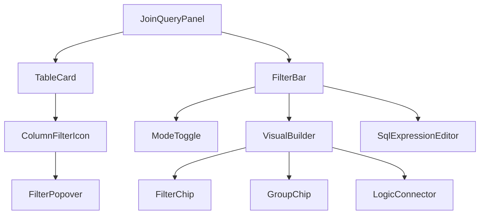

# 双模筛选器设计文档 (Dual-Mode Filter)

> **版本**: 1.0  
> **创建时间**: 2024-12-23  
> **关联需求**: requirements.md

---

## 📐 架构设计

### 1. 整体架构

```
┌─────────────────────────────────────────────────────────────────────────┐
│                         JoinQueryPanel                                   │
├─────────────────────────────────────────────────────────────────────────┤
│  ┌─────────────────────────────────────────────────────────────────┐    │
│  │                     Table Cards (Scatter)                        │    │
│  │  ┌──────────────┐  ┌──────────────┐  ┌──────────────┐          │    │
│  │  │  TableCard A │  │  TableCard B │  │  TableCard C │          │    │
│  │  │  • col1 [🔍] │  │  • col1 [🔍] │  │  • col1 [🔍] │          │    │
│  │  │  • col2 [🔍] │  │  • col2 [🔍] │  │  • col2 [🔍] │          │    │
│  │  └──────────────┘  └──────────────┘  └──────────────┘          │    │
│  └─────────────────────────────────────────────────────────────────┘    │
│                                                                          │
│  ┌─────────────────────────────────────────────────────────────────┐    │
│  │                      FilterBar (Gather)                          │    │
│  │  [✨ Visual | 📝 SQL]                                           │    │
│  │  ┌────────────────────────────────────────────────────────────┐ │    │
│  │  │ [A.status = 'active'] —AND— [B.amount > 100] —OR— [C.id=1] │ │    │
│  │  └────────────────────────────────────────────────────────────┘ │    │
│  └─────────────────────────────────────────────────────────────────┘    │
└─────────────────────────────────────────────────────────────────────────┘
```

### 2. 组件层级



### 3. 状态管理

```typescript
// JoinQueryPanel 新增状态
interface JoinQueryPanelState {
  // ... existing states
  
  // Filter 相关
  filterMode: 'visual' | 'sql';
  filterTree: FilterGroup;  // 根节点固定为 Group
  filterSqlOverride: string | null; // SQL 模式下的手动编辑内容
}
```

---

## 🔧 详细设计

### 模块 1: FilterBar (容器组件)

**职责**: 管理筛选区域的整体布局和模式切换

**Props**:
```typescript
interface FilterBarProps {
  mode: 'visual' | 'sql';
  onModeChange: (mode: 'visual' | 'sql') => void;
  filterTree: FilterGroup;
  onFilterChange: (tree: FilterGroup) => void;
  sqlOverride: string | null;
  onSqlChange: (sql: string) => void;
  availableColumns: { table: string; column: string; type: string }[];
}
```

**布局**:
```jsx
<div className="border-t border-border bg-muted/30 p-2">
  {/* Header: 模式切换 + 快捷操作 */}
  <div className="flex justify-between items-center mb-2">
    <span className="text-sm font-medium">WHERE 条件</span>
    <div className="flex gap-1">
      <Button variant={mode === 'visual' ? 'secondary' : 'ghost'}>✨ 可视化</Button>
      <Button variant={mode === 'sql' ? 'secondary' : 'ghost'}>📝 SQL</Button>
    </div>
  </div>
  
  {/* Body: 根据模式显示不同内容 */}
  {mode === 'visual' ? (
    <VisualBuilder tree={filterTree} onChange={onFilterChange} />
  ) : (
    <SqlExpressionEditor value={sqlOverride} onChange={onSqlChange} />
  )}
</div>
```

---

### 模块 2: VisualBuilder (可视化构建器)

**职责**: 渲染 FilterTree 为可交互的 Chip 列表

**核心逻辑**:
```typescript
const VisualBuilder: React.FC<{ tree: FilterGroup; onChange: (tree: FilterGroup) => void }> = ({ tree, onChange }) => {
  return (
    <DndContext onDragEnd={handleDragEnd}>
      <div className="flex flex-wrap items-center gap-1">
        {tree.children.map((node, index) => (
          <React.Fragment key={node.id}>
            {index > 0 && (
              <LogicConnector 
                logic={tree.logic} 
                onClick={() => toggleRootLogic()} 
              />
            )}
            <NodeRenderer node={node} onUpdate={...} onDelete={...} />
          </React.Fragment>
        ))}
        <AddFilterButton />
      </div>
    </DndContext>
  );
};
```

---

### 模块 3: FilterChip (条件芯片)

**职责**: 显示单个 FilterCondition

**UI**:
```jsx
<Badge 
  variant="outline" 
  className="cursor-pointer hover:bg-muted gap-1 pr-1"
  onClick={() => openEditPopover()}
>
  <span className="text-muted-foreground">{node.table}.</span>
  <span>{node.column}</span>
  <span className="text-primary">{node.operator}</span>
  <span className="font-medium">{formatValue(node.value)}</span>
  <Button variant="ghost" size="icon" className="h-4 w-4" onClick={onDelete}>
    <X className="h-3 w-3" />
  </Button>
</Badge>
```

**值格式化**:
```typescript
function formatValue(value: any, operator: FilterOperator): string {
  if (operator === 'IS NULL' || operator === 'IS NOT NULL') return '';
  if (operator === 'IN' || operator === 'NOT IN') {
    if (Array.isArray(value)) return `(${value.join(', ')})`;
  }
  if (typeof value === 'string') return `'${value}'`;
  return String(value);
}
```

---

### 模块 4: GroupChip (分组容器)

**职责**: 显示 FilterGroup 及其子节点

**UI**:
```jsx
<div className="flex items-center gap-1 border-l-2 border-primary/50 pl-2 bg-muted/20 rounded-r">
  <span className="text-xs text-muted-foreground">(</span>
  {node.children.map((child, index) => (
    <React.Fragment key={child.id}>
      {index > 0 && (
        <LogicConnector 
          logic={node.logic} 
          onClick={() => toggleGroupLogic(node.id)} 
        />
      )}
      <NodeRenderer node={child} ... />
    </React.Fragment>
  ))}
  <span className="text-xs text-muted-foreground">)</span>
</div>
```

---

### 模块 5: FilterPopover (条件编辑器)

**职责**: 添加/编辑单个条件

**表单结构**:
```jsx
<Popover>
  <PopoverContent className="w-80">
    <div className="space-y-3">
      {/* 表.列 选择 */}
      <div className="grid grid-cols-2 gap-2">
        <Select value={table} onValueChange={setTable}>
          <SelectTrigger><SelectValue placeholder="表" /></SelectTrigger>
          <SelectContent>{tables.map(...)}</SelectContent>
        </Select>
        <Select value={column} onValueChange={setColumn}>
          <SelectTrigger><SelectValue placeholder="列" /></SelectTrigger>
          <SelectContent>{columns.map(...)}</SelectContent>
        </Select>
      </div>
      
      {/* 操作符 */}
      <Select value={operator} onValueChange={setOperator}>
        <SelectTrigger><SelectValue /></SelectTrigger>
        <SelectContent>
          <SelectItem value="=">=</SelectItem>
          <SelectItem value="!=">≠</SelectItem>
          <SelectItem value=">">></SelectItem>
          <SelectItem value="<"><</SelectItem>
          <SelectItem value=">=">≥</SelectItem>
          <SelectItem value="<=">≤</SelectItem>
          <SelectItem value="LIKE">LIKE</SelectItem>
          <SelectItem value="IN">IN</SelectItem>
          <SelectItem value="NOT IN">NOT IN</SelectItem>
          <SelectItem value="IS NULL">IS NULL</SelectItem>
          <SelectItem value="IS NOT NULL">IS NOT NULL</SelectItem>
        </SelectContent>
      </Select>
      
      {/* 值输入 - 根据操作符变化 */}
      {operator === 'IN' || operator === 'NOT IN' ? (
        <TagsInput value={values} onChange={setValues} placeholder="输入值，回车添加" />
      ) : operator !== 'IS NULL' && operator !== 'IS NOT NULL' ? (
        <Input value={value} onChange={e => setValue(e.target.value)} placeholder="输入值" />
      ) : null}
      
      {/* 操作按钮 */}
      <div className="flex justify-end gap-2">
        <Button variant="ghost" onClick={onCancel}>取消</Button>
        <Button onClick={onSubmit}>确定</Button>
      </div>
    </div>
  </PopoverContent>
</Popover>
```

---

### 模块 6: SQL 生成器

**职责**: 将 FilterTree 转换为 SQL WHERE 子句

```typescript
function generateFilterSQL(node: FilterNode): string {
  switch (node.type) {
    case 'condition':
      return generateConditionSQL(node);
    case 'group':
      if (node.children.length === 0) return '';
      if (node.children.length === 1) return generateFilterSQL(node.children[0]);
      const parts = node.children.map(generateFilterSQL).filter(Boolean);
      return `(${parts.join(` ${node.logic} `)})`;
    case 'raw':
      return node.sql;
  }
}

function generateConditionSQL(cond: FilterCondition): string {
  const col = escapeSqlIdentifier(`${cond.table}.${cond.column}`);
  
  switch (cond.operator) {
    case 'IS NULL':
      return `${col} IS NULL`;
    case 'IS NOT NULL':
      return `${col} IS NOT NULL`;
    case 'IN':
    case 'NOT IN':
      const vals = (cond.value as any[]).map(v => 
        typeof v === 'string' ? escapeSqlString(v) : v
      ).join(', ');
      return `${col} ${cond.operator} (${vals})`;
    case 'LIKE':
    case 'NOT LIKE':
      return `${col} ${cond.operator} ${escapeSqlString(String(cond.value))}`;
    default:
      const val = typeof cond.value === 'string' 
        ? escapeSqlString(cond.value)
        : cond.value;
      return `${col} ${cond.operator} ${val}`;
  }
}

/**
 * 转义 SQL 标识符（表名、列名）
 * 规则：用双引号包裹，内部双引号转义为两个双引号
 */
function escapeSqlIdentifier(name: string): string {
  return `"${name.replace(/"/g, '""')}"`;
}

/**
 * 转义 SQL 字符串值
 * 规则：用单引号包裹，内部单引号转义为两个单引号
 */
function escapeSqlString(str: string): string {
  return `'${str.replace(/'/g, "''")}'`;
}

/**
 * 校验值类型是否匹配列类型
 */
function validateValueType(value: any, columnType: string): { valid: boolean; error?: string } {
  const type = columnType.toUpperCase();
  
  if (type.includes('INT') || type.includes('BIGINT')) {
    if (!/^-?\d+$/.test(String(value))) {
      return { valid: false, error: 'filter.error.invalidInteger' };
    }
  } else if (type.includes('DOUBLE') || type.includes('DECIMAL') || type.includes('FLOAT')) {
    if (isNaN(Number(value))) {
      return { valid: false, error: 'filter.error.invalidNumber' };
    }
  } else if (type.includes('DATE')) {
    if (!/^\d{4}-\d{2}-\d{2}$/.test(String(value))) {
      return { valid: false, error: 'filter.error.invalidDate' };
    }
  } else if (type.includes('TIMESTAMP')) {
    if (isNaN(Date.parse(String(value)))) {
      return { valid: false, error: 'filter.error.invalidTimestamp' };
    }
  }
  
  return { valid: true };
}
```

---

### 模块 7: SQL 解析器

**职责**: 将 SQL WHERE 字符串解析为 FilterTree

**策略**: 使用简化的递归下降解析，复杂表达式降级为 Raw

```typescript
function parseFilterSQL(sql: string): FilterNode {
  const trimmed = sql.trim();
  if (!trimmed) return createEmptyGroup();
  
  try {
    return parseExpression(trimmed);
  } catch (e) {
    // 解析失败，返回 Raw 节点
    return { id: nanoid(), type: 'raw', sql: trimmed };
  }
}

function parseExpression(expr: string): FilterNode {
  // 1. 尝试按 OR 分割（最低优先级）
  const orParts = splitByLogic(expr, 'OR');
  if (orParts.length > 1) {
    return {
      id: nanoid(),
      type: 'group',
      logic: 'OR',
      children: orParts.map(parseExpression),
    };
  }
  
  // 2. 尝试按 AND 分割
  const andParts = splitByLogic(expr, 'AND');
  if (andParts.length > 1) {
    return {
      id: nanoid(),
      type: 'group',
      logic: 'AND',
      children: andParts.map(parseExpression),
    };
  }
  
  // 3. 处理括号
  if (expr.startsWith('(') && expr.endsWith(')')) {
    return parseExpression(expr.slice(1, -1));
  }
  
  // 4. 尝试解析为条件
  return parseCondition(expr);
}

function parseCondition(expr: string): FilterCondition | FilterRaw {
  // 匹配模式: "table"."col" op value 或 table.col op value
  const patterns = [
    /^"?(\w+)"?\."?(\w+)"?\s+(IN|NOT IN)\s+\((.+)\)$/i,
    /^"?(\w+)"?\."?(\w+)"?\s+(IS NULL|IS NOT NULL)$/i,
    /^"?(\w+)"?\."?(\w+)"?\s+(=|!=|<>|>|>=|<|<=|LIKE|NOT LIKE)\s+(.+)$/i,
  ];
  
  for (const pattern of patterns) {
    const match = expr.match(pattern);
    if (match) {
      return buildConditionFromMatch(match);
    }
  }
  
  // 无法解析，返回 Raw
  return { id: nanoid(), type: 'raw', sql: expr };
}
```

---

## 🔄 模式切换流程

### Visual → SQL
```
1. 调用 generateFilterSQL(filterTree)
2. 设置 sqlOverride = 生成的 SQL
3. 切换 mode = 'sql'
```

### SQL → Visual
```
1. 调用 parseFilterSQL(sqlOverride)
2. 如果返回的是有效 FilterGroup:
   - 设置 filterTree = 解析结果
   - 清空 sqlOverride
   - 切换 mode = 'visual'
3. 如果返回的是 FilterRaw:
   - 提示"部分内容无法解析"
   - 将 Raw 节点包装在 FilterGroup 中
   - 切换 mode = 'visual'
4. 如果完全失败:
   - 提示"无法解析，保持 SQL 模式"
   - 保持 mode = 'sql'
```

---

## 📁 文件变更清单

### 新增文件

| 文件路径 | 说明 |
|---------|------|
| `frontend/src/new/Query/JoinQuery/FilterBar/index.tsx` | 主容器组件 |
| `frontend/src/new/Query/JoinQuery/FilterBar/VisualBuilder.tsx` | 可视化构建器 |
| `frontend/src/new/Query/JoinQuery/FilterBar/FilterChip.tsx` | 条件芯片组件 |
| `frontend/src/new/Query/JoinQuery/FilterBar/GroupChip.tsx` | 分组容器组件 |
| `frontend/src/new/Query/JoinQuery/FilterBar/FilterPopover.tsx` | 条件编辑弹窗 |
| `frontend/src/new/Query/JoinQuery/FilterBar/LogicConnector.tsx` | 逻辑连接符 |
| `frontend/src/new/Query/JoinQuery/FilterBar/types.ts` | 类型定义 |
| `frontend/src/new/Query/JoinQuery/FilterBar/filterUtils.ts` | SQL 生成/解析工具 |

### 修改文件

| 文件路径 | 改动范围 |
|---------|---------|
| `frontend/src/new/Query/JoinQuery/JoinQueryPanel.tsx` | 集成 FilterBar，新增 filterTree 状态 |
| `frontend/src/new/Query/JoinQuery/TableCard.tsx` | 列添加筛选图标入口 |

---

## 🎯 性能优化策略

### 大数据量优化

| 场景 | 阈值 | 优化方案 |
|------|------|---------|
| 条件数量 | 50+ | 使用 react-window 虚拟滚动 |
| 拖拽操作 | - | 使用 requestAnimationFrame 优化渲染 |
| SQL 解析 | 100ms | 设置超时，超时降级为 Raw |
| 模式切换 | - | 防抖 300ms，避免频繁切换 |
| 条件渲染 | 100+ | 分批渲染，每批 20 个 |

### 实现示例

```typescript
// 虚拟滚动（50+ 条件时启用）
import { FixedSizeList } from 'react-window';

const VisualBuilder: React.FC = ({ tree }) => {
  const flattenedNodes = flattenFilterTree(tree);
  
  if (flattenedNodes.length > 50) {
    return (
      <FixedSizeList
        height={400}
        itemCount={flattenedNodes.length}
        itemSize={40}
        width="100%"
      >
        {({ index, style }) => (
          <div style={style}>
            <NodeRenderer node={flattenedNodes[index]} />
          </div>
        )}
      </FixedSizeList>
    );
  }
  
  // 正常渲染
  return <div>{flattenedNodes.map(node => <NodeRenderer node={node} />)}</div>;
};

// SQL 解析超时处理
function parseFilterSQLWithTimeout(sql: string, timeout = 100): FilterNode {
  return new Promise((resolve) => {
    const timer = setTimeout(() => {
      // 超时降级为 Raw
      resolve({ id: nanoid(), type: 'raw', sql });
    }, timeout);
    
    try {
      const result = parseFilterSQL(sql);
      clearTimeout(timer);
      resolve(result);
    } catch (e) {
      clearTimeout(timer);
      resolve({ id: nanoid(), type: 'raw', sql });
    }
  });
}

// 模式切换防抖
const debouncedModeSwitch = useMemo(
  () => debounce((mode: 'visual' | 'sql') => {
    setMode(mode);
  }, 300),
  []
);
```

---

## ♿ 无障碍性规范

### ARIA 属性

| 元素 | ARIA 属性 | 说明 |
|------|----------|------|
| FilterChip | `role="button"` | 可点击编辑 |
|  | `aria-label="编辑条件: {table}.{column} {operator} {value}"` | 描述条件内容 |
|  | `aria-pressed="false"` | 未选中状态 |
| LogicConnector | `role="button"` | 可点击切换 |
|  | `aria-label="切换逻辑: 当前为 {logic}"` | 描述当前逻辑 |
| FilterPopover | `role="dialog"` | 弹窗对话框 |
|  | `aria-labelledby="filter-dialog-title"` | 标题 ID |
|  | `aria-modal="true"` | 模态对话框 |
| AddButton | `role="button"` | 添加按钮 |
|  | `aria-label="添加筛选条件"` | 按钮说明 |
| VisualBuilder | `role="region"` | 区域容器 |
|  | `aria-label="筛选条件列表"` | 区域说明 |
| GroupChip | `role="group"` | 分组容器 |
|  | `aria-label="条件分组: {logic} 逻辑"` | 分组说明 |

### 键盘操作

| 元素 | 键盘操作 | 行为 |
|------|---------|------|
| FilterChip | `Enter` | 打开编辑 Popover |
|  | `Delete` / `Backspace` | 删除条件 |
|  | `Tab` | 移动到下一个元素 |
|  | `Shift+Tab` | 移动到上一个元素 |
| LogicConnector | `Enter` / `Space` | 切换 AND/OR |
| FilterPopover | `Tab` | 在表单字段间导航 |
|  | `Escape` | 关闭 Popover |
|  | `Enter` | 提交表单（焦点在按钮上时） |
| VisualBuilder | `Arrow Up/Down` | 在条件间导航 |
|  | `Home` | 跳到第一个条件 |
|  | `End` | 跳到最后一个条件 |

### 焦点管理

```typescript
// FilterPopover 打开时，焦点移到第一个输入框
useEffect(() => {
  if (isOpen) {
    tableSelectRef.current?.focus();
  }
}, [isOpen]);

// FilterPopover 关闭时，焦点返回触发按钮
const handleClose = () => {
  setIsOpen(false);
  triggerButtonRef.current?.focus();
};

// 删除条件后，焦点移到前一个条件或添加按钮
const handleDelete = (index: number) => {
  deleteCondition(index);
  if (index > 0) {
    chipRefs.current[index - 1]?.focus();
  } else {
    addButtonRef.current?.focus();
  }
};
```

---

## 🔗 与 JoinQueryPanel 集成

### 状态同步

```typescript
// JoinQueryPanel 状态扩展
interface JoinQueryPanelState {
  // ... existing states
  tables: TableConfig[];
  joins: JoinConfig[];
  
  // Filter 相关（新增）
  filterTree: FilterGroup;
  filterMode: 'visual' | 'sql';
  filterSqlOverride: string | null;
}

// 初始化 Filter 状态
const [filterTree, setFilterTree] = useState<FilterGroup>({
  id: 'root',
  type: 'group',
  logic: 'AND',
  children: [],
});
const [filterMode, setFilterMode] = useState<'visual' | 'sql'>('visual');
const [filterSqlOverride, setFilterSqlOverride] = useState<string | null>(null);
```

### SQL 生成集成

```typescript
// 生成最终 SQL（包含 WHERE 子句）
function generateFinalSQL(state: JoinQueryPanelState): string {
  // 1. 生成基础 JOIN SQL
  const baseSQL = generateJoinSQL(state.tables, state.joins);
  
  // 2. 生成 WHERE 子句
  const whereClause = state.filterMode === 'sql' && state.filterSqlOverride
    ? state.filterSqlOverride  // SQL 模式：使用手动编辑的 SQL
    : generateFilterSQL(state.filterTree);  // Visual 模式：从 FilterTree 生成
  
  // 3. 拼接完整 SQL
  if (!whereClause || whereClause.trim() === '') {
    return baseSQL;
  }
  
  return `${baseSQL}\nWHERE ${whereClause}`;
}
```

### 实时预览同步

```typescript
// FilterBar 变化时，触发 SQL 预览更新
const debouncedUpdatePreview = useMemo(
  () => debounce(() => {
    const sql = generateFinalSQL({
      tables,
      joins,
      filterTree,
      filterMode,
      filterSqlOverride,
    });
    setSqlPreview(sql);
  }, 300),
  [tables, joins, filterTree, filterMode, filterSqlOverride]
);

useEffect(() => {
  debouncedUpdatePreview();
}, [filterTree, filterMode, filterSqlOverride]);
```

### 可用列数据传递

```typescript
// 从 tables 提取所有可用列
const availableColumns = useMemo(() => {
  return tables.flatMap(table => 
    table.columns.map(col => ({
      table: table.name,
      column: col.name,
      type: col.type,
    }))
  );
}, [tables]);

// 传递给 FilterBar
<FilterBar
  mode={filterMode}
  onModeChange={setFilterMode}
  filterTree={filterTree}
  onFilterChange={setFilterTree}
  sqlOverride={filterSqlOverride}
  onSqlChange={setFilterSqlOverride}
  availableColumns={availableColumns}
/>
```
