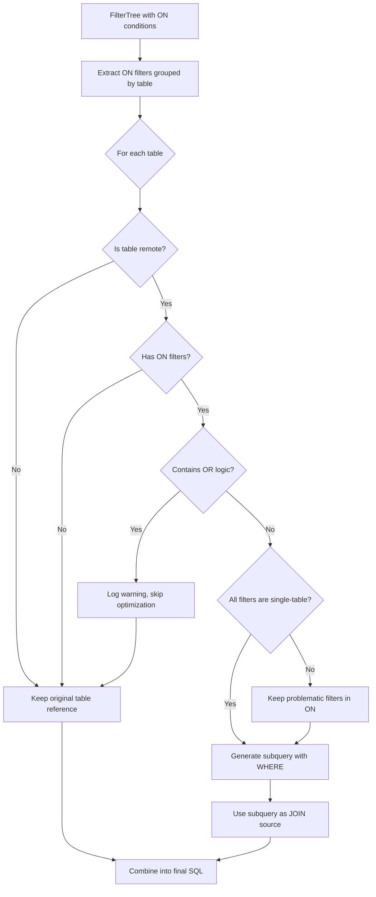

# Federated Query Optimization: Design Document

## Overview

This document describes the technical design for automatically rewriting federated JOIN queries to convert ON clause filters into subqueries, enabling predicate pushdown to remote databases.

## Architecture

```
┌────────────────────────────────────────────────────────────────────────────┐
│                           JoinQueryPanel                                    │
│                                                                             │
│  ┌──────────────┐   ┌───────────────────┐   ┌────────────────────────────┐ │
│  │  FilterBar   │──▶│  Filter Tree      │──▶│  generateSQL()             │ │
│  │  (UI)        │   │  (Data Structure) │   │  (SQL Generation)          │ │
│  └──────────────┘   └───────────────────┘   └─────────────┬──────────────┘ │
│                                                           │                 │
│                                                           ▼                 │
│                                             ┌─────────────────────────────┐ │
│                                             │  NEW: buildOptimizedJoin()  │ │
│                                             │  ┌───────────────────────┐  │ │
│                                             │  │ 1. Identify remote    │  │ │
│                                             │  │    tables             │  │ │
│                                             │  │ 2. Extract ON filters │  │ │
│                                             │  │ 3. Group by table     │  │ │
│                                             │  │ 4. Generate subquery  │  │ │
│                                             │  │ 5. Rebuild JOIN       │  │ │
│                                             │  └───────────────────────┘  │ │
│                                             └─────────────────────────────┘ │
└────────────────────────────────────────────────────────────────────────────┘
```

## Data Flow



## Optimization Decision Tree

```
For each remote table in JOIN:
├── Has ON placement filters?
│   ├── No → Keep original table reference (no optimization needed)
│   └── Yes → Check filter group
│       ├── Contains OR logic at group level?
│       │   └── Yes → BAILOUT: Skip optimization, log warning
│       │       └── Keep original table reference + ON filters
│       └── No (pure AND logic)
│           ├── All conditions reference only this table?
│           │   └── Yes → OPTIMIZE: Generate subquery with WHERE
│           └── Some conditions reference multiple tables?
│               └── PARTIAL: Move single-table filters to subquery
│                   └── Keep multi-table filters in ON clause
```


## Component Design

### 1. Remote Table Detector

**Location:** `JoinQueryPanel.tsx` or new utility file

**Purpose:** Determine which tables are "remote" (need optimization)

**Interface:**
```typescript
interface TableSourceInfo {
  tableName: string;
  alias: string;
  isRemote: boolean;
  fullRef: string;  // e.g., "mysql_db.table_name"
  attachAlias?: string;  // e.g., "mysql_db"
}

function getTableSourceInfo(
  table: JoinTable,
  attachDatabases: AttachDatabase[]
): TableSourceInfo;
```

**Logic:**
```typescript
function isRemoteTable(table: JoinTable, attachDatabases: AttachDatabase[]): boolean {
  // Remote if:
  // 1. The table reference contains a dot and the prefix matches an attach alias
  // 2. OR the table has a connectionId that appears in attachDatabases
  const tableRef = getFullTableRef(table);
  const prefix = tableRef.split('.')[0];
  return attachDatabases.some(db => db.alias === prefix);
}
```

---

### 2. ON Filter Extractor

**Location:** `FilterBar/filterUtils.ts` (extend existing)

**Purpose:** Extract ON conditions grouped by table

**Interface:**
```typescript
interface OnFilterGroup {
  tableName: string;
  tableAlias: string;
  conditions: FilterCondition[];
  combinedSQL: string;  // Generated SQL for WHERE clause
}

function extractOnFiltersGroupedByTable(
  filterTree: FilterGroup
): Map<string, OnFilterGroup>;
```

**Enhanced Interface (with OR detection):**
```typescript
interface OnFilterGroup {
  tableName: string;
  tableAlias: string;
  conditions: FilterCondition[];
  combinedSQL: string;  // Generated SQL for WHERE clause
  hasOrLogic: boolean;  // NEW: Whether group contains OR at top level
  canOptimize: boolean; // NEW: Final decision whether to optimize
}

function extractOnFiltersGroupedByTable(
  filterTree: FilterGroup
): Map<string, OnFilterGroup>;
```

**Logic (with OR detection and bailout):**
```typescript
function extractOnFiltersGroupedByTable(filterTree: FilterGroup): Map<string, OnFilterGroup> {
  const groups = new Map<string, OnFilterGroup>();
  
  // Walk the filter tree
  walkFilterTree(filterTree, (node, parent) => {
    if (node.type === 'condition' && node.placement === 'on') {
      const tableName = node.table;
      if (!groups.has(tableName)) {
        groups.set(tableName, {
          tableName,
          tableAlias: tableName,
          conditions: [],
          combinedSQL: '',
          hasOrLogic: false,
          canOptimize: true  // Assume optimizable until proven otherwise
        });
      }
      groups.get(tableName)!.conditions.push(node);
      
      // Check if parent is an OR group
      if (parent && parent.type === 'group' && parent.logic === 'OR') {
        groups.get(tableName)!.hasOrLogic = true;
      }
    }
  });
  
  // Analyze each group for optimization eligibility
  for (const [tableName, group] of groups) {
    if (group.hasOrLogic) {
      // BAILOUT: OR logic detected, skip optimization
      console.warn(`[SQL Optimizer] Skipping optimization for table '${tableName}' due to OR logic`);
      group.canOptimize = false;
    } else {
      // Pure AND logic, can optimize
      group.combinedSQL = generateConditionsSQL(group.conditions);
      group.canOptimize = true;
    }
  }
  
  return groups;
}

// Helper: Check if filter tree node has OR ancestor
function hasOrAncestor(node: FilterNode, tree: FilterGroup): boolean {
  // Walk up the tree to check if any parent group uses OR logic
  // Implementation depends on tree structure
  return checkParentLogic(node, tree, 'OR');
}
```

---

### 2.5 NEW: Optimization Eligibility Checker

**Location:** `sqlOptimizer.ts`

**Purpose:** Final validation before applying optimization

**Unified Type Definition (shared with Notification System):**
```typescript
// Reason enum - used by both OptimizationDecision and OptimizationReport
type OptimizationSkipReason = 
  | 'success'              // Optimization applied
  | 'no_filters'           // No filters to push
  | 'local_table'          // Local table
  | 'or_logic'             // Contains OR
  | 'expression_complex'   // Complex expression
  | 'multi_table_reference' // Multi-table reference
  | 'fallback_error';      // Exception occurred

interface OptimizationDecision {
  shouldOptimize: boolean;
  reason: OptimizationSkipReason;  // Enum, not string!
}

function checkOptimizationEligibility(
  tableInfo: TableSourceInfo,
  filterGroup: OnFilterGroup | undefined
): OptimizationDecision;
```

**Reason to Human-Readable Message (i18n-ready):**
```typescript
// Chinese messages (production)
const REASON_MESSAGES_ZH: Record<OptimizationSkipReason, string> = {
  'success': '优化成功',
  'no_filters': '无需优化：没有可下推的过滤条件',
  'local_table': '无需优化：本地表不受益于子查询优化',
  'or_logic': 'ON 条件包含 OR 逻辑，已回退到原始查询',
  'expression_complex': 'ON 条件包含复杂表达式，已回退',
  'multi_table_reference': 'ON 条件引用多表，无法拆分到子查询',
  'fallback_error': '优化过程发生异常，已回退到原始查询'
};

// English messages (for debugging / future i18n)
const REASON_MESSAGES_EN: Record<OptimizationSkipReason, string> = {
  'success': 'Optimization applied',
  'no_filters': 'No filters to push down',
  'local_table': 'Local table - no optimization benefit',
  'or_logic': 'Contains OR logic - falling back to preserve semantics',
  'expression_complex': 'Complex expression in ON clause - falling back',
  'multi_table_reference': 'Multi-table reference - cannot split to subquery',
  'fallback_error': 'Exception during optimization - falling back'
};

// Helper function to get localized message
function getReasonMessage(reason: OptimizationSkipReason, locale: 'zh' | 'en' = 'zh'): string {
  return locale === 'zh' ? REASON_MESSAGES_ZH[reason] : REASON_MESSAGES_EN[reason];
}
```

**Implementation (returns enum, not string):**
```typescript
function checkOptimizationEligibility(
  tableInfo: TableSourceInfo,
  filterGroup: OnFilterGroup | undefined
): OptimizationDecision {
  // Rule 1: Must be remote table
  if (!tableInfo.isRemote) {
    return { shouldOptimize: false, reason: 'local_table' };
  }
  
  // Rule 2: Must have filters
  if (!filterGroup || filterGroup.conditions.length === 0) {
    return { shouldOptimize: false, reason: 'no_filters' };
  }
  
  // Rule 3: Check OR logic bailout
  if (filterGroup.hasOrLogic || !filterGroup.canOptimize) {
    return { shouldOptimize: false, reason: 'or_logic' };
  }
  
  // Rule 4: Check for multi-table references (future enhancement)
  // if (hasMultiTableReferences(filterGroup)) {
  //   return { shouldOptimize: false, reason: 'multi_table_reference' };
  // }
  
  // All checks passed - proceed with optimization
  return { shouldOptimize: true, reason: 'success' };
}
```


**Location:** New file `sqlOptimizer.ts` or extend `JoinQueryPanel.tsx`

**Purpose:** Build optimized subquery for a remote table

**Interface:**
```typescript
interface SubqueryBuildResult {
  subquerySQL: string;  // The full (SELECT ... FROM ... WHERE ...) subquery
  alias: string;
}

function buildFilteredSubquery(
  tableSourceInfo: TableSourceInfo,
  onFilters: OnFilterGroup | undefined,
  selectedColumns: string[] | null,  // null = SELECT *
  dialect: 'duckdb' | 'mysql' | 'postgres'
): SubqueryBuildResult;
```

**Logic:**
```typescript
function buildFilteredSubquery(
  tableSourceInfo: TableSourceInfo,
  onFilters: OnFilterGroup | undefined,
  selectedColumns: string[] | null,
  dialect: 'duckdb'
): SubqueryBuildResult {
  const { fullRef, alias } = tableSourceInfo;
  
  // Column selection
  const selectClause = selectedColumns && selectedColumns.length > 0
    ? selectedColumns.map(c => quoteIdent(c, dialect)).join(', ')
    : '*';
  
  // WHERE clause from ON filters
  const whereClause = onFilters?.combinedSQL
    ? `WHERE ${onFilters.combinedSQL}`
    : '';
  
  const subquerySQL = `(SELECT ${selectClause} FROM ${fullRef} ${whereClause})`;
  
  return { subquerySQL, alias };
}
```

---

### 4. Optimized JOIN Generator

**Location:** Modify `generateSQL()` in `JoinQueryPanel.tsx`

**Purpose:** Integrate all components to generate optimized SQL

**Changes to generateSQL():**

```typescript
const generateSQL = (): string | null => {
  // ... existing preamble ...
  
  // NEW: Extract ON filters grouped by table
  const onFilterGroups = extractOnFiltersGroupedByTable(filterTree);
  
  // NEW: Identify remote tables
  const remoteTableSet = new Set(
    attachDatabases.map(db => db.alias)
  );
  
  // Modified FROM clause for first table
  const firstTableInfo = getTableSourceInfo(activeTables[0], attachDatabases);
  const firstTableOnFilters = onFilterGroups.get(firstTableInfo.tableName);
  
  if (firstTableInfo.isRemote && firstTableOnFilters) {
    // Use subquery for first table
    const { subquerySQL, alias } = buildFilteredSubquery(
      firstTableInfo, firstTableOnFilters, null, dialect
    );
    parts.push(`FROM ${subquerySQL} AS ${quoteIdent(alias, dialect)}`);
  } else {
    // Keep original reference
    parts.push(`FROM ${firstTableRef} AS ${quoteIdent(firstTableAlias, dialect)}`);
  }
  
  // Modified JOIN clauses
  for (let i = 1; i < activeTables.length; i++) {
    const rightTableInfo = getTableSourceInfo(activeTables[i], attachDatabases);
    const rightTableOnFilters = onFilterGroups.get(rightTableInfo.tableName);
    
    // Determine table reference (subquery or direct)
    let rightTableSource: string;
    if (rightTableInfo.isRemote && rightTableOnFilters) {
      const { subquerySQL } = buildFilteredSubquery(
        rightTableInfo, rightTableOnFilters, null, dialect
      );
      rightTableSource = subquerySQL;
    } else {
      rightTableSource = rightTableInfo.fullRef;
    }
    
    // Generate ON clause (only JOIN keys, not single-table filters)
    const joinKeyConditions = getJoinKeyConditions(config.conditions);
    const onClause = generateJoinKeyOnClause(joinKeyConditions, ...);
    
    parts.push(`${config.joinType} ${rightTableSource} AS ${quoteIdent(rightTableAlias, dialect)} ON ${onClause}`);
  }
  
  // WHERE clause (only non-ON conditions now)
  const whereOnlyTree = cloneTreeWithoutOnConditions(filterTree);
  const whereClause = generateFilterSQL(whereOnlyTree);
  if (whereClause) {
    parts.push(`WHERE ${whereClause}`);
  }
  
  // ... rest unchanged ...
};
```

---

## Filter Classification

Filters will be classified into three categories:

| Category | Description | Treatment |
|----------|-------------|-----------|
| **JOIN Key** | Conditions involving columns from BOTH left and right tables | Stay in ON clause |
| **Single-Table ON** | ON conditions referencing only ONE table | Move to subquery WHERE |
| **WHERE Filter** | Conditions with placement='where' | Stay in WHERE clause |

**Classification Logic:**
```typescript
function classifyCondition(
  condition: FilterCondition,
  leftTableName: string,
  rightTableName: string
): 'join_key' | 'left_filter' | 'right_filter' | 'where' {
  if (condition.placement !== 'on') {
    return 'where';
  }
  
  // Check if it's a join key (references both tables)
  // For expression-based conditions, we'd need to parse the expression
  // For now, assume single-table conditions if table matches one side
  if (condition.table === leftTableName) {
    return 'left_filter';
  }
  if (condition.table === rightTableName) {
    return 'right_filter';
  }
  
  // Default: treat as join key (keep in ON)
  return 'join_key';
}
```

---

## SQL Transformation Examples

### Example 1: Single Remote Table with Filter

**Input:**
- Tables: `local.csv` (local), `mysql_db.orders` (remote)
- ON filter: `mysql_db.orders.status = 'active'`

**Before:**
```sql
SELECT * FROM local_csv AS local
LEFT JOIN mysql_db.orders AS orders ON local.id = orders.local_id
AND orders.status = 'active'
```

**After:**
```sql
SELECT * FROM local_csv AS local
LEFT JOIN (
  SELECT * FROM mysql_db.orders WHERE status = 'active'
) AS orders ON local.id = orders.local_id
```

---

### Example 2: Multiple Remote Tables

**Input:**
- Tables: `mysql_a.users` (remote), `mysql_b.orders` (remote)
- ON filters: `users.created_at >= '2025-01-01'`, `orders.amount > 100`

**Before:**
```sql
SELECT * FROM mysql_a.users AS users
LEFT JOIN mysql_b.orders AS orders ON users.id = orders.user_id
AND users.created_at >= '2025-01-01'
AND orders.amount > 100
```

**After:**
```sql
SELECT * FROM (
  SELECT * FROM mysql_a.users WHERE created_at >= '2025-01-01'
) AS users
LEFT JOIN (
  SELECT * FROM mysql_b.orders WHERE amount > 100
) AS orders ON users.id = orders.user_id
```

---

### Example 3: Mixed Local and Remote

**Input:**
- Tables: `uploaded_file` (local), `mysql_db.customers` (remote)
- ON filter on local table: should NOT be wrapped

**Before:**
```sql
SELECT * FROM uploaded_file AS file
LEFT JOIN mysql_db.customers AS customers ON file.cust_id = customers.id
AND file.status = 'active'
AND customers.tier = 'gold'
```

**After:**
```sql
SELECT * FROM uploaded_file AS file
LEFT JOIN (
  SELECT * FROM mysql_db.customers WHERE tier = 'gold'
) AS customers ON file.cust_id = customers.id
AND file.status = 'active'
```

> Note: Local table filters stay in ON clause (no benefit from subquery)

---

## Performance Considerations

### 1. Avoid Over-Optimization
- Do NOT wrap tables without ON filters
- Do NOT wrap local tables
- Consider: skip optimization for small tables (< 10k rows)? (future enhancement)

### 2. Memory Efficiency
- Subquery wrapping adds minimal overhead to SQL generation (string manipulation)
- The actual query execution benefits massively from reduced data transfer

### 3. Column Pruning (Optional Future Enhancement)
```typescript
// If we know the columns used in SELECT and JOIN
function getRequiredColumns(
  tableName: string,
  selectColumns: string[],
  joinConditions: JoinCondition[],
  filterConditions: FilterCondition[]
): string[] {
  // Collect all column references for this table
  // Return unique set
}
```

---

## Error Handling

1. **Invalid filter combinations**: If a filter cannot be classified, log a warning and leave it in ON clause (safe fallback)

2. **SQL generation failure**: If subquery generation fails, fall back to original behavior (no optimization)

3. **Empty filter values**: Skip conditions with empty/null values

---

## Passive Notification System

### Design Principle: Silent Success
- **No notification when optimization succeeds** (expected behavior)
- **SQL comment notification when optimization is skipped** (passive, non-intrusive)

### 5.1 Optimization Report Interface

Uses the unified `OptimizationSkipReason` type defined in section 2.5:

```typescript
interface OptimizationReport {
  tableName: string;
  wasOptimized: boolean;
  reason: OptimizationSkipReason;  // Unified enum from section 2.5
}
```

### 5.2 Notification Decision Logic

```typescript
// Which reasons should trigger a SQL comment notification?
const SHOULD_NOTIFY: Record<OptimizationSkipReason, boolean> = {
  'success': false,              // No notification
  'no_filters': false,           // No notification (normal case)
  'local_table': false,          // No notification (expected)
  'or_logic': true,              // ⚠️ Show notification
  'expression_complex': true,    // ⚠️ Show notification
  'multi_table_reference': true, // ⚠️ Show notification
  'fallback_error': true         // ⚠️ Show notification
};

function generateOptimizationComment(report: OptimizationReport): string | null {
  if (!SHOULD_NOTIFY[report.reason]) return null;
  
  // Use unified i18n message from section 2.5
  const message = getReasonMessage(report.reason, 'zh');
  return `-- ⚠ ${report.tableName}: ${message}`;
}
```

### 5.3 Integration with generateSQL

```typescript
const generateSQL = (): { sql: string; reports: OptimizationReport[] } => {
  const reports: OptimizationReport[] = [];
  const sqlParts: string[] = [];
  
  // ... optimization logic ...
  
  for (const table of tables) {
    const decision = checkOptimizationEligibility(tableInfo, filterGroup);
    reports.push({
      tableName: tableInfo.tableName,
      wasOptimized: decision.shouldOptimize,
      reason: decision.reason
    });
  }
  
  // Generate warning comments for skipped optimizations
  const warningComments = reports
    .map(r => generateOptimizationComment(r))
    .filter((c): c is string => c !== null);
  
  // Prepend warnings to SQL
  const finalSQL = [...warningComments, ...sqlParts].join('\n');
  
  return { sql: finalSQL, reports };
};
```

### 5.4 Example Output

**When optimization is skipped due to OR logic:**
```sql
-- ⚠ mysql_sorting.sorting_info: ON 条件包含 OR 逻辑，已回退到原始查询

SELECT *
FROM mysql_sorder.wxsp_order AS wxsp_order
LEFT JOIN mysql_sorting.sorting_info AS sorting_info 
ON wxsp_order.order_id = sorting_info.order_no
AND (sorting_info.status = 'A' OR sorting_info.status = 'B')
LIMIT 10000
```

**When optimization succeeds (no comment):**
```sql
SELECT *
FROM (
    SELECT * FROM mysql_sorder.wxsp_order 
    WHERE create_time >= '2025-12-01'
) AS wxsp_order
LEFT JOIN (
    SELECT * FROM mysql_sorting.sorting_info 
    WHERE create_time >= '2025-12-01'
) AS sorting_info 
ON wxsp_order.order_id = sorting_info.order_no
LIMIT 10000
```


## Testing Strategy

### Unit Tests
- `isRemoteTable()` with various table configurations
- `extractOnFiltersGroupedByTable()` with complex filter trees
- `buildFilteredSubquery()` with different operator types
- `classifyCondition()` for all condition types

### Integration Tests (SQL Snapshot)
| Test Case | Description |
|-----------|-------------|
| `single_remote_no_filter` | Remote table, no ON filters |
| `single_remote_one_filter` | Remote table, one ON filter |
| `single_remote_multi_filter` | Remote table, multiple ON filters |
| `two_remote_mixed_filters` | Two remote tables with filters |
| `local_and_remote` | Mix of local and remote tables |
| `no_on_filters_only_keys` | Only JOIN keys, no single-table filters |
| `inner_join_optimization` | INNER JOIN with filters |
| `right_join_optimization` | RIGHT JOIN with filters |
| `three_table_join` | Three-way join with filters |
| `or_logic_preservation` | Filters connected by OR |
| `between_and_in` | BETWEEN and IN operators |

### Manual Testing
- UI generates correct SQL preview
- Execution performance matches expectations
- Cancel functionality still works

---

## Migration & Rollout

### Phase 1: Feature Flag
- Add config option: `enableFederatedQueryOptimization: boolean`
- Default: `true` (enabled)
- Allows quick rollback if issues found

### Phase 2: Gradual Rollout
- Monitor query performance metrics
- Collect user feedback

### Phase 3: Full Rollout
- Remove feature flag
- Document optimization behavior
