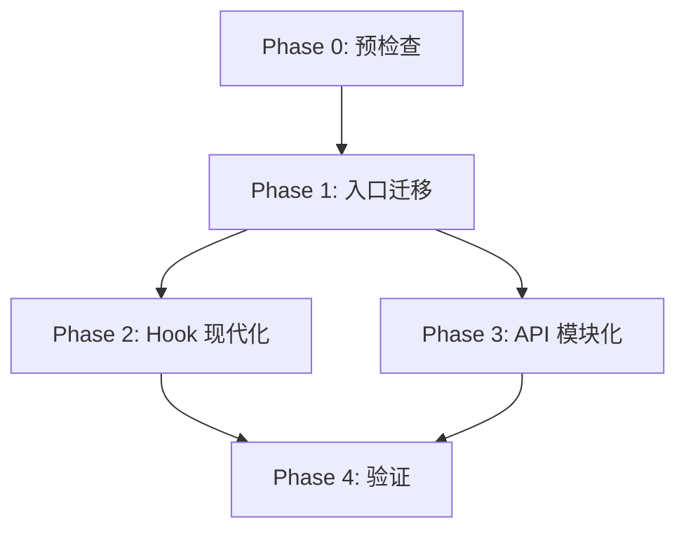

# Frontend Modernization Tasks

## 预迁移准备

### Task 0.1: 环境检查
- [ ] 运行 `cd frontend && npx tsc --noEmit` 检查现有类型问题
- [ ] 记录需要修复的类型错误数量
- [ ] 确保 `npm run build` 当前通过

---

## Phase 1: Entry File Migration

### Task 1.1: Convert main.jsx to TypeScript
- [ ] 创建 `main.tsx`，添加 root element 类型断言
- [ ] 更新导入使用新的 `App` 组件
- [ ] 删除 `main.jsx`
- [ ] 验证 build 通过

### Task 1.2: Convert DuckQueryApp.jsx to App.tsx
- [ ] 创建 `App.tsx`
- [ ] 定义类型接口:
  - `TabId = 'datasource' | 'queryworkbench' | 'settings'`
  - `DataSourceTabId = 'upload' | 'database' | 'paste'`
  - `HeaderGlobalProps`
- [ ] 合并 `LogoLight`/`LogoDark` 为单一 `Logo` 导入
- [ ] 转换 `ErrorBoundary` 类组件为 TypeScript
- [ ] 更新 `main.tsx` 导入路径
- [ ] 搜索并更新所有 `DuckQueryApp` 引用（测试、文档）
- [ ] 删除 `DuckQueryApp.jsx`
- [ ] 运行 `npm run build` 修复类型错误
- [ ] 手动验证: 导航、主题切换、语言切换

---

## Phase 2: Hook Modernization

### Task 2.1: 更新 useAppShell 注释
- [ ] 移除 "兼容性" / "过渡壳" 相关注释
- [ ] 更新顶部文档注释为 "应用状态管理的组合入口"

### Task 2.2: API 重命名 (选择方案)

**方案 A (破坏性重命名):**
- [ ] 重命名所有函数
- [ ] 更新所有消费方 (`App.tsx`)
- [ ] 更新单元测试

**方案 B (兼容别名) ✅ 推荐:**
- [ ] 添加新命名函数
- [ ] 保留旧命名作为 `@deprecated` 别名
- [ ] 在 `App.tsx` 中使用新命名
- [ ] 计划下个大版本移除旧别名

### Task 2.3: 验证
- [ ] 确认主题切换正常
- [ ] 确认欢迎页关闭正常
- [ ] 确认数据刷新正常

---

## Phase 3: API Modularization

### Task 3.1: 创建 API 基础设施
- [ ] 创建 `frontend/src/api/` 目录
- [ ] 创建 `api/client.ts`:
  - 导出共享 axios 实例
  - 迁移拦截器配置
  - 导出上传专用实例 (无 JSON header, 长超时)
- [ ] 创建 `api/types.ts`:
  - 定义 `QueryRequest`, `QueryResponse`
  - 定义 `DataSource`, `DatabaseConfig`
  - 定义 `UploadProgress`, `UploadResponse`
  - 定义 `AsyncTask`, `TaskStatus`

### Task 3.2: 提取 queryApi
- [ ] 创建 `api/queryApi.ts`
- [ ] 迁移函数:
  - `executeQuery`
  - `cancelQuery`
  - `getQueryHistory`
- [ ] 添加 TypeScript 类型
- [ ] 保留 axios 特性 (取消、超时)

### Task 3.3: 提取 dataSourceApi
- [ ] 创建 `api/dataSourceApi.ts`
- [ ] 迁移函数:
  - `getDataSources`
  - `connectDatabase`
  - `testConnection`
  - `saveConnectionConfig`
  - `deleteConnection`
- [ ] 添加 TypeScript 类型

### Task 3.4: 提取 fileApi
- [ ] 创建 `api/fileApi.ts`
- [ ] 迁移函数:
  - `uploadFile` (保留进度回调)
  - `importFromUrl`
  - `pasteData`
  - `listServerFiles`
- [ ] 添加 TypeScript 类型
- [ ] 验证上传进度条正常

### Task 3.5: 提取 asyncTaskApi
- [ ] 创建 `api/asyncTaskApi.ts`
- [ ] 迁移函数:
  - `createAsyncTask`
  - `getTaskStatus`
  - `cancelTask`
  - `downloadTaskResult`
- [ ] 添加 TypeScript 类型

### Task 3.6: 创建 Re-export Index
- [ ] 创建 `api/index.ts`
- [ ] 导出所有模块

### Task 3.7: 更新消费方导入
- [ ] 搜索所有 `from './services/apiClient'` 或 `from '../services/apiClient'`
- [ ] 替换为 `from '@/api'` 或相对路径
- [ ] 逐一验证替换后功能正常

### Task 3.8: 清理
- [ ] 删除 `services/apiClient.js`
- [ ] 删除 `services/asyncTasks.js` (如已迁移)
- [ ] 删除空的 `services/` 目录
- [ ] 运行 `npm run build` 确认无错误

---

## Phase 4: 最终验证

### Task 4.1: 自动化检查
- [ ] `npm run build` 通过
- [ ] `npm run lint` 通过
- [ ] `npm run test` 通过 (如有)

### Task 4.2: 手动回归测试
- [ ] 导航: datasource ↔ queryworkbench ↔ settings
- [ ] 文件上传: 拖拽 CSV，验证进度条显示
- [ ] 数据库连接: 测试 MySQL 连接并保存
- [ ] 主题切换: 深色/浅色模式
- [ ] 语言切换: 中文/English
- [ ] 查询执行: 运行 SQL 并查看结果
- [ ] 异步任务: 创建导出任务并查看状态
- [ ] 键盘快捷键: Cmd+K 打开命令面板

### Task 4.3: 文档更新
- [ ] 更新 `docs/NEW_UI_API_REFERENCE.md` 中的 API 导入示例
- [ ] 检查 README 是否需要更新

---

## 工时预估

| 阶段 | 任务数 | 预估工时 |
|------|--------|---------|
| Phase 0 | 1 | 0.5h |
| Phase 1 | 2 | 2-3h |
| Phase 2 | 3 | 1-2h |
| Phase 3 | 8 | 4-6h |
| Phase 4 | 3 | 1-2h |
| **总计** | **17** | **8.5-13.5h** |

---

## Git 提交策略

```
feat(frontend): migrate main.jsx to TypeScript
feat(frontend): migrate DuckQueryApp to App.tsx
refactor(hooks): modernize useAppShell API
feat(api): create shared axios client and types
feat(api): extract queryApi module
feat(api): extract dataSourceApi module
feat(api): extract fileApi module
feat(api): extract asyncTaskApi module
chore(cleanup): remove legacy apiClient.js
docs: update API reference documentation
```

## 依赖关系


