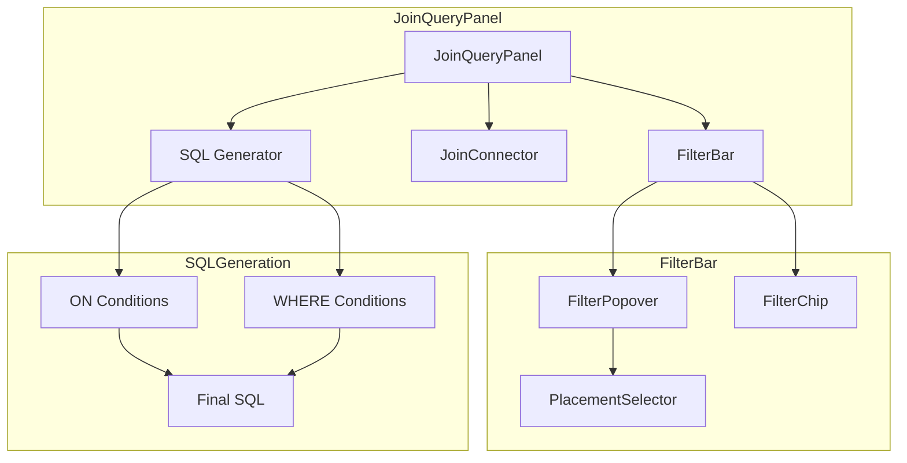
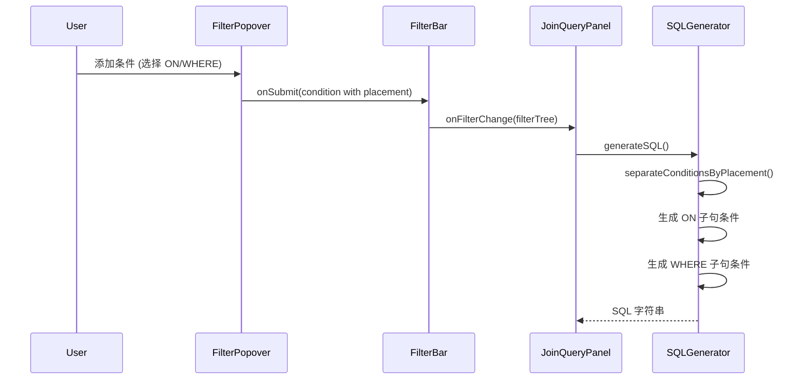

# JOIN ON 子句筛选器增强 - 设计文档

> **版本**: 1.1  
> **创建时间**: 2024-12-25  
> **更新时间**: 2024-12-25  
> **状态**: 🟢 设计审查完成

---

## 📐 架构设计

### 组件交互图



### 数据流



---

## 📁 文件变更清单

### 修改文件

| 文件路径 | 变更类型 | 描述 |
|---------|---------|------|
| `FilterBar/types.ts` | **修改** | 扩展 FilterCondition 类型，添加 `placement` 字段 |
| `FilterBar/FilterPopover.tsx` | **修改** | 添加"应用位置"单选框 |
| `FilterBar/FilterChip.tsx` | **修改** | 显示 ON/WHERE 标记 |
| `FilterBar/filterUtils.ts` | **修改** | 添加条件分离函数 |
| `JoinQueryPanel.tsx` | **修改** | SQL 生成逻辑支持 ON 条件 |

### 新增文件

| 文件路径 | 描述 |
|---------|------|
| `FilterBar/PlacementSelector.tsx` | 可复用的位置选择器组件 |

---

## 🔧 详细设计

### 1. 类型扩展 (types.ts)

```typescript
// 条件应用位置
export type FilterPlacement = 'on' | 'where';

// 扩展 FilterCondition
export interface FilterCondition extends FilterNodeBase {
  type: 'condition';
  table: string;
  column: string;
  operator: FilterOperator;
  value: FilterValue;
  value2?: FilterValue;
  
  /** 条件应用位置，默认 'where' */
  placement?: FilterPlacement;
}

// 智能默认逻辑需要的信息
export interface PlacementContext {
  /** 当前表是否为右表 */
  isRightTable: boolean;
  /** JOIN 类型 */
  joinType: 'INNER JOIN' | 'LEFT JOIN' | 'RIGHT JOIN' | 'FULL JOIN';
}

/**
 * ℹ️ 数据来源说明
 * 
 * PlacementContext 由 JoinQueryPanel 在构建 FilterPopover props 时注入：
 * 
 * 1. isRightTable: 根据 selectedTable 与 activeTables[0] 比较
 *    - activeTables[0] = 左表（FROM 表）
 *    - activeTables[1..n] = 右表（JOIN 表）
 *    - isRightTable = selectedTable !== getTableName(activeTables[0])
 * 
 * 2. joinType: 从 joinConfigs 数组中获取
 *    - 找到 selectedTable 对应的 joinConfig
 *    - joinType = joinConfigs[tableIndex - 1].joinType
 * 
 * 示例代码（在 JoinQueryPanel 中）：
 * ```typescript
 * const getPlacementContext = (tableName: string): PlacementContext | undefined => {
 *   const leftTableName = getTableName(activeTables[0]);
 *   if (tableName === leftTableName) {
 *     return { isRightTable: false, joinType: 'LEFT JOIN' }; // joinType 不重要
 *   }
 *   const tableIndex = activeTables.findIndex(t => getTableName(t) === tableName);
 *   if (tableIndex > 0 && joinConfigs[tableIndex - 1]) {
 *     return {
 *       isRightTable: true,
 *       joinType: joinConfigs[tableIndex - 1].joinType
 *     };
 *   }
 *   return undefined;
 * };
 * ```
 */
```

### 2. PlacementSelector 组件

```tsx
// PlacementSelector.tsx
interface PlacementSelectorProps {
  value: FilterPlacement;
  onChange: (value: FilterPlacement) => void;
  context?: PlacementContext;
  disabled?: boolean;
}

export const PlacementSelector: React.FC<PlacementSelectorProps> = ({
  value,
  onChange,
  context,
  disabled
}) => {
  const { t } = useTranslation();
  
  // 智能推荐
  const recommendedPlacement = useMemo(() => {
    if (!context) return 'where';
    if (context.isRightTable && 
        (context.joinType === 'LEFT JOIN' || context.joinType === 'FULL JOIN')) {
      return 'on';
    }
    return 'where';
  }, [context]);
  
  return (
    <div className="space-y-2">
      <Label className="flex items-center gap-1">
        {t('filter.placement.label')}
        <InfoTooltip content={t('filter.placement.helpText')} />
      </Label>
      <RadioGroup value={value} onValueChange={onChange} disabled={disabled}>
        <RadioGroupItem value="on" id="placement-on">
          <Label htmlFor="placement-on" className="flex items-center gap-2">
            <span>ON 子句</span>
            {recommendedPlacement === 'on' && (
              <Badge variant="outline" className="text-xs">推荐</Badge>
            )}
          </Label>
          <span className="text-xs text-muted-foreground">
            {t('filter.placement.onHint')}
          </span>
        </RadioGroupItem>
        <RadioGroupItem value="where" id="placement-where">
          <Label htmlFor="placement-where" className="flex items-center gap-2">
            <span>WHERE 子句</span>
            {recommendedPlacement === 'where' && (
              <Badge variant="outline" className="text-xs">推荐</Badge>
            )}
          </Label>
          <span className="text-xs text-muted-foreground">
            {t('filter.placement.whereHint')}
          </span>
        </RadioGroupItem>
      </RadioGroup>
    </div>
  );
};
```

### 3. FilterPopover 修改

```tsx
// FilterPopover.tsx - 添加以下逻辑

// 新增 Props
interface FilterPopoverProps {
  // ... 现有 props
  
  /** 用于智能默认的上下文 */
  placementContext?: PlacementContext;
}

// 组件内部
const [selectedPlacement, setSelectedPlacement] = useState<FilterPlacement>(
  initialValue?.placement ?? getDefaultPlacement(placementContext)
);

// 智能默认函数
function getDefaultPlacement(context?: PlacementContext): FilterPlacement {
  if (!context) return 'where';
  if (context.isRightTable && 
      (context.joinType === 'LEFT JOIN' || context.joinType === 'FULL JOIN')) {
    return 'on';
  }
  return 'where';
}

// handleSubmit 中
const condition = createCondition(
  selectedTable,
  selectedColumn,
  selectedOperator,
  value,
  value2
);
condition.placement = selectedPlacement;  // 添加 placement
```

### 4. FilterChip 修改

```tsx
// FilterChip.tsx - 添加 placement 标记
// ✅ 使用语义化 CSS 类，符合项目 UI 规范

export const FilterChip: React.FC<FilterChipProps> = ({ node, ... }) => {
  const placement = node.placement ?? 'where';
  
  return (
    <Badge variant="outline" className="...">
      {/* 位置标记 - 使用语义化类 */}
      <span className={cn(
        "text-[10px] px-1 rounded mr-1 font-medium",
        placement === 'on' 
          ? "bg-accent text-accent-foreground"           // ON: accent 配色
          : "bg-muted text-muted-foreground"             // WHERE: muted 配色
      )}>
        {placement === 'on' ? 'ON' : 'WHERE'}
      </span>
      
      {/* 现有内容 */}
      <span className="text-muted-foreground">{node.table}.</span>
      <span className="font-medium">{node.column}</span>
      {/* ... */}
    </Badge>
  );
};

/**
 * ℹ️ 实现细节
 * 
 * FilterChip 点击切换 placement 的交互（P2 功能）：
 * - 点击 ON/WHERE 标记可切换，无需二次确认
 * - 切换后立即触发 onFilterChange，SQL 预览实时刷新
 * - 可通过 e.stopPropagation() 防止触发编辑 Popover
 */
```

### 5. filterUtils.ts 新增函数

```typescript
/**
 * 按 placement 分离条件（平铺化，用于 ON 子句）
 */
export function separateConditionsByPlacement(
  tree: FilterGroup
): { onConditions: FilterCondition[]; whereConditions: FilterCondition[] } {
  const onConditions: FilterCondition[] = [];
  const whereConditions: FilterCondition[] = [];
  
  function traverse(node: FilterNode) {
    if (node.type === 'condition') {
      if (node.placement === 'on') {
        onConditions.push(node);
      } else {
        whereConditions.push(node);
      }
    } else if (node.type === 'group') {
      node.children.forEach(traverse);
    }
    // raw 类型暂时归入 whereConditions （作为整体 raw SQL 处理）
  }
  
  tree.children.forEach(traverse);
  return { onConditions, whereConditions };
}

/**
 * ✅ 递归克隆 filterTree，移除所有 placement='on' 的条件
 * 用于生成 WHERE 子句，确保嵌套 group 内的 ON 条件也被移除
 */
export function cloneTreeWithoutOnConditions(tree: FilterGroup): FilterGroup {
  function cloneNode(node: FilterNode): FilterNode | null {
    if (node.type === 'condition') {
      // 跳过 placement='on' 的条件
      if (node.placement === 'on') {
        return null;
      }
      return { ...node };
    } else if (node.type === 'group') {
      // 递归克隆子节点
      const clonedChildren = node.children
        .map(child => cloneNode(child))
        .filter((child): child is FilterNode => child !== null);
      
      // 如果 group 变空，返回 null（自动裁剪）
      if (clonedChildren.length === 0) {
        return null;
      }
      
      return {
        ...node,
        children: clonedChildren
      };
    } else if (node.type === 'raw') {
      return { ...node };
    }
    return null;
  }
  
  const clonedChildren = tree.children
    .map(child => cloneNode(child))
    .filter((child): child is FilterNode => child !== null);
  
  return {
    ...tree,
    children: clonedChildren
  };
}

/**
 * 获取指定表的条件
 */
export function getConditionsForTable(
  conditions: FilterCondition[],
  tableName: string
): FilterCondition[] {
  return conditions.filter(c => c.table === tableName);
}

/**
 * ℹ️ ON 条件逻辑限制
 * 
 * ON 条件统一使用 AND 连接，不支持 OR 逻辑。
 * 原因：
 * 1. ON 子句中的 OR 语义复杂，容易误用
 * 2. 大多数 JOIN 优化场景只需 AND 条件
 * 
 * UI 限制：
 * - placement='on' 的条件不能被拖入 OR 分组
 * - 尝试切换到 OR 时提示用户先改为 WHERE
 */
export function generateConditionsSQL(conditions: FilterCondition[]): string {
  if (conditions.length === 0) return '';
  // ON 条件强制使用 AND 连接
  return conditions.map(c => formatSingleCondition(c)).join(' AND ');
}

/**
 * 格式化单个条件为 SQL
 * ✅ 单元测试应覆盖此函数
 */
function formatSingleCondition(condition: FilterCondition): string {
  // 复用现有的 generateFilterSQL 逻辑
  // 将单个 condition 包装为临时 group 后调用
  const tempGroup: FilterGroup = {
    id: 'temp',
    type: 'group',
    logic: 'AND',
    children: [condition]
  };
  return generateFilterSQL(tempGroup);
}
```

### 6. JoinQueryPanel SQL 生成修改

```typescript
// generateSQL 函数修改

const generateSQL = (): string | null => {
  // ... 现有逻辑
  
  // 分离 ON 和 WHERE 条件
  const { onConditions } = separateConditionsByPlacement(filterTree);
  
  // JOIN 子句生成
  for (let i = 1; i < activeTables.length; i++) {
    const rightTableName = getTableName(activeTables[i]);
    const config = normalizeJoinConfig(joinConfigs[i - 1]);
    
    // 基础 ON 条件（列关联）
    const baseOnClause = config.conditions
      .map(c => `${leftRef} ${c.operator} ${rightRef}`)
      .join(' AND ');
    
    // 该表的额外 ON 条件（筛选器）
    const tableOnConditions = getConditionsForTable(onConditions, rightTableName);
    const extraOnClause = generateConditionsSQL(tableOnConditions);
    
    // 组合 ON 子句
    let fullOnClause = baseOnClause;
    if (extraOnClause) {
      fullOnClause += ` AND ${extraOnClause}`;
    }
    
    parts.push(`${config.joinType} ${rightTableRef} ON ${fullOnClause}`);
  }
  
  // ✅ WHERE 子句：使用递归克隆，完全移除所有 placement='on' 的条件
  const whereOnlyTree = cloneTreeWithoutOnConditions(filterTree);
  const whereClause = generateFilterSQL(whereOnlyTree);
  if (whereClause && whereClause.trim()) {
    parts.push(`WHERE ${whereClause}`);
  }
  
  // ...
};
```

---

## 🧪 测试策略

### 单元测试

| 测试文件 | 测试内容 |
|---------|---------|
| `filterUtils.test.ts` | `separateConditionsByPlacement` 函数 |
| `filterUtils.test.ts` | `getConditionsForTable` 函数 |
| `filterUtils.test.ts` | `generateConditionsSQL` 函数 |

### 集成测试

| 场景 | 预期结果 |
|------|---------|
| LEFT JOIN + 右表 ON 条件 | SQL: `LEFT JOIN ... ON A.id = B.id AND B.create_time > X` |
| LEFT JOIN + 右表 WHERE 条件 | SQL: `LEFT JOIN ... ON A.id = B.id WHERE B.create_time > X` |
| 混合 ON 和 WHERE 条件 | SQL 正确分离两类条件 |
| 无 placement 字段（向后兼容） | 默认作为 WHERE 条件处理 |

### 手动测试

1. 创建 LEFT JOIN 查询，添加右表筛选条件（placement=ON）
2. 执行查询，验证左表无匹配的行显示 NULL 而不是被过滤
3. 切换条件为 WHERE，验证结果变化

---

## ⚠️ 风险与缓解

| 风险 | 影响 | 缓解措施 |
|-----|------|---------|
| 复杂嵌套逻辑与 ON 条件混合 | WHERE 子句残留 ON 条件 | ✅ 使用递归 `cloneTreeWithoutOnConditions` 完全移除 |
| ON 条件使用 OR 逻辑 | SQL 语义不清 | ✅ UI 限制：placement='on' 的条件禁止拖入 OR 分组 |
| 用户不理解 ON vs WHERE | 选错条件位置 | 智能默认 + 清晰的帮助提示 |
| 向后兼容问题 | 旧数据无 placement 字段 | 默认 'where'，与之前行为一致 |
| Tailwind 原色类违规 | 与项目 UI 规范冲突 | ✅ 使用语义化类 (bg-accent, bg-muted) |

---

## 🛡️ ON 条件逻辑限制

> [!IMPORTANT]
> ON 子句条件仅支持 AND 连接，不支持 OR 逻辑

**原因**：
1. ON 子句中的 OR 语义复杂，容易导致非预期的 JOIN 结果
2. 大多数性能优化场景只需 AND 条件
3. 简化实现，降低复杂度

**UI 实现**：
- FilterBar 的拖拽逻辑检查 placement，禁止 `placement='on'` 的条件被拖入 OR 分组
- 尝试将包含 ON 条件的 AND 分组切换为 OR 时，提示用户先将 ON 条件改为 WHERE
- 该限制在文档和 UI 提示中明确说明

---

## 📅 实现计划

| 阶段 | 任务 | 预估工时 |
|------|------|---------|
| Phase 1 | 类型扩展 + filterUtils 新函数 | 2h |
| Phase 2 | PlacementSelector 组件 | 2h |
| Phase 3 | FilterPopover 集成 | 2h |
| Phase 4 | FilterChip 标记显示 | 1h |
| Phase 5 | JoinQueryPanel SQL 生成 | 3h |
| Phase 6 | 单元测试 + 集成测试 | 2h |
| Phase 7 | 国际化 + 文档 | 1h |
| **Total** | | **13h** |
