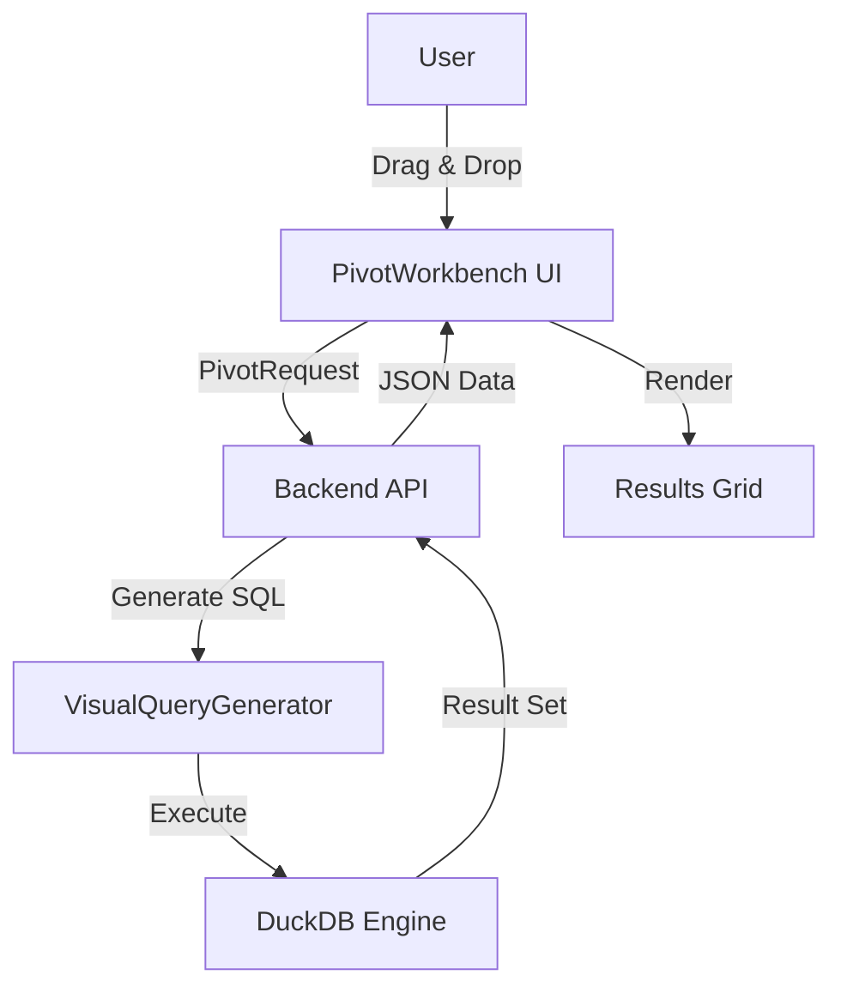

# Pivot Table Technical Design

## Architecture Overview
The feature will use a standard SPA + API architecture. The frontend provides a drag-and-drop workbench, while the backend utilizes DuckDB's powerful `PIVOT` capabilities to transform data.



## Backend Design
### 1. API Endpoint
**Endpoint**: `POST /api/query/visual-generation`
**Mode**: `VisualQueryMode.PIVOT`

**Request Model (`VisualQueryRequest`)**:
Re-use existing models but focus on `pivot_config`:
```python
class PivotConfig(BaseModel):
    rows: List[str]          # ["Region"]
    columns: List[str]       # ["Year"]
    values: List[PivotValue] # [{"column": "Sales", "aggregation": "SUM"}]
    # ... filters, sorting, etc.
```

### 2. SQL Generation (`visual_query_generator.py`)
**Current Legacy Logic**:
- Checks for `manual_column_values` (IN list).
- If missing, executes a "Limit N" query to sample values.
- Generates `PIVOT ... IN (...)` SQL.

**New Optimized Logic (Dynamic PIVOT)**:
- **Optimization**: Leverage DuckDB's `PIVOT` statement which supports dynamic column generation without an explicit `IN` list.
- **Statement**:
  ```sql
  PIVOT {table_name}
  ON {pivot_column}
  USING {agg_function}({value_column})
  GROUP BY {row_columns}
  ```
- **Fallback**: If multiple column dimensions or specific sorting is required, revert to `IN` list or multiple `PIVOT` steps if supported. For V1, we prioritize the standard single-column pivot or let DuckDB handle it.

**Implementation Plan**:
1.  Modify `_generate_pivot_transformation_sql` in `visual_query_generator.py`.
2.  If `manual_column_values` is empty, generate a dynamic PIVOT statement.
3.  Ensure `_autosample_native_in_values` is bypassed in this dynamic mode.

## Frontend Design
### 1. Component Architecture
- **Integration**:
  - Modify `src/QueryWorkbenchPage.tsx` to add `PivotWorkbench` as a peer to `QueryWorkspace`.
  - Controlled by a new tab/mode state in `QueryWorkbenchPage`.
- **Component Tree**:
  ```text
  PivotWorkbench (Context Provider: Table/Config state)
  ├── FieldsPanel (Left Sidebar)
  │   └── Uses `useTableColumns` hook to fetch fields
  ├── PivotConfigPanel (Top)
  │   ├── DropZone (Rows)
  │   ├── DropZone (Cols)
  │   └── DropZone (Values)
  └── PivotResultArea (Main)
      ├── Toolbar (Run, Export)
      └── PivotDataGrid (AG Grid wrapper)
  ```

### 2. State & Data Fetching (TanStack Query)
- **Hook**: `usePivotQuery(config: PivotConfig)`
- **Query Key**: `['pivot-query', { table, rows, cols, values, filters }]`
- **Config**:
  ```typescript
  useQuery({
    queryKey: [...],
    queryFn: () => api.generateVisualQuery(config),
    staleTime: 5 * 60 * 1000, // 5 mins
    gcTime: 10 * 60 * 1000,
    enabled: !!config.isValid()
  })
  ```
- **Cache Strategy**:
  - No auto-invalidation needed unless underlying table data changes.
  - Manual "Refresh" button calls `queryClient.invalidateQueries`.

### 3. Data Grid Implementation (AG Grid)
- **Configuration**:
  - **Theme**: `className="ag-theme-alpine-dark legacy"` (Strict requirement).
  - **Memoization**: All objects passed to grid (`defaultColDef`, `gridOptions`) MUST be wrapped in `useMemo` to verify referential stability.
- **Dynamic Columns**:
  - `columnDefs` are generated on-the-fly (`useEffect` or `useMemo`) based on the `VisualQueryResponse` metadata or data keys.
- **Virtualization**: AG Grid handles this natively; ensure container has explicit height.

### 4. Styling & i18n
- **Styling**: `className="flex flex-col h-full bg-background text-foreground"` (Tailwind only).
- **Internationalization**:
  ```typescript
  const { t } = useTranslation('common');
  // Usage: t('pivot.dropZone.rows')
  ```

## Security & Limits (Backend)
- **SQL Injection**: All table and column names will be sanitized/quoted using `_quote_identifier` in `visual_query_generator.py`.
- **Result Limits**:
  - **Rows**: Limit to 10,000 rows by default.
  - **Columns**: Dynamic pivot can generate many columns; Limit to 1,000 columns.
  - **Action**: Backend returns `warnings` if limit reached; Frontend displays non-blocking alert.
