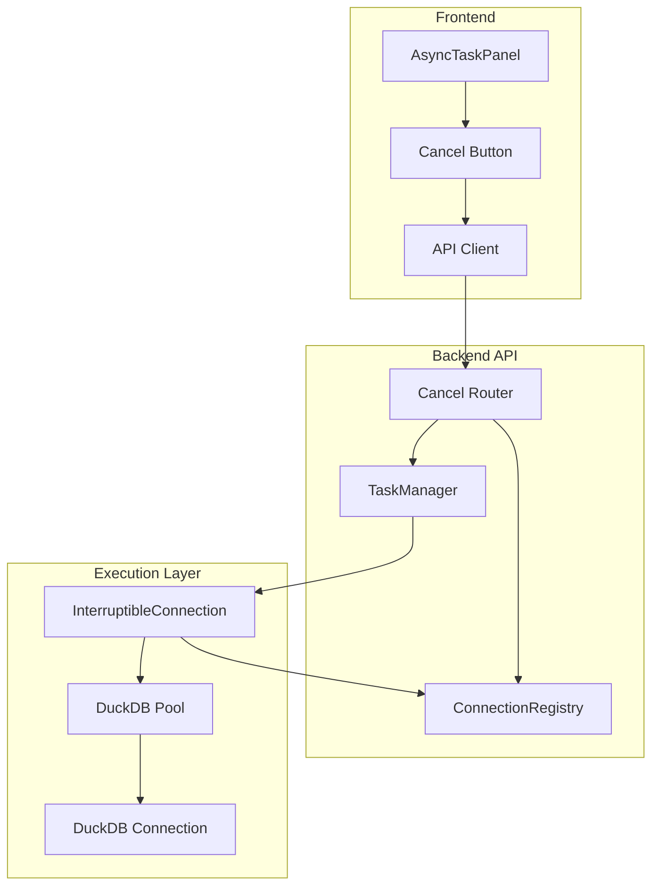
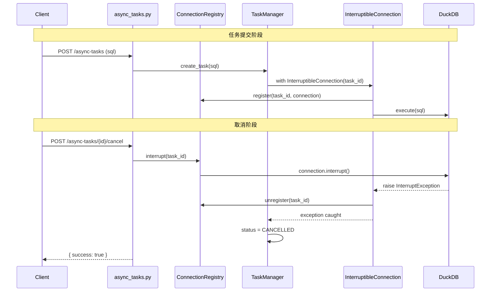

# 查询取消机制 - 设计文档

> **版本**: 1.3  
> **创建时间**: 2024-12-25  
> **更新时间**: 2024-12-25  
> **状态**: 🟢 设计完成，全部反馈已处理

---

## ✅ 审查反馈处理摘要

| 反馈 | 处理方式 |
|------|----------|
| 1. TaskStatus 命名对齐 | 保留 QUEUED/RUNNING/SUCCESS/FAILED/CANCELLING，仅新增 CANCELLED |
| 2. 实际执行链路 | 在 `execute_async_query` / `execute_async_federated_query` 中集成 |
| 3. 新旧取消逻辑协调 | 取消时设 CANCELLING + 调用 interrupt，完成后检查并标记 CANCELLED |
| 4. DuckDB 连接池改造 | 详细说明 discard_connection 实现和状态同步 |
| 5. 同步查询范围 | 明确短期不支持，仅异步任务可取消 |
| 6. 任务清理监控 | 添加后台巡检任务，处理 CANCELLING 超时 |
| 7. InterruptibleConnection 对接 | ✅ 改为纯函数型 wrapper，复用现有 get_connection |
| 8. 设计示例统一 | ✅ 统一使用 interruptible_connection 函数 |
| 9. discard 与 contextmanager | ✅ 明确处理连接池释放逻辑和状态同步 |

---

## 📐 架构设计

### 组件交互图



### 数据流



---

## 📁 文件变更清单

### 新增文件

| 文件路径 | 描述 |
|---------|------|
| `api/core/connection_registry.py` | 连接注册表模块，管理活跃查询与连接的映射 |
| `api/core/connection_registry_test.py` | 注册表单元测试 |

### 修改文件

| 文件路径 | 变更类型 | 描述 |
|---------|---------|------|
| `api/core/duckdb_pool.py` | **扩展** | 添加 `discard_connection()` 方法 + `InterruptibleConnection` 上下文管理器 |
| `api/core/task_manager.py` | **修改** | 新增 `CANCELLED` 状态 + 更新 status_mapping + 集成 interrupt 调用 |
| `api/routers/async_tasks.py` | **修改** | 在 `execute_async_query` / `execute_async_federated_query` 中使用 `InterruptibleConnection` |

---

## 🛡️ TaskStatus 命名对齐

> [!IMPORTANT]
> 保留现有枚举值，仅新增 `CANCELLED`，确保向后兼容

**现有枚举**（不变）：
```python
class TaskStatus(str, Enum):
    QUEUED = "queued"       # 排队中
    RUNNING = "running"     # 运行中
    SUCCESS = "success"     # 成功
    FAILED = "failed"       # 失败
    CANCELLING = "cancelling"  # 取消中（已有）
    CANCELLED = "cancelled"    # 已取消 ✅ 新增
```

**status_mapping 更新**（在 `AsyncTask.to_dict`）：
```python
status_mapping = {
    TaskStatus.QUEUED.value: "pending",
    TaskStatus.RUNNING.value: "running",
    TaskStatus.SUCCESS.value: "completed",
    TaskStatus.FAILED.value: "failed",
    TaskStatus.CANCELLING.value: "cancelling",
    TaskStatus.CANCELLED.value: "cancelled",  # 新增
}
```

**_coerce_status 更新**：
```python
if normalized == "cancelled":
    return TaskStatus.CANCELLED  # 新增
```

---

## 🔧 详细设计

### 1. ConnectionRegistry 模块

```python
# api/core/connection_registry.py

import threading
import time
from dataclasses import dataclass
from typing import Dict, Optional
import duckdb
import logging

logger = logging.getLogger(__name__)


@dataclass
class ConnectionRecord:
    """连接注册记录"""
    connection: duckdb.DuckDBPyConnection
    task_id: str
    thread_id: int
    start_time: float
    sql_preview: str  # 前 200 字符，用于调试
    

class ConnectionRegistry:
    """
    连接注册表 - 维护活跃查询与 DuckDB 连接的映射
    
    线程安全，支持注册、注销、中断操作
    """
    
    def __init__(self):
        self._registry: Dict[str, ConnectionRecord] = {}
        self._lock = threading.RLock()
    
    def register(
        self, 
        task_id: str, 
        connection: duckdb.DuckDBPyConnection,
        sql: str = ""
    ) -> None:
        """注册连接到注册表"""
        with self._lock:
            if task_id in self._registry:
                logger.warning(f"Task {task_id} already registered, overwriting")
            
            self._registry[task_id] = ConnectionRecord(
                connection=connection,
                task_id=task_id,
                thread_id=threading.current_thread().ident,
                start_time=time.time(),
                sql_preview=sql[:200] if sql else ""
            )
            logger.info(f"Registered connection for task {task_id}")
    
    def unregister(self, task_id: str) -> bool:
        """从注册表移除连接"""
        with self._lock:
            if task_id in self._registry:
                del self._registry[task_id]
                logger.info(f"Unregistered connection for task {task_id}")
                return True
            return False
    
    def get(self, task_id: str) -> Optional[ConnectionRecord]:
        """获取连接记录"""
        with self._lock:
            return self._registry.get(task_id)
    
    def interrupt(self, task_id: str) -> bool:
        """
        中断指定任务的查询
        
        Returns:
            True 如果成功调用 interrupt()
            False 如果任务不存在
        """
        with self._lock:
            record = self._registry.get(task_id)
            if not record:
                logger.warning(f"Cannot interrupt task {task_id}: not found in registry")
                return False
            
            try:
                record.connection.interrupt()
                logger.info(f"Interrupted task {task_id}")
                return True
            except Exception as e:
                logger.error(f"Failed to interrupt task {task_id}: {e}")
                raise
    
    def cleanup_stale(
        self, 
        max_age_seconds: float = 1800,
        ignore_suffix: Optional[str] = None
    ) -> int:
        """
        清理超时的注册条目
        
        Args:
            max_age_seconds: 超过此时长的条目会被清理
            ignore_suffix: 忽略以此后缀结尾的 task_id（如 "_cleanup"）
        """
        with self._lock:
            now = time.time()
            stale_ids = [
                task_id for task_id, record in self._registry.items()
                if now - record.start_time > max_age_seconds
                and (ignore_suffix is None or not task_id.endswith(ignore_suffix))
            ]
            for task_id in stale_ids:
                logger.warning(f"Cleaning up stale registry entry: {task_id}")
                del self._registry[task_id]
            return len(stale_ids)
    
    def get_active_count(self) -> int:
        """获取活跃连接数量"""
        with self._lock:
            return len(self._registry)
    
    def get_all_tasks(self) -> Dict[str, dict]:
        """获取所有注册任务的信息（用于调试）"""
        with self._lock:
            return {
                task_id: {
                    "thread_id": record.thread_id,
                    "start_time": record.start_time,
                    "sql_preview": record.sql_preview,
                    "duration": time.time() - record.start_time
                }
                for task_id, record in self._registry.items()
            }


# 单例实例
connection_registry = ConnectionRegistry()
```

### 2. interruptible_connection 函数型包装器

> [!IMPORTANT]
> ✅ 使用纯函数型 wrapper，复用现有 `get_connection()` 的事务/释放逻辑

```python
# api/core/duckdb_pool.py - 新增函数

from contextlib import contextmanager
import duckdb
import logging

logger = logging.getLogger(__name__)


@contextmanager
def interruptible_connection(task_id: str, sql: str = ""):
    """
    可中断的连接上下文管理器
    
    复用现有 get_connection() 的事务/释放逻辑，同时支持中断
    
    使用方式:
        with interruptible_connection(task_id, sql) as conn:
            conn.execute(sql)
    """
    from core.connection_registry import connection_registry
    
    pool = get_connection_pool()
    
    with pool.get_connection() as conn:
        # 注册到注册表
        connection_registry.register(task_id, conn, sql[:200])
        
        try:
            yield conn
        except duckdb.InterruptException:
            # 中断后销毁连接，避免被重新归还
            pool.discard_connection(conn)
            logger.info(f"Task {task_id} was interrupted, connection discarded")
            raise  # 重新抛出，让上层处理
        finally:
            # 无论成功/失败/取消，都注销注册表
            connection_registry.unregister(task_id)
```

**关键设计说明**：

1. **复用现有 contextmanager**：嵌套在 `with pool.get_connection() as conn:` 内，复用现有事务和释放逻辑
2. **中断时销毁连接**：捕获 `InterruptException` 后立即调用 `discard_connection`
3. **避免重复归还**：`discard_connection` 会从池中移除连接，后续 `get_connection.__exit__` 找不到该连接不会重复归还
4. **注册表清理在 finally**：确保任何情况下都注销

> [!NOTE]
> **开发注意事项**：外部数据源流程也需套用 `interruptible_connection`，确保所有 DuckDB 执行语句在该 context 内

---

### 3. DuckDB 连接池 discard_connection 详细设计

> [!IMPORTANT]
> 需要修改现有 `get_connection` 以配合 discard 逻辑

**文件**: `api/core/duckdb_pool.py`

```python
class DuckDBConnectionPool:
    # ... 现有代码 ...
    
    def discard_connection(self, connection: duckdb.DuckDBPyConnection) -> bool:
        """
        销毁连接（中断后使用，不归还池中）
        
        线程安全：使用 RLock 保护
        """
        with self._lock:
            # 查找连接 ID
            conn_id = None
            for cid, pooled_conn in self._connections.items():
                if pooled_conn.connection is connection:
                    conn_id = cid
                    break
            
            if conn_id is None:
                # 连接已不在池中，可能已被其他逻辑处理
                logger.warning("要销毁的连接不在池中")
                return False
            
            # 关闭并从池中移除
            try:
                connection.close()
            except Exception as e:
                logger.warning(f"关闭连接失败: {e}")
            
            del self._connections[conn_id]
            self._total_closed += 1
            logger.info(f"销毁连接 {conn_id}, 当前连接数: {len(self._connections)}")
            
            # 触发补充连接（如果低于最小连接数）
            if len(self._connections) < self.min_connections:
                self._create_connection()
            
            # 通知等待的线程
            with self._condition:
                self._condition.notify()
            
            return True
    
    @contextmanager
    def get_connection(self):
        """... 现有代码 ..."""
        conn_id = None
        try:
            conn_id = self._acquire_connection()
            if conn_id is None:
                raise RuntimeError("无法获取数据库连接")

            connection = self._connections[conn_id].connection
            yield connection

        except Exception as e:
            if conn_id:
                # ✅ 检查连接是否仍在池中（可能已被 discard）
                if conn_id in self._connections:
                    try:
                        self._connections[conn_id].connection.execute("ROLLBACK")
                    except Exception:
                        pass
                    self._mark_connection_error(conn_id, str(e))
            raise
        finally:
            if conn_id:
                # ✅ 检查连接是否仍在池中
                if conn_id in self._connections:
                    try:
                        self._connections[conn_id].connection.execute("COMMIT")
                    except Exception:
                        pass
                    self._release_connection(conn_id)
                else:
                    logger.debug(f"连接 {conn_id} 已被销毁，跳过释放")
```

**关键改动**：
- 在 `get_connection.__exit__` 中检查 `conn_id in self._connections`
- 如果连接已被 `discard_connection` 移除，则跳过释放逻辑
- 避免中断后连接被重新归还

---

### 4. 实际执行链路集成（统一写法）

> [!IMPORTANT]
> ✅ 统一使用 `interruptible_connection` 函数，避免内联注册/注销

**目标文件**: `api/routers/async_tasks.py`

```python
from core.duckdb_pool import interruptible_connection
import duckdb

def execute_async_query(
    task_id: str,
    sql: str,
    custom_table_name: Optional[str] = None,
    task_type: str = "query",
    datasource: Optional[Dict[str, Any]] = None,
):
    try:
        # 第一步：标记任务为运行中
        if not task_manager.start_task(task_id):
            return

        # 取消检查点 1（保留旧逻辑兆底）
        if task_manager.is_cancellation_requested(task_id):
            task_manager.mark_cancelled(task_id, "用户取消")
            return

        # ⚠️ 第二步：变量准备（必须在 with 之前，确保作用域正确）
        clean_sql = remove_auto_added_limit(sql)
        table_name = custom_table_name or task_utils.task_id_to_table_name(task_id)

        # ✅ 第三步：使用 interruptible_connection 执行查询
        with interruptible_connection(task_id, clean_sql) as con:
            create_sql = f'CREATE OR REPLACE TABLE "{table_name}" AS ({clean_sql})'
            con.execute(create_sql)
            
            # 获取元数据
            metadata_snapshot = build_table_metadata_snapshot(con, table_name)
            # ...(现有逻辑)
        
        # 取消检查点 2：查询完成后检查（保留旧逻辑）
        if task_manager.is_cancellation_requested(task_id):
            with interruptible_connection(task_id + "_cleanup", "") as con:
                con.execute(f'DROP TABLE IF EXISTS "{table_name}"')
            task_manager.mark_cancelled(task_id, "用户取消")
            return

        # 第三步：标记成功
        task_manager.complete_task(task_id, task_info)

    except duckdb.InterruptException:
        # ✅ 捕获中断异常，标记为 CANCELLED
        logger.info(f"任务被中断: {task_id}")
        task_manager.mark_cancelled(task_id, "用户取消")
        
    except Exception as e:
        # 检查是否因取消而异常
        if task_manager.is_cancellation_requested(task_id):
            task_manager.mark_cancelled(task_id, "用户取消")
        else:
            task_manager.fail_task(task_id, str(e))
```

**execute_async_federated_query 同理替换**：所有 DuckDB 执行语句（包括 ATTACH/DETACH）都应在 `with interruptible_connection(...)` 内。

---

### 5. 新旧取消逻辑协调

> [!IMPORTANT]
> 协调现有轮询式取消检查与新的实时 interrupt()

**取消请求流程** (`task_manager.request_cancellation` 修改)：

```python
def request_cancellation(self, task_id: str, reason: str = "用户手动取消") -> bool:
    """
    请求取消任务（设置取消标志 + 实时中断）
    """
    # 步骤 1: 设置 CANCELLING 状态（供旧逻辑兆底）
    with with_system_connection() as connection:
        rows = connection.execute(
            f"""
            UPDATE {ASYNC_TASKS_TABLE}
            SET status = ?
            WHERE task_id = ? AND status IN (?, ?)
            RETURNING task_id
            """,
            [
                TaskStatus.CANCELLING.value,
                task_id,
                TaskStatus.QUEUED.value,
                TaskStatus.RUNNING.value,
            ],
        ).fetchall()

    if not rows:
        return False

    # ✅ 步骤 2: 尝试实时中断连接
    try:
        from core.connection_registry import connection_registry
        interrupted = connection_registry.interrupt(task_id)
        if interrupted:
            logger.info(f"已发送中断信号: {task_id}")
    except Exception as e:
        logger.warning(f"中断失败，依赖轮询检查: {task_id}, {e}")

    return True
```

**取消完成标记** (`task_manager.mark_cancelled` 新增)：

```python
def mark_cancelled(self, task_id: str, reason: str) -> bool:
    """标记任务为已取消"""
    with with_system_connection() as connection:
        completed_at = get_storage_time()
        rows = connection.execute(
            f"""
            UPDATE {ASYNC_TASKS_TABLE}
            SET status = ?, error_message = ?, completed_at = ?
            WHERE task_id = ?
            RETURNING task_id
            """,
            [
                TaskStatus.CANCELLED.value,
                reason,
                completed_at,
                task_id,
            ],
        ).fetchall()
    return bool(rows)
```

---

### 6. DuckDB 连接池改造 (discard_connection)

**文件**: `api/core/duckdb_pool.py`

```python
class DuckDBConnectionPool:
    # ... 现有代码 ...
    
    def discard_connection(self, connection: duckdb.DuckDBPyConnection) -> bool:
        """
        销毁连接（中断后使用，不归还池中）
        
        线程安全：使用 RLock 保护
        
        Args:
            connection: 要销毁的连接
            
        Returns:
            True 如果成功销毁
        """
        with self._lock:
            # 查找连接 ID
            conn_id = None
            for cid, pooled_conn in self._connections.items():
                if pooled_conn.connection is connection:
                    conn_id = cid
                    break
            
            if conn_id is None:
                logger.warning("要销毁的连接不在池中")
                return False
            
            # 关闭并从池中移除
            try:
                connection.close()
            except Exception as e:
                logger.warning(f"关闭连接失败: {e}")
            
            del self._connections[conn_id]
            self._total_closed += 1
            logger.info(f"销毁连接 {conn_id}, 当前连接数: {len(self._connections)}")
            
            # 触发补充连接（如果低于最小连接数）
            if len(self._connections) < self.min_connections:
                self._create_connection()
            
            # 通知等待的线程
            with self._condition:
                self._condition.notify()
            
            return True
```

> [!NOTE]
> **实施说明**: 业务层统一使用 `interruptible_connection` 函数，不需要手动调用 `discard_connection`。该方法仅供 `interruptible_connection` 内部使用。

---

### 7. 同步查询范围

> [!CAUTION]
> **短期不支持同步查询取消**

**原因**：
1. 同步查询无任务 ID，无法通过 API 取消
2. 需要为每个请求生成唯一 token 并传递给前端
3. 复杂度较高，收益不明显（同步查询通常较快）

**后续可能方案**（P2）：
- 为同步查询生成 request-scoped token
- 前端通过 WebSocket 或 token 取消
- 同步查询超时自动取消（配置化）

**本次范围**：仅异步任务可取消

---

### 8. 后台巡检任务

**目标**：处理 CANCELLING 状态滞留、注册表泄露

```python
# api/core/task_manager.py - 新增

# ✅ 模块级单例控制，防止多次初始化启动多个线程
_watchdog_started = False
_watchdog_lock = threading.Lock()


def start_cancellation_watchdog(interval_seconds: int = 60):
    """启动取消监控守护线程（单例）"""
    global _watchdog_started
    
    with _watchdog_lock:
        if _watchdog_started:
            logger.debug("取消监控守护线程已在运行，跳过重复启动")
            return
        
        _watchdog_started = True
    
    def watchdog_loop():
        while True:
            try:
                time.sleep(interval_seconds)
                cleanup_cancelling_timeout()
                cleanup_stale_registry()
            except Exception as e:
                logger.error(f"取消监控异常: {e}")
    
    thread = threading.Thread(target=watchdog_loop, daemon=True)
    thread.start()
    logger.info("取消监控守护线程已启动")


def cleanup_cancelling_timeout(timeout_seconds: int = 30):
    """清理超时的 CANCELLING 任务"""
    with with_system_connection() as connection:
        cutoff = get_storage_time() - timedelta(seconds=timeout_seconds)
        rows = connection.execute(
            f"""
            UPDATE {ASYNC_TASKS_TABLE}
            SET status = ?, error_message = ?, completed_at = ?
            WHERE status = ? AND started_at < ?
            RETURNING task_id
            """,
            [
                TaskStatus.CANCELLED.value,
                "取消超时，强制标记",
                get_storage_time(),
                TaskStatus.CANCELLING.value,
                cutoff,
            ],
        ).fetchall()
    
    if rows:
        logger.info(f"清理超时 CANCELLING 任务: {[r[0] for r in rows]}")
    return len(rows)


def cleanup_stale_registry():
    """清理注册表中的残留条目"""
    from core.connection_registry import connection_registry
    # ✅ 实施时徵略 _cleanup 后缀的临时任务（cleanup 操作很快，不应被清理）
    count = connection_registry.cleanup_stale(
        max_age_seconds=1800,
        ignore_suffix="_cleanup"  # 实施时添加此参数支持
    )
    if count:
        logger.info(f"清理注册表残留条目: {count}")
```

**在 TaskManager 初始化时启动**：

```python
class TaskManager:
    def __init__(self):
        self._lock = Lock()
        self._ensure_tables()
        start_cancellation_watchdog()  # 单例控制，多次调用不会重复启动
        logger.info("异步任务管理器初始化完成")
```

---

## 🧪 测试策略

### 单元测试

| 测试文件 | 测试内容 |
|---------|---------|
| `connection_registry_test.py` | register/unregister/interrupt 基础功能 |
| `connection_registry_test.py` | 线程安全测试 |
| `connection_registry_test.py` | cleanup_stale 清理测试 |

### 集成测试

| 场景 | 预期结果 |
|------|---------|
| 正常执行完成 | 注册表条目被清理 |
| 执行中取消 | 任务状态变为 CANCELLED |
| 取消已完成任务 | 返回错误 |
| 取消不存在任务 | 返回 404 |
| 取消后表清理 | 启动长查询写表 → 中途取消 → 表被 DROP 且状态为 CANCELLED |
| 注册表忽略 `_cleanup` 后缀 | `cleanup_stale(ignore_suffix="_cleanup")` 不误删临时任务 |

### 手动测试

1. 启动长时间查询（如 `SELECT pg_sleep(30)` 等价操作）
2. 调用取消 API
3. 观察任务状态变化和资源释放

---

## ⚠️ 关键注意事项

### DuckDB 中断异常类型

需要预先测试确认 DuckDB Python 中断时抛出的异常类型：

```python
# 测试代码
import duckdb
import threading
import time

conn = duckdb.connect()

def run_query():
    try:
        conn.execute("SELECT * FROM generate_series(1, 1000000000)")
    except Exception as e:
        print(f"Exception type: {type(e).__name__}")
        print(f"Exception message: {e}")

thread = threading.Thread(target=run_query)
thread.start()
time.sleep(1)
conn.interrupt()
thread.join()
```

### 连接复用策略

中断后的连接建议**销毁而非复用**，原因：
1. 连接内部状态可能不确定
2. 可能存在未完成的事务
3. 保守策略更安全

### 超时机制

CANCELLING 状态应有超时保护：
- 5 秒后若仍为 CANCELLING，强制改为 CANCELLED
- 可通过后台定时任务实现

---

## 📅 实现计划

| 阶段 | 任务 | 预估工时 |
|------|------|---------|
| Phase 1 | ConnectionRegistry 模块 | 3h |
| Phase 2 | InterruptibleConnection | 2h |
| Phase 3 | TaskManager 集成 | 3h |
| Phase 4 | Cancel API 路由 | 2h |
| Phase 5 | 单元测试 | 2h |
| Phase 6 | 集成测试 | 2h |
| Phase 7 | 文档更新 | 1h |
| **Total** | | **15h** |

---

## 12. 取消 API 响应示例（含 timestamp）

### 成功（保持 499 或 200 fallback 均返回规范体）
```json
{
  "success": true,
  "data": { "request_id": "xxx" },
  "messageCode": "QUERY_CANCELLED",
  "message": "取消请求已提交",
  "timestamp": "2024-12-25T00:00:00Z"
}
```

### 不存在/已完成 (404)
```json
{
  "success": false,
  "error": {
    "code": "QUERY_NOT_FOUND",
    "message": "Query not found or already completed",
    "details": {}
  },
  "messageCode": "QUERY_NOT_FOUND",
  "message": "Query not found or already completed",
  "timestamp": "2024-12-25T00:00:00Z"
}
```

> 现有查询端点保持原样返回格式，前端通过 499 或 messageCode/cancelled 字段兼容判断；若网关不支持 499，可使用 200 + success:false 的 fallback，但响应体需保持上述字段。
