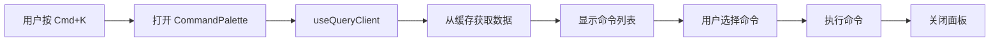

# CMDK 命令面板设计文档

## 一、概述

### 1.1 目标
在 Week 6 集成 CMDK 命令面板，提供快速访问功能的能力。

### 1.2 为什么在 Week 6？
- ✅ 此时 TypeScript 已配置完成
- ✅ 此时 TanStack Query 已配置完成
- ✅ 此时所有数据已在 Query 缓存中
- ✅ 命令面板可以直接访问缓存数据，无需额外请求

## 二、架构设计

### 2.1 组件结构

```
frontend/src/new/
├── components/
│   └── ui/
│       └── command.tsx          # shadcn/ui command 组件（基于 cmdk）
│
├── CommandPalette.tsx           # 命令面板主组件
│
└── hooks/
    └── useCommandPalette.ts     # 命令面板逻辑 hook
```

### 2.2 数据流



**关键优势**：
- ✅ 无需额外 API 请求
- ✅ 数据来自 TanStack Query 缓存
- ✅ 实时反映最新状态

## 三、组件设计

### 3.1 Command 组件（shadcn/ui）

**command.tsx**：
```typescript
import * as React from "react";
import { Command as CommandPrimitive } from "cmdk";
import { cn } from "@/lib/utils";

const Command = React.forwardRef<
  React.ElementRef<typeof CommandPrimitive>,
  React.ComponentPropsWithoutRef<typeof CommandPrimitive>
>(({ className, ...props }, ref) => (
  <CommandPrimitive
    ref={ref}
    className={cn(
      "flex h-full w-full flex-col overflow-hidden rounded-md bg-surface text-foreground",
      className
    )}
    {...props}
  />
));
Command.displayName = CommandPrimitive.displayName;

const CommandInput = React.forwardRef<
  React.ElementRef<typeof CommandPrimitive.Input>,
  React.ComponentPropsWithoutRef<typeof CommandPrimitive.Input>
>(({ className, ...props }, ref) => (
  <CommandPrimitive.Input
    ref={ref}
    className={cn(
      "flex h-11 w-full rounded-md bg-transparent py-3 text-sm outline-none placeholder:text-muted-foreground disabled:cursor-not-allowed disabled:opacity-50",
      className
    )}
    {...props}
  />
));
CommandInput.displayName = CommandPrimitive.Input.displayName;

// ... 其他子组件（CommandList, CommandEmpty, CommandGroup, CommandItem, CommandSeparator）

export {
  Command,
  CommandInput,
  CommandList,
  CommandEmpty,
  CommandGroup,
  CommandItem,
  CommandSeparator,
};
```

### 3.2 CommandPalette 组件

**CommandPalette.tsx**：
```typescript
import { useEffect, useState } from 'react';
import { useQueryClient } from '@tanstack/react-query';
import { useNavigate } from 'react-router-dom';
import {
  Command,
  CommandInput,
  CommandList,
  CommandEmpty,
  CommandGroup,
  CommandItem,
  CommandSeparator,
} from '@/new/components/ui/command';
import { Dialog, DialogContent } from '@/new/components/ui/dialog';
import { Database, Table, Search, Moon, Sun, Globe } from 'lucide-react';

interface Table {
  name: string;
  type: string;
  row_count: number;
}

interface CommandPaletteProps {
  open: boolean;
  onOpenChange: (open: boolean) => void;
}

export function CommandPalette({ open, onOpenChange }: CommandPaletteProps) {
  const queryClient = useQueryClient();
  const navigate = useNavigate();
  const [search, setSearch] = useState('');

  // 从 TanStack Query 缓存获取数据
  const tables = queryClient.getQueryData<Table[]>(['tables']) || [];
  const connections = queryClient.getQueryData<any[]>(['connections']) || [];

  // 过滤表
  const filteredTables = tables.filter(table =>
    table.name.toLowerCase().includes(search.toLowerCase())
  );

  // 命令执行
  const executeCommand = (command: string, args?: any) => {
    switch (command) {
      case 'search-table':
        navigate(`/query?table=${args.tableName}`);
        break;
      case 'switch-connection':
        // 切换连接逻辑
        break;
      case 'toggle-theme':
        // 切换主题逻辑
        break;
      case 'toggle-language':
        // 切换语言逻辑
        break;
    }
    onOpenChange(false);
  };

  return (
    <Dialog open={open} onOpenChange={onOpenChange}>
      <DialogContent className="overflow-hidden p-0 shadow-2xl">
        <Command className="[&_[cmdk-group-heading]]:px-2 [&_[cmdk-group-heading]]:font-medium [&_[cmdk-group-heading]]:text-muted-foreground">
          <CommandInput
            placeholder="搜索表、命令..."
            value={search}
            onValueChange={setSearch}
          />
          <CommandList>
            <CommandEmpty>未找到结果</CommandEmpty>
            
            {/* 表搜索 */}
            {filteredTables.length > 0 && (
              <CommandGroup heading="表">
                {filteredTables.slice(0, 5).map((table) => (
                  <CommandItem
                    key={table.name}
                    onSelect={() => executeCommand('search-table', { tableName: table.name })}
                  >
                    <Table className="mr-2 h-4 w-4" />
                    <span>{table.name}</span>
                    <span className="ml-auto text-xs text-muted-foreground">
                      {table.row_count} 行
                    </span>
                  </CommandItem>
                ))}
              </CommandGroup>
            )}

            <CommandSeparator />

            {/* 快捷操作 */}
            <CommandGroup heading="操作">
              <CommandItem onSelect={() => executeCommand('toggle-theme')}>
                <Moon className="mr-2 h-4 w-4" />
                <span>切换主题</span>
              </CommandItem>
              <CommandItem onSelect={() => executeCommand('toggle-language')}>
                <Globe className="mr-2 h-4 w-4" />
                <span>切换语言</span>
              </CommandItem>
            </CommandGroup>

            {/* 连接切换 */}
            {connections.length > 0 && (
              <>
                <CommandSeparator />
                <CommandGroup heading="连接">
                  {connections.map((conn) => (
                    <CommandItem
                      key={conn.id}
                      onSelect={() => executeCommand('switch-connection', { connectionId: conn.id })}
                    >
                      <Database className="mr-2 h-4 w-4" />
                      <span>{conn.name}</span>
                    </CommandItem>
                  ))}
                </CommandGroup>
              </>
            )}
          </CommandList>
        </Command>
      </DialogContent>
    </Dialog>
  );
}
```

### 3.3 useCommandPalette Hook

**hooks/useCommandPalette.ts**：
```typescript
import { useEffect, useState } from 'react';

export function useCommandPalette() {
  const [open, setOpen] = useState(false);

  useEffect(() => {
    const down = (e: KeyboardEvent) => {
      if (e.key === 'k' && (e.metaKey || e.ctrlKey)) {
        e.preventDefault();
        setOpen((open) => !open);
      }
    };

    document.addEventListener('keydown', down);
    return () => document.removeEventListener('keydown', down);
  }, []);

  return { open, setOpen };
}
```

### 3.4 集成到 PageShell

**PageShell.tsx**：
```typescript
import { QueryProvider } from '@/new/providers/QueryProvider';
import { CommandPalette } from '@/new/CommandPalette';
import { useCommandPalette } from '@/new/hooks/useCommandPalette';

export function PageShell({ children }: PageShellProps) {
  const { open, setOpen } = useCommandPalette();

  return (
    <QueryProvider>
      <div className="dq-new-theme">
        {children}
        <CommandPalette open={open} onOpenChange={setOpen} />
      </div>
    </QueryProvider>
  );
}
```

## 四、功能设计

### 4.1 支持的命令

#### 4.1.1 表搜索
- **触发**：输入表名
- **数据来源**：`queryClient.getQueryData(['tables'])`
- **操作**：导航到查询页面并预填表名

#### 4.1.2 连接切换
- **触发**：选择连接
- **数据来源**：`queryClient.getQueryData(['connections'])`
- **操作**：切换当前连接

#### 4.1.3 主题切换
- **触发**：选择"切换主题"
- **操作**：在浅色/深色模式间切换

#### 4.1.4 语言切换
- **触发**：选择"切换语言"
- **操作**：在中文/英文间切换

### 4.2 快捷键

| 快捷键 | 操作 |
|--------|------|
| `Cmd+K` / `Ctrl+K` | 打开/关闭命令面板 |
| `↑` / `↓` | 导航命令列表 |
| `Enter` | 执行选中的命令 |
| `Esc` | 关闭命令面板 |

## 五、实施计划

### 5.1 Week 6 Day 1: 安装和配置

```bash
# 1. 安装 cmdk
npm install cmdk

# 2. 创建 command.tsx 组件
# 使用 shadcn/ui 官方模板

# 3. 创建 CommandPalette.tsx
# 实现基础结构
```

### 5.2 Week 6 Day 2: 实现功能

```bash
# 1. 实现表搜索
# 2. 实现连接切换
# 3. 实现主题切换
# 4. 实现语言切换
# 5. 集成到 PageShell
# 6. 测试所有功能
```

## 六、测试计划

### 6.1 功能测试
- [ ] Cmd+K / Ctrl+K 打开命令面板
- [ ] 搜索表名正确过滤
- [ ] 选择表正确导航
- [ ] 切换连接正确执行
- [ ] 切换主题正确执行
- [ ] 切换语言正确执行
- [ ] Esc 关闭命令面板

### 6.2 性能测试
- [ ] 打开命令面板 < 50ms
- [ ] 搜索响应 < 100ms
- [ ] 命令执行 < 50ms

### 6.3 可访问性测试
- [ ] 键盘导航正常
- [ ] 屏幕阅读器支持
- [ ] Focus 管理正确

## 七、优势总结

### 7.1 为什么在 Week 6？
- ✅ TypeScript 已配置，命令面板有完整类型支持
- ✅ TanStack Query 已配置，数据来自缓存，无需额外请求
- ✅ 所有组件已迁移，命令面板可以访问完整功能
- ✅ 用户已熟悉新布局，命令面板是锦上添花

### 7.2 技术优势
- ✅ 数据来自 TanStack Query 缓存，实时且高效
- ✅ TypeScript 类型安全，减少运行时错误
- ✅ 基于 shadcn/ui，样式统一
- ✅ 基于 cmdk，性能优秀

### 7.3 用户体验优势
- ✅ 快速访问任何功能
- ✅ 键盘优先的交互
- ✅ 智能搜索和过滤
- ✅ 统一的操作入口
