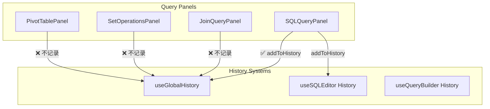
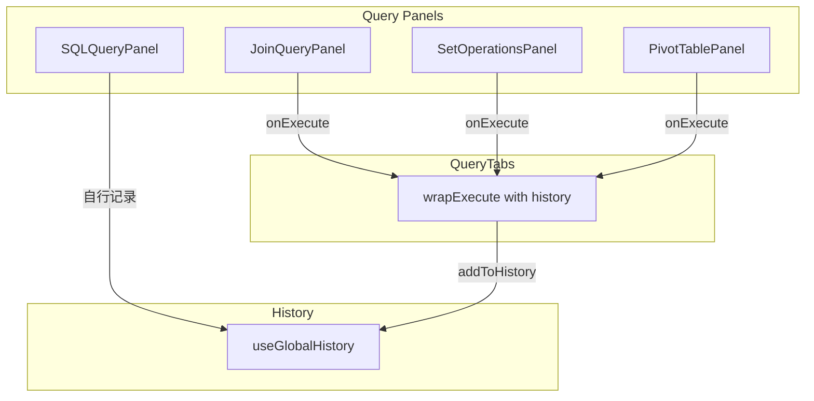

# 统一查询历史记录 - 设计文档

> **版本**: 1.0  
> **创建时间**: 2024-12-29  
> **状态**: 🟡 待审查

---

## 📐 架构设计

### 当前状态



### 目标状态



---

## 📁 文件变更清单

### 修改文件

| 文件路径 | 变更类型 | 描述 |
|---------|---------|------|
| `frontend/src/new/Query/QueryTabs/index.tsx` | **修改** | 添加 `wrapExecute` 包装函数，为非 SQL 面板自动记录历史 |

---

## 🔧 详细设计

### wrapExecute 包装函数

在 `QueryTabs` 组件中创建包装函数，自动记录历史：

```typescript
// frontend/src/new/Query/QueryTabs/index.tsx

const { addToHistory } = useGlobalHistory();

// 创建包装后的执行函数
const createWrappedExecute = React.useCallback(
  (type: 'join' | 'set' | 'pivot') => {
    return async (sql: string, source?: TableSource) => {
      const startTime = Date.now();
      try {
        await onExecute(sql, source);
        addToHistory({
          type,
          sql,
          executionTime: Date.now() - startTime,
        });
      } catch (err) {
        addToHistory({
          type,
          sql,
          error: (err as Error)?.message || String(err),
        });
        throw err; // 重新抛出，让 Panel 处理错误 UI
      }
    };
  },
  [onExecute, addToHistory]
);

// 为各面板创建特定的执行函数
const handleJoinExecute = React.useMemo(
  () => createWrappedExecute('join'),
  [createWrappedExecute]
);
const handleSetExecute = React.useMemo(
  () => createWrappedExecute('set'),
  [createWrappedExecute]
);
const handlePivotExecute = React.useMemo(
  () => createWrappedExecute('pivot'),
  [createWrappedExecute]
);
```

### 组件使用

```tsx
{/* SQL 面板保持原样，因为它自己记录历史 */}
<SQLQueryPanel onExecute={onExecute} ... />

{/* 其他面板使用包装后的执行函数 */}
<JoinQueryPanel onExecute={handleJoinExecute} ... />
<SetOperationsPanel onExecute={handleSetExecute} ... />
<PivotTablePanel onExecute={handlePivotExecute} ... />
```

---

## ⚠️ 关键注意事项

### SQLQueryPanel 不重复记录

`SQLQueryPanel` 已在内部调用 `addToHistory`（参见 [SQLQueryPanel.tsx:355-368](file:///Users/keliang/mypy/duckdb-query/frontend/src/new/Query/SQLQuery/SQLQueryPanel.tsx#L355-L368)），因此在 `QueryTabs` 层不再为其包装执行函数，避免重复记录。

### 错误处理

包装函数捕获错误后：
1. 记录带 `error` 字段的历史条目
2. 重新抛出错误，确保子面板能正确显示错误状态

### VisualQuery 面板

当前 VisualQuery 面板已隐藏（注释掉），暂不需要处理。如果后续启用，需同样添加历史记录。

---

## 🧪 验证计划

### 手动测试

1. 从 JOIN 面板执行查询，打开历史面板确认记录存在且 type 为 "join"
2. 从集合操作面板执行查询，确认记录存在且 type 为 "set"
3. 从透视表面板执行查询，确认记录存在且 type 为 "pivot"
4. 从 SQL 面板执行查询，确认仅有一条记录（无重复）
5. 故意触发错误（如语法错误），确认错误查询也被记录
