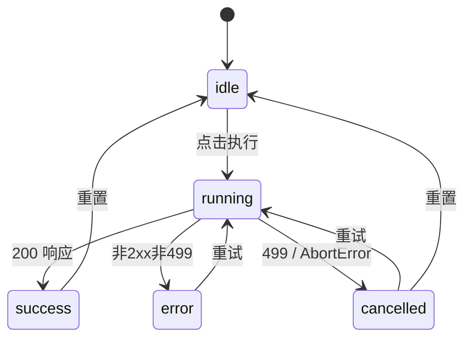

# 通用查询取消机制 - 技术设计

> **版本**: 1.2  
> **创建时间**: 2024-12-25  
> **更新时间**: 2024-12-25  
> **状态**: 🟢 设计完成

---

## 0. 审查反馈处理

| # | 反馈 | 处理方式 |
|---|------|----------|
| 1 | 标识符命名空间冲突 | 同步查询使用 `sync:` 前缀 |
| 2 | 占位符注册描述 | 明确：中间件只传播 request_id，register 在连接上下文中 |
| 3 | 重复的包装器 | 复用 `interruptible_connection` |
| 4 | 清理与守护 | 同步查询纳入现有 watchdog 清理范围 |
| 5 | 状态码处理 | 前端增加 `!response.ok` 兜底处理 |
| 6 | 多条 SQL 端点 | 所有子查询在同一个 with 上下文内 |
| 7 | 端点覆盖完整性 | 明确列出"仅覆盖指定端点" |
| 8 | 前端并发场景 | 明确"单面板单查询"假设 |
| 9 | 前后端一致性 | 保持现有设计，499 不触发 error 分支 |
| 10 | 联邦 ATTACH/DETACH | 确保在同一上下文中 |

---

## 1. 前端交互规范

### 1.1 状态机



| 状态 | UI 表现 | 按钮状态 |
|------|---------|---------|
| `idle` | 空白/上次结果 | 执行✅ 取消❌ |
| `running` | Spinner + "运行中..." | 执行🚫 取消✅ |
| `success` | 结果表格 | 执行✅ 取消❌ |
| `error` | 红色错误提示 + 重试 | 执行✅ 取消❌ |
| `cancelled` | 黄色提示"已取消" + 重试 | 执行✅ 取消❌ |

### 1.2 按钮与布局

```tsx
// 执行区域布局
<div className="flex items-center gap-2">
  {status === 'running' ? (
    <>
      <Button variant="destructive" onClick={cancel} disabled={cancelPending}>
        <X className="h-4 w-4 mr-1" />
        取消
      </Button>
      <span className="flex items-center text-muted-foreground">
        <Loader2 className="h-4 w-4 mr-2 animate-spin" />
        运行中...
      </span>
    </>
  ) : (
    <Button onClick={execute} disabled={status === 'running'}>
      <Play className="h-4 w-4 mr-1" />
      执行
    </Button>
  )}
</div>
```

### 1.3 结果区域显示

| 状态 | 显示内容 |
|------|---------|
| `success` | 结果表格 |
| `error` | 错误描述 + 重试按钮 |
| `cancelled` | "查询已取消" + 重试按钮 |
| `idle` | 可选：保留上次成功结果 (`lastSuccessData`) |

### 1.4 国际化 Key

```json
{
  "query.run": "执行",
  "query.cancel": "取消",
  "query.running": "运行中...",
  "query.cancelled": "查询已取消",
  "query.cancelFailed": "取消请求发送失败，已本地中止",
  "query.error": "查询失败",
  "query.retry": "重试",
  "query.notFound": "查询已结束或不存在"
}
```

---

## 2. 前端 Hook 设计

### 2.1 useQueryExecution

```typescript
// frontend/src/new/hooks/useQueryExecution.ts

import { useState, useCallback, useRef } from 'react';
import { v4 as uuidv4 } from 'uuid';

interface QueryExecutionState {
  status: 'idle' | 'running' | 'success' | 'error' | 'cancelled';
  requestId: string | null;
  data: any | null;
  error: string | null;
  lastSuccessData: any | null;  // 保留上次成功结果
}

export function useQueryExecution() {
  const [state, setState] = useState<QueryExecutionState>({
    status: 'idle',
    requestId: null,
    data: null,
    error: null,
    lastSuccessData: null,
  });
  
  const abortControllerRef = useRef<AbortController | null>(null);
  const cancelPendingRef = useRef(false);

  const execute = useCallback(async (endpoint: string, payload: any) => {
    // 节流：上次请求 < 300ms，先取消再发新请求
    if (state.status === 'running' && state.requestId) {
      await cancelInternal(state.requestId);
    }
    
    const requestId = uuidv4();
    abortControllerRef.current = new AbortController();
    
    setState(s => ({ 
      ...s, 
      status: 'running', 
      requestId, 
      data: null, 
      error: null 
    }));
    
    try {
      const response = await fetch(endpoint, {
        method: 'POST',
        headers: {
          'Content-Type': 'application/json',
          'X-Request-ID': requestId,
        },
        body: JSON.stringify(payload),
        signal: abortControllerRef.current.signal,
      });
      
      // 499: 查询被取消
      if (response.status === 499) {
        setState(s => ({ ...s, status: 'cancelled' }));
        return null;
      }
      
      // 非 2xx 错误处理
      if (!response.ok) {
        const errorData = await response.json().catch(() => ({}));
        const errorMessage = errorData.detail || errorData.message || `HTTP ${response.status}`;
        setState(s => ({ ...s, status: 'error', error: errorMessage }));
        return null;
      }
      
      const data = await response.json();
      setState(s => ({ 
        status: 'success', 
        requestId, 
        data, 
        error: null,
        lastSuccessData: data,  // 保存成功结果
      }));
      return data;
      
    } catch (error: any) {
      if (error.name === 'AbortError') {
        setState(s => ({ ...s, status: 'cancelled' }));
      } else {
        setState(s => ({ ...s, status: 'error', error: error.message }));
      }
      return null;
    }
  }, [state.status, state.requestId]);

  // 内部取消（节流用）
  const cancelInternal = async (requestId: string) => {
    try {
      await fetch(`/api/query/cancel/${requestId}`, { method: 'POST' });
    } catch {}
    abortControllerRef.current?.abort();
  };

  // 用户点击取消
  const cancel = useCallback(async () => {
    if (state.status !== 'running' || !state.requestId) return;
    if (cancelPendingRef.current) return;  // 防抖
    
    cancelPendingRef.current = true;
    
    try {
      const response = await fetch(`/api/query/cancel/${state.requestId}`, { 
        method: 'POST' 
      });
      
      if (response.status === 404) {
        // 查询已结束
        setState(s => ({ ...s, status: 'idle', error: null }));
      }
    } catch (e) {
      console.error('Cancel request failed:', e);
      // 即使取消 API 失败，仍中止本地请求
    }
    
    abortControllerRef.current?.abort();
    setState(s => ({ ...s, status: 'cancelled' }));
    
    setTimeout(() => {
      cancelPendingRef.current = false;
    }, 1000);  // 1秒防抖
  }, [state.status, state.requestId]);

  const reset = useCallback(() => {
    setState(s => ({ 
      ...s, 
      status: 'idle', 
      requestId: null, 
      data: null, 
      error: null 
      // 保留 lastSuccessData
    }));
  }, []);

  return { 
    ...state, 
    execute, 
    cancel, 
    reset,
    cancelPending: cancelPendingRef.current,
  };
}
```

---

## 3. 后端设计

### 3.1 中间件

```python
# api/middleware/request_id.py

from starlette.middleware.base import BaseHTTPMiddleware
from contextvars import ContextVar
import uuid

current_request_id: ContextVar[str] = ContextVar('request_id', default='')

class RequestIdMiddleware(BaseHTTPMiddleware):
    async def dispatch(self, request, call_next):
        request_id = request.headers.get('X-Request-ID') or str(uuid.uuid4())
        current_request_id.set(request_id)
        
        response = await call_next(request)
        response.headers['X-Request-ID'] = request_id
        return response
```

### 3.2 端点改造模板

```python
# 统一改造模式
from fastapi import Header
import uuid
import duckdb

def execute_query_endpoint(
    request: QueryRequest,
    x_request_id: str = Header(None)
):
    request_id = x_request_id or str(uuid.uuid4())
    query_id = f"sync:{request_id}"
    
    try:
        with interruptible_connection(query_id, request.sql) as conn:
            # 所有 SQL 在同一上下文内执行
            result = conn.execute(request.sql).fetchall()
        return result
    except duckdb.InterruptException:
        raise HTTPException(499, "Query cancelled by client")
```

### 3.3 取消端点

```python
# api/routers/query_cancel.py

@router.post("/api/query/cancel/{request_id}")
async def cancel_query(request_id: str):
    full_id = f"sync:{request_id}"
    success = connection_registry.interrupt(full_id)
    
    if not success:
        raise HTTPException(404, "Query not found or already completed")
    
    return {
        "success": True,
        "data": {"request_id": request_id},
        "messageCode": "QUERY_CANCELLED",
        "message": "取消请求已提交"
    }
```

---

## 4. 组件改造清单

| 组件 | 改造内容 |
|------|---------|
| `SqlQueryPanel` | 集成 `useQueryExecution`，运行区 Spinner + 取消按钮 |
| `JoinQueryPanel` | 同上，确保 join 编辑不被阻塞 |
| `AggregationConfig` / Visual Query | 单次执行单请求 |
| `FederatedQuery` | ATTACH/DETACH 在同一可中断上下文 |
| `DistinctValues` | 走 `useQueryExecution` 保持一致 UI |

---

## 5. 视觉规范

> [!IMPORTANT]  
> 使用 shadcn/ui + Tailwind 语义类，无硬编码颜色。

| 场景 | 样式类 |
|------|--------|
| 信息提示 | `bg-muted text-muted-foreground` |
| 错误提示 | `bg-destructive text-destructive-foreground` |
| 取消/警告提示 | `bg-muted text-muted-foreground` + 警告图标 |
| 取消按钮 | `variant="destructive"` |
| 执行按钮 | `variant="default"` |

---

## 6. 边界处理

| 场景 | 前端处理 | 后端处理 |
|------|---------|---------|
| 取消不存在请求 | 显示"查询已结束"，状态→idle | 返回 404 |
| 取消 API 网络失败 | 仍 abort 本地请求，黄色提示 | - |
| 快速重复取消 | 防抖 1-2 秒 | 无影响 |
| 运行中再次执行 | 先取消上一个，再发新请求 | - |
| 后端 499 | 状态→cancelled | - |
| 非 2xx 非 499 | 状态→error，显示详情 | - |

---

## 7. 测试场景

| # | 场景 | 预期结果 |
|---|------|---------|
| 1 | 正常执行→取消 | 2s 内状态变 cancelled，后端 499，无残留连接 |
| 2 | 取消已完成查询 | 后端 404，前端提示"已结束" |
| 3 | 网络异常取消 | 本地中止生效，黄色提示 |
| 4 | 快速重复取消 | 前端防抖，后端无重复日志 |
| 5 | 联邦查询取消 | ATTACH/DETACH 期间可中断，无残留挂载 |
| 6 | 长查询清理 | 取消后临时表不存在，注册表无残留 |

---

## 8. UX 增强建议

1. **保留上次成功结果**：取消后界面不全空，显示 lastSuccessData
2. **重试按钮**：取消/错误后显示"重试"
3. **节流自动取消**：300ms 内连续执行，自动取消上一个
4. **编辑提示**：取消后提示"继续编辑 SQL"

---

## 9. 文件改动清单

### 后端

| 文件 | 改动 |
|------|------|
| `api/middleware/request_id.py` | [NEW] |
| `api/routers/query_cancel.py` | [NEW] |
| `api/routers/duckdb_query.py` | [MODIFY] |
| `api/routers/query.py` | [MODIFY] |
| `api/main.py` | [MODIFY] |

### 前端

| 文件 | 改动 |
|------|------|
| `frontend/src/new/hooks/useQueryExecution.ts` | [NEW] |
| `frontend/src/new/Query/SqlQuery/*.tsx` | [MODIFY] |
| `frontend/src/new/Query/JoinQuery/JoinQueryPanel.tsx` | [MODIFY] |
| `frontend/src/new/Query/VisualQuery/*.tsx` | [MODIFY] |
| `frontend/src/i18n/locales/*/common.json` | [MODIFY] |

---

## 10. API 响应格式规范

### 10.1 标准格式

与项目现有规范一致：

```python
# 成功响应
{
    "success": True,
    "message": "查询成功，返回 100 行数据",
    "data": [...],  # 可选
    "row_count": 100,
    ...
}

# 失败响应 (非 499)
{
    "success": False,
    "message": "查询执行失败: ...",
    "detail": "..."  # HTTPException 格式
}
```

### 10.2 取消 API 响应

```python
# POST /api/query/cancel/{request_id}

# 成功
{
  "success": true,
  "data": { "request_id": "xxx" },
  "messageCode": "QUERY_CANCELLED",
  "message": "取消请求已提交",
  "timestamp": "2024-12-25T00:00:00Z"
}

# 不存在 (404)
{
  "success": false,
  "error": {
    "code": "QUERY_NOT_FOUND",
    "message": "Query not found or already completed",
    "details": {}
  },
  "messageCode": "QUERY_NOT_FOUND",
  "message": "Query not found or already completed",
  "timestamp": "2024-12-25T00:00:00Z"
}

> 现有查询端点保持原样返回格式，前端通过 499 或 messageCode/cancelled 字段兼容判断；若网关不支持 499，可使用 200 + success:false 的 fallback，但响应体需保持上述字段。前端展示请根据 `messageCode` 做 i18n 映射，后端 `message` 仅作 fallback，不保证随语言切换。
```

### 10.3 499 Fallback 策略

> [!WARNING]
> 499 是非标准状态码，部分网关可能改写。

**Fallback 方案**：

```python
# 方案 A: 保持 499（推荐）
raise HTTPException(499, "Query cancelled by client")

# 方案 B: 如果网关不支持 499，使用 200 + success:false
return JSONResponse(
    status_code=200,
    content={
        "success": False,
        "cancelled": True,
        "message": "Query cancelled by client",
        "messageCode": "QUERY_CANCELLED"
    }
)
```

**前端兼容处理**：

```typescript
// 同时检查 499 和 messageCode
if (response.status === 499 || data.messageCode === 'QUERY_CANCELLED') {
  setState(s => ({ ...s, status: 'cancelled' }));
}
```

### 10.4 错误响应标准化（渐进式）

> **目标**：将现有代码中的直接 `HTTPException(detail="...")` 改造为符合规范的错误体，供前端 i18n 使用。

**改造模式**：

```python
# 修改前
raise HTTPException(status_code=400, detail="SQL查询不能为空")

# 修改后
from api.utils.response_helpers import create_error_response

return JSONResponse(
    status_code=400,
    content=create_error_response(
        code="SQL_EMPTY",
        message="SQL查询不能为空",  # Fallback only
        details={}
    )
)
```

**覆盖范围**：
- `api/routers/async_tasks.py`
- `api/routers/chunked_upload.py`
- `api/routers/data_sources.py`
- `api/routers/duckdb_query.py`
- `api/routers/paste_data.py`
- `api/routers/query.py`
- `api/routers/server_files.py`
- `api/routers/sql_favorites.py`

---

## 11. 日志与监控

### 11.1 日志规范

```python
# 取消事件记录为 INFO（不触发告警）
logger.info(f"Query {query_id} cancelled by user")

# 中断成功/失败
logger.info(f"Interrupt succeeded for {query_id}")
logger.warning(f"Interrupt failed for {query_id}: not found")

# 区分取消和真正错误
if isinstance(exc, duckdb.InterruptException):
    logger.info(...)  # 用户取消，非错误
else:
    logger.error(...)  # 真正错误，需告警
```

### 11.2 监控指标

| 指标 | 路径 | 描述 |
|------|------|------|
| `registry_active_count` | `/api/duckdb/pool/status` | 注册表活跃连接数 |
| `registry_stale_cleaned` | 守护线程日志 | 清理的过期条目数 |
| `cancel_requests_total` | 取消 API 日志 | 取消请求总数 |
| `cancel_success_rate` | 计算 | 取消成功率 |

**扩展池状态接口**：

```python
@router.get("/api/duckdb/pool/status")
async def get_connection_pool_status():
    from core.connection_registry import connection_registry
    
    pool_stats = pool.get_stats()
    registry_stats = {
        "active_count": connection_registry.get_active_count(),
        "all_tasks": connection_registry.get_all_tasks(),
    }
    
    return {
        "success": True,
        "pool_status": pool_stats,
        "registry_status": registry_stats,
        "timestamp": time.time()
    }
```

---

## 12. I18N 实施策略

1.  **后端职责**：
    *   返回 `messageCode` 作为唯一标识。
    *   返回 `message` 作为默认 fallback（中文）。
    *   **不**直接根据请求语言翻译 `message`。

2.  **前端职责**：
    *   检查响应中的 `messageCode`。
    *   优先使用 `t(messageCode)` 显示本地化文案。
    *   如果缺失翻译，回退显示后端返回的 `message`。
    *   **禁止**直接显示 `message` 而不尝试查找 `messageCode`。

```typescript
// 前端实现示例
const errorMessage = error.messageCode ? t(error.messageCode) : error.message;
toast.error(errorMessage);
```
