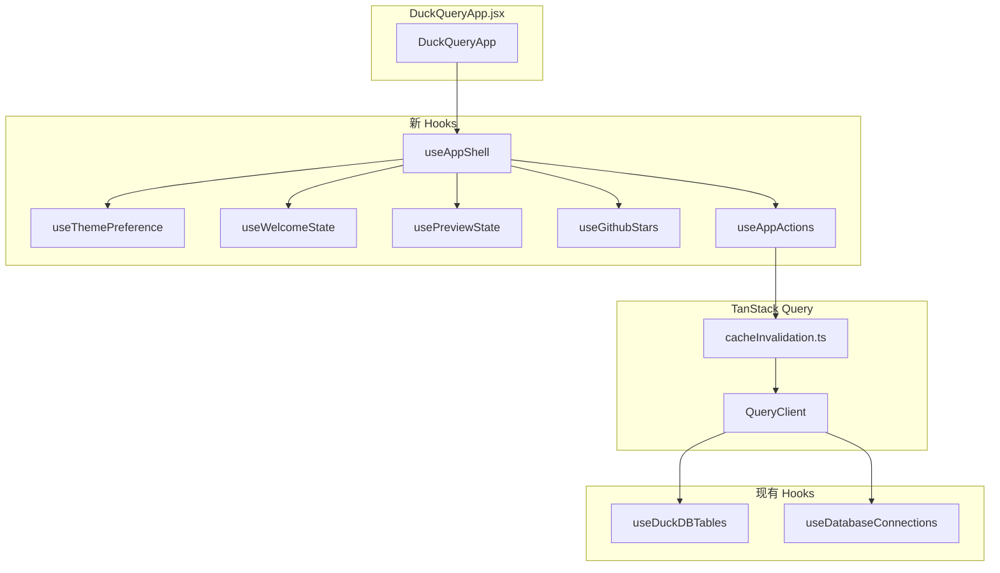
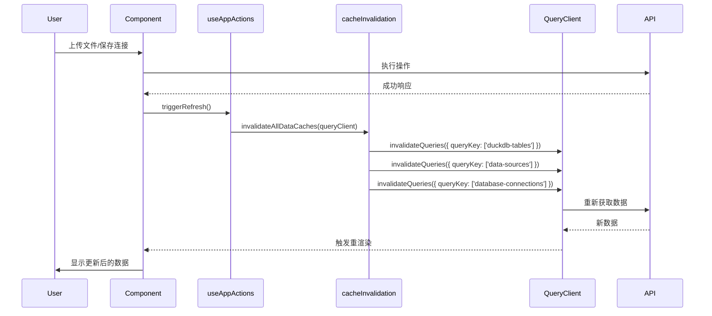
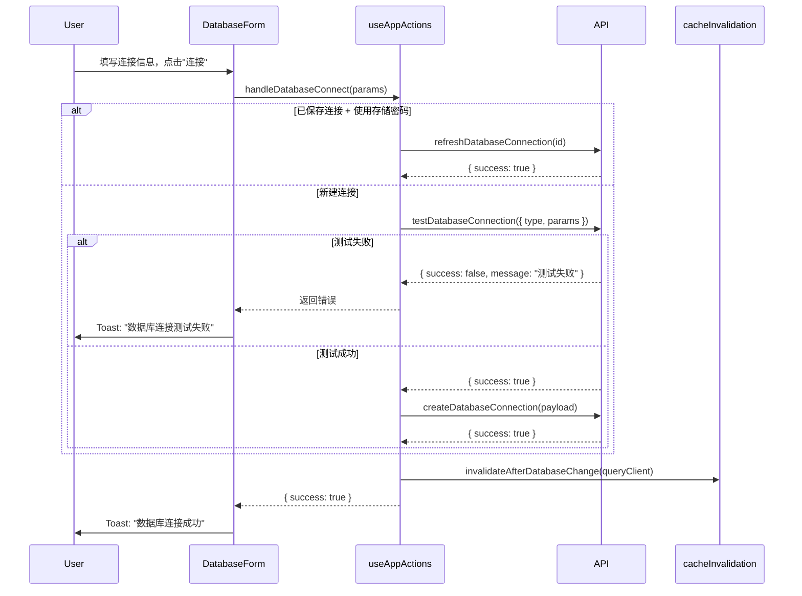
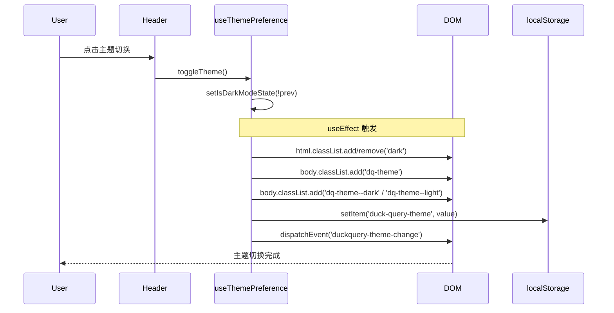

# useDuckQuery 清理与状态管理重构 - 设计文档

> **版本**: 1.1  
> **创建时间**: 2024-12-24  
> **更新时间**: 2024-12-24  
> **依赖**: 无前置依赖（基于现有 TanStack Query 基础设施）

---

## 🎯 设计原则

1. **渐进式迁移**：通过过渡壳 Hook 保持接口兼容，分阶段替换
2. **单一职责**：每个 Hook 只负责一个功能域
3. **TanStack Query 优先**：所有数据获取和缓存失效使用 TanStack Query
4. **零破坏性**：迁移过程中不影响现有功能，保留所有现有行为

---

## 📚 技术规范参考

| 规范 | 文档位置 | 说明 |
|------|---------|------|
| **TanStack Query 规范** | `.kiro/steering/tanstack-query-standards.md` | 数据获取、缓存策略 |
| **缓存失效规范** | `new/docs/MIGRATION_TO_TANSTACK_QUERY.md` | 缓存失效工具使用 |
| **UI 样式规范** | `AGENTS.md` | Tailwind 类名、禁止硬编码 |

---

## ⚠️ 关键兼容性要求

> [!CAUTION]
> 以下行为必须完整保留，否则会导致功能回退：

| 现有行为 | 必须保留的原因 |
|----------|----------------|
| `body` 添加 `dq-theme / dq-theme--dark / dq-theme--light` | `modern.css` 遗留样式依赖 |
| 派发 `duckquery-theme-change` 事件 | 可能有外部监听者 |
| 数据库连接"先测试后创建"流程 | 用户期望看到"测试失败"而非"创建失败" |
| 默认 Tab 为 `datasource` | 欢迎页关闭后落在数据源页 |
| 正确的 queryKey（`['data-sources']`、`['database-connections']`） | 缓存失效必须匹配 |

---

## 🗑️ 清理 vs. 迁移规范

> [!IMPORTANT]
> 本节明确区分"可直接删除的旧 UI 代码"和"需要迁移/保留的内容"，确保清理干净且新代码不受影响。

### 代码分类总览

| 旧逻辑/状态 | 目前用途 | 处理方式 | 说明 |
|-------------|----------|----------|------|
| `normalizeColumnType()` | 新 UI 用 `useColumnTypeDetection` | **🗑️ 删除** | 完全属于旧 UI |
| `normalizeBooleanValue()` | 新 UI 不使用 | **🗑️ 删除** | |
| `transformMetadataColumns()` | 新 UI 不使用 | **🗑️ 删除** | |
| `buildColumnTypeMap()` | 新 UI 用 `useColumnTypeDetection` | **🗑️ 删除** | |
| `quoteIdentifier()` | 新 UI 用 `sqlUtils.ts` | **🗑️ 删除** | |
| `escapeLikeValue()` | 新 UI 用 `sqlUtils.ts` | **🗑️ 删除** | |
| `escapeLiteralValue()` | 新 UI 用 `sqlUtils.ts` | **🗑️ 删除** | |
| `isNumericValue()` | 新 UI 不使用 | **🗑️ 删除** | |
| `buildFilterConditions()` | 新 UI 用 AG-Grid 内置过滤 | **🗑️ 删除** | ~214 行旧筛选逻辑 |
| `buildFilteredSql()` | 新 UI 不使用 | **🗑️ 删除** | 含硬编码 LIMIT 10000 |
| `extractBaseSql()` | 新 UI 不使用 | **🗑️ 删除** | |
| `handleApplyResultFilters()` | 新 UI 用 AG-Grid | **🗑️ 删除** | |
| `handleResultsReceived()` | 新 UI 不使用 | **🗑️ 删除** | |
| `queryResults` 状态 | 新 UI 用 `useQueryWorkspace` | **🗑️ 删除** | |
| `activeFilters` 状态 | 新 UI 用 AG-Grid 状态 | **🗑️ 删除** | |
| `queryContext` 状态 | 新 UI 不使用 | **🗑️ 删除** | |
| `dataSources` 状态 | 新 UI 用 `useDuckDBTables` | **🗑️ 删除** | TanStack Query 接管 |
| `databaseConnections` 状态 | 新 UI 用 `useDatabaseConnections` | **🗑️ 删除** | TanStack Query 接管 |
| `executeLoadInitialData()` | 新 UI 用 TanStack Query | **🗑️ 删除** | ~110 行 |
| `loadInitialData()` | 新 UI 不使用 | **🗑️ 删除** | |
| `setDataSources()` | 新 UI 不使用 | **🗑️ 删除** | |
| `isDarkMode` 状态 | `DuckQueryApp` 仍在使用 | **🔄 迁移** | → `useThemePreference` |
| `showWelcome` 状态 | `DuckQueryApp` 仍在使用 | **🔄 迁移** | → `useWelcomeState` |
| `previewQuery` 状态 | `DuckQueryApp` 仍在使用 | **🔄 迁移** | → `usePreviewState` |
| `currentTab` 状态 | `DuckQueryApp` 仍在使用 | **🔄 迁移** | → `useAppShell` |
| `triggerRefresh()` | `DuckQueryApp` 仍在使用 | **🔄 迁移** | → `useAppActions.refreshAllData` |
| `handleDatabaseConnect()` | `DuckQueryApp` 仍在使用 | **🔄 迁移** | → `useAppActions` |
| `handleDatabaseSaveConfig()` | `DuckQueryApp` 仍在使用 | **🔄 迁移** | → `useAppActions` |
| `handleCloseWelcome()` | `DuckQueryApp` 仍在使用 | **🔄 迁移** | → `useWelcomeState.closeWelcome` |
| GitHub Stars 拉取逻辑 | Header 展示 | **🔄 迁移** | → `useGithubStars` |
| `getInitialTheme()` | 主题初始化 | **🔄 迁移** | → `useThemePreference` |
| `shouldShowWelcome()` | 欢迎页逻辑 | **🔄 迁移** | → `useWelcomeState` |
| body class (`dq-theme` 等) | `modern.css` 依赖 | **⚠️ 保留行为** | 新 Hook 继续输出 |
| `duckquery-theme-change` 事件 | 可能有监听者 | **⚠️ 保留行为** | 新 Hook 继续派发 |
| `THEME_STORAGE_KEY` 导出 | 可能有外部引用 | **⚠️ 保留行为** | 新 Hook 继续导出 |

### 统计

| 类别 | 行数估算 | 占比 |
|------|----------|------|
| **可删除** | ~550 行 | ~55% |
| **需迁移** | ~300 行 | ~30% |
| **保留行为** | ~50 行 | ~5% |
| **其他（工具函数等）** | ~100 行 | ~10% |

### 删除安全性检查

在删除前，必须确认以下搜索无结果：

```bash
# 搜索已删除函数的引用
grep -r "normalizeColumnType\|buildFilterConditions\|buildFilteredSql" frontend/src/

# 搜索已删除状态的引用
grep -r "queryResults\|activeFilters\|queryContext" frontend/src/

# 确认 dataSources/databaseConnections 仅在 useDuckQuery 内部使用
grep -r "dataSources\|databaseConnections" frontend/src/ --include="*.jsx" --include="*.tsx"
```

### 未来清理路线图

> [!NOTE]
> 以下清理需要在更大范围的重构后进行：

#### 阶段 A：旧入口下线后
| 待清理项 | 前置条件 | 影响范围 |
|----------|----------|----------|
| `modern.css` 中的 `.dq-theme*` 样式 | `ShadcnApp.jsx` 完全废弃 | 需确认无其他引用 |
| body class 输出逻辑 | `modern.css` 样式已清理 | `useThemePreference` 可简化 |
| `duckquery-theme-change` 事件派发 | 确认无监听者 | `useThemePreference` 可简化 |

#### 阶段 B：TanStack Query 全面接管后
| 待清理项 | 前置条件 | 影响范围 |
|----------|----------|----------|
| `requestManager.js` | 所有 API 调用迁移到 TanStack Query | `apiClient.js` 需重构 |
| `apiClient.js` 中的 `clearCache` 调用 | `requestManager` 已移除 | 约 10 处调用 |
| `useDebounce.js` 中的 `globalDebounce` | 确认仅 `useDuckQuery` 使用 | 可能有其他引用 |

---

## 一、架构设计

### 1.1 目标结构

```
frontend/src/
├── DuckQueryApp.jsx              # 主入口（改造）
│
├── hooks/
│   ├── useDuckQuery.js           # 【删除】旧 Hook
│   ├── useDebounce.js            # 【保留】工具函数
│   └── useSmartParse.ts          # 【保留】新 UI 使用
│
└── new/
    └── hooks/
        ├── useThemePreference.ts  # 【新增】主题管理
        ├── useWelcomeState.ts     # 【新增】欢迎页状态
        ├── usePreviewState.ts     # 【新增】预览 SQL 状态
        ├── useGithubStars.ts      # 【新增】GitHub 星数
        ├── useAppActions.ts       # 【新增】全局操作（刷新、连接）
        ├── useAppShell.ts         # 【新增】过渡壳（组合上述 Hooks）
        │
        ├── useDuckDBTables.ts     # 【现有】表列表 - queryKey: ['duckdb-tables']
        ├── useDatabaseConnections.ts # 【现有】数据库连接 - queryKey: ['database-connections']
        ├── useDataSources.ts      # 【现有】数据源 - queryKey: ['data-sources']
        └── useAppConfig.ts        # 【现有】应用配置
```

### 1.2 现有 QueryKey 汇总

> [!IMPORTANT]
> 缓存失效必须使用正确的 queryKey，以下是项目中使用的 Key：

| Hook | queryKey | 说明 |
|------|----------|------|
| `useDuckDBTables` | `['duckdb-tables']` | DuckDB 表列表 |
| `useDatabaseConnections` | `['database-connections']` | 数据库连接列表 |
| `useDataSources` | `['data-sources']` | 所有数据源 |
| `useAppConfig` | `['app-config']` | 应用配置 |

**推荐做法**：直接使用 `cacheInvalidation.ts` 中的工具函数，避免手写 queryKey。

### 1.3 依赖关系



---

## 二、核心组件设计

### 2.1 useThemePreference

**职责**：管理主题状态（深色/浅色），持久化到 localStorage，同步到 DOM。

> [!WARNING]
> 必须保留以下现有行为：
> 1. 给 `html` 添加/移除 `dark` 类
> 2. 给 `body` 添加 `dq-theme` 基类
> 3. 给 `body` 切换 `dq-theme--dark` / `dq-theme--light`
> 4. 派发 `duckquery-theme-change` 自定义事件

**类型定义**：
```typescript
// frontend/src/new/hooks/useThemePreference.ts

export interface UseThemePreferenceReturn {
  isDarkMode: boolean;
  setIsDarkMode: (value: boolean | ((prev: boolean) => boolean)) => void;
  toggleTheme: () => void;
}

export type { UseThemePreferenceReturn };
```

**完整实现**：
```typescript
// frontend/src/new/hooks/useThemePreference.ts
import { useState, useEffect, useCallback } from 'react';

const THEME_STORAGE_KEY = 'duck-query-theme';

function getInitialTheme(): boolean {
  if (typeof window === 'undefined') return false;
  
  try {
    const stored = localStorage.getItem(THEME_STORAGE_KEY);
    if (stored === 'dark') return true;
    if (stored === 'light') return false;
  } catch {
    // localStorage 不可用
  }
  
  // 跟随系统偏好
  if (typeof window.matchMedia === 'function') {
    return window.matchMedia('(prefers-color-scheme: dark)').matches;
  }
  
  return false;
}

export function useThemePreference(): UseThemePreferenceReturn {
  const [isDarkMode, setIsDarkModeState] = useState(getInitialTheme);
  
  // 同步到 DOM 和 localStorage
  useEffect(() => {
    if (typeof document === 'undefined') return;
    
    const root = document.documentElement;
    const body = document.body;
    
    // 1. html 的 dark 类
    if (isDarkMode) {
      root.classList.add('dark');
    } else {
      root.classList.remove('dark');
    }
    
    // 2. 持久化到 localStorage
    try {
      localStorage.setItem(THEME_STORAGE_KEY, isDarkMode ? 'dark' : 'light');
    } catch {
      // 忽略
    }
    
    // 3. body 的 dq-theme 类（兼容 modern.css 遗留样式）
    if (body) {
      body.classList.add('dq-theme');
      body.classList.remove('dq-theme--dark', 'dq-theme--light');
      body.classList.add(isDarkMode ? 'dq-theme--dark' : 'dq-theme--light');
    }
    
    // 4. 派发自定义事件（兼容可能的外部监听）
    if (typeof window !== 'undefined') {
      window.dispatchEvent(
        new CustomEvent('duckquery-theme-change', {
          detail: { isDark: isDarkMode }
        })
      );
    }
    
    // 清理函数：移除 body 类
    return () => {
      if (body) {
        body.classList.remove('dq-theme', 'dq-theme--dark', 'dq-theme--light');
      }
    };
  }, [isDarkMode]);
  
  const setIsDarkMode = useCallback((value: boolean | ((prev: boolean) => boolean)) => {
    setIsDarkModeState(value);
  }, []);
  
  const toggleTheme = useCallback(() => {
    setIsDarkModeState(prev => !prev);
  }, []);
  
  return { isDarkMode, setIsDarkMode, toggleTheme };
}

export { THEME_STORAGE_KEY };
```

### 2.2 useWelcomeState

**职责**：管理欢迎页的显示逻辑，7 天后再次显示。

> [!NOTE]
> 此 Hook 只提供 `closeWelcome()` 方法，不支持 `setShowWelcome(true)`。
> 如需显示欢迎页，应清除 localStorage 或等待 7 天自动触发。

**类型定义**：
```typescript
// frontend/src/new/hooks/useWelcomeState.ts

export interface UseWelcomeStateReturn {
  showWelcome: boolean;
  /** 关闭欢迎页并记录时间戳。注意：不支持重新显示。 */
  closeWelcome: () => void;
}
```

**完整实现**：
```typescript
// frontend/src/new/hooks/useWelcomeState.ts
import { useState, useCallback } from 'react';

const WELCOME_STORAGE_KEY = 'duck-query-welcome-shown';

function shouldShowWelcome(): boolean {
  if (typeof window === 'undefined') return false;
  
  try {
    const lastShownTime = localStorage.getItem(WELCOME_STORAGE_KEY);
    
    if (!lastShownTime) return true;
    
    const lastShown = new Date(lastShownTime);
    const now = new Date();
    const daysDiff = (now.getTime() - lastShown.getTime()) / (1000 * 60 * 60 * 24);
    
    return daysDiff >= 7;
  } catch {
    return true;
  }
}

export function useWelcomeState(): UseWelcomeStateReturn {
  const [showWelcome, setShowWelcome] = useState(shouldShowWelcome);
  
  const closeWelcome = useCallback(() => {
    setShowWelcome(false);
    try {
      localStorage.setItem(WELCOME_STORAGE_KEY, new Date().toISOString());
    } catch {
      // 忽略
    }
  }, []);
  
  return { showWelcome, closeWelcome };
}
```

### 2.3 usePreviewState

**职责**：管理异步任务预览 SQL 的传递。

**类型定义**：
```typescript
// frontend/src/new/hooks/usePreviewState.ts

export interface UsePreviewStateReturn {
  previewQuery: string;
  setPreviewQuery: (sql: string) => void;
  clearPreviewQuery: () => void;
}
```

**完整实现**：
```typescript
// frontend/src/new/hooks/usePreviewState.ts
import { useState, useCallback } from 'react';

export function usePreviewState(): UsePreviewStateReturn {
  const [previewQuery, setPreviewQueryState] = useState('');
  
  const setPreviewQuery = useCallback((sql: string) => {
    setPreviewQueryState(sql);
  }, []);
  
  const clearPreviewQuery = useCallback(() => {
    setPreviewQueryState('');
  }, []);
  
  return { previewQuery, setPreviewQuery, clearPreviewQuery };
}
```

### 2.4 useGithubStars

**职责**：异步获取 GitHub 仓库星数。

> [!NOTE]
> 独立为单独 Hook，避免与其他状态耦合。

**类型定义**：
```typescript
// frontend/src/new/hooks/useGithubStars.ts

export interface UseGithubStarsReturn {
  githubStars: number | null;
  isLoading: boolean;
}
```

**完整实现**：
```typescript
// frontend/src/new/hooks/useGithubStars.ts
import { useState, useEffect } from 'react';

const GITHUB_REPO = 'chenkeliang/duckdb-query';

export function useGithubStars(): UseGithubStarsReturn {
  const [githubStars, setGithubStars] = useState<number | null>(null);
  const [isLoading, setIsLoading] = useState(true);
  
  useEffect(() => {
    const fetchStars = async () => {
      try {
        const response = await fetch(`https://api.github.com/repos/${GITHUB_REPO}`);
        if (response.ok) {
          const data = await response.json();
          setGithubStars(data.stargazers_count || null);
        }
      } catch {
        // 忽略错误
      } finally {
        setIsLoading(false);
      }
    };
    
    fetchStars();
  }, []);
  
  return { githubStars, isLoading };
}
```

### 2.5 useAppActions

**职责**：提供全局操作，包括刷新数据、数据库连接操作。

> [!CAUTION]
> 数据库连接操作必须保留"先测试后创建"的流程：
> 1. 新建连接时：先调用 `testDatabaseConnection()` 测试
> 2. 测试成功后：调用 `createDatabaseConnection()` 创建
> 3. 已保存连接：使用 `refreshDatabaseConnection()` 刷新
> 
> 缓存失效必须使用 `cacheInvalidation.ts` 中的工具函数。

**类型定义**：
```typescript
// frontend/src/new/hooks/useAppActions.ts

export interface DatabaseConnectParams {
  type: 'mysql' | 'postgresql' | 'sqlite';
  id?: string;
  name?: string;
  params: {
    host?: string;
    port?: number;
    database?: string;
    username?: string;
    password?: string;
    [key: string]: any;
  };
  useStoredPassword?: boolean;
}

export interface DatabaseConnectResult {
  success: boolean;
  message?: string;
  connection?: any;
}

export interface UseAppActionsReturn {
  /** 刷新所有数据（使用 invalidateAllDataCaches） */
  refreshAllData: () => Promise<void>;
  
  /** 
   * 数据库连接操作：
   * - 新建时：先测试后创建
   * - 已保存且用存储密码：使用 refresh
   */
  handleDatabaseConnect: (params: DatabaseConnectParams) => Promise<DatabaseConnectResult>;
  
  /** 保存数据库连接配置（无测试） */
  handleDatabaseSaveConfig: (params: DatabaseConnectParams) => Promise<DatabaseConnectResult>;
  
  /** 刷新中状态 */
  isRefreshing: boolean;
}
```

**完整实现**：
```typescript
// frontend/src/new/hooks/useAppActions.ts
import { useCallback, useState } from 'react';
import { useQueryClient } from '@tanstack/react-query';
import { 
  invalidateAllDataCaches,
  invalidateAfterDatabaseChange,
} from '@/new/utils/cacheInvalidation';
import {
  testDatabaseConnection,
  refreshDatabaseConnection,
  createDatabaseConnection,
  // updateDatabaseConnection, // 如果 API 支持
} from '@/services/apiClient';

export function useAppActions(): UseAppActionsReturn {
  const queryClient = useQueryClient();
  const [isRefreshing, setIsRefreshing] = useState(false);
  
  // 全局刷新 - 使用 cacheInvalidation 工具
  const refreshAllData = useCallback(async () => {
    setIsRefreshing(true);
    try {
      await invalidateAllDataCaches(queryClient);
    } finally {
      setIsRefreshing(false);
    }
  }, [queryClient]);
  
  // 数据库连接操作 - 保留"先测试后创建"流程
  const handleDatabaseConnect = useCallback(async (
    params: DatabaseConnectParams
  ): Promise<DatabaseConnectResult> => {
    try {
      // 情况 1：已保存连接且使用存储密码 -> 使用 refresh
      if (params.useStoredPassword && params.id) {
        const refreshResult = await refreshDatabaseConnection(params.id);
        if (!refreshResult.success) {
          return {
            success: false,
            message: refreshResult.message || '数据库连接测试失败',
          };
        }
        // 刷新缓存
        await invalidateAfterDatabaseChange(queryClient);
        return {
          success: true,
          message: refreshResult.message || '数据库连接成功',
        };
      }
      
      // 情况 2：新建连接 -> 先测试后创建
      // 步骤 2a：测试连接
      const testResult = await testDatabaseConnection({
        type: params.type,
        params: params.params,
      });
      
      if (!testResult?.success) {
        return {
          success: false,
          message: testResult?.message || '数据库连接测试失败',
        };
      }
      
      // 步骤 2b：测试成功，创建连接
      const createPayload = {
        id: params.id,
        name: params.name || `${params.type}-connection`,
        type: params.type,
        params: params.params,
      };
      
      const createResult = await createDatabaseConnection(createPayload);
      
      if (!createResult?.success) {
        return {
          success: false,
          message: createResult?.message || '数据库连接创建失败',
        };
      }
      
      // 刷新缓存 - 使用专用工具函数
      await invalidateAfterDatabaseChange(queryClient);
      
      return {
        success: true,
        message: createResult.message || '数据库连接成功',
        connection: createResult.connection, // 注意：API 返回结构是 result.connection，不是 result.data
      };
    } catch (error) {
      return {
        success: false,
        message: error instanceof Error ? error.message : '连接失败',
      };
    }
  }, [queryClient]);
  
  // 保存连接配置（仅保存，不测试）
  const handleDatabaseSaveConfig = useCallback(async (
    params: DatabaseConnectParams
  ): Promise<DatabaseConnectResult> => {
    try {
      const payload = {
        id: params.id,
        name: params.name || `${params.type}-connection`,
        type: params.type,
        params: params.params,
      };
      
      const result = await createDatabaseConnection(payload);
      
      if (result?.success) {
        // 刷新缓存 - 使用专用工具函数
        await invalidateAfterDatabaseChange(queryClient);
      }
      
      return {
        success: result?.success ?? false,
        message: result?.message,
        connection: result?.connection, // 与 handleDatabaseConnect 保持一致
      };
    } catch (error) {
      return {
        success: false,
        message: error instanceof Error ? error.message : '保存失败',
      };
    }
  }, [queryClient]);
  
  return {
    refreshAllData,
    handleDatabaseConnect,
    handleDatabaseSaveConfig,
    isRefreshing,
  };
}
```

### 2.6 useAppShell（过渡壳）

**职责**：组合所有新 Hooks，提供与原 `useDuckQuery` 兼容的接口。

> [!IMPORTANT]
> 关键兼容性要点：
> 1. `currentTab` 默认值必须是 `'datasource'`（与原实现一致）
> 2. `githubStars` 必须包含在 state 中
> 3. `setShowWelcome(false)` 等价于 `closeWelcome()`

**类型定义**：
```typescript
// frontend/src/new/hooks/useAppShell.ts

export interface UseAppShellReturn {
  state: {
    isDarkMode: boolean;
    showWelcome: boolean;
    previewQuery: string;
    currentTab: string;
    githubStars: number | null;
  };
  actions: {
    setIsDarkMode: (value: boolean | ((prev: boolean) => boolean)) => void;
    /** @deprecated 只支持 setShowWelcome(false)，建议使用 handleCloseWelcome */
    setShowWelcome: (value: boolean) => void;
    setCurrentTab: (tab: string) => void;
    setPreviewQuery: (sql: string) => void;
    handleCloseWelcome: () => void;
    triggerRefresh: () => void;
    handleDatabaseConnect: (params: any) => Promise<any>;
    handleDatabaseSaveConfig: (params: any) => Promise<any>;
  };
}
```

**完整实现**：
```typescript
// frontend/src/new/hooks/useAppShell.ts
import { useState, useCallback } from 'react';
import { useThemePreference } from './useThemePreference';
import { useWelcomeState } from './useWelcomeState';
import { usePreviewState } from './usePreviewState';
import { useGithubStars } from './useGithubStars';
import { useAppActions } from './useAppActions';

export function useAppShell(): UseAppShellReturn {
  const { isDarkMode, setIsDarkMode } = useThemePreference();
  const { showWelcome, closeWelcome } = useWelcomeState();
  const { previewQuery, setPreviewQuery } = usePreviewState();
  const { githubStars } = useGithubStars();
  const { refreshAllData, handleDatabaseConnect, handleDatabaseSaveConfig } = useAppActions();
  
  // 默认 Tab 为 'datasource'（与原 useDuckQuery 一致）
  const [currentTab, setCurrentTab] = useState('datasource');
  
  // 兼容接口：setShowWelcome(false) => closeWelcome()
  // 注意：setShowWelcome(true) 不会有效果，这是预期行为
  const setShowWelcome = useCallback((value: boolean) => {
    if (!value) {
      closeWelcome();
    }
    // value === true 时不做任何操作
    // 如需显示欢迎页，应清除 localStorage 或等待 7 天
  }, [closeWelcome]);
  
  const triggerRefresh = useCallback(() => {
    refreshAllData();
  }, [refreshAllData]);
  
  return {
    state: {
      isDarkMode,
      showWelcome,
      previewQuery,
      currentTab,
      githubStars,
    },
    actions: {
      setIsDarkMode,
      setShowWelcome,
      setCurrentTab,
      setPreviewQuery,
      handleCloseWelcome: closeWelcome,
      triggerRefresh,
      handleDatabaseConnect,
      handleDatabaseSaveConfig,
    },
  };
}
```

---

## 三、数据流设计

### 3.1 缓存失效流程



### 3.2 数据库连接流程（先测试后创建）



### 3.3 主题切换流程



---

## 四、迁移策略

### 4.1 阶段一：创建新 Hooks（不干扰现有代码）

1. 创建 `useThemePreference.ts` - 包含完整的 body 类和事件派发
2. 创建 `useWelcomeState.ts` - 只支持 `closeWelcome`
3. 创建 `usePreviewState.ts`
4. 创建 `useGithubStars.ts` - 独立 Hook
5. 创建 `useAppActions.ts` - 保留"先测试后创建"流程
6. 创建 `useAppShell.ts` - 默认 Tab 为 `datasource`
7. 为所有新 Hooks 添加单元测试

### 4.2 阶段二：替换 DuckQueryApp.jsx

1. 导入 `useAppShell` 替代 `useDuckQuery`
2. 验证 `state.githubStars` 正常工作
3. 验证 `currentTab` 默认值为 `datasource`
4. 验证主题切换的 body 类正确
5. 更新子组件的 props 传递

### 4.3 阶段三：更新调用方组件

1. 更新 `UploadPanel` - 使用 `invalidateAfterFileUpload`
2. 更新 `DataPasteCard` - 使用 `invalidateAfterFileUpload`
3. 更新 `DatabaseForm` - 使用新的连接操作
4. 更新 `SavedConnectionsList` - 验证刷新机制
5. 更新命令面板和快捷键

### 4.4 阶段四：清理旧代码

1. 从 `useDuckQuery.js` 移除未使用的函数
2. 移除 `requestManager` 的新代码调用
3. 验证 `apiClient.js` 中的 `requestManager` 调用（保留或替换）
4. 删除 `useDuckQuery.js`（如果已完全迁移）

---

## 五、影响范围分析

### 5.1 需要修改的文件

| 文件 | 修改类型 | 说明 |
|------|----------|------|
| `DuckQueryApp.jsx` | 重构 | 替换 `useDuckQuery` 为 `useAppShell` |
| `new/hooks/useThemePreference.ts` | 新增 | 主题管理（含 body 类和事件） |
| `new/hooks/useWelcomeState.ts` | 新增 | 欢迎页状态 |
| `new/hooks/usePreviewState.ts` | 新增 | 预览状态 |
| `new/hooks/useGithubStars.ts` | 新增 | GitHub 星数 |
| `new/hooks/useAppActions.ts` | 新增 | 全局操作（含测试→创建流程） |
| `new/hooks/useAppShell.ts` | 新增 | 过渡壳 |
| `hooks/useDuckQuery.js` | 删除 | 旧 Hook |

### 5.2 可能需要更新的组件

| 组件 | 当前依赖 | 目标状态 |
|------|----------|----------|
| `UploadPanel` | `onDataSourceSaved={triggerRefresh}` | 内部使用 `invalidateAfterFileUpload` |
| `DataPasteCard` | `onDataSourceSaved={triggerRefresh}` | 内部使用 `invalidateAfterFileUpload` |
| `DatabaseForm` | `onSave={handleSaveConnection}` | 使用 `useAppActions` |
| `SavedConnectionsList` | `onRefresh={refreshConfigs}` | 验证是否需要改造 |
| `CommandPalette` | `onAction('refresh')` | 使用 `refreshAllData` |
| `useKeyboardShortcuts` | `refreshData: triggerRefresh` | 使用 `refreshAllData` |

### 5.3 不受影响的模块

- 后端 API
- `new/Query/*` 组件
- `new/DataSource/*` 组件（除上述列出的）
- `apiClient.js`（暂时保留 `requestManager` 调用）

---

## 六、测试策略

### 6.1 单元测试

```typescript
// useThemePreference.test.ts
describe('useThemePreference', () => {
  it('should initialize from localStorage', () => {});
  it('should toggle theme', () => {});
  it('should persist to localStorage', () => {});
  it('should add dark class to html', () => {});
  it('should add dq-theme classes to body', () => {});  // 新增
  it('should dispatch duckquery-theme-change event', () => {});  // 新增
  it('should fallback to system preference', () => {});
});

// useAppActions.test.ts
describe('useAppActions', () => {
  it('should call invalidateAllDataCaches on refresh', () => {});
  it('should test before create for new connection', () => {});  // 新增
  it('should use refresh for saved connection with stored password', () => {});  // 新增
  it('should return test failure message, not create failure', () => {});  // 新增
  it('should call invalidateAfterDatabaseChange after success', () => {});  // 新增
});

// useAppShell.test.ts
describe('useAppShell', () => {
  it('should have default currentTab as datasource', () => {});  // 新增
  it('should include githubStars in state', () => {});  // 新增
  it('should call closeWelcome when setShowWelcome(false)', () => {});
  it('should do nothing when setShowWelcome(true)', () => {});  // 新增
});
```

### 6.2 E2E 验证清单

- [ ] 主题切换 → html 有 dark 类
- [ ] 主题切换 → body 有 dq-theme--dark / dq-theme--light 类
- [ ] 主题切换 → 派发 duckquery-theme-change 事件
- [ ] 欢迎页关闭 → 7 天内不再显示
- [ ] 新建数据库连接 → 先提示"测试失败"而非"创建失败"
- [ ] 上传文件 → 数据源列表更新
- [ ] 默认 Tab 是数据源页

---

## 七、回滚方案

1. **保留 `useDuckQuery.js`**：在阶段四之前不删除
2. **过渡壳设计**：`useAppShell` 保持与原接口兼容
3. **特性开关**（可选）：
   ```typescript
   const USE_NEW_HOOKS = true;
   const { state, actions } = USE_NEW_HOOKS 
     ? useAppShell() 
     : useDuckQuery();
   ```

---

## 八、时间估算

| 阶段 | 任务 | 预计时间 |
|------|------|----------|
| 阶段一 | 创建新 Hooks + 测试 | 2 天 |
| 阶段二 | 替换 DuckQueryApp | 1 天 |
| 阶段三 | 更新调用方组件 | 1 天 |
| 阶段四 | 清理旧代码 | 0.5 天 |
| 验证 | 全面测试 | 0.5 天 |
| **总计** | | **5 天** |
