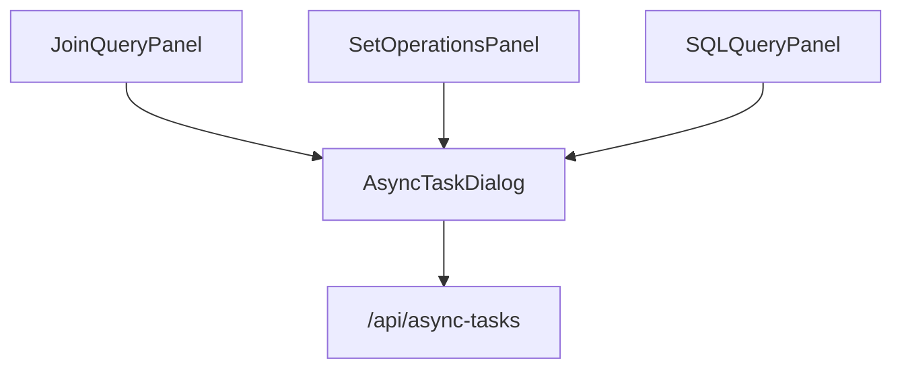

# Design: Visual Query Async Task Support

## Overview

为 JOIN 查询面板和集合操作面板添加异步任务支持，使用户能够在这些可视化查询界面中提交长时间运行的查询。

## Design Goals

1. **复用现有组件**：直接使用 `AsyncTaskDialog` 组件
2. **一致的用户体验**：按钮样式和交互与 SQL 查询面板保持一致
3. **最小侵入性**：只添加必要的代码，不改变现有查询执行逻辑
4. **健壮性**：防守式编程，处理边界情况

## Architecture

### 组件依赖关系



### AsyncTaskDialog Props 接口

```typescript
interface AsyncTaskDialogProps {
  open: boolean;
  onOpenChange: (open: boolean) => void;
  sql: string;
  datasource?: {
    id: string;
    type: string;
    name?: string;
  };
  attachDatabases?: AttachDatabase[];
  onSuccess?: (taskId: string) => void;
}
```

## Proposed Changes

---

### [MODIFY] JoinQueryPanel.tsx

**文件**: `frontend/src/new/Query/JoinQuery/JoinQueryPanel.tsx`

#### 1. 添加导入

```diff
+import { Timer } from 'lucide-react';
+import { AsyncTaskDialog } from '@/new/Query/AsyncTasks/AsyncTaskDialog';
+import {
+  Tooltip,
+  TooltipContent,
+  TooltipProvider,
+  TooltipTrigger,
+} from '@/new/components/ui/tooltip';
```

#### 2. 添加状态

```typescript
const [asyncDialogOpen, setAsyncDialogOpen] = React.useState(false);
```

#### 3. 添加"异步执行"按钮（带 Tooltip）

在"执行"按钮后、分隔符前添加：

```tsx
<TooltipProvider>
  <Tooltip>
    <TooltipTrigger asChild>
      <Button
        variant="outline"
        size="sm"
        onClick={() => setAsyncDialogOpen(true)}
        disabled={!canExecute || isExecuting || !sql?.trim()}
        className="gap-1.5"
        aria-label={t('query.sql.asyncExecute', '异步执行')}
      >
        <Timer className="w-3.5 h-3.5" />
        <span className="hidden sm:inline">
          {t('query.sql.asyncExecute', '异步执行')}
        </span>
      </Button>
    </TooltipTrigger>
    <TooltipContent>
      <p>{t('query.sql.asyncExecuteHint', '后台执行，结果保存到表')}</p>
    </TooltipContent>
  </Tooltip>
</TooltipProvider>
```

> [!NOTE]
> 按钮禁用条件增加 `!sql?.trim()`，避免空 SQL 时打开弹窗。

#### 4. 添加对话框组件

在 `SaveQueryDialog` 后添加：

```tsx
{/* 异步任务对话框 */}
<AsyncTaskDialog
  open={asyncDialogOpen}
  onOpenChange={setAsyncDialogOpen}
  sql={sql?.trim() ?? ''}
  datasource={
    sourceAnalysis.hasExternal && sourceAnalysis.currentSource
      ? {
          id: sourceAnalysis.currentSource.id ?? '',
          type: sourceAnalysis.currentSource.type ?? '',
          name: sourceAnalysis.currentSource.name,
        }
      : undefined
  }
  attachDatabases={
    attachDatabases?.map((db) => ({
      alias: db.alias,
      connectionId: db.connectionId,
      connectionName: db.connectionName, // 透传 connectionName 保证弹窗信息完整
    })) ?? []
  }
  onSuccess={() => {
    // AsyncTaskDialog 内部已处理 toast 和关闭，此处仅作防守
    setAsyncDialogOpen(false);
  }}
/>
```

> [!IMPORTANT]
> - `datasource` 构造时对 `id`、`type` 做了判空处理 (`?? ''`)
> - `attachDatabases?.map(...) ?? []` 防止 undefined 报错
> - 透传 `connectionName` 保证弹窗展示完整的数据库列表信息

---

### [MODIFY] SetOperationsPanel.tsx

**文件**: `frontend/src/new/Query/SetOperations/SetOperationsPanel.tsx`

#### 1. 添加导入

```diff
+import { Timer } from 'lucide-react';
+import { AsyncTaskDialog } from '@/new/Query/AsyncTasks/AsyncTaskDialog';
+import {
+  Tooltip,
+  TooltipContent,
+  TooltipProvider,
+  TooltipTrigger,
+} from '@/new/components/ui/tooltip';
```

#### 2. 添加状态

```typescript
const [asyncDialogOpen, setAsyncDialogOpen] = React.useState(false);
```

#### 3. 添加"异步执行"按钮（带 Tooltip）

在"执行"按钮后添加：

```tsx
<TooltipProvider>
  <Tooltip>
    <TooltipTrigger asChild>
      <Button
        variant="outline"
        size="sm"
        onClick={() => setAsyncDialogOpen(true)}
        disabled={!canExecute || isExecuting || !sql?.trim()}
        className="gap-1.5"
        aria-label={t('query.sql.asyncExecute', '异步执行')}
      >
        <Timer className="w-3.5 h-3.5" />
        <span className="hidden sm:inline">
          {t('query.sql.asyncExecute', '异步执行')}
        </span>
      </Button>
    </TooltipTrigger>
    <TooltipContent>
      <p>{t('query.sql.asyncExecuteHint', '后台执行，结果保存到表')}</p>
    </TooltipContent>
  </Tooltip>
</TooltipProvider>
```

#### 4. 添加对话框组件

在 `SaveQueryDialog` 后添加：

```tsx
{/* 异步任务对话框 */}
<AsyncTaskDialog
  open={asyncDialogOpen}
  onOpenChange={setAsyncDialogOpen}
  sql={sql?.trim() ?? ''}
  onSuccess={() => {
    setAsyncDialogOpen(false);
  }}
/>
```

> [!NOTE]
> 集合操作当前不支持外部表，因此 `datasource` 和 `attachDatabases` 留空。
> 如果未来支持外部表，需要像 JoinQueryPanel 一样传递这些参数。

---

## Verification Plan

### Manual Verification Steps

1. **启动开发服务器**
   ```bash
   # 终端 1：后端
   cd api && source ../.venv/bin/activate && uvicorn main:app --reload
   
   # 终端 2：前端
   cd frontend && npm run dev
   ```

2. **测试 JOIN 查询异步任务**
   - 打开浏览器访问 `http://localhost:5173`
   - 切换到"JOIN 查询"标签页
   - 双击数据源面板中的两个表添加到 JOIN 查询
   - 配置 JOIN 条件
   - **悬停"异步执行"按钮，验证 Tooltip 显示**
   - 点击"异步执行"按钮
   - 确认对话框弹出，且附加数据库列表显示完整（包含 connectionName）
   - 输入自定义表名（可选）
   - 点击"提交"
   - 确认任务成功提交（Toast 提示）
   - 切换到"异步任务"面板确认任务出现在列表中

3. **测试集合操作异步任务**
   - 切换到"集合操作"标签页
   - 添加两个 DuckDB 表
   - 选择 UNION 操作
   - 点击"异步执行"按钮
   - 确认对话框弹出并可以提交

4. **边界情况测试**
   - [ ] 未配置有效查询时，"异步执行"按钮应禁用
   - [ ] 正在执行查询时，"异步执行"按钮应禁用
   - [ ] SQL 为空时，"异步执行"按钮应禁用
   - [ ] 无外部表时，弹窗不显示附加数据库列表

### Automated Tests (Recommended)

使用 React Testing Library 验证：

```tsx
// frontend/src/new/Query/JoinQuery/__tests__/JoinQueryPanel.async.test.tsx
import { render, screen, fireEvent } from '@testing-library/react';

describe('JoinQueryPanel Async Support', () => {
  it('should render async execute button', () => {
    render(<JoinQueryPanel selectedTables={mockTables} />);
    expect(screen.getByRole('button', { name: /异步执行/i })).toBeInTheDocument();
  });

  it('should disable async button when canExecute is false', () => {
    render(<JoinQueryPanel selectedTables={[]} />);
    expect(screen.getByRole('button', { name: /异步执行/i })).toBeDisabled();
  });

  it('should open AsyncTaskDialog when clicked', async () => {
    render(<JoinQueryPanel selectedTables={mockTables} />);
    fireEvent.click(screen.getByRole('button', { name: /异步执行/i }));
    expect(await screen.findByRole('dialog')).toBeInTheDocument();
  });
});
```

## Notes on `onSuccess` Callback

`AsyncTaskDialog` 内部已在成功时：
1. 关闭弹窗 (`onOpenChange(false)`)
2. 显示 Toast 提示
3. 使缓存失效 (`invalidateQueries`)

外层的 `onSuccess={() => setAsyncDialogOpen(false)}` 是防守性代码，确保弹窗一定关闭。
虽有轻微冗余，但无副作用，保持即可。
