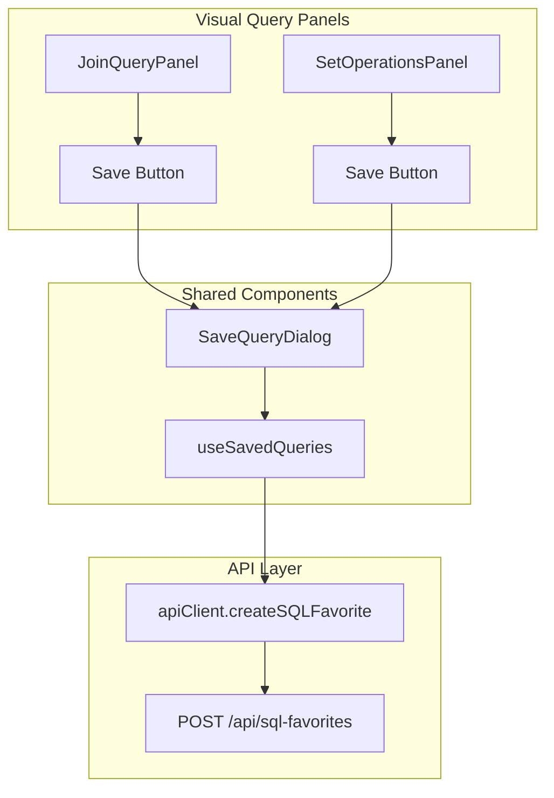
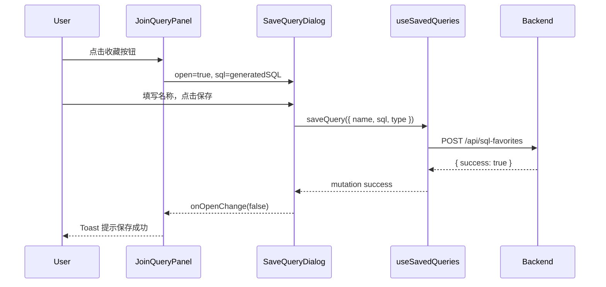

# 可视化查询收藏 - 设计文档

> **版本**: 1.0  
> **创建时间**: 2024-12-29  
> **状态**: 🟢 设计完成

---

## 📐 架构设计

### 组件交互图



### 数据流



---

## 📁 文件变更清单

### 修改文件

| 文件路径 | 变更类型 | 描述 |
|---------|---------|------|
| `frontend/src/new/Query/JoinQuery/JoinQueryPanel.tsx` | **修改** | 添加收藏按钮和 `SaveQueryDialog` |
| `frontend/src/new/Query/SetOperations/SetOperationsPanel.tsx` | **修改** | 添加收藏按钮和 `SaveQueryDialog` |

### 新增文件

无

---

## 🔧 详细设计

### 1. JoinQueryPanel 修改

**导入新依赖**:

```tsx
import { Star } from 'lucide-react';
import { SaveQueryDialog } from '../Bookmarks/SaveQueryDialog';
```

**添加状态**:

```tsx
const [isSaveDialogOpen, setIsSaveDialogOpen] = React.useState(false);
```

**工具栏添加按钮** (在"清空"按钮之后):

```tsx
<Button
  variant="ghost"
  size="sm"
  onClick={() => setIsSaveDialogOpen(true)}
  disabled={!sql}
  className="text-muted-foreground hover:text-yellow-500 gap-1.5 shrink-0"
  title={t('query.bookmark.save', '收藏查询')}
>
  <Star className="w-3.5 h-3.5" />
  {t('query.bookmark.save', '收藏')}
</Button>
```

**渲染对话框** (在组件末尾，`</div>` 之前):

```tsx
<SaveQueryDialog
  open={isSaveDialogOpen}
  onOpenChange={setIsSaveDialogOpen}
  sql={sql || ''}
/>
```

---

### 2. SetOperationsPanel 修改

与 JoinQueryPanel 完全相同的模式：

1. 导入 `Star` 和 `SaveQueryDialog`
2. 添加 `isSaveDialogOpen` 状态
3. 在工具栏添加收藏按钮
4. 渲染 `SaveQueryDialog`

---

### 3. SaveQueryDialog 确认

现有 `SaveQueryDialog` 已经支持：
- `open`: 控制显示
- `onOpenChange`: 关闭回调
- `sql`: 预填充的 SQL
- 内部调用 `useSavedQueries().saveQuery`

**无需修改 SaveQueryDialog 组件本身**。

---

## 🎨 UI 设计

### 按钮位置

```
┌─────────────────────────────────────────────────────────────────┐
│ [执行] [清空] [收藏]  │  ... 其他元素 ...  │  [关联查询]        │
└─────────────────────────────────────────────────────────────────┘
```

### 按钮样式

| 属性 | 值 |
|------|-----|
| variant | ghost |
| size | sm |
| 图标 | Star (lucide-react) |
| 颜色 | text-muted-foreground, hover:text-yellow-500 |
| 禁用条件 | `!sql` (无 SQL 时禁用) |

---

## 🧪 测试策略

### 手动测试

| 场景 | 步骤 | 预期结果 |
|------|------|---------|
| JOIN 收藏正常 | 添加表 → 配置 JOIN → 点击收藏 → 填写名称 → 保存 | Toast 成功，收藏夹可见 |
| 空 SQL 禁用 | 打开 JOIN 面板，不添加表 | 收藏按钮禁用 |
| 集合操作收藏 | 添加表 → 选择 UNION → 点击收藏 → 保存 | Toast 成功 |
| 取消对话框 | 点击收藏 → 点击取消/ESC | 对话框关闭，无保存 |

### 回归测试

- 确认 SQL 编辑器收藏功能不受影响
- 确认收藏夹列表正确显示所有来源的收藏

---

## ⚠️ 注意事项

### 类型处理

可视化查询生成的 SQL 保存时，`type` 字段建议统一使用 `"duckdb"`，因为：
1. 生成的 SQL 由 DuckDB 执行
2. 当前 SaveQueryDialog 已移除类型选择器
3. 保持简单，无需区分来源

### 后续增强建议

若未来需要区分收藏来源（SQL 编辑器 vs JOIN vs 集合操作），可：
1. 在 `SaveQueryDialog` 添加隐藏的 `source` 字段
2. 后端 `sql-favorites` API 扩展支持 `source`
3. 收藏夹列表可按来源筛选

---

## 📋 实现检查清单

- [ ] JoinQueryPanel 导入 Star 和 SaveQueryDialog
- [ ] JoinQueryPanel 添加 isSaveDialogOpen 状态
- [ ] JoinQueryPanel 工具栏添加收藏按钮
- [ ] JoinQueryPanel 渲染 SaveQueryDialog
- [ ] SetOperationsPanel 同上四项
- [ ] 暗色模式 UI 验证
- [ ] 保存成功 Toast 验证
- [ ] 收藏夹列表验证
