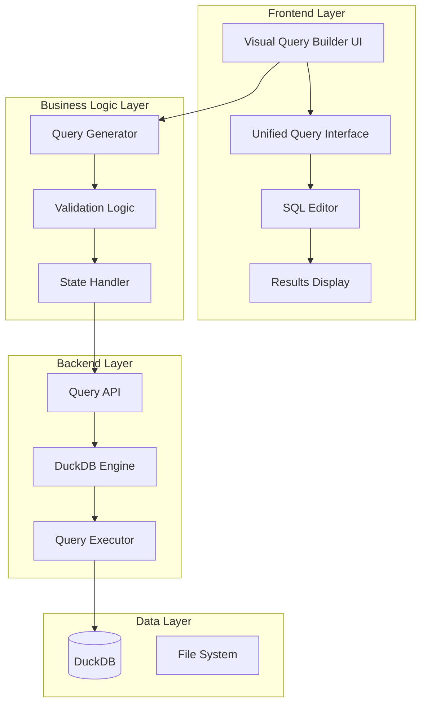

# Design Document - Visual Query Builder

## Overview

The Visual Query Builder is a comprehensive enhancement to the existing Duck Query platform that provides a no-code interface for data analysis. It will be integrated into the existing "统一查询" (Unified Query) tab, extending the current QueryBuilder component with visual analysis capabilities while maintaining seamless integration with the existing SQL editor and results display system.

## Impact Analysis

### Code Impact Assessment

#### Frontend Impact (Low Risk - Additive Changes)

**Existing Components (No Changes Required)**:
- `ShadcnApp.jsx` - Main application container (no changes needed)
- `QueryBuilder.jsx` - Current multi-table query builder (will remain unchanged)
- `SourceSelector.jsx` - Current source selection logic (will remain unchanged)
- `ModernDataDisplay.jsx` - Results display component (will reuse as-is)

**Components to Enhance (Minimal Changes)**:
- `UnifiedQueryInterface.jsx` - Add new tab for visual query builder
  - **Change**: Add third tab "可视化分析" alongside existing "图形化查询" and "SQL编辑器"
  - **Risk**: Low - Simple tab addition without affecting existing functionality

**New Components (No Impact on Existing Code)**:
- All visual query builder components will be new additions
- No modification of existing component logic required

#### Backend Impact (Low Risk - New Endpoints Only)

**Existing API Routes (No Changes)**:
- `/api/query` - Current multi-table query endpoint (unchanged)
- `/api/duckdb-query` - Current DuckDB SQL executor (unchanged)
- All other existing endpoints remain untouched

**New API Endpoints (Additive Only)**:
- `/api/visual-query/*` - New endpoints for visual query functionality
- No modification of existing endpoint logic

**Existing Models (No Changes)**:
- Current `QueryRequest`, `DataSource` models remain unchanged
- New visual query models will be separate additions

#### Database Impact (Zero Risk)

**DuckDB Schema**: No changes to existing table structures or data
**File System**: No changes to existing file organization
**Configuration**: No changes to existing configuration files

### Integration Strategy (Minimal Risk)

**Approach**: Additive Enhancement Pattern
- Add new functionality alongside existing features
- Maintain complete backward compatibility
- Use feature flags for gradual rollout
- Zero disruption to current user workflows

**Rollback Strategy**: 
- Simple feature flag toggle to disable visual query builder
- No database migrations or schema changes to rollback
- Existing functionality remains completely unaffected

## Architecture

### High-Level Architecture



### Component Integration Strategy

The Visual Query Builder will be integrated into the existing architecture as follows:

1. **Extend UnifiedQueryInterface**: Add a new tab/mode for visual query building
2. **Enhance QueryBuilder**: Add visual analysis controls alongside existing source selection
3. **Reuse Existing Infrastructure**: Leverage current API endpoints, DuckDB engine, and result display components
4. **Maintain Backward Compatibility**: Ensure existing functionality remains unchanged

## Components and Interfaces

### 1. Frontend Components

#### 1.1 VisualQueryBuilder (New Main Component)

**Location**: `frontend/src/components/QueryBuilder/VisualQueryBuilder.jsx`

**Props**:
```javascript
{
  dataSources: Array<DataSource>,
  selectedTable: DataSource | null,
  onTableSelect: (table: DataSource) => void,
  onQueryGenerated: (sql: string, config: VisualQueryConfig) => void,
  onResultsReceived: (results: QueryResults) => void
}
```

**State Management**:
```javascript
{
  selectedColumns: Array<string>,
  aggregations: Array<AggregationConfig>,
  filters: Array<FilterConfig>,
  groupBy: Array<string>,
  orderBy: Array<SortConfig>,
  limit: number | null,
  isDistinct: boolean,
  generatedSQL: string,
  previewData: Array<any>,
  isLoading: boolean
}
```

#### 1.2 TableSelector (Enhanced Component)

**Location**: `frontend/src/components/QueryBuilder/TableSelector.jsx`

Extends existing SourceSelector to support single-table selection mode for visual analysis.

#### 1.3 ColumnSelector (New Component)

**Location**: `frontend/src/components/QueryBuilder/ColumnSelector.jsx`

**Features**:
- Display available columns with data types
- Multi-select columns for analysis
- Column metadata display (null count, unique values, etc.)

#### 1.4 AggregationPanel (New Component)

**Location**: `frontend/src/components/QueryBuilder/AggregationPanel.jsx`

**Features**:
- Chinese-labeled aggregation functions
- Column-specific aggregation selection
- Group by configuration
- Statistical functions panel

#### 1.5 FilterPanel (New Component)

**Location**: `frontend/src/components/QueryBuilder/FilterPanel.jsx`

**Features**:
- Dynamic filter controls based on column data types
- Multiple filter conditions with AND/OR logic
- Pattern matching for text fields
- Range filters for numeric/date fields

#### 1.6 SortLimitPanel (New Component)

**Location**: `frontend/src/components/QueryBuilder/SortLimitPanel.jsx`

**Features**:
- Multi-column sorting configuration
- Row limit settings
- Offset configuration

#### 1.7 SQLPreview (Enhanced Component)

**Location**: `frontend/src/components/QueryBuilder/SQLPreview.jsx`

**Features**:
- Real-time SQL generation display
- Syntax highlighting
- Chinese comments explaining query logic
- Estimated execution time display

### 2. Backend Enhancements

#### 2.1 Visual Query Models

**Location**: `api/models/visual_query_models.py`

```python
class VisualQueryConfig(BaseModel):
    table_name: str
    selected_columns: List[str] = []
    aggregations: List[AggregationConfig] = []
    filters: List[FilterConfig] = []
    group_by: List[str] = []
    order_by: List[SortConfig] = []
    limit: Optional[int] = None
    is_distinct: bool = False

class AggregationConfig(BaseModel):
    column: str
    function: str  # SUM, AVG, COUNT, etc.
    alias: Optional[str] = None

class FilterConfig(BaseModel):
    column: str
    operator: str  # =, !=, >, <, LIKE, etc.
    value: Any
    logic_operator: str = "AND"  # AND, OR

class SortConfig(BaseModel):
    column: str
    direction: str = "ASC"  # ASC, DESC
```

#### 2.2 Visual Query Generator

**Location**: `api/core/visual_query_generator.py`

**Functions**:
- `generate_sql_from_config(config: VisualQueryConfig) -> str`
- `validate_query_config(config: VisualQueryConfig) -> ValidationResult`
- `estimate_query_performance(config: VisualQueryConfig) -> PerformanceEstimate`

#### 2.3 Enhanced Query API

**Location**: `api/routers/query.py` (Enhanced)

**New Endpoints**:
- `POST /api/visual-query/generate` - Generate SQL from visual config
- `POST /api/visual-query/preview` - Get preview data with row count estimation
- `GET /api/visual-query/column-stats/{table_name}/{column_name}` - Get column statistics

### 3. Data Models

#### 3.1 Visual Query Configuration

```typescript
interface VisualQueryConfig {
  tableName: string;
  selectedColumns: string[];
  aggregations: AggregationConfig[];
  filters: FilterConfig[];
  groupBy: string[];
  orderBy: SortConfig[];
  limit?: number;
  isDistinct: boolean;
}

interface AggregationConfig {
  column: string;
  function: 'SUM' | 'AVG' | 'COUNT' | 'MIN' | 'MAX' | 'COUNT_DISTINCT' | 'MEDIAN' | 'MODE' | 'STDDEV_SAMP' | 'VAR_SAMP';
  alias?: string;
  displayName: string; // Chinese label
}

interface FilterConfig {
  column: string;
  operator: '=' | '!=' | '>' | '<' | '>=' | '<=' | 'LIKE' | 'ILIKE' | 'IS NULL' | 'IS NOT NULL' | 'BETWEEN';
  value: any;
  value2?: any; // For BETWEEN operator
  logicOperator: 'AND' | 'OR';
  displayName: string; // Chinese label
}

interface SortConfig {
  column: string;
  direction: 'ASC' | 'DESC';
  priority: number;
}
```

#### 3.2 Column Metadata

```typescript
interface ColumnMetadata {
  name: string;
  dataType: string;
  isNullable: boolean;
  uniqueCount?: number;
  nullCount?: number;
  sampleValues?: any[];
  minValue?: any;
  maxValue?: any;
}
```

## Error Handling

### 1. Frontend Error Handling

**Validation Errors**:
- Real-time validation of user selections
- Clear Chinese error messages with suggestions
- Prevent incompatible combinations (e.g., aggregation without GROUP BY)

**API Errors**:
- Graceful handling of backend errors
- User-friendly error messages
- Fallback to SQL editor mode when visual parsing fails

### 2. Backend Error Handling

**SQL Generation Errors**:
- Validate visual query configuration before SQL generation
- Provide detailed error messages for invalid configurations
- Suggest corrections for common mistakes

**Query Execution Errors**:
- Catch and translate DuckDB errors to user-friendly messages
- Provide query optimization suggestions
- Handle timeout and memory limit errors

## Testing Strategy

### 1. Unit Tests

**Frontend Components**:
- Test each visual component in isolation
- Mock API responses for consistent testing
- Test user interaction flows

**Backend Logic**:
- Test SQL generation with various configurations
- Test validation logic with edge cases
- Test DuckDB query execution

### 2. Integration Tests

**End-to-End Workflows**:
- Test complete visual query building flow
- Test integration with existing SQL editor
- Test result display and export functionality

**API Integration**:
- Test visual query API endpoints
- Test error handling scenarios
- Test performance with large datasets

### 3. User Acceptance Tests

**Usability Testing**:
- Test with non-technical users
- Validate Chinese interface clarity
- Test common data analysis scenarios

## Implementation Phases

### Phase 1: Core Infrastructure (Tasks 1-3)
- Set up basic visual query builder structure
- Implement table selection and column display
- Create basic SQL generation framework

### Phase 2: Basic Analysis Features (Tasks 4-7)
- Implement aggregation functions
- Add filtering capabilities
- Create sorting and limiting controls

### Phase 3: Advanced Features (Tasks 8-11)
- Add statistical analysis functions
- Implement calculated fields
- Create data distribution analysis

### Phase 4: Integration and Polish (Tasks 12-15)
- Integrate with existing query interface
- Add real-time preview and validation
- Implement user guidance and help system

### Phase 5: Testing and Optimization (Tasks 16-18)
- Comprehensive testing
- Performance optimization
- User experience refinement

## Performance Considerations

### 1. Frontend Performance

**Lazy Loading**:
- Load column metadata on demand
- Implement virtual scrolling for large column lists
- Debounce user input for real-time SQL generation

**State Management**:
- Use React.memo for expensive components
- Implement efficient state updates
- Cache generated SQL and preview data

### 2. Backend Performance

**Query Optimization**:
- Generate efficient DuckDB SQL
- Use appropriate indexes and query hints
- Implement query result caching

**Resource Management**:
- Limit preview query result size
- Implement query timeout handling
- Monitor memory usage for large datasets

## Security Considerations

### 1. Input Validation

**SQL Injection Prevention**:
- Parameterize all user inputs
- Validate column names against table schema
- Sanitize filter values

**Access Control**:
- Ensure users can only access authorized tables
- Validate table permissions before query execution
- Log all query activities

### 2. Resource Protection

**Query Limits**:
- Enforce maximum query execution time
- Limit result set size for preview queries
- Implement rate limiting for API endpoints

## Deployment Strategy

### 1. Incremental Rollout

**Feature Flags**:
- Use feature flags to control visual query builder availability
- Enable for specific user groups initially
- Gradual rollout based on feedback

**Backward Compatibility**:
- Maintain existing query interface functionality
- Provide migration path for existing queries
- Support both visual and SQL modes simultaneously

### 2. Monitoring and Analytics

**Usage Tracking**:
- Track visual query builder adoption
- Monitor query performance and errors
- Collect user feedback and usage patterns

**Performance Monitoring**:
- Monitor API response times
- Track DuckDB query performance
- Alert on error rates and timeouts