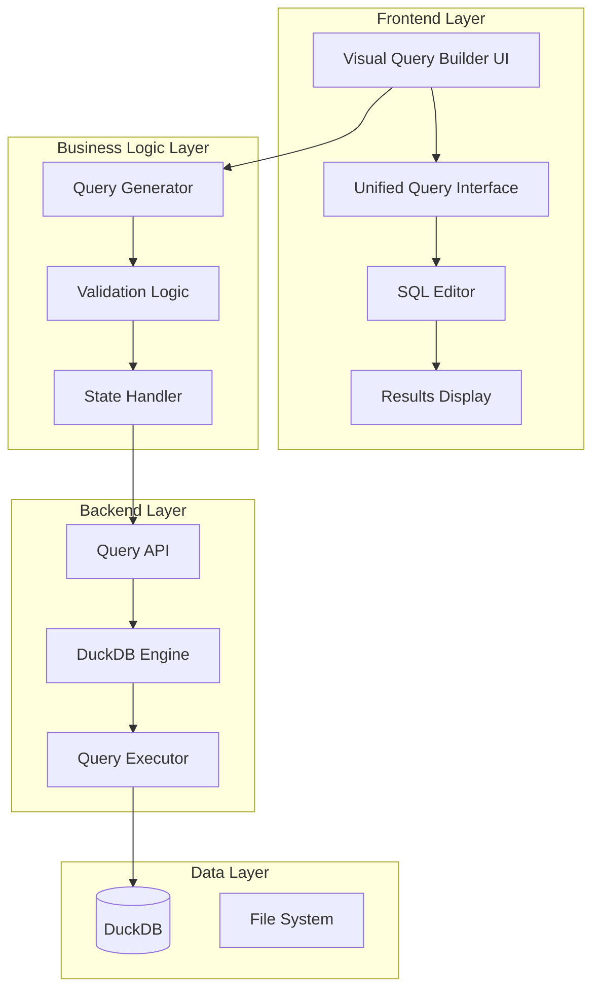

# Design Document - Visual Query Builder

## Overview

The Visual Query Builder is a comprehensive enhancement to the existing Duck Query platform that provides a no-code interface for data analysis. It will be integrated directly into the existing QueryBuilder component by adding a visual analysis panel above the "执行查询" button. This approach maintains all existing multi-table JOIN functionality while adding single-table visual analysis capabilities with zero disruption to current workflows.

## Impact Analysis

### Code Impact Assessment

#### Frontend Impact (Low Risk - Additive Changes)

**Existing Components (No Changes Required)**:
- `ShadcnApp.jsx` - Main application container (no changes needed)
- `UnifiedQueryInterface.jsx` - Query interface container (no changes needed)
- `SourceSelector.jsx` - Current source selection logic (will remain unchanged)
- `ModernDataDisplay.jsx` - Results display component (will reuse as-is)

**Components to Enhance (Minimal Changes)**:
- `QueryBuilder.jsx` - Add visual analysis panel above "执行查询" button
  - **Change**: Insert VisualAnalysisPanel component above existing execute button
  - **Risk**: Very Low - Pure additive enhancement, no existing logic modification

**New Components (No Impact on Existing Code)**:
- All visual query builder components will be new additions
- No modification of existing component logic required

#### Backend Impact (Low Risk - New Endpoints Only)

**Existing API Routes (No Changes)**:
- `/api/query` - Current multi-table query endpoint (unchanged)
- `/api/duckdb-query` - Current DuckDB SQL executor (unchanged)
- All other existing endpoints remain untouched

**New API Endpoints (Additive Only)**:
- `/api/visual-query/*` - New endpoints for visual query functionality
- No modification of existing endpoint logic

**Existing Models (No Changes)**:
- Current `QueryRequest`, `DataSource` models remain unchanged
- New visual query models will be separate additions

#### Database Impact (Zero Risk)

**DuckDB Schema**: No changes to existing table structures or data
**File System**: No changes to existing file organization
**Configuration**: No changes to existing configuration files

### Integration Strategy (Minimal Risk)

**Approach**: Additive Enhancement Pattern
- Add new functionality alongside existing features
- Maintain complete backward compatibility
- Use feature flags for gradual rollout
- Zero disruption to current user workflows

**Rollback Strategy**: 
- Simple feature flag toggle to disable visual query builder
- No database migrations or schema changes to rollback
- Existing functionality remains completely unaffected

## Architecture

### High-Level Architecture



### Component Integration Strategy

The Visual Query Builder will be integrated into the existing QueryBuilder component as follows:

1. **Enhance QueryBuilder Component**: Add visual analysis controls **above** the "执行查询" button
2. **Preserve Existing Multi-table Logic**: Keep all existing multi-table JOIN functionality completely unchanged
3. **Conditional Analysis Mode**: Only activate visual analysis when single table is selected AND analysis conditions are configured
4. **Default Behavior Maintained**: If no analysis conditions are selected, execute existing query logic as before
5. **Reuse Existing Infrastructure**: Leverage current API endpoints, DuckDB engine, and result display components

## UI/UX Design Specifications

### Design System and Component Library

**UI Framework**: Hybrid approach - MUI components + Tailwind CSS + Shadcn/ui design system
**Styling**: Tailwind CSS v4.1.11 + Custom CSS (Shadcn/ui inspired)
**Typography**: Inter font family (@fontsource/inter)
**Icons**: Material Icons (@mui/icons-material)
**Component Strategy**: Use MUI for complex components (Select, Autocomplete) + Tailwind for layout and styling

### Visual Design Language

#### Color Palette (Tailwind CSS Classes)
```css
/* Primary Colors */
bg-blue-600 (#2563eb)           /* Primary action buttons */
hover:bg-blue-700 (#1d4ed8)     /* Hover state */
bg-green-500 (#10b981)          /* Success states */
bg-orange-500 (#f59e0b)         /* Warning states */
bg-red-500 (#ef4444)            /* Error states */

/* Neutral Colors (Shadcn/ui inspired) */
bg-gray-50 (#f9fafb)            /* Page background */
bg-white (#ffffff)              /* Card/surface background */
border-gray-200 (#e5e7eb)       /* Light borders */
text-gray-900 (#111827)         /* Primary text */
text-gray-600 (#4b5563)         /* Secondary text */
text-gray-400 (#9ca3af)         /* Muted text */
```

#### Typography Scale (Tailwind Classes)
```css
/* Headings */
text-base font-semibold text-gray-900    /* Section titles (16px) */
text-sm font-medium text-gray-900        /* Subsection titles (14px) */
text-sm font-medium text-gray-700        /* Labels (14px) */

/* Body Text */
text-sm text-gray-900                    /* Body text (14px) */
text-xs text-gray-600                    /* Caption text (12px) */
text-xs text-gray-400                    /* Helper text (12px) */
```

#### Spacing System (Tailwind Classes)
```css
/* Consistent spacing scale */
p-1, m-1, gap-1     /* 4px - Tight spacing */
p-2, m-2, gap-2     /* 8px - Small spacing */
p-3, m-3, gap-3     /* 12px - Medium spacing */
p-4, m-4, gap-4     /* 16px - Large spacing */
p-6, m-6, gap-6     /* 24px - Extra large spacing */
p-8, m-8, gap-8     /* 32px - Section spacing */
```

### Visual Analysis Panel Layout

#### Panel Structure
```
┌─────────────────────────────────────────────────────────────┐
│ 可视化分析 (只在选择单表时显示)                                    │
├─────────────────────────────────────────────────────────────┤
│ ┌─ 列选择 ─┐ ┌─ 聚合统计 ─┐ ┌─ 筛选条件 ─┐ ┌─ 排序设置 ─┐      │
│ │ □ 列1    │ │ 求和 ▼    │ │ 列名 ▼    │ │ 列名 ▼    │      │
│ │ ☑ 列2    │ │ 平均值    │ │ 等于      │ │ 升序 ○    │      │
│ │ □ 列3    │ │ 计数      │ │ [值输入]   │ │ 降序 ○    │      │
│ │ ...      │ │ ...       │ │ + 添加条件 │ │ 显示条数   │      │
│ └─────────┘ └──────────┘ └──────────┘ └──────────┘      │
├─────────────────────────────────────────────────────────────┤
│ 生成的SQL预览: SELECT column1, SUM(column2) FROM table...    │
└─────────────────────────────────────────────────────────────┘
```

#### Component Specifications

**VisualAnalysisPanel Container**:
```jsx
<div className="mb-6 bg-white rounded-lg border border-gray-200 shadow-sm">
  <div className="px-6 py-4 bg-gray-50 border-b border-gray-200 rounded-t-lg">
    <h3 className="text-base font-semibold text-gray-900">可视化分析</h3>
    <p className="text-sm text-gray-600 mt-1">选择分析条件来生成查询</p>
  </div>
  <div className="p-6">
    {/* Analysis controls */}
  </div>
</div>
```

**Column Selector Design**:
```jsx
<div className="space-y-2">
  <label className="text-sm font-medium text-gray-700">选择分析列</label>
  <div className="grid grid-cols-2 gap-2 max-h-32 overflow-y-auto p-3 border border-gray-200 rounded-md bg-gray-50">
    {columns.map(col => (
      <label key={col.name} className="flex items-center space-x-2 cursor-pointer">
        <input
          type="checkbox"
          checked={selectedColumns.includes(col.name)}
          onChange={() => handleColumnToggle(col.name)}
          className="rounded border-gray-300 text-blue-600 focus:ring-blue-500"
        />
        <div className="flex-1 min-w-0">
          <div className="text-sm font-medium text-gray-900 truncate">{col.name}</div>
          <div className="text-xs text-gray-500">{col.dataType}</div>
        </div>
      </label>
    ))}
  </div>
</div>
```

**Aggregation Controls Design**:
```jsx
<div className="space-y-2">
  <label className="text-sm font-medium text-gray-700">聚合统计</label>
  <div className="flex flex-wrap gap-2">
    {aggregationOptions.map(option => (
      <button
        key={option.value}
        onClick={() => handleAggregationSelect(option)}
        className={`px-3 py-1.5 text-sm font-medium rounded-full border transition-colors ${
          selectedAggregations.includes(option.value)
            ? 'bg-blue-600 text-white border-blue-600'
            : 'bg-white text-gray-700 border-gray-300 hover:bg-gray-50'
        }`}
      >
        {option.displayName}
      </button>
    ))}
  </div>
</div>
```

**Filter Controls Design**:
```jsx
<Stack spacing={2}>
  {filters.map((filter, index) => (
    <Paper 
      key={index} 
      sx={{ 
        p: 2, 
        border: '1px solid #e2e8f0',
        borderRadius: 2,
        backgroundColor: '#ffffff'
      }}
    >
      <Grid container spacing={2} alignItems="center">
        <Grid item xs={3}>
          <Select size="small" value={filter.column}>
            {columns.map(col => (
              <MenuItem key={col.name} value={col.name}>
                {col.name}
              </MenuItem>
            ))}
          </Select>
        </Grid>
        <Grid item xs={2}>
          <Select size="small" value={filter.operator}>
            <MenuItem value="=">等于</MenuItem>
            <MenuItem value="!=">不等于</MenuItem>
            <MenuItem value=">">大于</MenuItem>
            <MenuItem value="<">小于</MenuItem>
            <MenuItem value="LIKE">包含</MenuItem>
          </Select>
        </Grid>
        <Grid item xs={4}>
          <TextField 
            size="small" 
            placeholder="输入筛选值"
            value={filter.value}
          />
        </Grid>
        <Grid item xs={2}>
          <Select size="small" value={filter.logicOperator}>
            <MenuItem value="AND">且</MenuItem>
            <MenuItem value="OR">或</MenuItem>
          </Select>
        </Grid>
        <Grid item xs={1}>
          <IconButton size="small" color="error">
            <DeleteIcon />
          </IconButton>
        </Grid>
      </Grid>
    </Paper>
  ))}
  <Button 
    startIcon={<AddIcon />} 
    variant="outlined" 
    size="small"
    sx={{ alignSelf: 'flex-start' }}
  >
    添加筛选条件
  </Button>
</Stack>
```

**SQL Preview Design**:
```jsx
<div className="space-y-2">
  <label className="text-sm font-medium text-gray-700">生成的SQL查询</label>
  <div className="bg-gray-50 border border-gray-200 rounded-md p-3">
    <pre className="bg-white border border-gray-200 rounded p-3 text-sm font-mono text-gray-900 max-h-32 overflow-auto whitespace-pre-wrap">
      {generatedSQL || '-- 配置分析条件后将显示生成的SQL'}
    </pre>
  </div>
</div>
```

### Responsive Design

#### Breakpoints
```css
/* Mobile First Approach */
xs: 0px      /* Mobile */
sm: 600px    /* Tablet */
md: 900px    /* Small Desktop */
lg: 1200px   /* Large Desktop */
xl: 1536px   /* Extra Large Desktop */
```

#### Layout Adaptations
- **Mobile (xs-sm)**: Stack analysis controls vertically
- **Tablet (md)**: 2-column grid for analysis controls
- **Desktop (lg+)**: 4-column grid for optimal space usage

### Animation and Interactions

#### Micro-interactions
```jsx
// Smooth transitions for panel expansion
sx={{
  transition: 'all 0.3s cubic-bezier(0.4, 0, 0.2, 1)',
  '&:hover': {
    boxShadow: '0 4px 12px rgba(0, 0, 0, 0.1)',
    transform: 'translateY(-1px)'
  }
}}

// Loading states
<CircularProgress 
  size={20} 
  sx={{ 
    color: '#0071e3',
    animation: 'pulse 2s infinite'
  }} 
/>

// Success feedback
<Fade in={showSuccess}>
  <Alert severity="success" sx={{ borderRadius: 2 }}>
    查询执行成功！
  </Alert>
</Fade>
```

## Components and Interfaces

### 1. Frontend Components

#### 1.1 QueryBuilder (Enhanced Existing Component)

**Location**: `frontend/src/components/QueryBuilder/QueryBuilder.jsx` (Modified)

**New Props Added**:
```javascript
{
  // Existing props remain unchanged
  // New props for visual analysis:
  enableVisualAnalysis?: boolean,
  onVisualQueryGenerated?: (sql: string, config: VisualQueryConfig) => void
}
```

**Integration Point**: Add VisualAnalysisPanel component above the existing "执行查询" button

#### 1.2 VisualAnalysisPanel (New Component)

**Location**: `frontend/src/components/QueryBuilder/VisualAnalysisPanel.jsx`

**Purpose**: Container for all visual analysis controls, only shown when single table is selected

**State Management**:
```javascript
{
  selectedColumns: Array<string>,
  aggregations: Array<AggregationConfig>,
  filters: Array<FilterConfig>,
  groupBy: Array<string>,
  orderBy: Array<SortConfig>,
  limit: number | null,
  isDistinct: boolean,
  generatedSQL: string,
  previewData: Array<any>,
  isLoading: boolean
}
```

#### 1.3 SourceSelector (No Changes Required)

**Location**: `frontend/src/components/QueryBuilder/SourceSelector.jsx`

**Status**: Keep completely unchanged - existing multi-table selection logic preserved

#### 1.4 ColumnSelector (New Sub-component)

**Location**: `frontend/src/components/QueryBuilder/VisualAnalysis/ColumnSelector.jsx`

**Features**:
- Display available columns for selected single table
- Multi-select columns for analysis
- Column metadata display (data types, null count, etc.)

#### 1.5 AggregationControls (New Sub-component)

**Location**: `frontend/src/components/QueryBuilder/VisualAnalysis/AggregationControls.jsx`

**Features**:
- Chinese-labeled aggregation functions (求和, 平均值, 计数, etc.)
- Column-specific aggregation selection
- Group by configuration
- Statistical functions panel

#### 1.6 FilterControls (New Sub-component)

**Location**: `frontend/src/components/QueryBuilder/VisualAnalysis/FilterControls.jsx`

**Features**:
- Dynamic filter controls based on column data types
- Chinese-labeled operators (等于, 包含, 大于, etc.)
- Multiple filter conditions with AND/OR logic
- Pattern matching for text fields

#### 1.7 SortLimitControls (New Sub-component)

**Location**: `frontend/src/components/QueryBuilder/VisualAnalysis/SortLimitControls.jsx`

**Features**:
- Multi-column sorting configuration (升序/降序)
- Row limit settings (显示条数)
- Simple and intuitive controls

#### 1.8 SQLPreview (Enhanced Display)

**Integration**: Show generated SQL in existing query preview area
**Features**:
- Real-time SQL generation when analysis conditions change
- Chinese comments explaining the analysis logic
- Fallback to original query when no analysis conditions set

### 2. Backend Enhancements

#### 2.1 Visual Query Models

**Location**: `api/models/visual_query_models.py`

```python
class VisualQueryConfig(BaseModel):
    table_name: str
    selected_columns: List[str] = []
    aggregations: List[AggregationConfig] = []
    filters: List[FilterConfig] = []
    group_by: List[str] = []
    order_by: List[SortConfig] = []
    limit: Optional[int] = None
    is_distinct: bool = False

class AggregationConfig(BaseModel):
    column: str
    function: str  # SUM, AVG, COUNT, etc.
    alias: Optional[str] = None

class FilterConfig(BaseModel):
    column: str
    operator: str  # =, !=, >, <, LIKE, etc.
    value: Any
    logic_operator: str = "AND"  # AND, OR

class SortConfig(BaseModel):
    column: str
    direction: str = "ASC"  # ASC, DESC
```

#### 2.2 Visual Query Generator

**Location**: `api/core/visual_query_generator.py`

**Functions**:
- `generate_sql_from_config(config: VisualQueryConfig) -> str`
- `validate_query_config(config: VisualQueryConfig) -> ValidationResult`
- `estimate_query_performance(config: VisualQueryConfig) -> PerformanceEstimate`

#### 2.3 Enhanced Query API

**Location**: `api/routers/query.py` (Enhanced)

**New Endpoints**:
- `POST /api/visual-query/generate` - Generate SQL from visual config
- `POST /api/visual-query/preview` - Get preview data with row count estimation
- `GET /api/visual-query/column-stats/{table_name}/{column_name}` - Get column statistics

### 3. Data Models

#### 3.1 Visual Query Configuration

```typescript
interface VisualQueryConfig {
  tableName: string;
  selectedColumns: string[];
  aggregations: AggregationConfig[];
  filters: FilterConfig[];
  groupBy: string[];
  orderBy: SortConfig[];
  limit?: number;
  isDistinct: boolean;
}

interface AggregationConfig {
  column: string;
  function: 'SUM' | 'AVG' | 'COUNT' | 'MIN' | 'MAX' | 'COUNT_DISTINCT' | 'MEDIAN' | 'MODE' | 'STDDEV_SAMP' | 'VAR_SAMP';
  alias?: string;
  displayName: string; // Chinese label
}

interface FilterConfig {
  column: string;
  operator: '=' | '!=' | '>' | '<' | '>=' | '<=' | 'LIKE' | 'ILIKE' | 'IS NULL' | 'IS NOT NULL' | 'BETWEEN';
  value: any;
  value2?: any; // For BETWEEN operator
  logicOperator: 'AND' | 'OR';
  displayName: string; // Chinese label
}

interface SortConfig {
  column: string;
  direction: 'ASC' | 'DESC';
  priority: number;
}
```

#### 3.2 Column Metadata

```typescript
interface ColumnMetadata {
  name: string;
  dataType: string;
  isNullable: boolean;
  uniqueCount?: number;
  nullCount?: number;
  sampleValues?: any[];
  minValue?: any;
  maxValue?: any;
}
```

## Error Handling

### 1. Frontend Error Handling

**Validation Errors**:
- Real-time validation of user selections
- Clear Chinese error messages with suggestions
- Prevent incompatible combinations (e.g., aggregation without GROUP BY)

**API Errors**:
- Graceful handling of backend errors
- User-friendly error messages
- Fallback to SQL editor mode when visual parsing fails

### 2. Backend Error Handling

**SQL Generation Errors**:
- Validate visual query configuration before SQL generation
- Provide detailed error messages for invalid configurations
- Suggest corrections for common mistakes

**Query Execution Errors**:
- Catch and translate DuckDB errors to user-friendly messages
- Provide query optimization suggestions
- Handle timeout and memory limit errors

## Testing Strategy

### 1. Unit Tests

**Frontend Components**:
- Test each visual component in isolation
- Mock API responses for consistent testing
- Test user interaction flows

**Backend Logic**:
- Test SQL generation with various configurations
- Test validation logic with edge cases
- Test DuckDB query execution

### 2. Integration Tests

**End-to-End Workflows**:
- Test complete visual query building flow
- Test integration with existing SQL editor
- Test result display and export functionality

**API Integration**:
- Test visual query API endpoints
- Test error handling scenarios
- Test performance with large datasets

### 3. User Acceptance Tests

**Usability Testing**:
- Test with non-technical users
- Validate Chinese interface clarity
- Test common data analysis scenarios

## Implementation Phases

### Phase 1: Core Infrastructure (Tasks 1-3)
- Set up basic visual query builder structure
- Implement table selection and column display
- Create basic SQL generation framework

### Phase 2: Basic Analysis Features (Tasks 4-7)
- Implement aggregation functions
- Add filtering capabilities
- Create sorting and limiting controls

### Phase 3: Advanced Features (Tasks 8-11)
- Add statistical analysis functions
- Implement calculated fields
- Create data distribution analysis

### Phase 4: Integration and Polish (Tasks 12-15)
- Integrate with existing query interface
- Add real-time preview and validation
- Implement user guidance and help system

### Phase 5: Testing and Optimization (Tasks 16-18)
- Comprehensive testing
- Performance optimization
- User experience refinement

## Performance Considerations

### 1. Frontend Performance

**Lazy Loading**:
- Load column metadata on demand
- Implement virtual scrolling for large column lists
- Debounce user input for real-time SQL generation

**State Management**:
- Use React.memo for expensive components
- Implement efficient state updates
- Cache generated SQL and preview data

### 2. Backend Performance

**Query Optimization**:
- Generate efficient DuckDB SQL
- Use appropriate indexes and query hints
- Implement query result caching

**Resource Management**:
- Limit preview query result size
- Implement query timeout handling
- Monitor memory usage for large datasets

## Security Considerations

### 1. Input Validation

**SQL Injection Prevention**:
- Parameterize all user inputs
- Validate column names against table schema
- Sanitize filter values

**Access Control**:
- Ensure users can only access authorized tables
- Validate table permissions before query execution
- Log all query activities

### 2. Resource Protection

**Query Limits**:
- Enforce maximum query execution time
- Limit result set size for preview queries
- Implement rate limiting for API endpoints

## Deployment Strategy

### 1. Incremental Rollout

**Feature Flags**:
- Use feature flags to control visual query builder availability
- Enable for specific user groups initially
- Gradual rollout based on feedback

**Backward Compatibility**:
- Maintain existing query interface functionality
- Provide migration path for existing queries
- Support both visual and SQL modes simultaneously

### 2. Monitoring and Analytics

**Usage Tracking**:
- Track visual query builder adoption
- Monitor query performance and errors
- Collect user feedback and usage patterns

**Performance Monitoring**:
- Monitor API response times
- Track DuckDB query performance
- Alert on error rates and timeouts