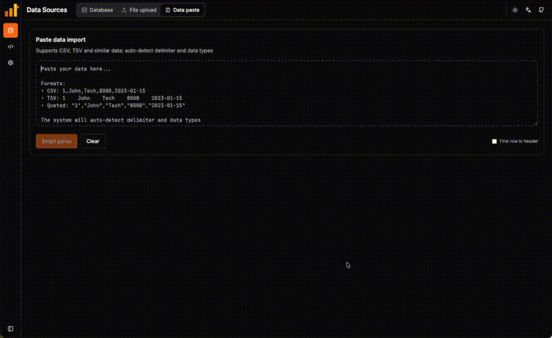
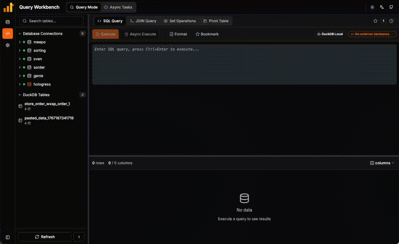

<p align="center">
  
</p>

<h1 align="center">DuckQuery</h1>

<p align="center">
  <b>The missing UI for DuckDB. Query any file, any database, zero config.</b>
</p>

<p align="center">
  <a href="#quick-start">Quick Start</a> •
  <a href="#what-can-you-do">What Can You Do</a> •
  <a href="#deployment">Deployment</a> •
  <a href="README_zh.md">中文</a>
</p>

<p align="center">
  
  
  
</p>

---

## Quick Start

**One command to launch:**

```bash
git clone https://github.com/Chenkeliang/duckdb-query.git && cd duckdb-query && ./quick-start.sh
```

Open **http://localhost:3000** and start querying.

---

## Demo

### Data Source Upload


### Query Workbench


---

## What Can You Do

| Action | How |
|--------|-----|
| 📥 **Paste CSV/TSV from anywhere** | Copy cells from any source, paste directly as a new table. |
| 📂 **Query any file** | Drag CSV/Excel/Parquet/JSON into the browser. Instant table. |
| 🗄️ **Connect databases** | Add MySQL/PostgreSQL. Query alongside local files. |
| 🔗 **Cross-source JOIN** | `SELECT * FROM local_csv JOIN mysql_db.users ON ...` |
| 📊 **Visual Builder** | No SQL needed, select tables to build JOINs, Pivots, and Unions. |
| 🌐 **Import from URL** | Enter a CSV/Parquet/JSON link, auto-import to DuckDB. |
| 🌙 **Dark Mode & i18n** | Switch themes and languages (EN/中文) instantly. |

---

## How It Works

```
┌─────────────────┐      ┌─────────────────┐      ┌─────────────────┐
│  Your Files     │      │  DuckQuery      │      │  Your Databases │
│  CSV/Excel/...  │ ───► │  (DuckDB Core)  │ ◄─── │  MySQL/Postgres │
└─────────────────┘      └────────┬────────┘      └─────────────────┘
                                  │
                                  ▼
                         ┌─────────────────┐
                         │   SQL + Visual  │
                         │   Query Results │
                         └─────────────────┘
```

Files are imported as **native DuckDB tables** for lightning-fast queries. External databases are connected via DuckDB's `ATTACH` mechanism.

---

## Deployment

### Docker (Recommended)

```bash
./quick-start.sh
# Or manually:
docker-compose up -d --build
```

| Service | URL |
|---------|-----|
| Frontend | http://localhost:3000 |
| API Docs | http://localhost:8001/docs |

### Local Development

```bash
# Backend
cd api && pip install -r requirements.txt && uvicorn main:app --reload

# Frontend
cd frontend && npm install && npm run dev
```

---

## Configuration

DuckQuery works out-of-the-box. For advanced setups, edit `config/app-config.json`:

| Setting | Default | What it does |
|---------|---------|-------------|
| `duckdb_memory_limit` | `8GB` | Max RAM for DuckDB |
| `server_data_mounts` | `[]` | Mount host directories for direct file access |
| `cors_origins` | `[localhost:3000]` | Allowed frontend origins |

👉 **[Full Configuration Reference →](docs/configuration.md)**

---

## FAQ

<details>
<summary><b>Docker: How to query files without uploading?</b></summary>

Mount your data directory in `docker-compose.yml`:
```yaml
volumes:
  - /your/data/path:/app/server_mounts
```
Then add to `config/app-config.json`:
```json
"server_data_mounts": [{"label": "My Data", "path": "/app/server_mounts"}]
```
</details>

<details>
<summary><b>Local Dev: How to query files without uploading?</b></summary>

Configure local folder in `config/app-config.json`:
```json
"server_data_mounts": [{"label": "My Data", "path": "/Users/yourname/data-folder"}]
```
Restart the backend, then browse and import files from the "Server Directory" tab in the data source page.
</details>

<details>
<summary><b>Docker: How to change default ports?</b></summary>

Edit `docker-compose.yml`:
```yaml
services:
  backend:
    ports: ["9000:8000"]  # Backend on 9000
  frontend:
    ports: ["8080:80"]    # Frontend on 8080
```
</details>

<details>
<summary><b>Local Dev: How to change default ports?</b></summary>

**Backend port** (default 8000):
```bash
cd api && uvicorn main:app --reload --port 9000
```

**Frontend port** (default 5173):
Add `port` to the `server` block in `frontend/vite.config.js`:
```javascript
server: {
  port: 3000,  // Add this line
  proxy: {
    // ... existing config
  },
},
```
Or specify at startup:
```bash
cd frontend && npm run dev -- --port 3000
```

**CORS Note**: Default allows `localhost:3000` and `localhost:5173`. For other ports, add to `config/app-config.json`:
```json
"cors_origins": ["http://localhost:3000", "http://localhost:5173", "http://localhost:YOUR_PORT"]
```
</details>

---

## Acknowledgments

- [DuckDB](https://duckdb.org/) — High-performance embedded analytical database
- [FastAPI](https://fastapi.tiangolo.com/) — Modern Python API framework
- [React](https://react.dev/) — Frontend UI framework
- [Kiro](https://kiro.dev/) — AI-assisted development
- [Claude](https://claude.ai/) — AI coding assistant
- [Gemini](https://gemini.google.com/) — AI coding assistant
- [Codex](https://openai.com/blog/openai-codex) — AI coding assistant

---

## License

This project is licensed under the MIT License. See the [LICENSE](LICENSE) file for details.

MIT © [Chenkeliang](https://github.com/Chenkeliang)
