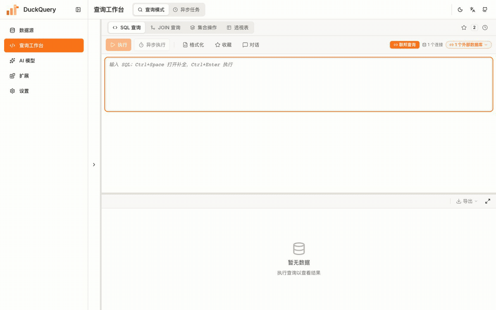
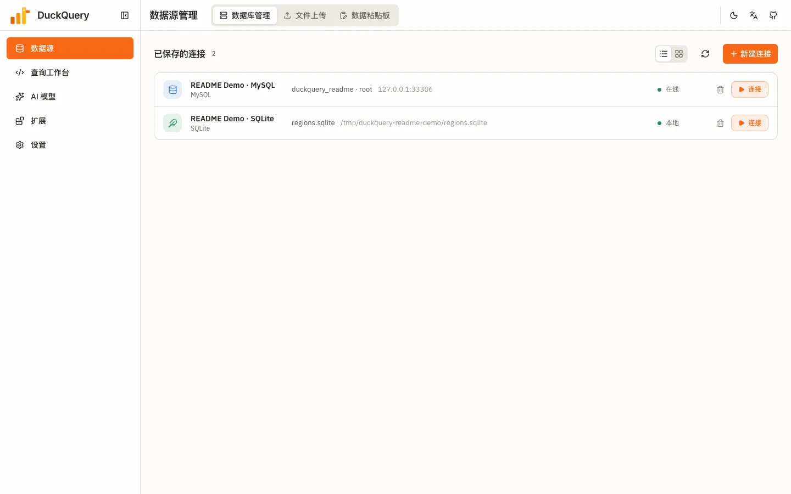
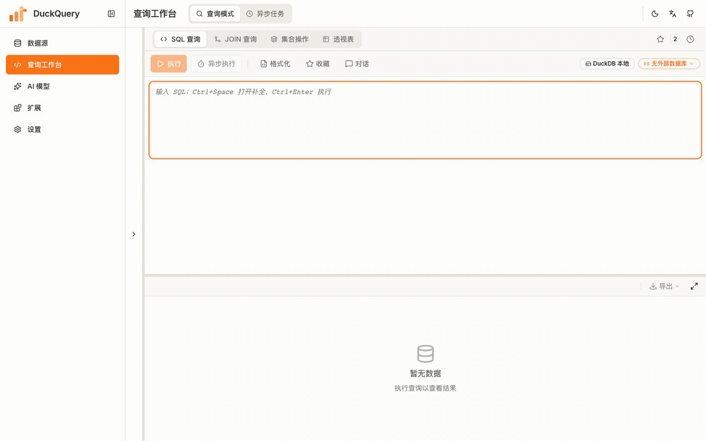
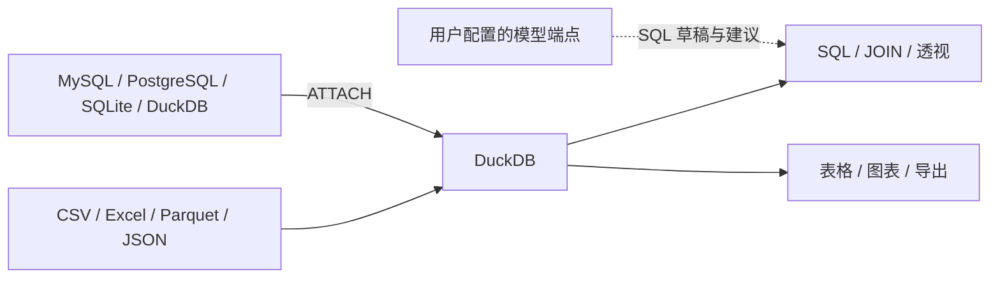

<p align="center">
  
</p>

<h1 align="center">DuckQuery</h1>

<p align="center">
  <strong>本地优先的 AI 可视化 SQL 工作台</strong><br>
  一条 SQL 联查本地文件、MySQL / PostgreSQL，以及 SQLite / DuckDB 数据库文件。<br>
  直接写 SQL，或让 AI 起草后由你确认执行。
</p>

<p align="center">
  <a href="https://github.com/Chenkeliang/duckdb-query/releases/latest"></a>
  <a href="https://chenkeliang.github.io/duckdb-query/"></a>
  <a href="LICENSE"></a>
</p>

<p align="center">
  <a href="https://github.com/Chenkeliang/duckdb-query/releases/latest"><strong>下载桌面版</strong></a>
  · <a href="https://chenkeliang.github.io/duckdb-query/">在线 Demo</a>
  · <a href="#立即开始">Docker 自托管</a>
  · <a href="README_en.md">English</a>
</p>

<p align="center">
  <sub>在线 Demo 仅支持浏览器内 DuckDB-Wasm，不含 AI、数据库连接和 Excel。AI 功能会调用你配置的模型端点。</sub>
</p>

<p align="center">
  <a href="#30-秒看懂">30 秒看懂</a> ·
  <a href="#核心能力">核心能力</a> ·
  <a href="#为什么选-duckquery">为什么选 DuckQuery</a> ·
  <a href="#立即开始">立即开始</a> ·
  <a href="#技术与数据边界">技术与数据边界</a> ·
  <a href="#mcp-接入">MCP 接入</a>
</p>

<p align="center">
  
</p>

## 30 秒看懂

1. **接入数据**：上传文件成为 DuckDB 表，或保存 SQLite、MySQL、PostgreSQL、DuckDB 文件连接。

   

2. **让 AI 起草 SQL**：AI 根据当前表结构生成草稿；你可以先检查、插入编辑器，再手动执行。

   

3. **查看与探索结果**：同一份真实查询结果可在 DataGrid 与图表之间切换，并继续下钻或导出。

## 核心能力

- **文件与数据导入**：CSV、Excel、Parquet、JSON、JSONL；支持粘贴表格、URL 导入、服务器挂载目录和 Excel 多工作表选择。
- **数据库与跨源查询**：连接 MySQL、PostgreSQL、SQLite、DuckDB 文件，通过 DuckDB `ATTACH` 与本地表一起查询。
- **完整查询工作流**：CodeMirror SQL 编辑器、JOIN 工作台、集合运算、透视表、异步任务、查询取消、收藏与历史。
- **可选 AI 辅助**：问数与对话、报错医生、SQL 解释、图表建议；使用你配置的模型供应商与端点。Web 工作台中的 SQL 草稿不会自动执行。
- **结果分析与导出**：虚拟滚动 DataGrid；柱状、折线、面积、饼图、环形图、KPI 六类图表；点击图元生成明细 SQL。网格支持 CSV / Excel / JSON，查询结果还可导出 Parquet。
- **MCP 自动化**：24 个工具覆盖查询、发现、数据接入、转换、AI 设置与导出，并提供 `read-only`、`normal`、`full` 三种运行模式。

## 为什么选 DuckQuery

- **数据库 GUI**（DBeaver、TablePlus 等）以数据库连接为中心，本地 CSV / Excel 通常要先导入建表才能参与查询。
- **BI 平台**（Metabase、Superset 等）擅长固化看板，临时分析往往要先配数据源、甚至建仓跑 ETL。
- **DuckQuery** 补的是中间这块：文件拖进来即成表，远程库 `ATTACH` 即入查询，一条 SQL 跨源 JOIN；AI 起草 SQL，由你确认执行。

## 立即开始

| 形态 | 适合场景 | 说明 |
|---|---|---|
| **桌面版** | 本机直接使用 | macOS Apple Silicon / Intel、Windows x64；内置后端并支持应用内更新 |
| **在线 Demo** | 免安装体验 SQL | 仅 DuckDB-Wasm；不含 AI、数据库连接和 Excel |
| **Docker** | 自托管前后端 | 需要 Docker 与 Docker Compose；数据保存在宿主机 `./data` |

**桌面版**：从 [GitHub Releases](https://github.com/Chenkeliang/duckdb-query/releases/latest) 下载 `.dmg` 或 Windows 安装程序。当前没有 Linux 安装包；安装包没有 Apple / Microsoft 官方开发者证书签名，首次启动可能触发系统警告。

首次启动被拦截时：Windows 选择「更多信息」→「仍要运行」；macOS 将 App 拖入「应用程序」后，在终端执行 `xattr -cr /Applications/DuckQuery.app`。完整步骤见 [桌面版使用手册](docs/guide/桌面版使用手册.md#2-安装时弹出警告怎么办)。

**在线 Demo**：[在浏览器中打开](https://chenkeliang.github.io/duckdb-query/)，可查询示例数据，或导入 CSV / TSV / Parquet / JSON。

**Docker**：

```bash
git clone https://github.com/Chenkeliang/duckdb-query.git
cd duckdb-query
./quick-start.sh
```

启动后访问：

- Web UI：<http://localhost:48000>
- API 文档：<http://localhost:48001/docs>
- 持久化数据：宿主机 `./data`（bind mount，重建容器不会删除已导入表）

更多说明见 [配置参考](docs/CONFIGURATION_ZH.md) 与 [桌面版使用手册](docs/guide/桌面版使用手册.md)。

### Docker 镜像与数据

`quick-start.sh` 默认只把前端构建使用的 Node / Nginx 基础镜像切到 DaoCloud；可稳定访问 Docker Hub 时，可用 `USE_DOCKER_HUB=1 ./quick-start.sh` 切回官方镜像，也可编辑根目录 `.env` 中的 `NODE_IMAGE` / `NGINX_IMAGE`。后端仍需从 Docker Hub 拉取 `python:3.12-bookworm`，构建时还会下载 DuckDB 扩展；镜像与扩展源能否访问取决于当前网络。

`./data` 是宿主机目录，不随容器重建删除；清理前请先确认并备份需要保留的数据。

## 技术与数据边界


```mermaid
flowchart LR
  F[CSV / Excel / Parquet / JSON] --> D[DuckDB]
  R[MySQL / PostgreSQL / SQLite / DuckDB] -->|ATTACH| D
  D --> Q[SQL / JOIN / 透视]
  D --> V[表格 / 图表 / 导出]
  L[用户配置的模型端点] -. SQL 草稿与建议 .-> Q
```

导入的文件会成为当前实例中的 DuckDB 表；外部数据库通过 DuckDB `ATTACH` 参与查询。查询结果进入 DataGrid、图表与导出流程。

- **本地存储**：桌面版或自托管实例中的表与连接设置保存在该实例的数据目录。
- **外部访问**：联邦查询会连接你配置的数据库，URL 导入会访问目标地址，桌面版检查更新时会访问 GitHub Releases。
- **AI 数据**：按具体功能，表结构、SQL、错误上下文或有限的结果样例可能发送到你配置的模型端点。
- **执行边界**：Web UI 中 AI 生成的 SQL 只会作为草稿插入编辑器，须由你确认执行。

## MCP 接入

先启动桌面版或 Docker 后端，再运行独立 MCP server：

```bash
uvx duckquery-mcp
```

Claude Code：

```bash
claude mcp add duckquery -- uvx duckquery-mcp
```

Cursor / Codex 的 `mcp.json`：

```json
{
  "mcpServers": {
    "duckquery": {
      "command": "uvx",
      "args": ["duckquery-mcp"],
      "env": { "DUCKQUERY_MCP_MODE": "normal" }
    }
  }
}
```

`DUCKQUERY_MCP_MODE`：

- `read-only`：只注册读取类工具；写入型 SQL 和其他变更请求会被阻止，即使传入 `confirm=true`。
- `normal`（默认）：开放写工具；修改表、保存连接、导入数据、执行写入型 SQL，以及非 GET 通用请求需要 `confirm=true`。
- `full`：跳过上述 `confirm` 门控，适合由调用方自行承担安全控制的环境。

连接后，MCP 客户端会读取这些工具的实时 schema 与参数说明。MCP 会自动发现正在运行的后端；多个后端同时运行时，可用 `DUCKQUERY_API_BASE=http://127.0.0.1:48001` 指定其一。完整说明见 [mcp/README.md](mcp/README.md)。

---

如果 DuckQuery 对你有用，欢迎点个 ⭐ Star，让更多人发现它。

[文档索引](docs/README.md) · [API 契约](docs/API_CONTRACT_FE_BE.md) · [Issues](https://github.com/Chenkeliang/duckdb-query/issues) · [参与贡献](CONTRIBUTING.md) · [行为准则（英文）](CODE_OF_CONDUCT.md) · [MIT License](LICENSE)
