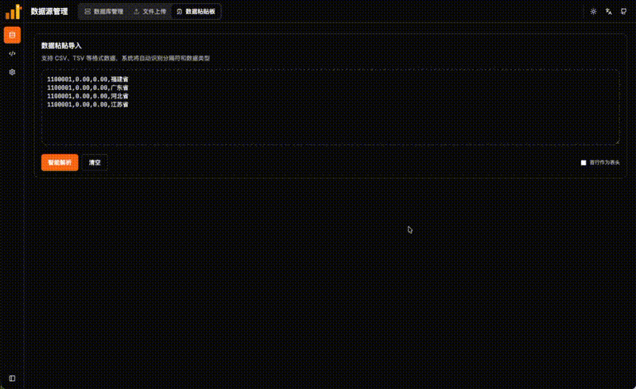
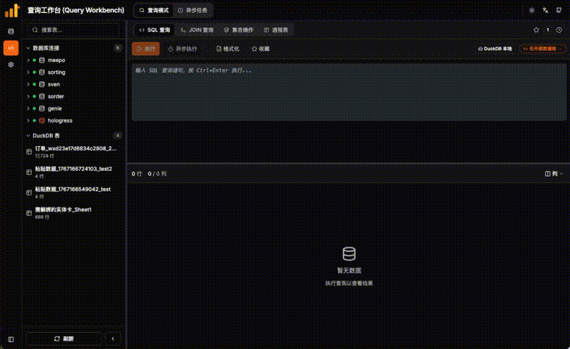

<p align="center">
  
</p>

<h1 align="center">DuckQuery</h1>

  <b>文件与数据库的 AI 可视化 SQL 工作台。</b><br>
  <b>用大白话提问或直接写 SQL，跨本地文件（Excel/CSV/JSON）与远程数据库（MySQL/PG）一站式分析 —— 跨源、免 ETL。</b>
</p>

<p align="center">
  <sub>写给在本地文件与在线数据库之间来回折腾的分析师和工程师 —— 不建仓、不写脚本。</sub>
</p>

<p align="center">
  <a href="https://chenkeliang.github.io/duckdb-query/">在线 Demo</a> •
  <a href="#快速开始">快速开始</a> •
  <a href="#你能做什么">你能做什么</a> •
  <a href="#部署方式">部署方式</a> •
  <a href="README_en.md">English</a>
</p>

<p align="center">
  <a href="https://chenkeliang.github.io/duckdb-query/"></a>
  
  
  
  
</p>

<p align="center">
  
</p>

---

## 快速开始

### 浏览器内试用（免安装）

对示例表跑真 SQL,或拖入你自己的 CSV / Parquet / JSON —— 全程在浏览器内、基于 **DuckDB-Wasm**。

👉 **[打开在线 Demo](https://chenkeliang.github.io/duckdb-query/)**

> 连接 MySQL / Postgres 与 AI 功能跑在后端,需要下面的自托管版。

### 自托管（完整功能）

启动全栈版本（Python 后端 + React 前端）—— 直接读写本地文件、连接持久化的 MySQL/Postgres、以及 AI。

**前置依赖：** 需要安装 Docker 和 Docker Compose

```bash
git clone https://github.com/Chenkeliang/duckdb-query.git && cd duckdb-query && ./quick-start.sh
```

打开 **http://localhost:48000** 即可开始查询。

---

## 演示

### 数据源上传


### 查询工作台


---

## 你能做什么

| 功能 | 操作方式 |
|------|---------|
| 🧠 **用大白话提问（问数 Text-to-SQL）** | 和数据对话，AI 起草 SQL，你确认后再执行 —— **绝不自动运行**。 |
| 🩺 **AI 报错医生** | 查询报错时，给出中文诊断 + 修正后的 SQL（懂你的表结构，含联邦表）。 |
| 📈 **AI 图表推荐** | 一键把结果集变成合适的图表 —— 柱 / 折线 / 饼 / 大数字。 |
| 📥 **从任意处粘贴CSV/TSV** | 复制单元格，直接粘贴创建新表。 |
| 📂 **查询任意文件** | 拖拽 CSV/Excel/Parquet/JSON 到浏览器，即刻生成表。 |
| 🗄️ **连接外部数据库** | 添加 MySQL/PostgreSQL 连接，与本地文件一起查询。 |
| 🔗 **跨数据源 JOIN** | `SELECT * FROM 本地表 JOIN mysql_db.users ON ...` |
| 📊 **透视 / JOIN / 集合** | SQL 编辑器 + JOIN 工作台 + 透视表 + 集合运算（无独立「可视化构建器」Tab）。 |
| 🌐 **从 URL 导入** | 输入 CSV/Parquet/JSON 链接，自动导入 DuckDB。 |
| 🌙 **深色模式 & 多语言** | 一键切换主题和语言（中文/English）。 |

---

## 工作原理

```
┌─────────────────┐      ┌─────────────────┐      ┌─────────────────┐
│  你的文件        │      │   DuckQuery     │      │  你的数据库      │
│  CSV/Excel/...  │ ───► │  (DuckDB 引擎)  │ ◄─── │  MySQL/Postgres │
└─────────────────┘      └────────┬────────┘      └─────────────────┘
                                  │
                                  ▼
                         ┌─────────────────┐
                         │  SQL + 可视化    │
                         │    查询结果      │
                         └─────────────────┘
```

文件被导入为 **DuckDB 原生表**，查询速度极快。外部数据库通过 DuckDB 的 `ATTACH` 机制连接。

---

## 为什么选 DuckQuery？

多数工具让你二选一：**数据库 GUI**（DBeaver、TablePlus）碰不了本地 CSV；**BI 工具**（Metabase、Superset）又要先建仓库、跑 ETL。DuckQuery 补上中间这块 —— 同时对着文件和数据库、一条 SQL 跨源 JOIN，还能让 AI 帮你写 SQL。

| | **DuckQuery** | DBeaver / TablePlus | Metabase / Superset |
|---|:---:|:---:|:---:|
| 查询本地 CSV / Excel / Parquet | ✅ 原生 | ⚠️ 需先导入 | ❌ |
| 一条 SQL JOIN 文件 ↔ MySQL/PG | ✅ | ❌ | ❌ |
| 自然语言生成 SQL（AI） | ✅ 内置 | ❌ | ⚠️ 付费/受限 |
| 免 ETL / 免数仓 | ✅ | ✅ | ❌ |
| 完全本地 / 可自托管 | ✅ | ✅ | ⚠️ 需服务端 |
| 上手到第一条查询 | 几秒 | 几分钟 | 几小时 |

基于 **DuckDB** 进程内分析引擎 —— 1 GB 的 CSV 与远程表毫秒级 JOIN，无需维护任何数据管道。

---

## 部署方式

### Docker 启动（推荐）

```bash
git clone https://github.com/Chenkeliang/duckdb-query.git
cd duckdb-query
./quick-start.sh
```

| 服务 | 地址 |
|------|------|
| 前端界面 | http://localhost:48000 |
| API 文档 | http://localhost:48001/docs |

**数据位置**：表与连接配置在宿主机 **`./data`**（Docker 卷绑定）。`./quick-start.sh` 重建容器时**不会**删除 `./data`；日志里的 `Removed` 一般指旧容器被替换，不是删库。

**国内拉取镜像超时**（`node:24-alpine` 连接 docker.io 失败时）：

- 脚本默认使用 DaoCloud 镜像；首次运行会自动从 `.env.docker.cn.example` 生成 `.env`。
- 也可手动：`cp .env.docker.cn.example .env` 后执行 `docker compose up -d --build`。
- 能稳定访问 Docker Hub 时：`USE_DOCKER_HUB=1 ./quick-start.sh`。

**仅重建前端**（保留 `./data`）：

```bash
docker compose up -d --build frontend
```

**完全停止服务**（仍保留 `./data`）：`docker compose down`（请勿随意使用 `down -v`）。

### 本地开发

```bash
# 后端（http://localhost:48001 ，文档 /docs）
cd api && pip install -r requirements.txt && uvicorn main:app --reload --port 48001

# 前端（http://localhost:48000 ，/api 由 Vite 代理到后端）
cd frontend && npm install && npm run dev
```

本地查询走 `POST /api/duckdb/execute`（本地表）与 `POST /api/duckdb/federated-query`（外部库 ATTACH），勿使用旧版 `POST /api/execute_sql`。端点清单见 [`docs/API_CONTRACT_FE_BE.md`](docs/API_CONTRACT_FE_BE.md)，执行流程见 [`docs/frontend/QUERY_EXECUTION_FLOW.md`](docs/frontend/QUERY_EXECUTION_FLOW.md)。

---

## 配置说明

DuckQuery 开箱即用。如需高级配置，编辑 `config/app-config.json`：

| 配置项 | 默认值 | 作用 |
|--------|--------|------|
| `duckdb_memory_limit` | `8GB` | DuckDB 最大内存 |
| `server_data_mounts` | `[]` | 挂载宿主机目录用于直接读取文件 |
| `cors_origins` | `3000`、`5173` | 允许的前端访问源 |

👉 **[完整配置参考 →](docs/CONFIGURATION_ZH.md)**

---

## 常见问题

<details>
<summary><b>Docker 如何不上传文件直接查询？</b></summary>

在 `docker-compose.yml` 中挂载目录：
```yaml
volumes:
  - /你的数据路径:/app/server_mounts
```
然后在 `config/app-config.json` 添加：
```json
"server_data_mounts": [{"label": "我的数据", "path": "/app/server_mounts"}]
```
</details>

<details>
<summary><b>本地开发如何不上传文件直接查询？</b></summary>

在 `config/app-config.json` 中配置本地文件夹：
```json
"server_data_mounts": [{"label": "我的数据", "path": "/Users/你的用户名/数据目录"}]
```
重启后端服务后，在数据源页面的"服务器目录"标签页可直接浏览和导入文件。
</details>

<details>
<summary><b>Docker 如何修改默认端口？</b></summary>

编辑 `docker-compose.yml`：
```yaml
services:
  backend:
    ports: ["48001:8000"]  # 改左边宿主端口（默认 48001）
  frontend:
    ports: ["48000:80"]    # 改左边宿主端口（默认 48000）
```
</details>

<details>
<summary><b>本地开发如何修改默认端口？</b></summary>

**后端端口**（默认 48001）：
```bash
cd api && uvicorn main:app --reload --port 48001
```

**前端端口**（默认 48000）：
在 `frontend/vite.config.js` 的 `server.port` 改成你要的端口：
```javascript
server: {
  port: 48000,  // 改这里
  proxy: {
    // ... 现有配置
  },
},
```
或启动时指定：
```bash
cd frontend && npm run dev -- --port 48000
```

**注意跨域配置**：默认允许 `localhost:48000`。如使用其他端口，需在 `config/app-config.json` 添加：
```json
"cors_origins": ["http://localhost:48000", "http://localhost:你的端口"]
```
</details>

<details>
<summary><b>Docker 重新部署会删掉我的表吗？</b></summary>

不会。DuckDB 文件在宿主机 **`./data`**，`docker compose up -d --build` 只替换容器。`docker compose down` 停止容器，也**不删** `./data`。请勿对生产数据执行 `docker compose down -v`（若将来引入命名卷）。WAL 异常时可参考 `./scripts/repair-duckdb-wal.sh`。
</details>

---

## 喜欢的话

如果 DuckQuery 帮你省了一段弯路，点个 star 能让更多人找到它。

<p align="center">
  <a href="https://github.com/Chenkeliang/duckdb-query">⭐ 在 GitHub 上 Star</a> &nbsp;·&nbsp;
  <a href="https://chenkeliang.github.io/duckdb-query/">🚀 试用在线 Demo</a> &nbsp;·&nbsp;
  <a href="https://github.com/Chenkeliang/duckdb-query/issues">🛠 提 issue / 参与贡献</a>
</p>

---

## 许可证

本项目采用 MIT 许可证开源，详见 [LICENSE](LICENSE) 文件。

MIT © [Chenkeliang](https://github.com/Chenkeliang)
