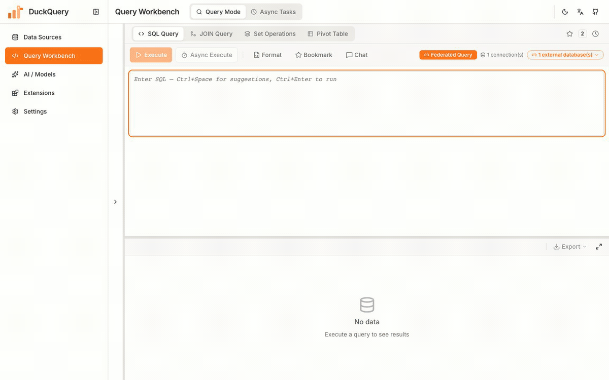
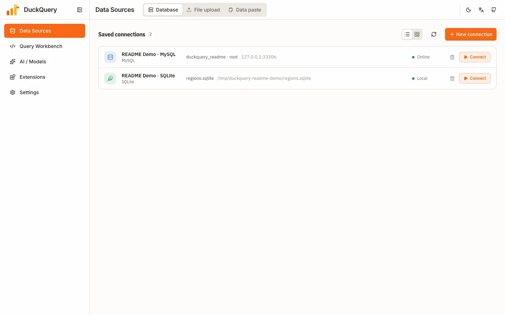
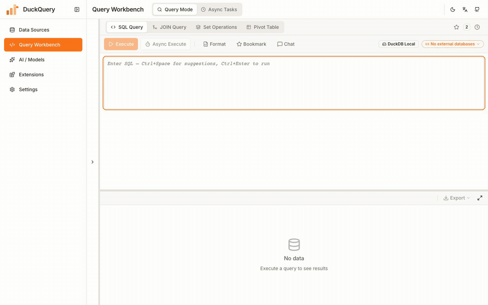
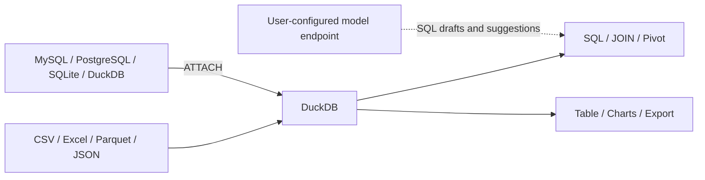

<p align="center">
  
</p>

<h1 align="center">DuckQuery</h1>

<p align="center">
  <strong>The local-first AI visual SQL workbench</strong><br>
  Query local files, MySQL / PostgreSQL, and SQLite / DuckDB database files together in one SQL statement.<br>
  Write SQL directly, or let AI draft it for your review before execution.
</p>

<p align="center">
  <a href="https://github.com/Chenkeliang/duckdb-query/releases/latest"></a>
  <a href="https://chenkeliang.github.io/duckdb-query/"></a>
  <a href="LICENSE"></a>
</p>

<p align="center">
  <a href="https://github.com/Chenkeliang/duckdb-query/releases/latest"><strong>Download Desktop</strong></a>
  · <a href="https://chenkeliang.github.io/duckdb-query/">Online Demo</a>
  · <a href="#get-started">Docker Self-hosting</a>
  · <a href="README.md">中文</a>
</p>

<p align="center">
  <sub>The online Demo runs DuckDB-Wasm in your browser only; it does not include AI, database connections, or Excel. AI features call the model endpoint you configure.</sub>
</p>

<p align="center">
  <a href="#see-it-in-30-seconds">See It in 30 Seconds</a> ·
  <a href="#core-capabilities">Core Capabilities</a> ·
  <a href="#why-duckquery">Why DuckQuery</a> ·
  <a href="#get-started">Get Started</a> ·
  <a href="#architecture--data-boundaries">Architecture &amp; Data Boundaries</a> ·
  <a href="#mcp-integration">MCP Integration</a>
</p>

<p align="center">
  
</p>

## See It in 30 Seconds

1. **Connect data**: upload files as DuckDB tables, or save SQLite, MySQL, PostgreSQL, and DuckDB file connections.

   

2. **Let AI draft SQL**: AI uses the current schema to produce a draft that you can inspect, insert into the editor, and run manually.

   

3. **Explore results**: switch a real query result between the DataGrid and charts, then drill down or export.

## Core Capabilities

- **Files and ingestion**: CSV, Excel, Parquet, JSON, and JSONL; paste tabular data, import URLs, browse server-mounted directories, and select multiple Excel sheets.
- **Databases and federation**: connect MySQL, PostgreSQL, SQLite, and DuckDB files, then query them alongside local tables through DuckDB `ATTACH`.
- **Complete query workflow**: CodeMirror SQL editor, JOIN workbench, set operations, pivot tables, async tasks, query cancellation, bookmarks, and history.
- **Optional AI assistance**: a data agent (inspects schemas, verifies real values, dry-runs read-only row-capped queries before answering — every step visible and stoppable), plus data chat, error doctor, SQL explanation, and chart suggestions; uses the model provider and endpoint you configure. AI-drafted SQL is only inserted into the editor for you to run; the agent's probe queries are read-only, row-capped and cancellable.
- **Ask your databases directly**: add a connected MySQL / PostgreSQL / SQLite / DuckDB to the question scope and ask in plain language — one answer can draw on local tables and remote ones together. Adding a connection reads **only its structure (table and column names); no data rows are loaded**, and values arrive solely through row-capped read-only queries. A scope bar sits at the top of the drawer, and every answer states which databases it actually queried.
- **Results and export**: virtualized DataGrid; bar, line, area, pie, donut, and KPI charts; click a chart element to generate detail SQL. The grid exports CSV / Excel / JSON, and query results can also be exported as Parquet.
- **MCP automation**: 24 tools for querying, discovery, ingestion, transforms, AI settings, and export, with `read-only`, `normal`, and `full` modes.

## Why DuckQuery

- **Database GUIs** (DBeaver, TablePlus, …) center on database connections; local CSV / Excel files usually need to be imported as tables first.
- **BI platforms** (Metabase, Superset, …) excel at durable dashboards; ad-hoc analysis often means configuring sources or even building a warehouse with ETL first.
- **DuckQuery** covers the middle ground: drop in a file to get a table, `ATTACH` a remote database, and JOIN both in one SQL statement — with AI drafting SQL that you review and run.

## Get Started

| Form | Best for | Notes |
|---|---|---|
| **Desktop** | Direct local use | macOS Apple Silicon / Intel and Windows x64; bundled backend and in-app updates |
| **Online Demo** | Trying SQL without installation | DuckDB-Wasm only; no AI, database connections, or Excel |
| **Docker** | Self-hosting frontend and backend | Requires Docker and Docker Compose; data persists on the host under `./data` |

**Desktop**: download **one installer** from [GitHub Releases](https://github.com/Chenkeliang/duckdb-query/releases/latest) using the table below (the `.sig`, `.app.tar.gz`, and `latest.json` files on the release page belong to the in-app auto-updater — you don't need them):

| Your machine | Standard (recommended, smaller) | Offline full bundle (air-gapped) |
|---|---|---|
| **Windows 10 / 11 (64-bit)** | `*_x64-setup.exe` | `*_x64-offline-setup.exe` |
| **Mac · Apple Silicon (M1–M4)** | `*_aarch64.dmg` | `*_aarch64-offline.dmg` |
| **Mac · Intel** | `*_x64.dmg` | `*_x64-offline.dmg` |

How to choose: with normal internet access, use the **standard** installer — DuckDB extensions (MySQL / PostgreSQL / remote files) download automatically on first use, and the Windows installer fetches WebView2 online. In air-gapped or restricted networks, use the **`-offline`** bundle — all extensions plus the WebView2 offline installer are built in, so nothing needs the network. Not sure which Mac chip you have? Apple menu → "About This Mac": Apple M-series → `aarch64`, Intel → `x64`.

There is currently no Linux package. The installers are not signed with official Apple / Microsoft developer certificates, so the OS may warn on first launch.

If first launch is blocked, choose **More info → Run anyway** on Windows. On macOS, move the app to **Applications**, then run `xattr -cr /Applications/DuckQuery.app` in Terminal. See the [desktop guide (Chinese)](docs/guide/桌面版使用手册.md#2-安装时弹出警告怎么办) for full steps.

**Online Demo**: [open it in your browser](https://chenkeliang.github.io/duckdb-query/) to query sample data or import CSV / TSV / Parquet / JSON.

**Docker**:

```bash
git clone https://github.com/Chenkeliang/duckdb-query.git
cd duckdb-query
./quick-start.sh
```

After startup:

- Web UI: <http://localhost:48000>
- API docs: <http://localhost:48001/docs>
- Persistent data: host directory `./data` (a bind mount that survives container rebuilds)

See the [configuration reference](docs/CONFIGURATION.md) and [desktop guide (Chinese)](docs/guide/桌面版使用手册.md) for more.

### Docker Images and Data

`quick-start.sh` defaults only the frontend Node / Nginx base images to DaoCloud. If Docker Hub is reachable from your network, run `USE_DOCKER_HUB=1 ./quick-start.sh` to use the official images instead, or override `NODE_IMAGE` / `NGINX_IMAGE` in the root `.env`. The backend still pulls `python:3.12-bookworm` from Docker Hub and downloads DuckDB extensions during the build, so availability depends on your current network.

`./data` is a host directory and is not removed by rebuilding containers. Confirm and back up anything you need before deleting it manually.

## Architecture & Data Boundaries



Imported files become DuckDB tables in the current instance. External databases participate in queries through DuckDB `ATTACH`. Results flow into the DataGrid, charts, and export tools.

- **Local storage**: tables and connection settings for a desktop or self-hosted instance are stored in that instance's data directory.
- **External access**: federated queries contact configured databases, URL imports contact their target addresses, and desktop update checks contact GitHub Releases.
- **AI data**: AI features send schema, SQL, error context, and bounded data samples from local tables (a few real rows and low-cardinality column values to improve generation quality; attached databases are never sampled) to the model endpoint you configure.
- **Execution boundary**: AI-drafted SQL is inserted as a draft and runs only after you confirm it; the data agent itself executes only read-only, row-capped, cancellable probe SELECTs, scoped to local tables and the connections you add to its scope. An answer carrying data must be bound to the read-only SELECT actually executed that turn — an answer whose SQL is empty, not read-only, or never ran is rejected and the run ends honestly rather than returning it as a result.

## MCP Integration

Start the desktop or Docker backend, then run the standalone MCP server:

```bash
uvx duckquery-mcp
```

Claude Code:

```bash
claude mcp add duckquery -- uvx duckquery-mcp
```

For Cursor / Codex, add this to `mcp.json`:

```json
{
  "mcpServers": {
    "duckquery": {
      "command": "uvx",
      "args": ["duckquery-mcp"],
      "env": { "DUCKQUERY_MCP_MODE": "normal" }
    }
  }
}
```

`DUCKQUERY_MCP_MODE`:

- `read-only`: registers read-tier tools only; mutating SQL and other mutation requests are blocked even with `confirm=true`.
- `normal` (default): exposes write tools; changing tables, saving connections, importing data, mutating SQL statements, and non-GET passthrough requests require `confirm=true`.
- `full`: bypasses the confirmation gates above for environments where the caller provides its own safety controls.

Once connected, the MCP client reads the live schemas and parameter descriptions for all tools. The MCP server auto-discovers a running backend; when several are running, set `DUCKQUERY_API_BASE=http://127.0.0.1:48001` to pin one. See [mcp/README.md](mcp/README.md) for details.

---

If DuckQuery is useful to you, a ⭐ star helps more people discover it.

[Documentation (Chinese)](docs/README.md) · [API contract](docs/API_CONTRACT_FE_BE.md) · [Issues](https://github.com/Chenkeliang/duckdb-query/issues) · [Contributing (Chinese)](CONTRIBUTING.md) · [Code of Conduct](CODE_OF_CONDUCT.md) · [MIT License](LICENSE)
