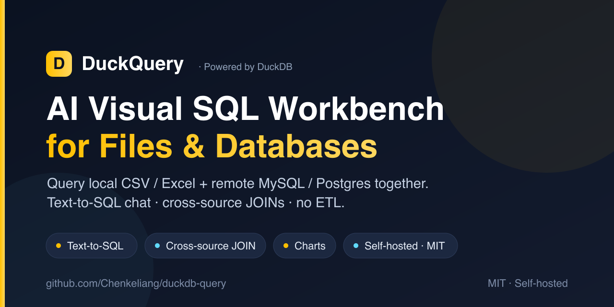
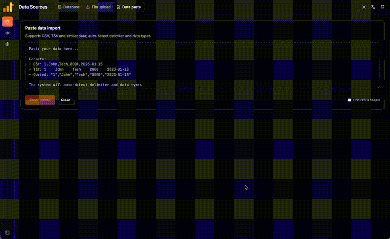
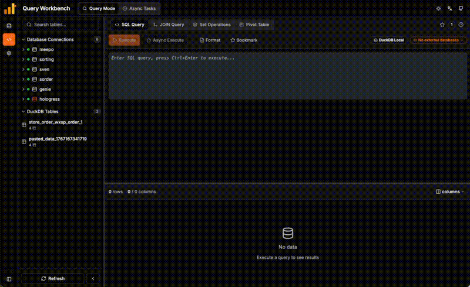

<p align="center">
  
</p>

<h1 align="center">DuckQuery</h1>

  <b>The AI Visual SQL Workbench for Files and Databases.</b><br>
  <b>Ask in plain English or write SQL across local files (Excel/CSV/JSON) and remote databases (MySQL/PG) — one‑stop, cross‑source, no ETL.</b>
</p>

<p align="center">
  <sub>For data analysts & engineers who juggle local files and live databases — no warehouse, no pipeline.</sub>
</p>

<p align="center">
  <a href="https://chenkeliang.github.io/duckdb-query/">Live Demo</a> •
  <a href="#quick-start">Quick Start</a> •
  <a href="#what-can-you-do">What Can You Do</a> •
  <a href="#deployment">Deployment</a> •
  <a href="README.md">中文</a>
</p>

<p align="center">
  <a href="https://chenkeliang.github.io/duckdb-query/"></a>
  
  
  
  
</p>

<p align="center">
  
</p>

---

## Quick Start

### Try it in your browser (no install)

Run real SQL on the sample tables — or drag in your own CSV / Parquet / JSON — entirely in-browser via **DuckDB-Wasm**.

👉 **[Open the live demo](https://chenkeliang.github.io/duckdb-query/)**

> Connecting MySQL / Postgres and the AI features run on the backend, so they need the self-hosted version below.

### Self-host (full features)

Run the full stack (Python Backend + React Frontend) — local file access, persistent database connections (MySQL / PostgreSQL / SQLite / DuckDB), and AI.

**Prerequisites:** Docker & Docker Compose

```bash
git clone https://github.com/Chenkeliang/duckdb-query.git && cd duckdb-query && ./quick-start.sh
```

Open **http://localhost:48000** and start querying.

> Don't want Docker? The [Desktop App](#desktop-app) below ships native macOS / Windows installers with the backend built in.

---

## Demo

### Data Source Upload


### Query Workbench


---

## What Can You Do

| Action | How |
|--------|-----|
| 🧠 **Ask in plain English (Text-to-SQL)** | Chat with your data; the AI drafts SQL you review before running — **never auto-executed**. |
| 🩺 **AI error doctor** | When a query fails, get a plain-English diagnosis + a fixed SQL suggestion (knows your table schema, incl. federated). |
| 📈 **AI chart suggestions** | One click turns a result set into the right chart — bar / line / pie / KPI. |
| 📥 **Paste CSV/TSV from anywhere** | Copy cells from any source, paste directly as a new table. |
| 📂 **Query any file** | Drag CSV/Excel/Parquet/JSON into the browser. Instant table. |
| 🗄️ **Connect databases** | Add MySQL / PostgreSQL / SQLite / DuckDB. Query alongside local files. |
| 🔗 **Cross-source JOIN** | `SELECT * FROM local_csv JOIN mysql_db.users ON ...` |
| 📊 **Pivot / JOIN / Set ops** | SQL editor + JOIN workbench + pivot + set operations (no separate “visual builder” tab). |
| 🌐 **Import from URL** | Enter a CSV/Parquet/JSON link, auto-import to DuckDB. |
| 🌙 **Dark Mode & i18n** | Switch themes and languages (EN/中文) instantly. |

---

## How It Works

```
┌─────────────────┐      ┌─────────────────┐      ┌─────────────────┐
│  Your Files     │      │  DuckQuery      │      │  Your Databases │
│  CSV/Excel/...  │ ───► │  (DuckDB Core)  │ ◄─── │  MySQL/Postgres │
└─────────────────┘      └────────┬────────┘      └─────────────────┘
                                  │
                                  ▼
                         ┌─────────────────┐
                         │   SQL + Visual  │
                         │   Query Results │
                         └─────────────────┘
```

Files are imported as **native DuckDB tables** for lightning-fast queries. External databases are connected via DuckDB's `ATTACH` mechanism.

---

## Why DuckQuery?

Most tools force a choice: a **database GUI** (DBeaver, TablePlus) that can't touch your local CSVs, or a **BI tool** (Metabase, Superset) that needs a warehouse and ETL first. DuckQuery is the missing middle — point it at files *and* databases, JOIN across them in one query, and let AI write the SQL.

| | **DuckQuery** | DBeaver / TablePlus | Metabase / Superset |
|---|:---:|:---:|:---:|
| Query local CSV / Excel / Parquet | ✅ native | ⚠️ import first | ❌ |
| JOIN files ↔ MySQL/Postgres in one query | ✅ | ❌ | ❌ |
| Text-to-SQL (AI) | ✅ built-in | ❌ | ⚠️ paid/limited |
| No ETL / no warehouse | ✅ | ✅ | ❌ |
| Fully local / self-hosted | ✅ | ✅ | ⚠️ server |
| Time to first query | seconds | minutes | hours |

Built on **DuckDB**, an in-process analytical engine — so a 1 GB CSV joins a remote table in milliseconds, with no data pipeline to maintain.

---

## Deployment

### Docker (Recommended)

```bash
git clone https://github.com/Chenkeliang/duckdb-query.git
cd duckdb-query
./quick-start.sh
```

| Service | URL |
|---------|-----|
| Frontend | http://localhost:48000 |
| API Docs | http://localhost:48001/docs |

**Data**: Tables and connections live on the host in **`./data`** (bind mount). Re-running `./quick-start.sh` or `docker compose up -d --build` **does not** delete `./data`; log lines saying `Removed` refer to old containers, not your database files.

**Slow or failed pulls from docker.io** (e.g. `node:24-alpine`):

- The script defaults to DaoCloud mirror images; on first run it may copy `.env.docker.cn.example` → `.env`.
- Or: `cp .env.docker.cn.example .env` then `docker compose up -d --build`.
- If Docker Hub works reliably: `USE_DOCKER_HUB=1 ./quick-start.sh`.

**Rebuild frontend only** (keeps `./data`):

```bash
docker compose up -d --build frontend
```

**Stop services** (still keeps `./data`): `docker compose down` (avoid `down -v` unless you intend to wipe named volumes).

### Desktop App

Native installers for macOS (Apple Silicon / Intel) and Windows (x64) with the backend bundled in (PyInstaller sidecar) — **no Docker, no terminal required**.

👉 **[Download from GitHub Releases](https://github.com/Chenkeliang/duckdb-query/releases/latest)**

| Platform | Installer |
|----------|-----------|
| macOS Apple Silicon | `.dmg` |
| macOS Intel | `.dmg` |
| Windows x64 | Installer (NSIS) |

- **First launch**: the installers are ad-hoc signed, not signed with an official Apple/Microsoft certificate, so the OS will warn you — on macOS: *System Settings → Privacy & Security → Open Anyway*; on Windows: SmartScreen → *More info → Run anyway*.
- **In-app auto-update**: on launch, the app checks GitHub Releases for a newer version, shows download progress, then installs and relaunches. Update artifacts are signed with a repo-private key and verified against a public key embedded in the app.
- **Feature parity**: local file queries, database connections (MySQL / PostgreSQL / SQLite / DuckDB), and AI all work the same as the self-hosted version (AI still needs a model API key configured in Settings). No Linux build yet.

### Local Development

```bash
# Backend (http://localhost:48001 , docs at /docs)
cd api && pip install -r requirements.txt && uvicorn main:app --reload --port 48001

# Frontend (http://localhost:48000 , /api proxied to backend)
cd frontend && npm install && npm run dev
```

| Service | Default URL | API from browser |
|---------|-------------|------------------|
| Frontend (Vite) | http://localhost:48000 | `/api/*` proxied to backend |
| Backend | http://localhost:48001 | Direct (e.g. `/docs`) |

**Query APIs**: DuckDB local → `POST /api/duckdb/execute`; external / federated → `POST /api/duckdb/federated-query` with ATTACH. Do **not** use legacy `POST /api/execute_sql`. See [`docs/API_CONTRACT_FE_BE.md`](docs/API_CONTRACT_FE_BE.md) and [`docs/frontend/QUERY_EXECUTION_FLOW.md`](docs/frontend/QUERY_EXECUTION_FLOW.md). Cross-source federated JOINs automatically apply **semi-join key pushdown** (the remote side only scans matching keys, no full-table scan), **time-bound suggestions** on audit columns, and a **query-timeout guard** — all transparent to callers.

---

## MCP (drive DuckQuery from an AI CLI)

DuckQuery ships a standalone **MCP server** (`duckquery-mcp`) so MCP-capable AI CLIs — **Claude Code / Cursor / Codex** — can drive it directly: ask questions in natural language, run SQL, add data sources, configure the LLM, export, and more, entirely through AI.

**Prerequisite**: start any one DuckQuery backend first (desktop app / Docker / manual). The MCP server auto-discovers it (reads `runtime.json`, else probes `48001 / 8000 / 8001` and verifies `/health`).

**Run (zero-install)**:

```bash
uvx duckquery-mcp
```

**Add to a CLI**:

```bash
# Claude Code
claude mcp add duckquery -- uvx duckquery-mcp
```

```jsonc
// Cursor / Codex mcp.json
{ "mcpServers": { "duckquery": {
    "command": "uvx", "args": ["duckquery-mcp"],
    "env": { "DUCKQUERY_MCP_MODE": "normal" } } } }
```

**Tools (~24)**: query / NL-to-SQL / explain SQL, list tables & schema, add connection / local file / Excel / URL sources, configure LLM, pivot / set-operations, export — plus a generic passthrough tool for everything else.

**Safety mode** `DUCKQUERY_MCP_MODE`:

- `read-only` — reads only (query / schema / export); all mutating tools hidden;
- `normal` (default) — mutations allowed (write SQL runs directly); only non-GET generic passthrough requires `confirm=true`;
- `full` — no gate.

**Target a specific backend** (when several are running): `DUCKQUERY_API_BASE=http://127.0.0.1:8001`.

See [`mcp/README.md`](mcp/README.md) for details.

---

## Configuration

DuckQuery works out-of-the-box. For advanced setups, edit `config/app-config.json`:

| Setting | Default | What it does |
|---------|---------|-------------|
| `duckdb_memory_limit` | `8GB` | Max RAM for DuckDB |
| `server_data_mounts` | `[]` | Mount host directories for direct file access |
| `cors_origins` | `3000`, `5173` | Allowed frontend origins |

👉 **[Full Configuration Reference →](docs/CONFIGURATION.md)**

---

## FAQ

<details>
<summary><b>Docker: How to query files without uploading?</b></summary>

Mount your data directory in `docker-compose.yml`:
```yaml
volumes:
  - /your/data/path:/app/server_mounts
```
Then add to `config/app-config.json`:
```json
"server_data_mounts": [{"label": "My Data", "path": "/app/server_mounts"}]
```
</details>

<details>
<summary><b>Local Dev: How to query files without uploading?</b></summary>

Configure local folder in `config/app-config.json`:
```json
"server_data_mounts": [{"label": "My Data", "path": "/Users/yourname/data-folder"}]
```
Restart the backend, then browse and import files from the "Server Directory" tab in the data source page.
</details>

<details>
<summary><b>Docker: How to change default ports?</b></summary>

Edit `docker-compose.yml`:
```yaml
services:
  backend:
    ports: ["48001:8000"]  # host port (default 48001)
  frontend:
    ports: ["48000:80"]    # host port (default 48000)
```
</details>

<details>
<summary><b>Local Dev: How to change default ports?</b></summary>

**Backend port** (default 48001):
```bash
cd api && uvicorn main:app --reload --port 48001
```

**Frontend port** (default 48000):
Change `server.port` in `frontend/vite.config.js`:
```javascript
server: {
  port: 48000,  // change here
  proxy: {
    // ... existing config
  },
},
```
Or specify at startup:
```bash
cd frontend && npm run dev -- --port 48000
```

**CORS Note**: Default allows `localhost:48000`. For other ports, add to `config/app-config.json`:
```json
"cors_origins": ["http://localhost:48000", "http://localhost:YOUR_PORT"]
```
</details>

<details>
<summary><b>Will Docker redeploy delete my tables?</b></summary>

No. DuckDB files are on the host under **`./data`**. `docker compose up -d --build` only recreates containers. `docker compose down` stops containers but **does not** remove `./data`. Avoid `docker compose down -v` unless you mean to wipe volumes. For WAL issues see `./scripts/repair-duckdb-wal.sh`.
</details>

---

## Like it?

If DuckQuery saved you a detour, a star helps other people find it.

<p align="center">
  <a href="https://github.com/Chenkeliang/duckdb-query">⭐ Star on GitHub</a> &nbsp;·&nbsp;
  <a href="https://chenkeliang.github.io/duckdb-query/">🚀 Try the live demo</a> &nbsp;·&nbsp;
  <a href="https://github.com/Chenkeliang/duckdb-query/issues">🛠 Open an issue / contribute</a>
</p>

---

## License

This project is licensed under the MIT License. See the [LICENSE](LICENSE) file for details.

MIT © [Chenkeliang](https://github.com/Chenkeliang)
