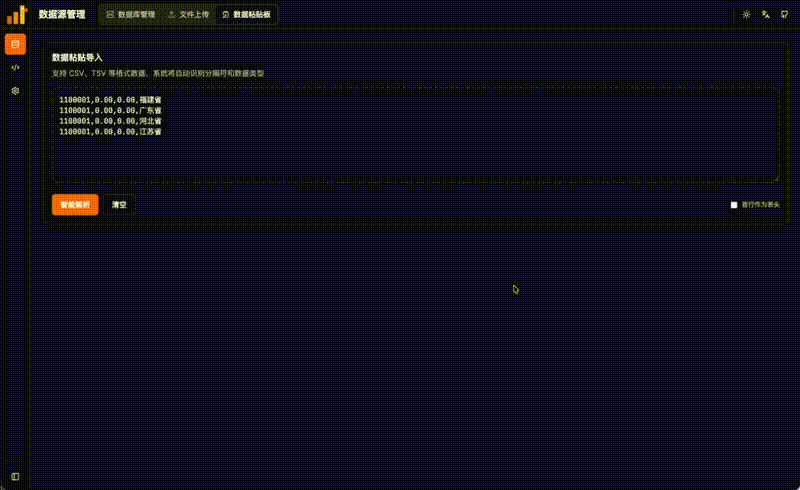
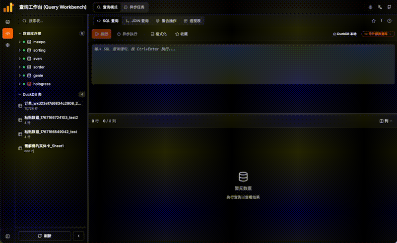

<p align="center">
  
</p>

<h1 align="center">DuckQuery</h1>

  <b>文件与数据库的可视化 SQL 工作台。</b><br>
  <b>无缝连接本地文件（Excel/CSV/JSON）与远程数据库（MySQL/PG）。打破数据孤岛，实现一站式跨源SQL查询分析。</b>
</p>

<p align="center">
  <a href="https://chenkeliang.github.io/duckdb-query/" target="_blank">
    
  </a>

<p align="center">
  <a href="#快速开始">快速开始</a> •
  <a href="#你能做什么">你能做什么</a> •
  <a href="#部署方式">部署方式</a> •
  <a href="README.md">English</a>
</p>

<p align="center">
  
  
  
</p>

---

## 快速开始

**一条命令启动：**

```bash
git clone https://github.com/Chenkeliang/duckdb-query.git && cd duckdb-query && ./quick-start.sh
```

打开 **http://localhost:3000** 即可开始查询。

---

## 演示

### 数据源上传


### 查询工作台


---

## 你能做什么

| 功能 | 操作方式 |
|------|---------|
| 📥 **从任意处粘贴CSV/TSV** | 复制单元格，直接粘贴创建新表。 |
| 📂 **查询任意文件** | 拖拽 CSV/Excel/Parquet/JSON 到浏览器，即刻生成表。 |
| 🗄️ **连接外部数据库** | 添加 MySQL/PostgreSQL 连接，与本地文件一起查询。 |
| 🔗 **跨数据源 JOIN** | `SELECT * FROM 本地表 JOIN mysql_db.users ON ...` |
| 📊 **可视化构建器** | 无需 SQL，选表即可完成 JOIN、透视表、合并操作。 |
| 🌐 **从 URL 导入** | 输入 CSV/Parquet/JSON 链接，自动导入 DuckDB。 |
| 🌙 **深色模式 & 多语言** | 一键切换主题和语言（中文/English）。 |

---

## 工作原理

```
┌─────────────────┐      ┌─────────────────┐      ┌─────────────────┐
│  你的文件        │      │   DuckQuery     │      │  你的数据库      │
│  CSV/Excel/...  │ ───► │  (DuckDB 引擎)  │ ◄─── │  MySQL/Postgres │
└─────────────────┘      └────────┬────────┘      └─────────────────┘
                                  │
                                  ▼
                         ┌─────────────────┐
                         │  SQL + 可视化    │
                         │    查询结果      │
                         └─────────────────┘
```

文件被导入为 **DuckDB 原生表**，查询速度极快。外部数据库通过 DuckDB 的 `ATTACH` 机制连接。

---

## 部署方式

### Docker 启动（推荐）

```bash
./quick-start.sh
# 或手动执行：
docker-compose up -d --build
```

| 服务 | 地址 |
|------|------|
| 前端界面 | http://localhost:3000 |
| API 文档 | http://localhost:8001/docs |

### 本地开发

```bash
# 后端
cd api && pip install -r requirements.txt && uvicorn main:app --reload

# 前端
cd frontend && npm install && npm run dev
```

---

## 配置说明

DuckQuery 开箱即用。如需高级配置，编辑 `config/app-config.json`：

| 配置项 | 默认值 | 作用 |
|--------|--------|------|
| `duckdb_memory_limit` | `8GB` | DuckDB 最大内存 |
| `server_data_mounts` | `[]` | 挂载宿主机目录用于直接读取文件 |
| `cors_origins` | `[localhost:3000]` | 允许的前端访问源 |

👉 **[完整配置参考 →](docs/configuration_zh.md)**

---

## 常见问题

<details>
<summary><b>Docker 如何不上传文件直接查询？</b></summary>

在 `docker-compose.yml` 中挂载目录：
```yaml
volumes:
  - /你的数据路径:/app/server_mounts
```
然后在 `config/app-config.json` 添加：
```json
"server_data_mounts": [{"label": "我的数据", "path": "/app/server_mounts"}]
```
</details>

<details>
<summary><b>本地开发如何不上传文件直接查询？</b></summary>

在 `config/app-config.json` 中配置本地文件夹：
```json
"server_data_mounts": [{"label": "我的数据", "path": "/Users/你的用户名/数据目录"}]
```
重启后端服务后，在数据源页面的"服务器目录"标签页可直接浏览和导入文件。
</details>

<details>
<summary><b>Docker 如何修改默认端口？</b></summary>

编辑 `docker-compose.yml`：
```yaml
services:
  backend:
    ports: ["9000:8000"]  # 后端改为 9000
  frontend:
    ports: ["8080:80"]    # 前端改为 8080
```
</details>

<details>
<summary><b>本地开发如何修改默认端口？</b></summary>

**后端端口**（默认 8000）：
```bash
cd api && uvicorn main:app --reload --port 9000
```

**前端端口**（默认 5173）：
在 `frontend/vite.config.js` 的 `server` 块中添加 `port`：
```javascript
server: {
  port: 3000,  // 添加这一行
  proxy: {
    // ... 现有配置
  },
},
```
或启动时指定：
```bash
cd frontend && npm run dev -- --port 3000
```

**注意跨域配置**：默认允许 `localhost:3000` 和 `localhost:5173`。如使用其他端口，需在 `config/app-config.json` 添加：
```json
"cors_origins": ["http://localhost:3000", "http://localhost:5173", "http://localhost:你的端口"]
```
</details>

---

## 致谢

- [DuckDB](https://duckdb.org/) — 高性能嵌入式分析数据库
- [FastAPI](https://fastapi.tiangolo.com/) — 现代 Python API 框架
- [React](https://react.dev/) — 前端 UI 框架
- [Kiro](https://kiro.dev/) — AI 辅助开发
- [Claude](https://claude.ai/) — AI 编程助手
- [Gemini](https://gemini.google.com/) — AI 编程助手
- [Codex](https://openai.com/blog/openai-codex) — AI 编程助手

---

## 许可证

本项目采用 MIT 许可证开源，详见 [LICENSE](LICENSE) 文件。

MIT © [Chenkeliang](https://github.com/Chenkeliang)
