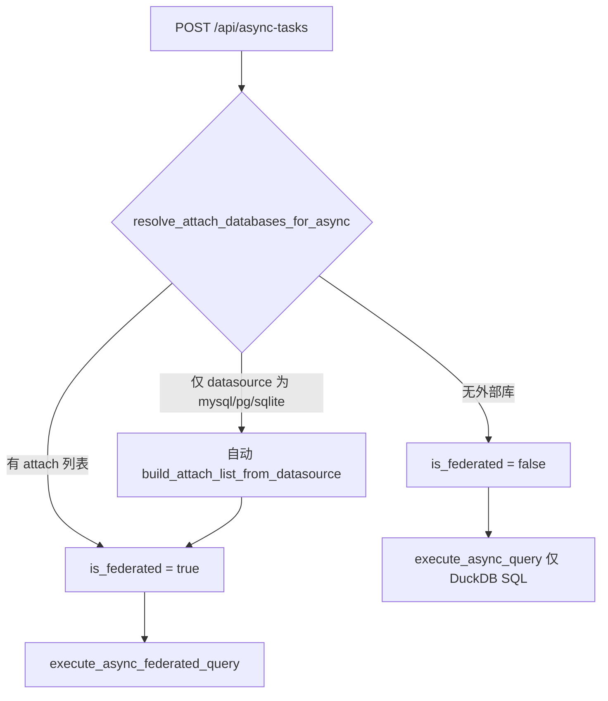

# 阶段 C — 后端查询单轨调用图

> **目标**：外部库异步/遗留同步查询统一走 DuckDB ATTACH + 联邦 SQL，不再经 `db_manager.execute_query` 拉全量 DataFrame。  
> **前提**：Docker `:3000` → nginx `/api/` → `backend:8000`；本地 Vite 代理同源路径。前端业务已不再调用 `execute_sql`（见阶段 B）。

## 1. 同步查询（用户路径 vs 遗留）

| 路径 | 状态 | 调用方（仓库内） | 执行方式 |
|------|------|------------------|----------|
| `POST /api/duckdb/execute` | **推荐** | `executeDuckDBSQL` → `useQueryWorkspace` | `with_duckdb_connection` / 池 |
| `POST /api/duckdb/federated-query` | **推荐** | `executeFederatedQuery` | ATTACH + SQL |
| `POST /api/execute_sql` | **deprecated** | 无前端引用 | 外部库仍 `db_manager.execute_query`；响应含 `row_count` + 兼容 `rowCount` |
| `GET /api/duckdb_tables` | **deprecated** | 无（已改 `GET /api/duckdb/tables`） | 委托 `list_duckdb_tables_summary` |
| `DELETE /api/duckdb_tables/{name}` | **deprecated** | 无（已改 `DELETE /api/duckdb/tables/{name}`） | 委托 `delete_duckdb_table` |

## 2. 异步任务提交分支（阶段 C 后）



**重试** `POST /api/async-tasks/{id}/retry`：同样经 `resolve_attach_databases_for_async`（payload 中已有 `attach_databases` 则优先；否则从 `datasource` 推导）。

## 3. `execute_async_query` 外部分支（阶段 C 后）

| 阶段 B 前 | 阶段 C 后 |
|-----------|-----------|
| `_fetch_external_query_result` → DataFrame → `create_varchar_table_from_dataframe` | `_attach_external_databases` → `CREATE TABLE AS (sql)` → `_detach_databases` |

**SQL 语义**：自动推导 attach 时，SQL 须为 DuckDB 联邦形态（`alias.schema.table`），与同步 `federated-query` 一致；原生远程 SQL（无 alias 前缀）在 submit 时若仅带 `datasource` 会记录 warning 日志。

## 4. 别名对齐

| 层 | 实现 |
|----|------|
| 前端 | `frontend/src/utils/sqlUtils.ts` → `generateDatabaseAlias` |
| 后端 | `api/core/common/connection_alias.py` → `generate_connection_alias` |
| 连接 ID | `normalize_connection_id` 处理 `db_` 前缀 |

## 5. 验证命令

```bash
cd api && python -m pytest tests/test_connection_alias.py tests/test_phase_c_async_attach.py -q
cd api && python -m pytest tests/test_async_federated_query.py -q
```
