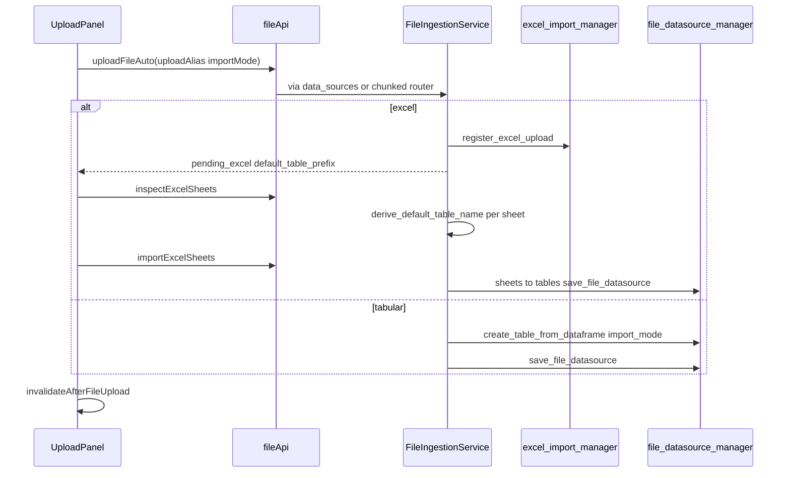
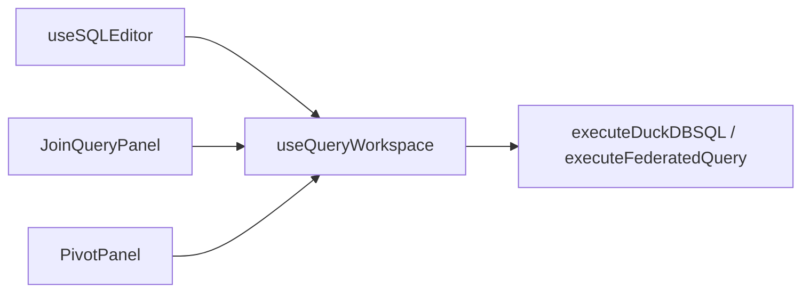
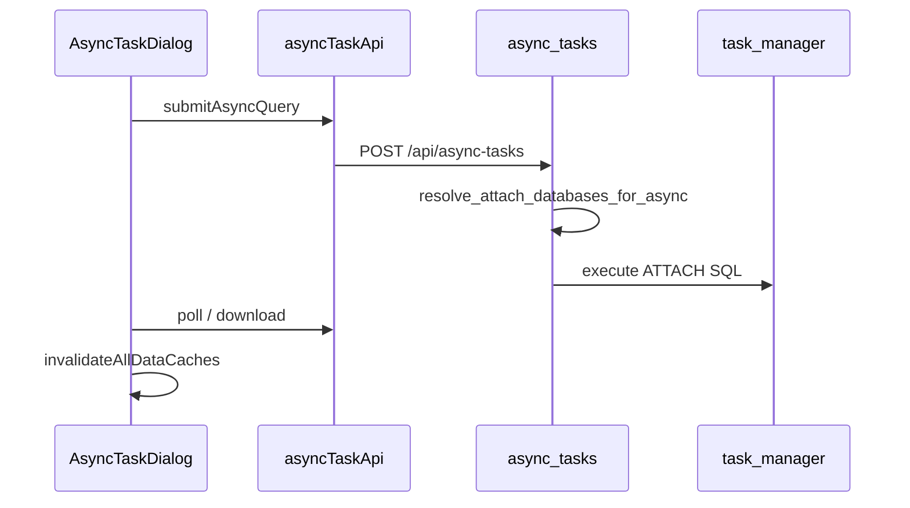

# DuckQuery 全局架构调用图

> **更新时间**：2026-05-21  
> **用途**：改入湖、查询、元数据、异步任务前先看本文链路；端点字段以 [`API_CONTRACT_FE_BE.md`](API_CONTRACT_FE_BE.md) 为准。  
> **阶段调用图**：URL [`API_URL_IMPORT_CALL_MAP.md`](API_URL_IMPORT_CALL_MAP.md)、阶段 B/C [`API_PHASE_B_CALL_MAP.md`](API_PHASE_B_CALL_MAP.md)、[`API_PHASE_C_CALL_MAP.md`](API_PHASE_C_CALL_MAP.md)。

---

## 1. 全局分层

```mermaid
flowchart TB
  subgraph browser [Browser]
    App[App.tsx]
    DSPage[DataSourcePage]
    QBench[QueryWorkbenchPage]
  end

  subgraph fe_api [frontend/src/api]
    client[client.ts]
    queryApi[queryApi.ts]
    fileApi[fileApi.ts]
    dataSourceApi[dataSourceApi.ts]
    dbSchemas[databaseSchemasApi.ts]
  end

  subgraph fe_hooks [frontend/src/hooks]
    useQW[useQueryWorkspace]
    useQueryRunner[useQueryRunner]
  end

  subgraph routers [api/routers]
    duckdb_q[duckdb_query.py]
    query_py[join_query.py / visual_query / set_operations]
    async_r[async_tasks.py]
    ingest_r[data_sources chunked server url paste]
  end

  subgraph services [api/core/services]
    ingest_svc[file_ingestion_service.py]
    db_tables[database_tables.py]
  end

  subgraph core [api/core]
    engine[duckdb_engine.py]
    ingest_core[core/data]
  end

  App --> DSPage and QBench
  DSPage --> fileApi
  QBench --> queryApi and useQueryRunner
  useQueryRunner --> useQW
  fe_api --> client
  client --> routers
  routers --> services
  services --> core
  routers --> core
  core --> DuckDB[(DuckDB)]
```

---

## 2. 分域索引

| 域 | 本文章节 | 后端服务（目标） | 前端入口 |
|----|----------|------------------|----------|
| Ingestion | §3 | `file_ingestion_service` | `fileApi.ts`, `UploadPanel` |
| QueryExecution | §4 | `duckdb_query`, `query_cancel` | `queryApi.ts`, `useQueryRunner` |
| QueryAsync | §5 | `async_tasks`, `task_manager` | `asyncTaskApi.ts` |
| Catalog | §6 | `datasources`, `database_tables`（canonical + legacy 别名） | `databaseSchemasApi`, `dataSourceApi`, `tableApi` |
| DuckDBCatalog | §6.3 | `duckdb_query` | `tableApi`, `useDuckDBTables` |
| 透视表 Pivot | §7 | `visual_query` router + `pivot_query_generator` | `pivotQueryApi` |
| SetOps | §7 | `set_operations` router | `setOperationsApi` |

---

## 3. 域 A：数据入湖（Ingestion）

### 3.1 HTTP 入口

| # | 场景 | 前端 | HTTP | Router | Core / Service |
|---|------|------|------|--------|----------------|
| 1 | 本地上传 | `uploadFileAuto` | `POST /api/upload` | `data_sources` | `FileIngestionService.ingest_upload` |
| 2 | 分块上传 | `uploadFileChunked` | `upload/init\|chunk\|complete` | `chunked_upload` | 同上 → `process_uploaded_file` |
| 3 | Excel | `inspectExcelSheets`, `importExcelSheets` | `excel/inspect`, `excel/import` | `data_sources` | `inspect_pending_excel`, `import_excel_sheets` |
| 4 | 服务器 | `importServerFile`, `importServerExcelSheets` | `server-files/*` | `server_files` | `ingest_server_path`, `inspect_server_excel` |
| 5 | URL | `readFromUrl` | `POST /api/read_from_url` | `url_reader` | `ingest_from_path` + `import_mode` |
| 6 | 粘贴 | `pasteData` | `POST /api/paste-data` | `paste_data` | 独立（VARCHAR） |

### 3.2 本地上传 + Excel 时序



### 3.3 别名与 import_mode

| UI 栏 | 前端状态 | 请求字段 | 后端 |
|-------|----------|----------|------|
| 本地上传 | `uploadAlias` | Form `table_alias` | `default_table_prefix` / 表名 |
| 远程 | `remoteAlias` | `table_alias` | URL 表名 |
| 服务器 | `serverAlias` | `table_alias` | 服务器 Excel inspect 前缀 |

---

## 4. 域 B：查询执行（QueryExecution）

| 类型 | 前端 | HTTP | 后端 |
|------|------|------|------|
| 本地 | `executeDuckDBSQL` | `POST /api/duckdb/execute` | `duckdb_query` |
| 联邦 | `executeFederatedQuery` | `POST /api/duckdb/federated-query` | ATTACH + execute |
| 取消 | `cancelSyncQuery` | `POST /api/query/cancel/{id}` | `query_cancel` |

### 4.1 前端调用收敛



详见 [`frontend/QUERY_EXECUTION_FLOW.md`](frontend/QUERY_EXECUTION_FLOW.md)。

---

## 5. 域 D：异步查询（QueryAsync）



---

## 6. 域 C：元数据（Catalog）

| 用途 | 路径 | 前端 | 说明 |
|------|------|------|------|
| Schema 列表 | `GET /api/datasources/databases/{id}/schemas` | `listConnectionSchemas` | canonical |
| Schema 表 | `GET .../schemas/{schema}/tables` | `listSchemaTablesForConnection` | 推荐 |
| 表详情 canonical | `GET /api/datasources/databases/{id}/tables/detail` | `getExternalTableDetail` | CatalogService 对齐 |
| 表详情 | `GET /api/datasources/databases/{id}/tables/detail` | `getExternalTableDetail` | canonical |
| 统一列表 | `GET /api/datasources` | `listAllDataSources` | `datasources.py` |

---

## 7. 域 E：可视化 / 集合运算

| 能力 | HTTP | Router 模块 | 前端 |
|------|------|-------------|------|
| Pivot | `/api/visual-query/*` | `routers/visual_query.py` | `pivotQueryApi` |
| SetOps | `/api/set-operations/*` | `routers/set_operations.py` | `setOperationsApi` |

集合运算生成 SQL 后，前端常再调 `executeDuckDBSQL` 执行。

---

## 8. 缓存失效（入湖后）

| 场景 | 函数 |
|------|------|
| 文件上传/URL/服务器 | `invalidateAfterFileUpload` |
| 建表/删表 | `invalidateAfterTableCreate` / `Delete` |
| 异步任务完成 | `invalidateAllDataCaches` |

定义于 [`frontend/src/utils/cacheInvalidation.ts`](../frontend/src/utils/cacheInvalidation.ts)。

---

## 9. 维护规则

1. 新增 `/api/...`：先 [`API_CONTRACT_FE_BE.md`](API_CONTRACT_FE_BE.md)，再 router → service → `frontend/src/api/*`。  
2. 入湖逻辑只改 `file_ingestion_service` + `core/data`，不在 5 个 router 复制编排。  
3. 查询执行前端优先走 `useQueryRunner`，避免 Panel 直接调 API。  
4. 历史 spec 见 [`docs/archive/README.md`](archive/README.md)，不作实现依据。
