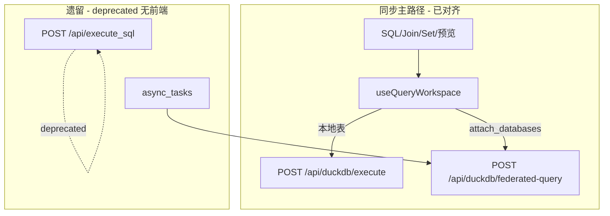

# 前后端全面评估报告

> **评估日期**：2026-05-21  
> **部署形态**：见 [`FE_BE_OPTIMAL_PLAN.md`](./FE_BE_OPTIMAL_PLAN.md) §1（Docker 推荐 + 本地 dev）。无独立线上网关。  
> **方法**：静态扫描 `api/routers/*.py` 与 `frontend/src/api/*.ts`、业务引用 grep、对照 README/`quick-start.sh` 与契约文档。  
> **Remediation**：最优分阶段方案见 [`FE_BE_OPTIMAL_PLAN.md`](./FE_BE_OPTIMAL_PLAN.md)。  
> **阶段 A–D（2026-05-21）**：URL 导入、前端 API 收敛、后端 ATTACH 单轨、契约表扩写已完成；下文「已修复」项以删除线或 ✅ 标注。

---

## 1. 执行摘要

| 维度 | 结论 |
|------|------|
| **主查询路径** | ✅ 同步：`executeDuckDBSQL` + `executeFederatedQuery`（ATTACH），与 v2.0/v2.1 文档一致 |
| **P0 断链** | ✅ URL 导入已对齐（`API_URL_IMPORT_CALL_MAP.md`、阶段 A） |
| **遗留双轨** | ✅ 异步新任务统一 ATTACH（阶段 C）；`execute_sql` / `duckdb_tables` 标 **deprecated**，无前端引用 |
| **契约表** | ✅ [`API_CONTRACT_FE_BE.md`](./API_CONTRACT_FE_BE.md) 按域覆盖 `frontend/src/api/*` 在用路径（阶段 D） |
| **死代码 API** | ✅ 阶段 B 已从 `queryApi` / `index.ts` 移除 `execute_sql`、`performQuery` 等 |
| **响应规范** | ⚠️ 仍混用 `HTTPException`；`execute_sql` 已补 `row_count`（主）+ `rowCount`（兼容） |

---

## 2. 运行拓扑（Docker + 本地开发）

### 2.1 Docker（`./quick-start.sh`）

| 组件 | 访问 |
|------|------|
| 前端 | http://localhost:3000 |
| API 文档 | http://localhost:8001/docs |
| API 流量 | 浏览器 `/api/*` → nginx → `backend:8000` |

### 2.2 本地开发（README）

| 组件 | 默认 |
|------|------|
| 后端 | `cd api && uvicorn main:app --reload` → :8000 |
| 前端 | `cd frontend && npm run dev` → :5173（Vite proxy `/api` → :8000） |

两种形态共用 `frontend/src/api/*`；**无**网关路径重写。

---

## 3. Docker 代理细节

```
浏览器 → host:3000 (nginx frontend)
           location /api/ → proxy_pass http://backend:8000
后端容器 dataquery-backend 监听 8000（compose 映射 host:8001）
```

| 配置 | 值 | 说明 |
|------|-----|------|
| `frontend/nginx.conf` | `proxy_pass http://backend:8000` | 与 compose 服务名一致，**无**路径重写 |
| `VITE_API_URL`（构建） | `""` | 生产构建走相对路径 `/api/...`，经 nginx 代理 |
| `REACT_APP_API_URL`（compose） | `http://dataquery-backend:8000` | 构建时用 `import.meta.env.VITE_API_URL`；若为空则仍走相对路径 |

**推论**：不存在「线上网关改写 `/api/url-reader` → `/api/read_from_url`」；路径不一致在 Docker 下即为真实缺陷。

---

## 4. 端点 inventory

### 3.1 规模

| 来源 | 数量 |
|------|------|
| 后端 `@router.*`（`api/routers/*.py`） | **76** |
| 前端 `apiClient` / `uploadClient` 调用模式 | **~59**（去重后） |
| `docs/API_CONTRACT_FE_BE.md` 登记 | **~50+**（按域分表，见阶段 D） |

### 3.2 P0：URL 导入（已修复）

| 前端（现） | 后端 | 调用方 |
|------------|------|--------|
| `POST /api/read_from_url` | 同左 | `UploadPanel` → `readFromUrl` |
| `GET /api/url_info` | 同左 | `getUrlInfo`（无 UI，已对齐字段） |

请求体：`header`（非 `has_header`）。详见 [`API_URL_IMPORT_CALL_MAP.md`](./API_URL_IMPORT_CALL_MAP.md)。

### 3.3 P1：路径/资源名不一致（调用即失败）

| 前端 | 后端 | 业务是否使用 |
|------|------|--------------|
| `GET /api/connection-pool/status` | `GET /api/duckdb/pool/status` | 否（仅 `asyncTaskApi` 导出） |
| `POST /api/connection-pool/reset` | `POST /api/duckdb/pool/reset` | 否 |
| `POST /api/duckdb/tables/{name}/refresh` | `POST /api/duckdb/table/{name}/refresh` | 否（刷新菜单只做 cache invalidate） |
| `POST /api/duckdb/upload-file` | （无）主上传为 `POST /api/upload` | 否 |
| `GET /api/features` | （无）配置为 `GET /api/app-config/features` | 否（`useAppConfig` 用正确路径） |

### 3.4 P2：前端封装存在、后端无路由且无业务引用

> ✅ 阶段 B 已从 `frontend/src/api` 删除下列死路径封装；若 grep 到残留 import 应视为遗漏。

| 前端路径（已移除） | 说明 |
|----------|------|
| ~~`POST /api/save_query_result_as_datasource`~~ | 无后端 |
| ~~`GET /api/available_tables`~~ | 无后端 |
| ~~`GET /api/tables/all`~~ | 无后端 |
| ~~`GET /api/file_preview/{filename}`~~ | 无后端 |
| ~~`POST /api/tables/distinct-values`~~ | 后端为 `POST /api/visual-query/distinct-values` |
| ~~`GET /api/tables/{t}/columns/{c}/statistics`~~ | 后端为 `GET /api/visual-query/column-stats/{t}/{c}` |

### 3.5 后端有能力、前端未走 `@/api` 或本地拼 SQL

| 后端 | 说明 |
|------|------|
| `POST /api/set-operations/*`（7 个） | `SetOperationsPanel` 本地生成 SQL + `onExecute`，未封装到 `frontend/src/api` |
| `POST /api/upload/init|chunk|complete` | 分块上传后端完整；前端当前主要 `POST /api/upload` |
| `POST /api/visual-query/distinct-values|validate` | 未在 `visualQueryApi.ts` 暴露 |
| `POST /api/duckdb/migrate/created_at` | 运维向，无前端 |

### 3.6 重复端点（同一资源多套 URL）

| 能力 | Legacy | 现行/并列 | 前端实际 |
|------|--------|-----------|----------|
| DuckDB 表列表 | `GET /api/duckdb_tables` (**deprecated**) | `GET /api/duckdb/tables` | ✅ **`getDuckDBTables()` → 新路径** |
| 删 DuckDB 表 | `DELETE /api/duckdb_tables/{name}` (**deprecated**) | `DELETE /api/duckdb/tables/{name}` | ✅ **`deleteDuckDBTable` 仅新路径** |
| 外部 schemas | — | `/api/databases/...` 与 `/api/datasources/databases/...` | `databaseSchemasApi` 用 **databases** |
| 外部表列表 | `GET /api/database_tables/{id}` | `.../schemas/{schema}/tables` | 无 schema 时用扁平接口 |

---

## 5. 查询执行架构



| 项目 | 状态 |
|------|------|
| `TableSource.type`：`duckdb \| external \| federated` | `external` 仍在 `useQueryWorkspace` 兜底拼 attach |
| `executeExternalSQL` / `executeSQL` / `performQuery` | 仅 `api/index.ts` 导出，**无** `frontend/src` 业务 import |
| 引号策略 | 已改为按需引号（`sqlUtils.needsQuoting`） |
| 可视化查询 | `QueryBuilder` 对外部表禁止执行（`canExecute = !isExternal`） |
| 集合运算 | 客户端拼 SQL，不调用后端 set-operations API |

---

## 6. 响应格式与字段

| 项 | 现状 |
|----|------|
| 标准成功体 | 多数新路由使用 `create_success_response` / `create_list_response` |
| 错误 | 大量 `raise HTTPException(detail=...)`，与 `StandardError` 形状不统一 |
| `normalizeResponse` | `client.ts` 仍含 **legacy** 分支（兼容旧 success/error 嵌套） |
| 字段命名 | ✅ `execute_sql` 已补 `row_count`（主）+ `rowCount`（兼容）；现行查询用 `row_count` |
| 列表载荷 | 部分端点 `data.items`，部分 `data.tables[]`（契约表已注明 database_tables） |

---

## 7. 后端实现债（AGENTS 对照）

| 规则 | 现状 |
|------|------|
| `with_duckdb_connection()` | `join_query.py` 已迁移；**`duckdb_query.py` 仍有多处 `get_db_connection()`** |
| 统一响应 | `duckdb_query.py` 部分错误仍 `JSONResponse` |
| 时区 | 新代码多用 `timezone_utils`；旧路由需逐文件核对 |

---

## 8. 前端实现债

| 项 | 说明 |
|----|------|
| `hooks/README.md` | ✅ 示例已改为 `useDuckDBTables` / `/api/duckdb/tables` |
| QueryKey | `['schemas', id]` 等与 kebab 规范混用 |
| 结果表格 | `AGGridWrapper` + `DataGrid` 双栈，AG Grid 待移除 |
| `as any` | `QueryWorkspace`、`ContextMenu` 等仍有 |
| 契约维护 | ✅ 全量表见 `API_CONTRACT_FE_BE.md`；改 API 须先更新该表 |

---

## 9. 文档漂移

| 文档 | 问题 |
|------|------|
| `.kiro/specs/api-standardization-refactor/requirements.md` | ✅ 已加废止注（按需引号为准，见 `sqlUtils.needsQuoting`） |
| `.kiro/specs/*` 中 `frontend/src/new/` | ✅  steering / lint 文档已标注路径废止 → 现用 `frontend/src/` |
| `API_CONTRACT_FE_BE.md` | ✅ 阶段 D 按域扩写 |
| `QUERY_EXECUTION_FLOW.md` | ✅ v2.1：部署表 + 废弃端点 + 异步 ATTACH |

---

## 10. 修复优先级（建议）

> 详细分阶段方案见 [`FE_BE_OPTIMAL_PLAN.md`](./FE_BE_OPTIMAL_PLAN.md)。

### P0 — 影响 Docker 现网功能

1. **URL 导入**：前端改为 `POST /api/read_from_url`、`GET /api/url_info`，或后端增加 alias 路由；更新契约表。
2. 自测：`UploadPanel` 提交公网 CSV URL。

### P1 — 收敛与防再发

1. 删除或 `@deprecated`：`executeExternalSQL`、`executeSQL`、`performQuery`、`saveQueryResultAsDatasource` 及无后端路径的 tableApi 函数。
2. `asyncTaskApi`：连接池路径改为 `/api/duckdb/pool/*`（若将来做管理页）。
3. `useDuckDBTables`：迁到 `GET /api/duckdb/tables`，废弃 `duckdb_tables`。
4. 异步任务：评估去掉 `_fetch_external_query_result`，统一 ATTACH。
5. 扩充 `API_CONTRACT_FE_BE.md` 至与 `frontend/src/api` 一一对应。

### P2 — 架构与体验

1. 去掉 `TableSource.external` 兜底，仅 `federated` + `duckdb`。
2. Set 运算是否走后端 `set-operations`（减少 SQL 生成重复）。
3. Visual 查询支持联邦表或明确「仅 DuckDB」产品文案。
4. `duckdb_query.py` 连接池迁移（`join_query.py` 已完成）。

---

## 11. Docker 自测清单

```bash
# 启动
docker compose up -d --build

# 后端健康
curl -s http://localhost:8001/health

# 经前端代理（与浏览器一致）
curl -s -o /dev/null -w "%{http_code}" http://localhost:3000/api/duckdb/tables
curl -s -o /dev/null -w "%{http_code}" -X POST http://localhost:3000/api/read_from_url \
  -H 'Content-Type: application/json' \
  -d '{"url":"https://example.com/x.csv","table_alias":"test"}'
curl -s -o /dev/null -w "%{http_code}" -X POST http://localhost:3000/api/url-reader/read \
  -H 'Content-Type: application/json' \
  -d '{"url":"https://example.com/x.csv","table_alias":"test"}'
# 预期：前者 4xx/422/5xx 视实现；后者 404
```

---

## 12. 评估局限

- 未在评估时启动容器做 HTTP 断言（路径结论来自源码对照）。
- 未扫描 `query_proxy` / `enhanced_data_sources` 可选路由（`main.py` 中 try-import，当前仓库无对应文件）。
- 第三方 `fetch`（GitHub stars）不计入本后端契约。

---

## 13. 相关文件

| 用途 | 路径 |
|------|------|
| Compose | `docker-compose.yml` |
| 前端代理 | `frontend/nginx.conf` |
| 契约表 | `docs/API_CONTRACT_FE_BE.md` |
| 查询流程 | `docs/frontend/QUERY_EXECUTION_FLOW.md` |
| 规范 | `AGENTS.md` |
