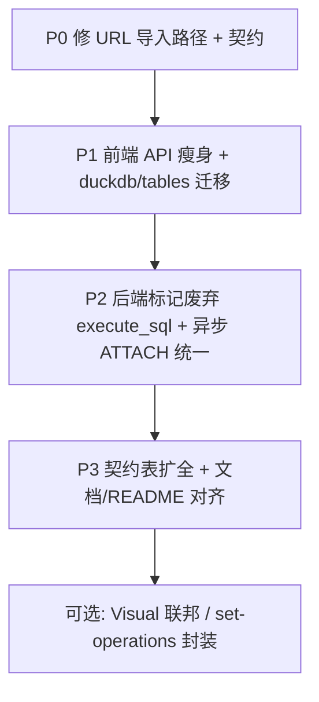

# 前后端收敛最优方案（综合评估）

> **依据**：[`FE_BE_AUDIT.md`](./FE_BE_AUDIT.md)、[`README_zh.md`](../README_zh.md)、[`quick-start.sh`](../quick-start.sh)、[`docker-compose.yml`](../docker-compose.yml)、[`QUERY_EXECUTION_FLOW.md`](./frontend/QUERY_EXECUTION_FLOW.md)、[`API_CONTRACT_FE_BE.md`](./API_CONTRACT_FE_BE.md)  
> **部署前提**：无独立线上网关；仅 **Docker Compose（推荐）** 与 **本地双进程开发** 两种形态。

---

## 1. 实际运行方式（与 README 一致）

### 1.1 Docker（`./quick-start.sh` → `docker-compose up -d --build`）

| 组件 | 容器内 | 宿主机访问 |
|------|--------|------------|
| 前端 | nginx:80 | http://localhost:3000 |
| 后端 | uvicorn:8000 | http://localhost:8001/docs |
| API 代理 | `frontend/nginx.conf`：`/api/` → `http://backend:8000` | 浏览器只打 `:3000/api/...` |

- 前端构建 `VITE_API_URL=""` → 请求为**相对路径** `/api/...`，经 nginx 转发。
- **不存在**路径重写；前端写的 URL 必须与 FastAPI 路由一字不差。

### 1.2 本地开发（README「本地开发」）

| 组件 | 默认端口 | API 路径 |
|------|----------|----------|
| 后端 | `uvicorn main:app --reload` → **8000** | 直连 `http://127.0.0.1:8000/api/...` |
| 前端 | `npm run dev` → **5173**（可改 3000） | Vite `proxy['/api']` → `VITE_API_PROXY_TARGET` 默认 `http://127.0.0.1:8000` |

- CORS：`config/app-config.json` 默认含 `localhost:3000` / `5173`。
- **与 Docker 共用同一套** `frontend/src/api/*` 路径；修一处，两种部署同时生效。

### 1.3 架构目标（README + QUERY_EXECUTION_FLOW v2.0）

```
文件/粘贴/上传 ──► DuckDB 本地表 ──► POST /api/duckdb/execute
外部库连接      ──► ATTACH 别名     ──► POST /api/duckdb/federated-query
```

**不应再新增**「直连外部库执行」的用户主路径（`execute_sql` 仅保留短期兼容或删除）。

---

## 2. 问题分级（Docker / 本地均适用）

| 级别 | 问题 | 影响 |
|------|------|------|
| **P0** | URL 导入：`/api/url-reader/*` ≠ `/api/read_from_url`、`/api/url_info` | README 宣传的「从 URL 导入」在两种部署下均失败 |
| **P1** | 死代码 API：`execute_sql`、`performQuery`、`save_query_result_as_datasource` 等 | 误导维护者；契约表失真 |
| **P1** | DuckDB 表列表仍调 legacy `GET /api/duckdb_tables` | 与新路由重复；长期双实现 |
| **P2** | 异步任务 `_fetch_external_query_result` 与 ATTACH 双轨 | 行为/性能不一致 |
| **P2** | `API_CONTRACT_FE_BE.md` 过短 | 改 API 易漂移 |
| **P3** | Visual 外部表不可执行、Set 运算未用后端 API | 产品能力不完整，非阻塞 |

---

## 3. 最优方案总览

**原则**：小步、可验证、先修 README 承诺的功能断链，再删遗留；**不**做大规模重写；**不**改 plan 文件；契约驱动（先表后码）。



---

## 4. 分阶段实施（推荐顺序）

### 阶段 A — P0 止血（1 PR，必做）

**目标**：Docker `./quick-start.sh` 与本地 dev 下「从 URL 导入」可用。

| 决策 | 选型 | 理由 |
|------|------|------|
|  canonical 路径 | **沿用后端现有** `POST /api/read_from_url`、`GET /api/url_info` | 后端已实现；改前端成本最低；两种部署立刻一致 |
| 实现 | 改 `frontend/src/api/fileApi.ts` 的 `readFromUrl` / `getUrlInfo`（若有）路径 | 不依赖 nginx 别名 |
| 契约 | `API_CONTRACT_FE_BE.md` 增加两行 URL 导入 | 满足 AGENTS §9.5 |
| 验证 | Docker：`curl` 经 `:3000/api/read_from_url`；UI：`UploadPanel` 导入公网 CSV | 与 README 一致 |

**不做**：后端再加一套 `/api/url-reader`（除非有外部客户端依赖——当前无）。

---

### 阶段 B — P1 前端 API 与表列表收敛（1～2 PR）

**目标**：`@/api` 只暴露真实在用、路径正确的函数。

| 动作 | 说明 |
|------|------|
| **删除或停止导出** | `executeExternalSQL`、`executeSQL`、`performQuery`、`saveQueryResultAsDatasource`、`getAppFeatures`、`getAvailableTables`、`getAllTables`、`getFilePreview`、`getDistinctValues`、`uploadFileToDuckDB`（若无引用） |
| **修正预留** | `asyncTaskApi`：`connection-pool` → `duckdb/pool`（管理页接入前可先删导出） |
| **迁移** | `useDuckDBTables`：`getDuckDBTables` → `fetchDuckDBTableSummaries` / `GET /api/duckdb/tables`；删除表同理用 `/api/duckdb/tables/{name}` |
| **保留** | `executeDuckDBSQL`、`executeFederatedQuery`、`cancelSyncQuery`、`databaseSchemasApi`、`saveQueryToDuckDB`（Import 对话框在用） |

**验证**：`npm run lint`、`npm run test`、手动：数据源树、SQL 执行、联邦 JOIN。

---

### 阶段 C — P2 后端查询单轨 ✅（2026-05-21）

**目标**：与 README「ATTACH 机制」单一叙事一致。

| 动作 | 说明 |
|------|------|
| `POST /api/execute_sql` | `deprecated=True` + 日志 warning；`row_count` 为主、`rowCount` 兼容 |
| `async_tasks` | `resolve_attach_databases_for_async`：无显式 attach 时从 datasource 推导；`execute_async_query` 外部分支改 ATTACH |
| legacy `duckdb_tables` | GET/DELETE 委托 `duckdb_query` 新路由 |
| 调用图 | [`docs/API_PHASE_C_CALL_MAP.md`](API_PHASE_C_CALL_MAP.md) |
| `query.py` `get_db_connection` 迁移 | 仍属长期子任务，本阶段未扩大 |

**验证**：`cd api && python -m pytest tests/test_connection_alias.py tests/test_phase_c_async_attach.py tests/test_async_federated_query.py -q`

---

### 阶段 D — P3 契约与文档单一真相源 ✅（2026-05-21）

| 动作 | 说明 |
|------|------|
| 扩写 `API_CONTRACT_FE_BE.md` | 按域 §0–§12 覆盖 `frontend/src/api/*` 在用路径 + 废弃/未封装说明 |
| 更新 `FE_BE_AUDIT.md` | 阶段 A–D 已修复项已标注 |
| README / `QUERY_EXECUTION_FLOW` | Docker + 本地端口表；用户路径不含 `execute_sql` |
| 废止 `.kiro` 注记 | `api-standardization-refactor`、`shadcn-ui-standards`、`require-tanstack-query` |

---

### 阶段 E — 产品增强 ✅（2026-05-21）

| 项 | 状态 | 说明 |
|----|------|------|
| Visual 查询外部表 | ✅ | `getSourceFromSelectedTable` → `federated` + `attachDatabases`；JOIN 仍禁用 |
| Set 运算后端生成 SQL | ✅ | `generateSetOperation` + TanStack Query |
| Set 运算预览 | ✅ | `previewSetOperation` + 结果面板 `displayQueryPreview` |
| 分块上传 | ✅ | `uploadFileAuto`（&gt;8MB 分块）；`UploadPanel` 进度与 `maxFileSize` 校验 |

---

## 5. 两种部署下的验证矩阵（阶段 A 完成后）

| 用例 | Docker（:3000） | 本地 dev（:5173 + proxy） |
|------|-----------------|---------------------------|
| 健康检查 | `curl localhost:3000/api/...` 经代理 | `curl localhost:8000/health` |
| DuckDB 表列表 | 数据源树加载 | 同左 |
| 外部库联邦查询 | SQL 面板 `mysql_xxx.t` 无引号可执行 | 同左 |
| URL 导入 | UploadPanel | 同左 |
| 取消查询 | `cancelSyncQuery` | 同左 |

```bash
# Docker 一键（README）
./quick-start.sh

# 本地（README）
cd api && uvicorn main:app --reload &
cd frontend && npm run dev
```

---

## 6. 明确不做的项（避免过度工程）

| 不做 | 原因 |
|------|------|
| 执行前自动改写用户 SQL 引号 | 易改用户意图；按需引号仅用于**生成** SQL |
| 恢复 `frontend/src/new/` 双 UI | 目录已不存在；spec 废止即可 |
| 为每个 legacy 端点永久保留 nginx rewrite | 增加隐式规则；直接改前端路径更清晰 |
| 一次性重写 `query.py` | 风险大；连接池迁移单独立项 |

---

## 7. 成功标准（整体完成度）

- [ ] README 所列「从 URL 导入」在 Docker 与本地 dev 均可完成。
- [ ] 同步查询仅文档化 `execute` + `federated-query` 两条路径。
- [ ] `frontend/src/api` 无指向不存在后端的导出函数。
- [ ] DuckDB 表 CRUD 统一 `/api/duckdb/tables` 族。
- [ ] `API_CONTRACT_FE_BE.md` 覆盖所有在用端点。
- [ ] `npm run lint`、相关 pytest、联邦相关 vitest 通过。

---

## 8. 实施状态

### 阶段 A（已完成）

- [x] 调用关系：[`API_URL_IMPORT_CALL_MAP.md`](./API_URL_IMPORT_CALL_MAP.md)
- [x] `fileApi.ts`：路径对齐 + 请求体 `has_header` → `header`
- [x] `API_CONTRACT_FE_BE.md` 登记 URL 端点

### 阶段 B（已完成）

- [x] 调用关系：[`API_PHASE_B_CALL_MAP.md`](./API_PHASE_B_CALL_MAP.md)
- [x] `getDuckDBTables` → `GET /api/duckdb/tables`；删表 → `DELETE /api/duckdb/tables/{name}`
- [x] `refreshDuckDBTableMetadata` → `POST /api/duckdb/table/{name}/refresh`
- [x] `asyncTaskApi` 连接池与错误统计路径/字段对齐
- [x] 移除无引用的 legacy query/table/file/visual API 导出
- [x] 单测：`fileApi.urlImport.test.ts`、`tableApi.duckdb.test.ts`

---

## 9. 与近期已完成工作的关系

| 已完成 | 本方案 |
|--------|--------|
| SQL 按需引号 | 不变；属生成层，与 API 路径无关 |
| `@/api` 收敛、契约表初版 | 阶段 D 扩表；阶段 B 删死代码 |
| 前后端联动 plan | 正交；本方案聚焦 **路径断链 + 查询单轨** |
