# DuckQuery 系统架构与流程图

> **版本**: v1.0  
> **更新时间**: 2026-01-23

---

## 1. 系统架构总览

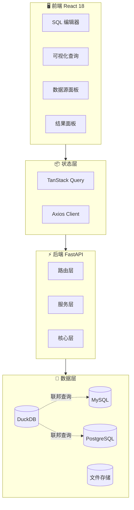

---

## 2. 后端模块架构

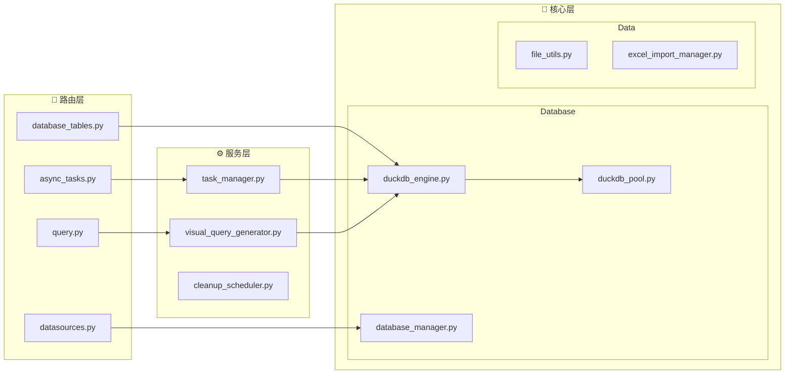

---

## 3. 前端组件架构

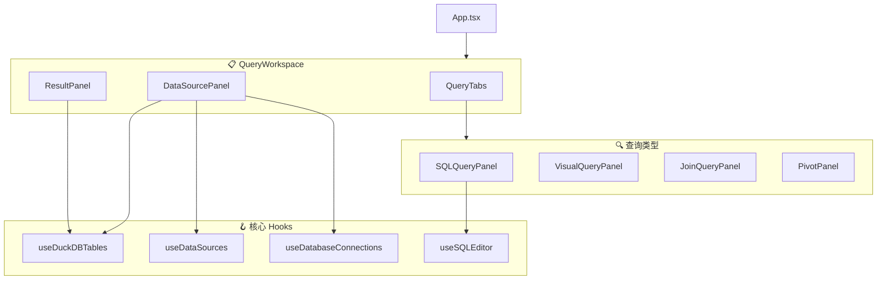

---

## 4. 核心流程图

### 4.1 SQL 查询执行流程

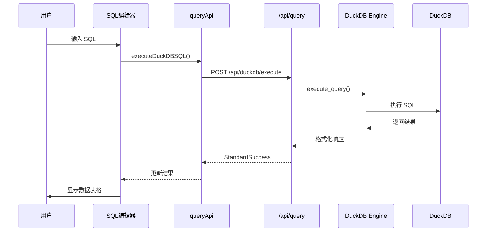

### 4.2 异步任务执行流程

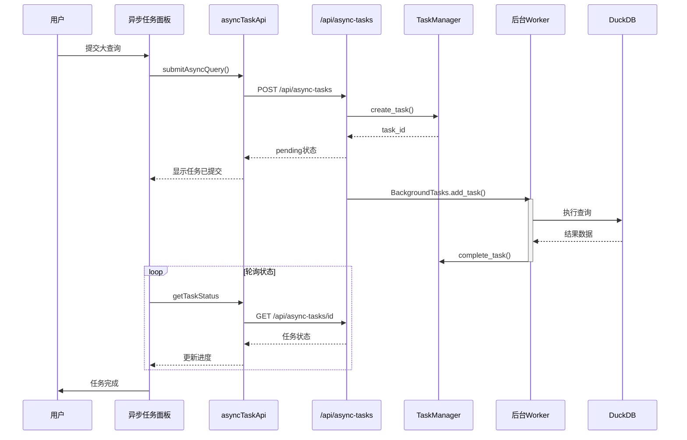

### 4.3 联邦查询流程

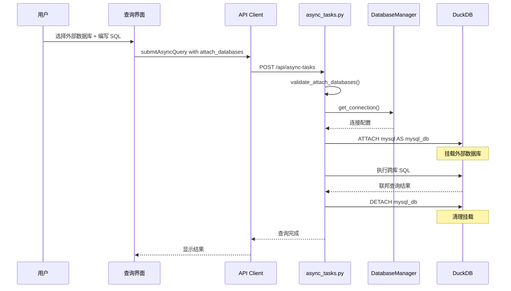

### 4.4 文件导入流程

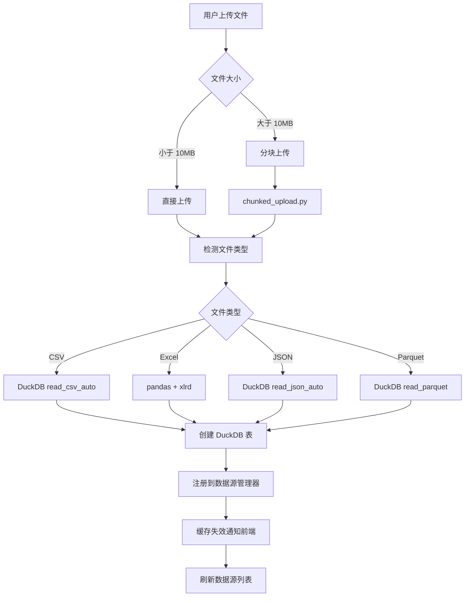

### 4.5 可视化查询构建流程

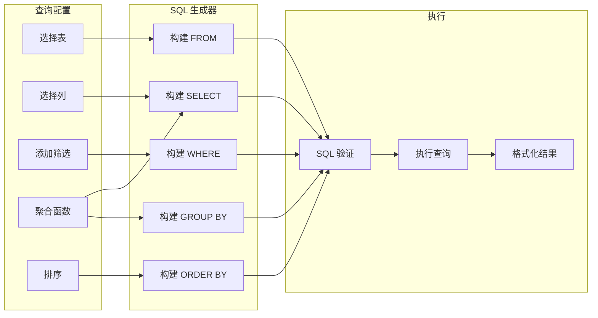

---

## 5. 数据流架构

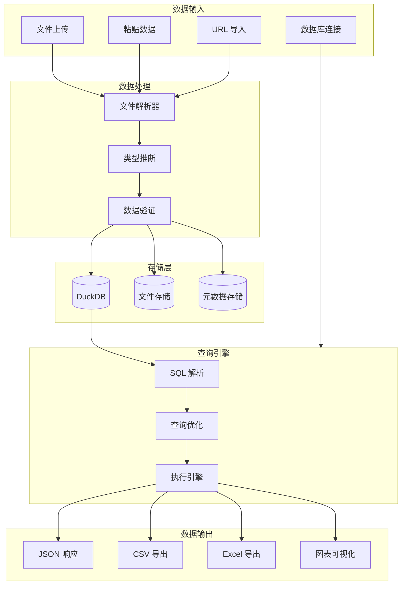

---

## 6. 技术栈总览

| 层级 | 技术 | 说明 |
|------|------|------|
| **前端框架** | React 18 + Vite + TypeScript | 现代化 SPA 架构 |
| **UI 组件** | shadcn/ui + Tailwind CSS | 一致性设计系统 |
| **状态管理** | TanStack Query 5.x | 服务端状态缓存 |
| **表格组件** | AG Grid v34 + TanStack Table | 高性能数据展示 |
| **后端框架** | FastAPI + Python 3.11+ | 异步 API 服务 |
| **核心数据库** | DuckDB | OLAP 分析引擎 |
| **外部数据库** | MySQL / PostgreSQL / SQLite | 联邦查询支持 |
| **国际化** | react-i18next | 多语言支持 |
| **代码质量** | ESLint + Pylint | 静态代码分析 |

---

## 7. 部署架构

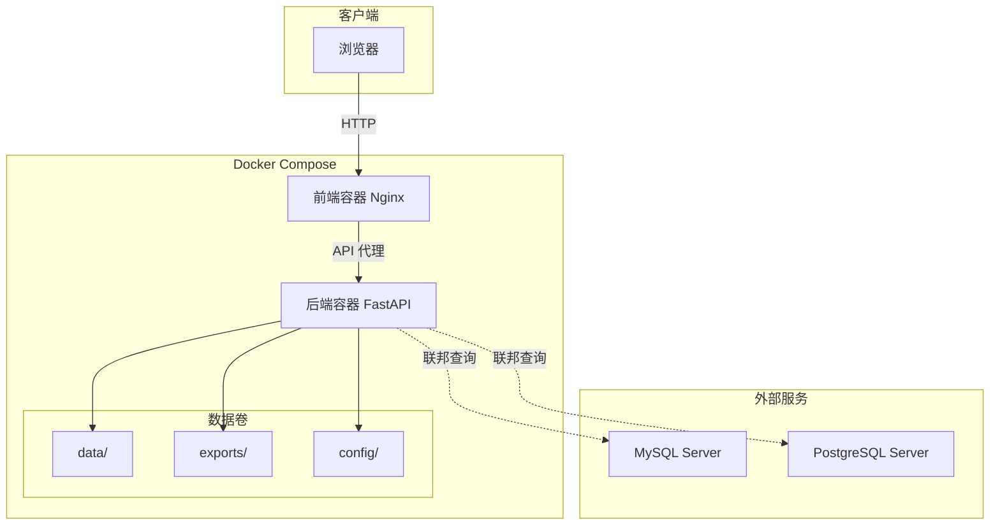

---

## 8. 安全架构

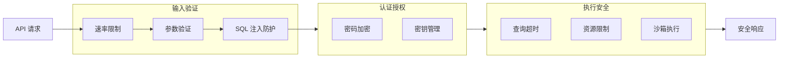

---

## 9. API 端点概览

| 模块 | 端点 | 说明 |
|------|------|------|
| **查询** | `POST /api/query/visual` | 可视化查询 |
| **查询** | `POST /api/duckdb/execute` | 执行 SQL |
| **异步任务** | `POST /api/async-tasks` | 提交异步任务 |
| **异步任务** | `GET /api/async-tasks` | 获取任务列表 |
| **数据源** | `GET /api/datasources` | 获取数据源列表 |
| **数据源** | `POST /api/datasources/connections` | 添加数据库连接 |
| **文件** | `POST /api/chunked-upload` | 分块上传 |
| **表管理** | `GET /api/database-tables` | 获取表列表 |
