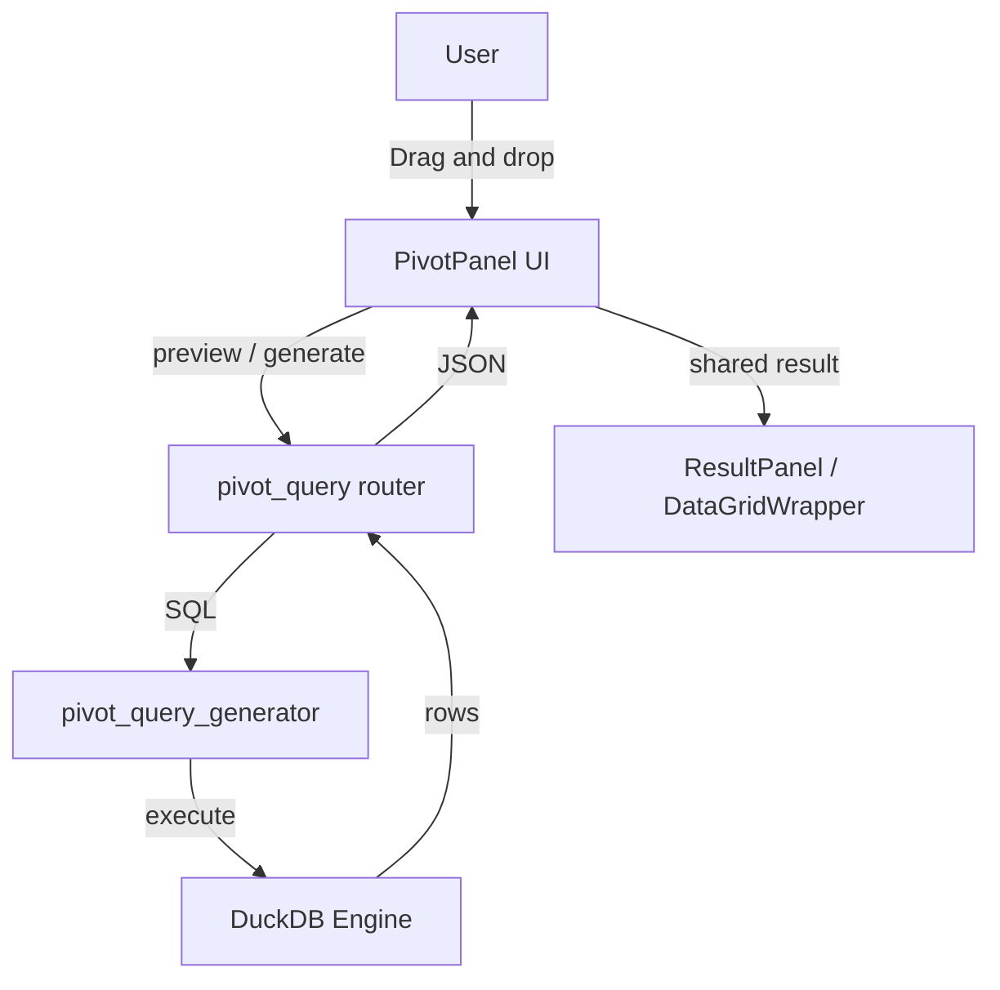

# Pivot Table Technical Design

> **2026-05**：现行实现 `QueryTabs` → `PivotPanel` → `pivotQueryApi` → `POST /api/pivot-query/*`；结果区为 TanStack `DataGrid`（`ResultPanel` → `DataGridWrapper`）。

## Architecture Overview



## Backend Design

### API

| Method | Path | Purpose |
|--------|------|---------|
| `POST` | `/api/pivot-query/generate` | 生成透视 SQL |
| `POST` | `/api/pivot-query/preview` | 预览透视结果 |

Models: `api/models/pivot_query_models.py`；SQL：`pivot_query_generator.py` + `pivot_query_sql_common.py`。

### SQL generation

- 优先 DuckDB 动态 `PIVOT`（无强制 `IN` 列表）；可选 `manual_column_values`。
- 标识符经 `_quote_identifier` 转义；默认 `LIMIT` 防止浏览器过载。
- 联邦表：请求体 `attach_databases`（与 `federated_attach.execute_sql_with_attach` 一致）。

## Frontend Design

### Entry and component tree

```text
QueryWorkbenchPage
└── QueryTabs (tab: pivot)
    └── PivotPanel                # 字段列表（useTableColumns）、运行 / 生成 SQL
        ├── PivotTableDesigner    # 行/列/值拖拽区
        ├── PivotFilters          # 可选 WHERE（PivotFilters）
        └── buildPivotQueryPayload → pivotQueryApi
```

查询结果与 SQL/JOIN 共用 **`ResultPanel`**，不单独嵌网格。

### State and data fetching

> **No `useGeneratePivotSQL` / `usePivotQuery` hooks exist.** `PivotPanel` calls `useQuery` from `@tanstack/react-query` directly, inline in the component — there is no separate hook layer.

| Function | Role |
|----------|------|
| `useQuery({ queryKey: getPivotQueryKey(...), queryFn: () => generatePivotQuery(...) })` (inline in `PivotPanel.tsx`) | Calls `POST /api/pivot-query/generate` and renders the returned `final_sql` in the SQL-preview panel. `enabled` only when `canUseServerPivotPath(table, rows, values)` is true and `!shouldUseLocalPivotSql(columns)` (i.e. exactly one pivot column); otherwise `PivotPanel` falls back to a client-built `PIVOT` / `GROUP BY` string via `generateLocalSQL()`. |
| `getPivotQueryKey` (`buildPivotQueryPayload.ts`) | Builds the TanStack Query cache key: `['pivot-sql', tableName, rows.join(','), columns.join(','), values, filterKey]`. |
| `buildPivotQueryPayload` (`buildPivotQueryPayload.ts`) | Assembles `PivotQueryConfig` + `PivotConfig` from the selected table, rows/columns/values, `maxQueryRows`, and filters. |
| `previewPivotQuery` (`api/pivotQueryApi.ts`, calls `POST /api/pivot-query/preview`) | **Exported and unit-tested** (`frontend/src/api/__tests__/pivotQueryApi.test.ts`) but **not called from any UI component**. Clicking "执行" in `PivotPanel` hands the already-generated `final_sql` string to the parent's `onExecute`, which runs it through the normal query-execution path shared with the SQL editor / JOIN workbench — not through `/preview`. |

`staleTime: 30_000` (30s) on the `generate` query in `PivotPanel`. The `pivot-sql` query key is not wired into `invalidateAfterTableCreate` (`utils/cacheInvalidation.ts`) — that helper only invalidates the table list, data-source list, and column list, which refreshes `useTableColumns`' field picker; a stale `generate` response simply expires on its own after `staleTime`.

### Results grid (TanStack DataGrid)

- **禁止** AG Grid；使用 `frontend/src/Query/DataGrid/DataGrid.tsx`（经 `DataGridWrapper`）。
- 动态列：由预览响应 `columns` / `data` 驱动；`columns` 引用须 `useMemo` 稳定化。
- 虚拟滚动：`@tanstack/react-virtual`；大结果受后端 `limit` 与 `max_query_rows` 约束。

### Styling and i18n

- shadcn/ui + Tailwind only；文案 `t('query.pivot.*')` / `t('pivot.*')`（`common` namespace）。

## Security and limits

- 注入防护：后端 quote 所有动态标识符。
- 行/列上限：后端 `warnings`；前端 `useAppConfig().maxQueryRows` 对齐预览 limit。
